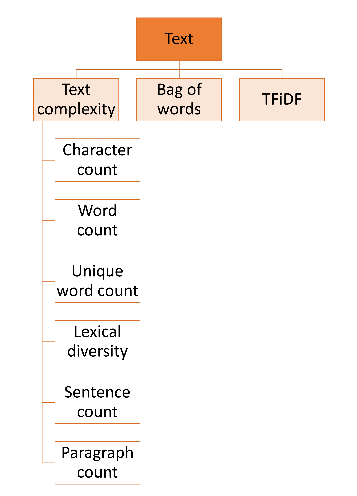

Roadmap
=======

This document provides general directions on what the core contributors would like to
see developed in Feature-engine. As resources are limited, we can't promise when or if
the transformers listed here will be included in the library. We welcome all the help
we can get to support this vision. If you are interested in contributing, please get in
touch.

Purpose
-------

Feature-engine's mission is to simplify and streamline the implementation of end-to-end
feature engineering pipelines. It aims to help users both during the research phase and
while putting a model in production.

Feature-engine makes data engineering easy by allowing the selection of feature subsets
directly within its transformers. It also interlaces well with exploratory data analysis
(EDA) by returning dataframes for easy data exploration.

Feature-engine’s transformers preserve Scikit-learn functionality with the methods fit()
and transform() and can be integrated into a Pipeline to simplify putting the model in
production.

Feature-engine was designed to be used in real settings. Each transformer has a concrete
aim, and is tailored to certain variables and certain data. Transformers raise errors
and warnings to support the user to use a suitable transformation given the data.
These errors help avoid inadvertedly incorporating missing values to the dataframe at
unwanted stages of the development.

Vision
------

At the moment, Feature-engine's functionality is tailored to tabular data, with numerical,
categorical, or datetime variables. We started supporting the creation of features for
time series forecasting in 2022.

But we would like to extend Feature-engine's functionality to work with text and time
series, as well as, expand its current functionality for tabular data.

In the following figure we show the overall structure and vision for Feature-engine:

.. figure::  ../images/FeatureEnginePackageStructure.png
   :align:   center

   Feature-engine structure

Current functionality
---------------------

Most of the functionality for tabular data is already included in the package.
We expand and update this arm of the library, based on user feedback and suggestions,
and our own research in the field. In grey, the transformers that are not yet included
in the package:

.. figure::  ../images/FeatureEnginePackageStructureCrossSectional.png
   :align:   center

   Transformers for tabular data

The current transformations supported by Feature-engine return features that are easy
to interpret, and the effects of the transformations are clear and easy to understand.
The original aim of Feature-engine was to provide technology that is suitable to create
models that will be used in real settings, and return understandable variables.

Having said this, more and more, users are requesting features to combine or transform
variables in ways that would return features that are not human readable, in an attempt
to improve model performance and perhaps have an edge in data science competitions. We
are currently contemplating the incorporation of this functionality to the package.

Wanted functionality
--------------------

We would also like to add a module that returns straightforward features from simple
text variables, to capture text complexity, like for example counting the number
of words, unique words, lexical complexity, number of paragraphs and sentences. We would
also consider integrating the Bag of Words and TFiDF from sklearn with a wrapper that
returns a dataframe ready to use to train machine learning models. Below we show more
detail into these new modules.

   New models wanted: datetime and text

In addition, we would like to expand our module for time series forecasting features.
The transformations we are considering are shown in this image:

.. figure::  ../images/FeatureEnginePackageStructureTimeseries.png
   :align:   center

   Time series module and the transformations envisioned

Goals
-----

Our main goals are:

- Continue maintaining a high-quality, well-documented collection of canonical tools for data processing.
- Expand the documentation with more examples about Feature-engine's functionality.
- Expand the documentation with more detail on how to contribute to the package.
- Expand the library's functionality as per the precedent paragraphs.

For more fine-grained goals and current and lined-up issues please visit the `issues <https://github.com/feature-engine/feature_engine/issues/>`_
section in our repo.

