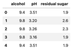
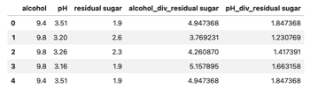

.. -*- mode: rst -*-

Feature Creation
================

Feature creation is a  feature engineering technique that consists of 
constructing new variables from the dataset’s original features. By combining 
or amalgamating two or more variables, a new variable is developed to improve 
the performance of a machine learning model.

One of the most common feature-creation methods in data science is `one-hot 
encoding <https://www.blog.trainindata.com/one-hot-encoding-categorical-variables/>`_, which  is a preprocessing technique used to transform a categorical 
feature into multiple binary features that represent each category.

In general, feature creation requires significant time analyzing the raw data, 
including evaluating the relationship between the independent or predictor 
variables and the dependent/target variable. It is useful to have domain knowledge 
of the dataset when performing feature creation, making it one of the more 
creative approaches to improve a predictive model’s performance. 

Lastly, a data scientist should be mindful that creating new features increases 
increases the dimensionality. This may have downstream effects depending on 
the machine learning algorithm being used. 

Creating New Features with Feature-engine
~~~~~~~~~~~~~~~~~~~~~~~~~~~~~~~~~~~~~~~~~~~

Feature-engine’s creation transformers generate new features that are added to the 
pandas dataframe by either combining or transforming existing features. The 
mathematical or statistical operations used in the Python package vary depending 
on the selected transformer. The transformers are to be used with numerical 
variables, e.g., integer and float data types.

Summary of Feature-engine’s feature-creation transformers:

   - CyclicalFeatures - Create two new features per original feature by applying 
     the trigonometric operations sine and cosine to each original feature.
   
   - MathFeatures - Applies basic mathematical functions, which are used in 
     ``pandas.agg()``, to subsets of features to create one or more new features.
   
   - RelativeFeatures - Utilizes basic mathematical functions between a group 
     of variables and one or more reference features, appending the new features 
     to the dataframe.

In addition to the abovementioned transformer, Feature-engine includes the 
``SklearnTransformerWrapper()``, which applies a Scikit-learn transformer to a 
selected set of features. ``SklearnTransformerWrapper()`` is similar to Scikit-learn’s 
``ColumnTrasnformer()`` but differs in implementation.

One useful application is to use ``SklearnTransformerWrapper()`` with Scikit-learn’s 
``PolynomialFeatures()``. This is appropriate in feature engineering when an independent 
variable does not have a linear or monotonic relationship with the target variable.

A data scientist may perform feature creation when they believe that the interaction 
between two variables can have a strong relationship with the target variable.

Feature-engine in Practice
~~~~~~~~~~~~~~~~~~~~~~~~~~
Let’s use Kaggle’s wine quality dataset as an example. The dataset is comprised of 11 
features, including ``alcohol``, ``pH``, and ``residual sugar``, and has ``quality`` as its 
target variable.

Through exploratory data analysis and our domain knowledge which includes real-world 
experimentation, i.e., drinking various brands/types of wine, we believe that we can 
create better features to train our algorithm by deriving the ratios of acidic-to-sweet 
and alcohol-to-sweet.

In our example, we import three Python packages - os, pandas, and Feature-engine. We also 
download the Kaggle dataset. We then use Feature-engine’s ``RelativeFeatures()`` to perform 
feature transformation.

.. code:: python

   import os
   import pandas as pd
   from feature_engine.creation import RelativeFeatures

   # download and unzip Kaggle wine-quality raw data
   os.environ["KAGGLE_USERNAME"] = <kaggle_username>
   os.environ["KAGGLE_KEY"] = <kaggle_api_key>
   !kaggle datasets download -d yasserh/wine-quality-dataset
   !unzip -q wine-quality-dataset.zip
   
   # read raw data and extract relevant features
   data = pd.read_csv("WineQT.csv")
   df = data[["alcohol", "pH", "residual sugar"]].copy()
   df.head()

.. code:: python

   # perform feature transformation
   rf = RelativeFeatures(variables=["alcohol", "pH"], reference=["residual sugar"], func=["div"])
   rf.fit(df)
   df_tr = rf.transform(df)
   df_tr.head()

In the above example, we see that ``RelativeFeature()`` performs automated feature engineering on 
the input data by applying the transformation defined in the ``func``  parameter on the features 
identified in ``variables``  and ``reference``.

The new features - ``alcohol_div_residual sugar`` and ``pH_div_residual sugar`` - can now train a 
regression model, like ``GradientBoostingRegressor()``, to predict the ``quality`` variable.

Summary
~~~~~~~
By using feature engineering for machine learning, a data scientist can optimize an algorithm’s 
scoring metrics. With feature creation, new data points are constructed that improve a machine 
learning algorithm’s learning process. 

To ensure the creation of high-quality features, thorough data mining is strongly encouraged to 
understand the relationships among the various independent variables.

One must be mindful of excessive feature creation, in addition to high dimensionality, unrestrained 
feature creation can cause overfitting, i.e., high variance.  Predictive models with high variance 
are susceptible to outliers. That is why we  recommend using feature creation in conjunction with 
feature selection, which Feature-engine has a module for.

Also, since we use existing features to develop new features, data validation must be performed 
before starting the process of feature engineering. Otherwise, the predictive model will be 
trained on erroneous information.

Transformers in other Libraries
~~~~~~~~~~~~~~~~~~~~~~~~~~~~~~~

Check also the following transformer from Scikit-learn:

* `PolynomialFeatures <https://scikit-learn.org/stable/modules/generated/sklearn.preprocessing.PolynomialFeatures.html>`_
* `SplineTransformer <https://scikit-learn.org/stable/modules/generated/sklearn.preprocessing.SplineTransformer.html>`_

Feature creation transformers in Feature-engine
~~~~~~~~~~~~~~~~~~~~~~~~~~~~~~~~~~~~~~~~~~~~~~~

.. toctree:: 
   :maxdepth: 1
   :hidden:

   CyclicalFeatures
   MathFeatures
   RelativeFeatures