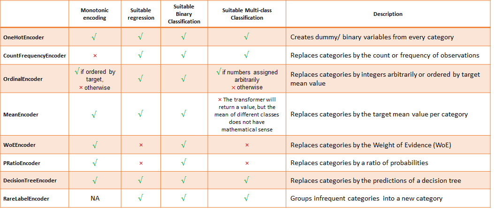

.. -*- mode: rst -*-

Categorical Variable Encoding
=============================

Feature-engine's categorical encoders replace variable strings by estimated or
arbitrary numbers.

   Summary of Feature-engine's encoders main characteristics

Feature-engine's categorical encoders work only with categorical variables by default.
From version 1.1.0, you have the option to set the parameter `ignore_format` to True,
and make the transformers also accept numerical variables as input.

.. toctree::
   :maxdepth: 2

   OneHotEncoder
   CountFrequencyEncoder
   OrdinalEncoder
   MeanEncoder
   WoEEncoder
   PRatioEncoder
   DecisionTreeEncoder
   RareLabelEncoder
   
For additional categorical encoding transformations, visit the open-source package
`Category encoders <https://contrib.scikit-learn.org/category_encoders/>`_.
