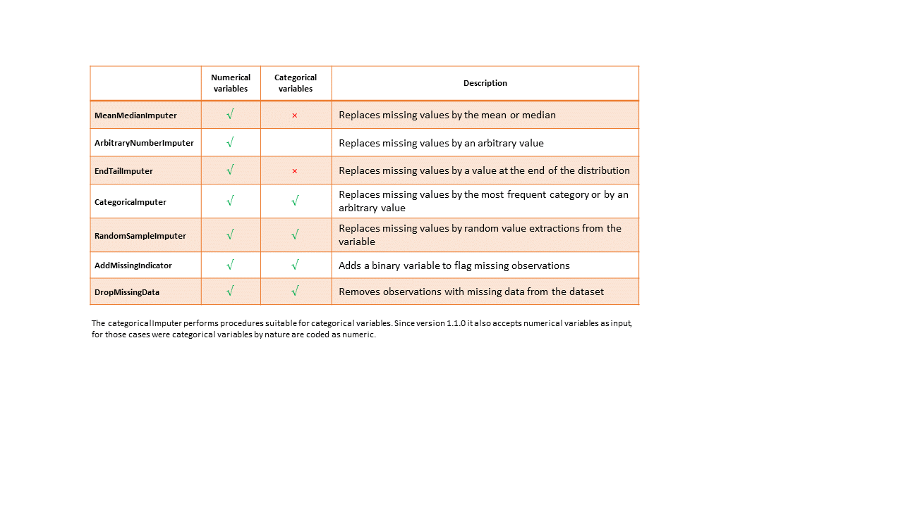

.. -*- mode: rst -*-

Missing Data Imputation
=======================

Feature-engine's missing data imputers replace missing data by parameters estimated
from data or arbitrary values pre-defined by the user.

.. toctree::
   :maxdepth: 2

   MeanMedianImputer
   ArbitraryNumberImputer
   EndTailImputer
   CategoricalImputer
   RandomSampleImputer
   AddMissingIndicator
   DropMissingData