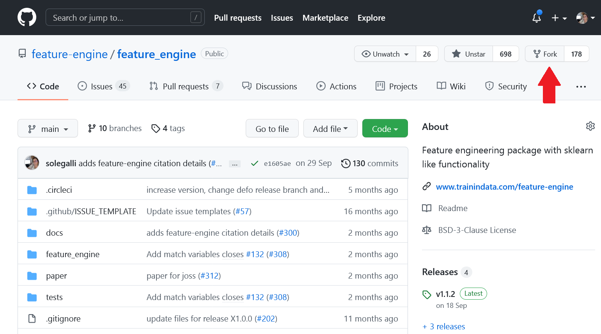

.. -*- mode: rst -*-

.. _contribute_code:

Contribute Code
===============

Contributing code to Feature-engine is fun and easy. If you want to make a code contribution,
you can check the `issue tracker <https://github.com/feature-engine/feature_engine/issues/>`_
for already requested and wanted functionality. Alternatively, you can create a new issue
with functionality you would like to see included in Feature-engine and then work it through.

Contributing workflow
---------------------

A typical contributing workflow goes like this:

1. **Suggest** new functionality or **pick up** an issue from the `issue tracker <https://github.com/feature-engine/feature_engine/issues/>`_.
2. **Mention** in the issue that you are "working on it".
3. **Fork** the repository into your GitHub account.
4. **Clone** your fork into your local computer.
5. Set up the **development environment**.
6. **Create** a new branch with the name of your feature
7. **Code** the feature, the tests and update or add the documentation.
8. **Commit** the changes to your fork.
9. Make a **Pull Request (PR)** with your changes from your fork to the main repo.
10. **Test** the code.
11. **Review** the code with us.
12. Make the **changes** and commit them to your fork, using the same branch created in 5.
13. When it is ready, we will **merge** your contribution into Feature-engine's source code base.

To avoid extra work or duplication, it is important that we communicate right from the
beginning, so we can build together a clear understanding of how you would like to get involved
and what is needed to complete the task. This is particularly important for big code additions.

In the rest of the document, we will describe steps 3 to 13 in more detail.

Fork the Repository
-------------------

When you fork the repository, you create a copy of Feature-engine's source code into
your Github account, which you can edit. To fork Feature-engine's repository, click the
**fork** button in the upper right corner of
`Feature-engine's Repository <https://github.com/feature-engine/feature_engine>`_.

Clone the Repository
--------------------

Once you forked the repository, clone the fork to your local machine.

1. Clone your fork into your local machine::

    $ git clone https://github.com/<YOURUSERNAME>/feature_engine

2. Set up an ``upstream`` remote from where you can pull the latest code changes occurring in the main Feature-engine repository::

    $ git remote add upstream https://github.com/feature-engine/feature_engine.git

3. Check that the remote was set correctly::

    $ git remote -v

You should see both your fork (origin) and the main repository (upstream) linked to your local copy::

    origin    https://github.com/YOUR_USERNAME/feature_engine.git (fetch)
    origin    https://github.com/YOUR_USERNAMEfeature_engine.git (push)
    upstream  https://github.com/feature-engine/feature_engine.git (fetch)
    upstream  https://github.com/feature-engine/feature_engine.git (push)

Keep in mind that Feature-engine is being actively developed, so you may need to update
your fork regularly. See below how to **Keep your fork up to date**.

Set up the Development Environment
----------------------------------

After creating a local copy of the repo, you need to set up the development environment.
Setting up a development environment will ensure that you have all the libraries
you need for the development, no more and no less. These libraries include
`Feature-engine dependencies <https://github.com/feature-engine/feature_engine/blob/main/requirements.txt>`_,
like Pandas, NumPy and Scikit-learn and also
`software development libraries <https://github.com/feature-engine/feature_engine/blob/main/test_requirements.txt>`_
like pytest, mypy, flake8, isort and black.

It is optional but highly advisable that you create a virtual environment. A virtual environment
is a "separate space", where you can install Feature-engine's dependencies. To create a virtual
environment, use any virtual environment tool of your choice. Some examples include:

1. `venv <https://docs.python.org/3/library/venv.html>`_
2. `conda environments <https://docs.conda.io/projects/conda/en/latest/user-guide/tasks/manage-environments.html>`_

In the previous links, you find details on how to create the environments. We provide
some guidelines below.

venv
~~~~

If you use venv, from the windows cmd or Mac terminal, create and activate the environment
like this::

    python -m venv /path/to/new/virtual/environment

For example I would do::

    python -m venv Documents/Repositories/envs/featureengine

where "featureengine" will be the name of the environment and "Documents/Repositories/envs"
the location where the environment will be created.

Then, to activate the environment, run::

    Documents/Repositories/envs/featureengine/Scripts/activate

**Note for windows users:** you may need to use \\ instead of /.

conda
~~~~~

If you are using anaconda, from your conda prompt, create and activate the environment
like this::

    conda create --name myenv

where "myenv" will be the name of the environment, so you probably want to change that to
something more meaningful.

Then, to activate the environment, run::

    conda activate myenv

Install dependencies
~~~~~~~~~~~~~~~~~~~~

Now, you are ready to install all dependencies, that is, all the Python libraries used by
Feature-engine. First, navigate to your clone of Feature-engine::

        $ cd feature_engine

Now, install Feature_engine in developer mode::

        $ pip install -e .

Don't forget the `.` after the `-e`. This will add Feature-engine to your PYTHONPATH so your code edits
are automatically picked up, and there is no need to re-install the package after each
code change. This will also install Feature'engine's dependencies.
    
Finally, install the additional dependencies for tests and documentation::

        $ pip install -r test_requirements.txt
        $ pip install -r docs/requirements.txt

Make sure that your local main branch is up to date with the remote main branch::

        $ git pull --rebase upstream main

If you just cloned your fork, your local main branch should be up to date. If you cloned
your fork a time ago, probably the main repository had some code changes. To sync your
fork main branch to the main repository, read below the section **Keep your fork up
to date**.

Create a branch
---------------

It is important to create a new branch, different from main, where you will code your
changes. It is advisable, almost never to work on the main branch.

Create a new branch where you will develop your feature::

    $ git checkout -b myfeaturebranch

where "myfeaturebranch" is the name you choose for your branch.

There are 3 things to keep in mind when creating a feature branch:

1. Give the branch a name that identifies the feature you are going to build.
2. Make sure you checked out your branch from the main branch.
3. Make sure your local main branch was updated with the upstream main branch.

Code your feature
-----------------

Now, you are ready to make your code changes. When you develop a new feature, fix a bug, or
make any code contribution, there are a few things to consider:

1. Make regular code commits to your branch, locally.
2. Give clear messages to your commits, indicating which changes were made at each commit (use present tense).
3. Try and push regularly to your fork, so that you don't lose your changes.

Commit
~~~~~~

Make small changes and commit immediately. This way it is easier to track what was changed.
To commit changes do the following::

    $ git add .
    $ git commit -m "my commit message"

and make sure to include an informative but succinct commit message in the present tense,
for example "fix style in imputation error message".

The previous commands will commit all files that have changes. If you want to commit just 1
or 2 files, you can do so as follows::

    $ git add file1.py file2.py
    $ git commit -m "my commit message"

It is important that you commit only the files relevant to your feature, and not others
that may have been accidentally changed, for example through code styling (more on this in
**Test the Code** below).

After making a few commits, push your changes to your fork::

    $ git push origin myfeaturebranch

This will automatically create a branch in your remote fork called "myfeaturebranch"
containing all your changes.

Make a Pull Request
~~~~~~~~~~~~~~~~~~~

After pushing the first changes, go to your fork in Github. You will see the branch you
just pushed and next to it a button to create a PR (Pull Request). Go ahead and create a PR from your
feature branch to Feature_engine's **main branch**. In the PR message, describe what the overall
aim of the PR is, and if it resolves an issue, link the issue in the message. This will
notify us of your changes.

Don't worry, you can continue making changes and committing more code to the branch. You
basically need to repeat these steps as often as you need::

    $ git add .
    $ git commit -m "my commit message"
    $ git push origin myfeaturebranch

Once you think your code is ready to review, leave a message in the PR saying "please review"
or something similar.

Create Docstrings
~~~~~~~~~~~~~~~~~

If you are coding an entire new class, make sure you follow our :ref:`guidelines to create
the docstrings <contribute_docs>`.

Test the Code
-------------

The code you submit must pass any test you add plus all current tests in the library.
The tests are triggered automatically when you first make a PR, and then any
time you commit new changes to the PR. It is important that the tests pass when you ask
us for review.

We have tests for:

1. Functionality, using pytest
2. Code style, using flake8
3. Typehints, using mypy
4. Documentation, using sphinx.
5. Coverage using coverage

In the following paragraphs, we will take you through how to test each of the above.

Test functionality
~~~~~~~~~~~~~~~~~~

We use pytest to create and run our tests. If you set up the development environment as
we described previously, you should have pytest installed. Alternatively, run from the
windows cmd or mac terminal::

    $ pip install pytest

You can now run the tests from your command line interface. Make sure you are within the
feature-engine folder. Then run::

    $ pytest

These command will run all the test scripts within the test folder. It will take a few
minutes.

Alternatively, you can run a specific script as follows::

    $ pytest tests/test_encoding/test_onehot_encoder.py

The previous command will just run the tests for the one hot encoder.

It will be faster if you just test the code you created, in which case you would do::

    $ pytest tests/test_my_new_feature_folder/test_my_new_feature.py

where test_my_new_feature.py is the name of your test script, and it is located in the
test_my_new_feature_folder.

If you are using Pycharm, this is even easier:

1. In your project directory (where you have all the files and scripts), right click with the mouse on the folder "tests".
2. Select "Run pytest in tests".

This will run all tests.

To run your specific tests:

1. Locate your test file
2. Right click with the mouse on the test file.
3. Select "Run pytest in tests".

Sweet, isn't it?

With the above procedure you can also "click" on your individual test script and run only
those tests.

Code coverage
~~~~~~~~~~~~~

We use `coverage <https://pypi.org/project/coverage/>`_ to test the extend of coverage of
our tests. To evaluate the code coverage, you need to run pytest with coverage::

    $ coverage run -m pytest

And then, you can visualize the report like this::

    $ coverage report

If you see that there is coverage missing in any of the classes you are working with,
try to add tests to increase coverage. We aim for 97%.

Test Code Style
~~~~~~~~~~~~~~~

We follow `PEP8 <https://pep8.org/>`_ and we keep our code lines up to 88 characters.
Before testing the code style, make sure to automatically
fix anything that might not abide by PEP8 with `**black** <https://pypi.org/project/black/>`_
and `**isort** <https://pypi.org/project/isort/>`_.

If you set up the development environment as we described previously, you should have these
libraries installed. Alternatively, run from the windows cmd or mac terminal::

    $ pip install black
    $ pip install isort

Then, you can sort the imports alphabetically by running::

    $ isort my_new_script.py

You can fix code style by running::

    $ black my_new_script.py

**You need to run isort and black on both code files and test files.**

Black and isort may make changes to your file. Don't forget to commit those changes::

    $ git add my_new_script.py
    $ git commit -m "fix code style"
    $ git push origin my_feature_branch

Now, you can go ahead and test that your scripts pass the code styling tests. To do so,
execute from the command line::

    $ flake8 my_new_script.py

If the flake8 test pass, you are good to go. Alternatively, you will get an error, indicating
which line of code is not following the coding convention.

Test Typehint
~~~~~~~~~~~~~

We use `Typehint <https://www.python.org/dev/peps/pep-0484/>`_. To test typehinting we use
`**mypy** <http://mypy-lang.org/>`_.

If you set up the development environment as we described previously, you should have
mypy installed. Alternatively, run from the windows cmd or mac terminal::

    $ pip install mypy

now, you test typehint by running::

    $ mypy feature_engine

A few things to notice:

- We use typehint only on the code base and not on the tests.
- You need to run mypy on the entire module and not just your script.

Otherwise, you will most likely get an error.

Test the docs
~~~~~~~~~~~~~

If after running pytest, black and mypy you do not get errors, you are only left with testing
that the documentation builds correctly.

To do this, first make sure you have all the documentation dependencies installed. If you
set up the environment as we described previously, they should be installed. Alternatively,
from the windows cmd or mac terminal, run::

    $ pip install -r docs/requirements.txt

Make sure you are within the feature_engine module when you run the previous command.

Now, you can go ahead and build the documentation::

    $ sphinx-build -b html docs build

This will trigger the building of the docs, which will be stored in html format in the
"build" folder within the repository. You can open those up with your browser. But the
important thing is that you do not get any red warning during the build process.

Using tox
~~~~~~~~~

In Feature-engine, we use tox to run all our tests automatically. If you want to run all
the tests using tox locally:

1. Install tox in your development environment::

    $ pip install tox

2. Make sure you are in the repository folder, alternatively::

    $ cd feature_engine

3. Run the tests in tox::

    $ tox

Just writing `tox`, will trigger automatically the functionality tests, code styling tests,
typehint tests and documentation test. These will test the entire Feature-engine ecosystem
and not just your new scripts, so it will be more time consuming.

If the tests pass, the code is in optimal condition :)

**A few things to note:**

Tox runs our tests in Python versions 3.6, 3.7, 3.8 and 3.9. However, it will only be able to
run the tests in the version you have installed locally. All others will fail. This is OK.
As long as the tests in the Python version you have installed pass, you are good to go.

Tox may modify some local files that are not relevant to your feature. Please **DO NOT** add
those files to your PR.

If you want to know more about tox check this `link <https://tox.readthedocs.io>`_. If
you want to know why we prefer tox, this
`article <https://christophergs.com/python/2020/04/12/python-tox-why-use-it-and-tutorial/>`_
will tell you everything ;)

Review Process
--------------

Once your contribution contains the new code, the tests and the documentation, you can
request a review by mentioning that in a comment in the Pull Request. Likely, there will
be some back and forth until the final submission. We will work together to get the code
in the final shape.

If you feel you would like to clarify something before the first draft is done, or if
you can't get some tests to pass, do not hesitate to mention that in a comment, and we
will try to help.

**We aim to review PRs within a week. If for some reason we can't, we will let you know
through the PR as well.**

Once the submission is reviewed and provided the continuous integration tests have
passed and the code is up to date with Feature-engine's main branch, we will be ready
to "Squash and Merge" your contribution into the ``main`` branch of Feature-engine.
"Squash and Merge" combines all of your commits into a single commit which helps keep
the history of the repository clean and tidy.

Once your contribution has been merged into main, you will be listed as a
Feature-engine contributor :)

Merge Pull Requests
-------------------

Only Core contributors have write access to the repository, can review and merge
pull requests. Some preferences for commit messages when merging in pull requests:

- Make sure to use the “Squash and Merge” option in order to create a Git history that is understandable.
- Keep the title of the commit short and descriptive; be sure it links all related issues.

Releases
--------

After a few features have been added to the main branch by yourself and other
contributors, we will merge main into a release branch, e.g. 1.2.X, to release a new
version of Feature-engine to PyPI and conda-forge.

Keep your Fork up to Date
-------------------------

When you're collaborating using forks, it's important to update your fork to capture
changes that have been made by other collaborators.

If your feature takes a few weeks or months to develop, it may happen that new code
changes are made to Feature_engine's main branch by other contributors. Some of the
files that are changed maybe the same files you are working on. Thus, it is really
important that you pull and rebase the upstream main branch into your feature branch.
To keep your branches up to date:

1. Check out your local main branch::

    $ git checkout main

If your feature branch has uncommitted changes, it will ask you to commit or stage those
first. Refer to the commit guidelines we described above.

2. Pull and rebase the upstream main branch on your local main branch::

    $ git pull --rebase upstream main

Your main should be a copy of the upstream main after this. If was is not, there may appear
some conflicting files. You will need to resolve these conflicts and continue the rebase.

3. Pull the changes to your fork::

    $ git push -f origin main

The previous command will update your fork (remote) so that your fork's main branch is in sync with
Feature-engine's main. Now, you need to rebase main onto your feature branch.

4. Check out your feature branch::

    $ git checkout myfeaturebranch

5. Rebase main onto it::

    $ git rebase main

Again, if conflicts arise, try and resolve them and continue the rebase.

Now you are good to go to continue developing your feature.