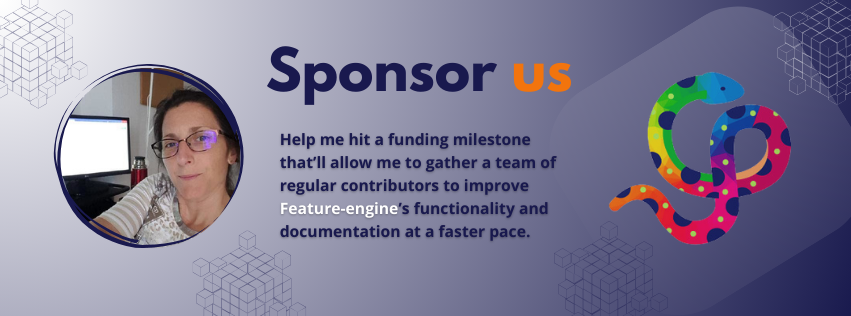

.. -*- mode: rst -*-

Other ways to contribute
========================

A common misconception about contributing to open source is that you need to contribute code.
Equally important to the code contributions are contributions to the documentation or to
the gallery of examples on how to use the project, which we already discussed.

However, a good project does no-one any good if people don't know about it. So spreading the word
about Feature-engine is extremely important. You will do the project a big favor if you help
us spread the word about Feature-engine.

Here are some examples of how you could do that:

Spread the word
---------------

1. Star `Feature-engine's Repository <https://github.com/feature-engine/feature_engine>`_.
2. Share Feature-engine or any of our :ref:`blogs and videos <featureengine_blogs>` on social media.
3. Write a blog about Feature-engine.
4. Give a talk about Feature-engine or mention it in one of your talks.
5. If you teach, use Feature-engine in your lectures.
6. Share Feature-engine with your colleagues.

If you write a blog or give a talk that is publicly available, and it features Feature-engine,
let us know so we link it to the project or share it on social.

If you teach Feature-engine, give a shout-out on Twiter or LinkedIn and tag the maintainers.

If you have other ideas on how to spread the word, let us know or update this page
straightaway.

We are also happy to talk about the project in talks and podcasts. If you host a meetup
or a podcast channel, do get in touch.

Sponsor us
----------

`Empower Sole <https://github.com/sponsors/solegalli>`_, the main developer of
Feature-engine, to assemble a team of paid contributors to accelerate the development of
Feature-engine.

Currently, Sole and our contributors dedicate their free time voluntarily
to advancing the project. You can help us reach a funding milestone so that we can
gather a group of 2-3 contributors who will commit regular hours each week to enhance
documentation and expand Feature-engine's functionality at a faster pace.
`Your contribution <https://github.com/sponsors/solegalli>`_ will play a vital role in
propelling Feature-engine to new heights, ensuring it remains a valuable resource for
the data science community.

If you don't have a Github account, you can also `sponsor us here <https://buymeacoffee.com/solegalliy>`_.
