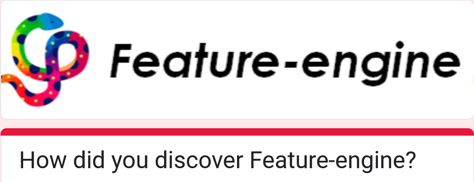

.. feature_engine documentation master file, created by
   sphinx-quickstart on Wed Jan 10 14:43:38 2018.
   You can adapt this file completely to your liking, but it should at least
   contain the root `toctree` directive.

Feature-engine
==============

A user-friendly feature engineering alternative to Scikit-learn
---------------------------------------------------------------

   **Feature-engine rocks!**

Feature-engine is a Python library with multiple transformers to engineer and select
features for machine learning models. Feature-engine, like Scikit-learn,
uses the methods `fit()` and `transform()` to learn parameters from and then
transform the data.

Working with dataframes? 👉 Feature-engine is a no-brainer
~~~~~~~~~~~~~~~~~~~~~~~~~~~~~~~~~~~~~~~~~~~~~~~~~~~~~~~~~~

Unlike Scikit-learn, Feature-engine is designed to work with dataframes. No
column order or name changes. A dataframe comes in, same dataframe
comes out, with the transformed variables.

We normally apply different feature engineering processes to different feature subsets. With sklearn, we restrict the
feature engineering techniques to a certain group of variables by using an auxiliary class: the `ColumnTransformer`.
This class also results in a change in the name of the variables after the transformation.

Feature-engine, instead, allows you to select the variables you want to transform **within** each
transformer. This way, different engineering procedures can be easily applied to
different feature subsets without the need for additional transformers or changes in the feature names.

Sitting at the interface of pandas and scikit-learn
~~~~~~~~~~~~~~~~~~~~~~~~~~~~~~~~~~~~~~~~~~~~~~~~~~~

Pandas is great for data analysis and transformation. We ❤️ it too. But it
doesn't automatically learn and store parameters from the data. And that is
key for machine learning. That's why we created Feature-engine.

Feature-engine wraps pandas functionality in Scikit-learn like transformers,
capturing much of the pandas logic needed to learn and store parameters,
while making these transformations compatible with Scikit-learn estimators,
selectors, cross-validation functions and hyperparameter search methods.

If your work is primarily data analysis and transformation for machine
learning, and pandas and scikit-learn are your main tools, then Feature-engine
is your friend.

Feature-engine transformers
---------------------------

Feature-engine includes transformers for:

- Missing data imputation
- Encoding of categorical features
- Discretization
- Outlier capping or removal
- Feature transformation
- Creation of new features
- Feature selection
- Datetime features
- Time series
- Preprocessing
- Scaling

Feature-engine transformers are fully compatible with scikit-learn. That means that you can assemble Feature-engine
transformers within a Scikit-learn pipeline, or use them in a grid or random search for hyperparameters.
Check :ref:`**Quick Start** <quick_start>` for an example.

How did you find us? 👀
-----------------------

We want to share Feature-engine with more people. It'd help us loads if you tell us
how you discovered us.

Then we can know what we are doing right and which channels we should use to share the love.

🙏 Please share your story by answering 1 quick question
`at this link <https://docs.google.com/forms/d/e/1FAIpQLSfxvgnJvuvPf2XgosakhXo5VNQafqRrjNXkoW5qDWqnuxZNSQ/viewform?usp=sf_link>`_ 😃

What is feature engineering?
----------------------------

Feature engineering is the process of using domain knowledge and statistical tools to create features for
machine learning algorithms. The raw data that we normally gather as part of our business activities is rarely fit to
train machine learning models. Instead, data scientists spend a large part of their time on data analysis, preprocessing,
and feature engineering.

Pandas is a common library for data preprocessing and feature engineering. It supports pretty much every method that is
commonly used to transform raw data. However, pandas is not compatible with sklearn out of the box and is also not able
to learn and store the feature engineering parameters.

Feature-engine’s transformers wrap pandas functionality around an API that exposes `fit` and `transform` methods to learn
and store parameters from data and then use these parameters to transform the variables. Like this, Feature-engine makes
the awesome functionality available in pandas fully compatible with Scikit-Learn.

What is unique about Feature-engine?
------------------------------------

The following characteristics make Feature-engine unique:

- Feature-engine contains the most exhaustive collection of feature engineering transformations.
- Feature-engine can transform a specific group of variables in the dataframe, right out-of-the-box.
- Feature-engine returns dataframes, hence suitable for data analysis and model deployment.
- Feature-engine is compatible with the Scikit-learn pipeline, Grid and Random search and cross validation.
- Feature-engine automatically recognizes numerical, categorical and datetime variables.
- Feature-engine alerts you if a transformation is not possible, e.g., if applying logarithm to negative variables or divisions by 0.

Installation
------------

Feature-engine is a Python 3 package and works well with 3.9 or later.

The simplest way to install Feature-engine is from PyPI with pip:

.. code-block:: bash

    $ pip install feature-engine

Note, you can also install it with a _ as follows:

.. code-block:: bash

    $ pip install feature_engine

Feature-engine is an active project and routinely publishes new releases. To upgrade
Feature-engine to the latest version, use pip like this:

.. code-block:: bash

    $ pip install -U feature-engine

If you’re using Anaconda, you can install the
`Anaconda Feature-engine package <https://anaconda.org/conda-forge/feature_engine>`_:

.. code-block:: bash

    $ conda install -c conda-forge feature_engine

Feature-engine features in the following tutorials
--------------------------------------------------

- `Feature Engineering for Machine Learning <https://www.trainindata.com/p/feature-engineering-for-machine-learning>`_, Online Course.
- `Feature Selection for Machine Learning <https://www.trainindata.com/p/feature-selection-for-machine-learning>`_, Online Course.
- `Feature Engineering for Time Series Forecasting <https://www.trainindata.com/p/feature-engineering-for-forecasting>`_, Online Course.
- `Python Feature Engineering Cookbook <https://www.packtpub.com/en-us/product/python-feature-engineering-cookbook-9781835883587>`_, book.
- `Feature Selection in Machine Learning with Python <https://www.trainindata.com/p/feature-selection-in-machine-learning-book>`_, book.

More learning resources in :ref:`**Learning Resources** <learning_resources>`.

Feature-engine's Transformers
-----------------------------

Feature-engine hosts the following groups of transformers:

Missing Data Imputation: Imputers
~~~~~~~~~~~~~~~~~~~~~~~~~~~~~~~~~

Missing data imputation consists in replacing missing values in categorical data and numerical variables with estimates
of those nan values or arbitrary data points. Feature-engine supports the following missing data imputation methods:

- :doc:`api_doc/imputation/MeanMedianImputer`: replaces missing data in numerical variables by the mean or median
- :doc:`api_doc/imputation/ArbitraryNumberImputer`: replaces missing data in numerical variables by an arbitrary number
- :doc:`api_doc/imputation/EndTailImputer`: replaces missing data in numerical variables by numbers at the distribution tails
- :doc:`api_doc/imputation/CategoricalImputer`: replaces missing data with an arbitrary string or by the most frequent category
- :doc:`api_doc/imputation/RandomSampleImputer`: replaces missing data by random sampling observations from the variable
- :doc:`api_doc/imputation/AddMissingIndicator`: adds a binary missing indicator to flag observations with missing data
- :doc:`api_doc/imputation/DropMissingData`: removes observations (rows) containing missing values from dataframe

Categorical Encoders: Encoders
~~~~~~~~~~~~~~~~~~~~~~~~~~~~~~

Categorical encoding is the process of replacing categorical values by numerical values. Most machine learning models, and
in particular, those supported by scikit-learn, don't accept strings as inputs. Hence, we need to convert these strings
into numbers that can be interpeted by these models.

There are various categorical encoding techniques, including one hot encoding, ordinal encoding and target encoding.
Feature-engine supports the following methods:

- :doc:`api_doc/encoding/OneHotEncoder`: performs one hot encoding, optional: of popular categories
- :doc:`api_doc/encoding/CountFrequencyEncoder`: replaces categories by the observation count or percentage
- :doc:`api_doc/encoding/OrdinalEncoder`: replaces categories by numbers arbitrarily or ordered by target
- :doc:`api_doc/encoding/MeanEncoder`: replaces categories by the target mean
- :doc:`api_doc/encoding/WoEEncoder`: replaces categories by the weight of evidence
- :doc:`api_doc/encoding/DecisionTreeEncoder`: replaces categories by predictions of a decision tree
- :doc:`api_doc/encoding/RareLabelEncoder`: groups infrequent categories
- :doc:`api_doc/encoding/StringSimilarityEncoder`: encodes categories based on string similarity

Variable Discretization: Discretizers
~~~~~~~~~~~~~~~~~~~~~~~~~~~~~~~~~~~~~

Discretization, or binning, consists in sorting numerical features into discrete intervals. The most commonly used methods
are equal-width and equal-frequency discretization. Feature-engine supports these and more advanced methods, like
discretization with decision trees:

- :doc:`api_doc/discretisation/ArbitraryDiscretiser`: sorts variable into intervals defined by the user
- :doc:`api_doc/discretisation/EqualFrequencyDiscretiser`: sorts variable into equal frequency intervals
- :doc:`api_doc/discretisation/EqualWidthDiscretiser`: sorts variable into equal width intervals
- :doc:`api_doc/discretisation/DecisionTreeDiscretiser`: uses decision trees to create finite variables
- :doc:`api_doc/discretisation/GeometricWidthDiscretiser`: sorts variable into geometrical intervals

Outlier Capping or Removal
~~~~~~~~~~~~~~~~~~~~~~~~~~

Outliers are values that are very different with respect to the distribution observed by the variable. Some machine-learning
models and statistical tests are sensitive to outliers. In some cases, we may want to remove outliers or replace them with
permitted values.

-  :doc:`api_doc/outliers/ArbitraryOutlierCapper`: caps maximum and minimum values at user defined values
-  :doc:`api_doc/outliers/Winsorizer`: caps maximum or minimum values using statistical parameters
-  :doc:`api_doc/outliers/OutlierTrimmer`: removes outliers from the dataset

Numerical Transformation: Transformers
~~~~~~~~~~~~~~~~~~~~~~~~~~~~~~~~~~~~~~

We normally use variance stabilizing transformations to make the data meet the assumptions of certain statistical tests,
like anova, and machine learning models, like linear regression. Feature-engine supports the following transformations:

- :doc:`api_doc/transformation/LogTransformer`: performs logarithmic transformation of numerical variables
- :doc:`api_doc/transformation/LogCpTransformer`: performs logarithmic transformation after adding a constant value
- :doc:`api_doc/transformation/ReciprocalTransformer`: performs reciprocal transformation of numerical variables
- :doc:`api_doc/transformation/PowerTransformer`: performs power transformation of numerical variables
- :doc:`api_doc/transformation/BoxCoxTransformer`: performs Box-Cox transformation of numerical variables
- :doc:`api_doc/transformation/YeoJohnsonTransformer`: performs Yeo-Johnson transformation of numerical variables
- :doc:`api_doc/transformation/ArcsinTransformer`: performs arcsin transformation of numerical variables

Feature Creation:
~~~~~~~~~~~~~~~~~

Feature-engine allows you to create new features by combining them mathematically or transforming them with mathematical functions:

-  :doc:`api_doc/creation/MathFeatures`: creates new variables by combining features with mathematical operations
-  :doc:`api_doc/creation/RelativeFeatures`: combines variables with reference features
-  :doc:`api_doc/creation/CyclicalFeatures`: creates variables using sine and cosine, suitable for cyclical features
-  :doc:`api_doc/creation/DecisionTreeFeatures`: creates variables resulting from predictions of decision trees on 1 or more features

Datetime:
~~~~~~~~~

Data scientists rarely use datetime features in their original representation with machine learning models. Instead, we
extract many new features from the date and time parts of the datetime variable:

- :doc:`api_doc/datetime/DatetimeFeatures`: extract features from datetime variables
- :doc:`api_doc/datetime/DatetimeSubtraction`: computes subtractions between datetime variables

Feature Selection:
~~~~~~~~~~~~~~~~~~

Simpler models are easier to interpret, deploy, and maintain. Feature-engine expands the feature selection functionality
existing in other libraries like sklearn and MLXtend, with additional methods:

- :doc:`api_doc/selection/DropFeatures`: drops an arbitrary subset of variables from a dataframe
- :doc:`api_doc/selection/DropConstantFeatures`: drops constant and quasi-constant variables from a dataframe
- :doc:`api_doc/selection/DropDuplicateFeatures`: drops duplicated variables from a dataframe
- :doc:`api_doc/selection/DropCorrelatedFeatures`: drops correlated variables from a dataframe
- :doc:`api_doc/selection/SmartCorrelatedSelection`: selects best features from correlated groups
- :doc:`api_doc/selection/DropHighPSIFeatures`: selects features based on the Population Stability Index (PSI)
- :doc:`api_doc/selection/SelectByInformationValue`: selects features based on their information value
- :doc:`api_doc/selection/SelectByShuffling`: selects features by evaluating model performance after feature shuffling
- :doc:`api_doc/selection/SelectBySingleFeaturePerformance`: selects features based on their performance on univariate estimators
- :doc:`api_doc/selection/SelectByTargetMeanPerformance`: selects features based on target mean encoding performance
- :doc:`api_doc/selection/RecursiveFeatureElimination`: selects features recursively, by evaluating model performance
- :doc:`api_doc/selection/RecursiveFeatureAddition`: selects features recursively, by evaluating model performance
- :doc:`api_doc/selection/ProbeFeatureSelection`: selects features whose importance is greater than those of random variables
- :doc:`api_doc/selection/MRMR`: selects features based on the Maximum Relevance Minimum Redundancy framework

Forecasting:
~~~~~~~~~~~~

To address forecasting as a regression by using traditional machine learning algorithms, we first need to transform the
time series into a table of static fetaures. We can do this through lags and windows combined with aggregations over past data:

- :doc:`api_doc/timeseries/forecasting/LagFeatures`: extract lag features
- :doc:`api_doc/timeseries/forecasting/WindowFeatures`: create window features
- :doc:`api_doc/timeseries/forecasting/ExpandingWindowFeatures`: create expanding window features

Preprocessing:
~~~~~~~~~~~~~~

When transforming variables and doing data cleaning, we usually change the variables data types (dtype in pandas). These
can cause problems further down the pipeline. To tackle this head on, Feature-engine has transformers to ensure the data
types and variable names match.

- :doc:`api_doc/preprocessing/MatchCategories`: ensures categorical variables are of type 'category'
- :doc:`api_doc/preprocessing/MatchVariables`: ensures that columns in test set match those in train set

Scaling:
~~~~~~~~

Scaling the data can help to balance the impact of all variables on the model, and can improve 
its performance.

- :doc:`api_doc/scaling/MeanNormalizationScaler`: scale variables using mean normalization

Scikit-learn Wrapper:
~~~~~~~~~~~~~~~~~~~~~

An alternative to scikit-learn's `ColumnTransformer`:

-  :doc:`api_doc/wrappers/Wrapper`: applies Scikit-learn transformers to a selected subset of features

Feature scaling
---------------

Scikit-learn offers a comprehensive array of tools to apply data normalization, standardization, and min-max scaling, among
other processes, so we felt that there was no need to bring that functionality to Feature-engine. If you want to apply these
procedures to a subset of the variables only, check out the :doc:`api_doc/wrappers/Wrapper`:

Getting Help
------------

Can't get something to work? Here are places where you can find help.

1. The :ref:`**User Guide** <user_guide>` in the docs.
2. `Stack Overflow <https://stackoverflow.com/search?q=feature_engine>`_. If you ask a question, please mention "feature_engine" in it.
3. If you are enrolled in the `Feature Engineering for Machine Learning course <https://www.trainindata.com/p/feature-engineering-for-machine-learning>`_ , post a question in a relevant section.
4. If you are enrolled in the `Feature Selection for Machine Learning course <https://www.trainindata.com/p/feature-selection-for-machine-learning>`_ , post a question in a relevant section.
5. Join our `gitter community <https://gitter.im/feature_engine/community>`_. You an ask questions here as well.
6. Ask a question in the repo by filing an `issue <https://github.com/feature-engine/feature_engine/issues/>`_ (check before if there is already a similar issue created :) ).

Contributing
------------

Interested in contributing to Feature-engine? That is great news!

Feature-engine is a welcoming and inclusive project and we would be delighted to have you
on board. We follow the
`Python Software Foundation Code of Conduct <http://www.python.org/psf/codeofconduct/>`_.

Regardless of your skill level you can help us. We appreciate bug reports, user testing,
feature requests, bug fixes, addition of tests, product enhancements, and documentation
improvements. We also appreciate blogs about Feature-engine. If you happen to have one,
let us know!

For more details on how to contribute check the contributing page. Click on the
:ref:`**Contribute** <contribute>` guide.

Sponsor us
----------

`Empower Sole <https://github.com/sponsors/solegalli>`_, the main developer of
Feature-engine, to assemble a team of paid contributors to accelerate the development of
Feature-engine.

.. figure::  images/sponsors/call_for_sponsors.png
   :align:   center
   :target: https://github.com/sponsors/solegalli

Currently, Sole and our contributors dedicate their free time voluntarily
to advancing the project. You can help us reach a funding milestone so that we can
gather a group of 2-3 contributors who will commit regular hours each week to enhance
documentation and expand Feature-engine's functionality at a faster pace.

`Your contribution <https://github.com/sponsors/solegalli>`_ will play a vital role in
propelling Feature-engine to new heights, ensuring it remains a valuable resource for
the data science community.

If you don't have a Github account, you can also `sponsor us here <https://buymeacoffee.com/solegalliy>`_.

Open Source
-----------

Feature-engine's `license <https://github.com/feature-engine/feature_engine/blob/master/LICENSE.md>`_
is an open source BSD 3-Clause.

Feature-engine is hosted on `GitHub <https://github.com/feature-engine/feature_engine/>`_.
The `issues <https://github.com/feature-engine/feature_engine/issues/>`_ and
`pull requests <https://github.com/feature-engine/feature_engine/pulls>`_ are tracked there.

Table of Contents
-----------------

.. toctree::
   :maxdepth: 2

   quickstart/index
   user_guide/index
   api_doc/index
   resources/index
   contribute/index
   about/index
   whats_new/index
   versions/index
   donate
