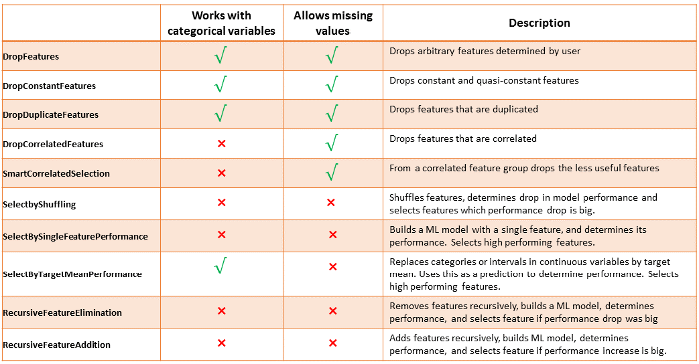

.. -*- mode: rst -*-

Preprocessing
=============

Feature-engine's preprocessing transformers are used to apply general preprocessing steps.

   Summary of Feature-engine's preprocessing main characteristics

.. toctree::
   :maxdepth: 2

   MatchColumnsToTrainSet
