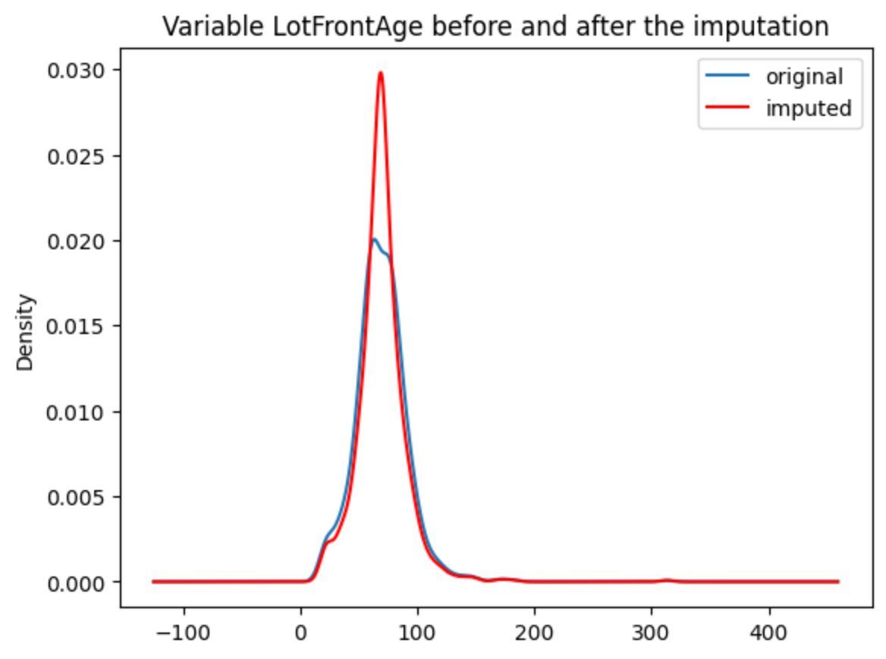
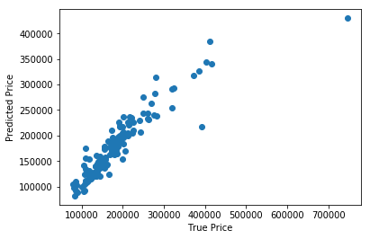

.. -*- mode: rst -*-

Quick Start
===========

If you're new to Feature-engine this guide will get you started. Feature-engine transformers have the methods
fit() and transform() to learn parameters from the data and then modify the data. They work just like any Scikit-
learn transformer.

Installation
------------

Feature-engine is a Python 3 package and works well with 3.6 or later. Earlier versions have not been tested.
The simplest way to install Feature-engine is from PyPI with pip, Python's preferred package installer.

.. code-block:: bash

    $ pip install feature-engine

Note that Feature-engine is an active project and routinely publishes new releases. In order to upgrade Feature-engine to the latest version, use ``pip`` as follows.

.. code-block:: bash

    $ pip install -U feature-engine

You can also use the ``-U`` flag to update Scikit-learn, pandas, NumPy, or any other libraries that work well with Feature-engine to their latest versions.

Once installed, you should be able to import Feature-engine without an error, both in Python and inside of Jupyter notebooks.

Example Use
-----------
This is an example of how to use Feature-engine's transformers to perform missing data imputation.

.. code:: python

	import numpy as np
	import pandas as pd
	import matplotlib.pyplot as plt
	from sklearn.model_selection import train_test_split

	import feature_engine.missing_data_imputers as mdi

	# Load dataset
	data = pd.read_csv('houseprice.csv')

	# Separate into train and test sets
	X_train, X_test, y_train, y_test = train_test_split(
    	data.drop(['Id', 'SalePrice'], axis=1), data['SalePrice'], test_size=0.3, random_state=0)

	# set up the imputer
	median_imputer = mdi.MeanMedianImputer(imputation_method='median',
	                                       variables=['LotFrontage', 'MasVnrArea'])
	# fit the imputer
	median_imputer.fit(X_train)

	# transform the data
	train_t= median_imputer.transform(X_train)
	test_t= median_imputer.transform(X_test)

	fig = plt.figure()
	ax = fig.add_subplot(111)
	X_train['LotFrontage'].plot(kind='kde', ax=ax)
	train_t['LotFrontage'].plot(kind='kde', ax=ax, color='red')
	lines, labels = ax.get_legend_handles_labels()
	ax.legend(lines, labels, loc='best')

More examples can be found in the documentation for each transformer and in a dedicated section in the
repository with `Jupyter notebooks <https://github.com/solegalli/feature_engine/tree/master/examples>`_.

Feature-engine with Scikit-learn's pipeline
-------------------------------------------

Feature-engine's transformers can be assembled within a Scikit-learn pipeline. This way, we can store our feature engineering pipeline in one object and save it in one pickle (.pkl). Here is an example on how to do it:

.. code:: python

    from math import sqrt
    import pandas as pd
    import numpy as np
    import matplotlib.pyplot as plt

    from sklearn.linear_model import Lasso
    from sklearn.metrics import mean_squared_error
    from sklearn.model_selection import train_test_split
    from sklearn.pipeline import Pipeline as pipe
    from sklearn.preprocessing import MinMaxScaler
    
    from feature_engine import categorical_encoders as ce
    from feature_engine import discretisers as dsc
    from feature_engine import missing_data_imputers as mdi

    # load dataset
    data = pd.read_csv('houseprice.csv')

    # drop some variables
    data.drop(labels=['YearBuilt', 'YearRemodAdd', 'GarageYrBlt', 'Id'], axis=1, inplace=True)

    # make a list of categorical variables
    categorical = [var for var in data.columns if data[var].dtype == 'O']

    # make a list of numerical variables
    numerical = [var for var in data.columns if data[var].dtype != 'O']

    # make a list of discrete variables
    discrete = [ var for var in numerical if len(data[var].unique()) < 20]

    # categorical encoders work only with object type variables
    # to treat numerical variables as categorical, we need to re-cast them
    data[discrete]= data[discrete].astype('O')

    # continuous variables
    numerical = [
        var for var in numerical if var not in discrete
        and var not in ['Id', 'SalePrice']
        ]

     # separate into train and test sets
     X_train, X_test, y_train, y_test = train_test_split(data.drop(labels=['SalePrice'], axis=1),
	                                                 data.SalePrice,
	                                                 test_size=0.1,
	                                                 random_state=0)

	# set up the pipeline
     price_pipe = pipe([
	 # add a binary variable to indicate missing information for the 2 variables below
	 ('continuous_var_imputer', mdi.AddMissingIndicator(variables = ['LotFrontage'])),

	 # replace NA by the median in the 2 variables below, they are numerical
	 ('continuous_var_median_imputer', mdi.MeanMedianImputer(
		imputation_method='median', variables = ['LotFrontage', 'MasVnrArea'])),

	 # replace NA by adding the label "Missing" in categorical variables
	 ('categorical_imputer', mdi.CategoricalVariableImputer(variables = categorical)),

	 # disretise continuous variables using trees
	 ('numerical_tree_discretiser', dsc.DecisionTreeDiscretiser(
	    cv = 3, scoring='neg_mean_squared_error', variables = numerical, regression=True)),

	 # remove rare labels in categorical and discrete variables
	 ('rare_label_encoder', ce.RareLabelCategoricalEncoder(
			tol = 0.03, n_categories=1, variables = categorical+discrete)),

	 # encode categorical and discrete variables using the target mean 
	 ('categorical_encoder', ce.MeanCategoricalEncoder(variables = categorical+discrete)),

	 # scale features
	 ('scaler', MinMaxScaler()),

	 # Lasso
	 ('lasso', Lasso(random_state=2909, alpha=0.005))
	 
	 ])
    # train feature engineering transformers and Lasso
    price_pipe.fit(X_train, np.log(y_train))

    # predict
    pred_train = price_pipe.predict(X_train)
    pred_test = price_pipe.predict(X_test)
    
    # Evaluate
    print('Lasso Linear Model train mse: {}'.format(mean_squared_error(y_train, np.exp(pred_train))))
    print('Lasso Linear Model train rmse: {}'.format(sqrt(mean_squared_error(y_train, np.exp(pred_train)))))
    print()
    print('Lasso Linear Model test mse: {}'.format(mean_squared_error(y_test, np.exp(pred_test))))
    print('Lasso Linear Model test rmse: {}'.format(sqrt(mean_squared_error(y_test, np.exp(pred_test)))))

.. code:: python

    Lasso Linear Model train mse: 949189263.8948538
    Lasso Linear Model train rmse: 30808.9153313591

    Lasso Linear Model test mse: 1344649485.0641894
    Lasso Linear Model train rmse: 36669.46256852136

.. code:: python

    plt.scatter(y_test, np.exp(pred_test))
    plt.xlabel('True Price')
    plt.ylabel('Predicted Price')
    plt.show()

More examples can be found in the documentation for each transformer and in a dedicated section of `Jupyter notebooks <https://github.com/solegalli/feature_engine/tree/master/examples>`_.

Dataset attribution
-------------------

The user guide and examples included in Feature-engine's documentation are based on these 3 datasets:

**Titanic dataset**

We use the dataset available in `openML <https://www.openml.org/d/40945>`_ which can be downloaded from `here <https://www.openml.org/data/get_csv/16826755/phpMYEkMl>`_.

**Ames House Prices dataset**

We use the data set created by Professor Dean De Cock:
* Dean De Cock (2011) Ames, Iowa: Alternative to the Boston Housing
* Data as an End of Semester Regression Project, Journal of Statistics Education, Vol.19, No. 3.

The examples are based on a copy of the dataset available on `Kaggle <https://www.kaggle.com/c/house-prices-advanced-regression-techniques/data>`_.

The original data and documentation can be found here:

* `Documentation <http://jse.amstat.org/v19n3/decock/DataDocumentation.txt>`_

* `Data <http://jse.amstat.org/v19n3/decock/AmesHousing.xls>`_

**Credit Approval dataset**

We use the Credit Approval dataset from the UCI Machine Learning Repository:

Dua, D. and Graff, C. (2019). `UCI Machine Learning Repository <http://archive.ics.uci.edu/ml>`_. Irvine, CA: University of California, School of Information and Computer Science.

To download the dataset visit this `website <http://archive.ics.uci.edu/ml/machine-learning-databases/credit-screening/>`_ and click on "crx.data" to download the data set.

To prepare the data for the examples:

.. code:: python

    import random
    import pandas as pd
    import numpy as np

    # load data
    data = pd.read_csv('crx.data', header=None)

    # create variable names according to UCI Machine Learning information
    varnames = ['A'+str(s) for s in range(1,17)]
    data.columns = varnames

    # replace ? by np.nan
    data = data.replace('?', np.nan)

    # re-cast some variables to the correct types
    data['A2'] = data['A2'].astype('float')
    data['A14'] = data['A14'].astype('float')

    # encode target to binary
    data['A16'] = data['A16'].map({'+':1, '-':0})

    # save the data
    data.to_csv('creditApprovalUCI.csv', index=False)
