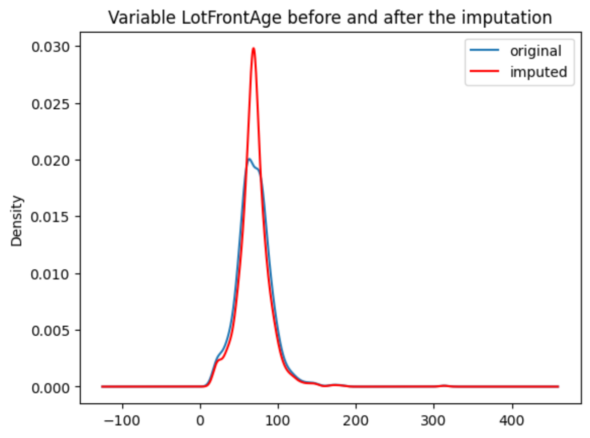
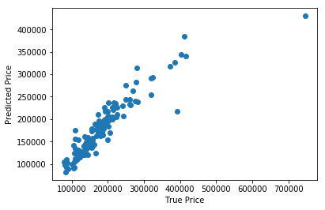

.. -*- mode: rst -*-
.. _quick_start:

Quick Start
===========

If you're new to feature-engine this guide will get you started. Feature-engine
transformers have the methods `fit()` and `transform()` to learn parameters from the
data and then modify the data. They work just like any scikit-learn transformer.

Installation
------------

Feature-engine is a Python 3 package and works well with 3.9 or later. You can install
feature-engine with `pip`:

.. code-block:: bash

    $ pip install feature-engine

Note you can also install it with a _ as follows:

.. code-block:: bash

    $ pip install feature_engine

Feature-engine is an active project and routinely publishes new releases. To upgrade
feature-engine to the latest version, use `pip` as follows:

.. code-block:: bash

    $ pip install -U feature-engine

If you’re using Anaconda, you can install the
`Anaconda feature-engine package <https://anaconda.org/conda-forge/feature_engine>`_:

.. code-block:: bash

    $ conda install -c conda-forge feature_engine

Once installed, you should be able to import feature-engine without an error, both in
Python and in Jupyter notebooks.

Example Use
-----------
This is an example of how to use feature-engine's transformers to perform missing data
imputation.

.. code:: python

    import pandas as pd
    import matplotlib.pyplot as plt
    from sklearn.datasets import fetch_openml
    from sklearn.model_selection import train_test_split

    from feature_engine.imputation import MeanMedianImputer

    # Load dataset
    X, y = fetch_openml(
        name="house_prices",
        version=1,
        as_frame=True,
        return_X_y=True
    )

    # Separate into train and test sets
    X_train, X_test, y_train, y_test = train_test_split(
        X,
        y,
        test_size=0.3,
        random_state=0,
    )

    # set up the imputer
    median_imputer = MeanMedianImputer(
        imputation_method='median',
        variables=['LotFrontage', 'MasVnrArea']
    )

    # fit the imputer
    median_imputer.fit(X_train)

    # transform the data
    train_t = median_imputer.transform(X_train)
    test_t = median_imputer.transform(X_test)

    # plot a variable distribution before and after imputation
    fig = plt.figure()
    ax = fig.add_subplot(111)
    X_train['LotFrontage'].plot(kind='kde', ax=ax)
    train_t['LotFrontage'].plot(kind='kde', ax=ax, color='red')
    lines, _ = ax.get_legend_handles_labels()
    labels = ["original", "imputed"]
    ax.legend(lines, labels, loc='best')
    plt.title("Variable LotFrontAge before and after the imputation")
    plt.show()

In the following output, we see the distribution of one of the imputed variables, before
and after the imputation:

Feature-engine within scikit-learn's pipeline
---------------------------------------------

Feature-engine's transformers can be assembled within a scikit-learn pipeline. This
way, we can store our entire feature engineering pipeline in one single object or
pickle (.pkl). Here is an example of how to do it:

.. code:: python

    import numpy as np

    from sklearn.datasets import fetch_openml
    from sklearn.linear_model import Lasso
    from sklearn.metrics import mean_squared_error
    from sklearn.model_selection import train_test_split
    from sklearn.pipeline import Pipeline as pipe
    from sklearn.preprocessing import MinMaxScaler

    from feature_engine.encoding import RareLabelEncoder, MeanEncoder
    from feature_engine.discretisation import DecisionTreeDiscretiser
    from feature_engine.imputation import (
        AddMissingIndicator,
        MeanMedianImputer,
        CategoricalImputer,
    )

    # Load dataset
    X, y = fetch_openml(
        name="house_prices",
        version=1,
        as_frame=True,
        return_X_y=True
    )

    # Drop some variables
    X.drop(
        labels=['YearBuilt', 'YearRemodAdd', 'GarageYrBlt', 'Id'],
        axis=1,
        inplace=True,
    )

    # Make a list of categorical variables
    categorical = [var for var in X.columns if X[var].dtype == 'O']

    # Make a list of numerical variables
    numerical = [var for var in X.columns if X[var].dtype != 'O']

    # Make a list of discrete variables
    discrete = [var for var in numerical if len(X[var].unique()) < 20]

    # Make a list of continuous variables
    numerical = [var for var in numerical if var not in discrete]

    # Separate data into training and test sets
    X_train, X_test, y_train, y_test = train_test_split(
        X,
        y,
        test_size=0.1,
        random_state=0
    )

    # Set up the pipeline
    price_pipe = pipe([
        # Add a binary variable to flag NA in one variable
        ('continuous_var_imputer', AddMissingIndicator(variables=['LotFrontage'])),

        # Replace NA with the median in 2 variables
        ('continuous_var_median_imputer', MeanMedianImputer(
            imputation_method='median', variables=['LotFrontage', 'MasVnrArea']
        )),

        # Replace NA by adding the label "Missing" in categorical variables
        ('categorical_imputer', CategoricalImputer(variables=categorical)),

        # Disretise continuous variables using decision trees
        ('numerical_tree_discretiser', DecisionTreeDiscretiser(
            cv=3,
            scoring='neg_mean_squared_error',
            variables=numerical,
            regression=True)),

        # Group rare labels in categorical and discrete variables
        ('rare_label_encoder', RareLabelEncoder(
            tol=0.03,
            n_categories=1,
            variables=categorical+discrete,
            ignore_format=True,
        )),

        # Encode categorical and discrete variables using the target mean
        ('categorical_encoder', MeanEncoder(variables=categorical+discrete, ignore_format=True)),

        # Scale features
        ('scaler', MinMaxScaler()),

        # Lasso regression
        ('lasso', Lasso(random_state=2909, alpha=0.005))

    ])

    # Fit feature engineering transformers and Lasso
    price_pipe.fit(X_train, np.log(y_train))

    # Predict
    pred_train = price_pipe.predict(X_train)
    pred_test = price_pipe.predict(X_test)

    # Evaluate
    print('Lasso Linear Model train mse: {}'.format(
        mean_squared_error(y_train, np.exp(pred_train))))
    print('Lasso Linear Model train rmse: {}'.format(
        np.sqrt(mean_squared_error(y_train, np.exp(pred_train)))))
    print()
    print('Lasso Linear Model test mse: {}'.format(
        mean_squared_error(y_test, np.exp(pred_test))))
    print('Lasso Linear Model test rmse: {}'.format(
        np.sqrt(mean_squared_error(y_test, np.exp(pred_test)))))

In the following output, we see the mean squared error and RMSE of the LASSO on the training
and test sets:

.. code:: python

    Lasso Linear Model train mse: 949189263.8948538
    Lasso Linear Model train rmse: 30808.9153313591

    Lasso Linear Model test mse: 1344649485.0641973
    Lasso Linear Model test rmse: 36669.46256852147

Let's now plot the predictions vs the actuals:

.. code:: python

    import matplotlib.pyplot as plt

    plt.scatter(y_test, np.exp(pred_test))
    plt.xlabel('True Price')
    plt.ylabel('Predicted Price')
    plt.show()

In the following output, we see the predictions vs the actuals:

More examples
-------------

More examples can be found in:

- :ref:`User Guide <user_guide>`
- :ref:`Learning Resources <learning_resources>`
