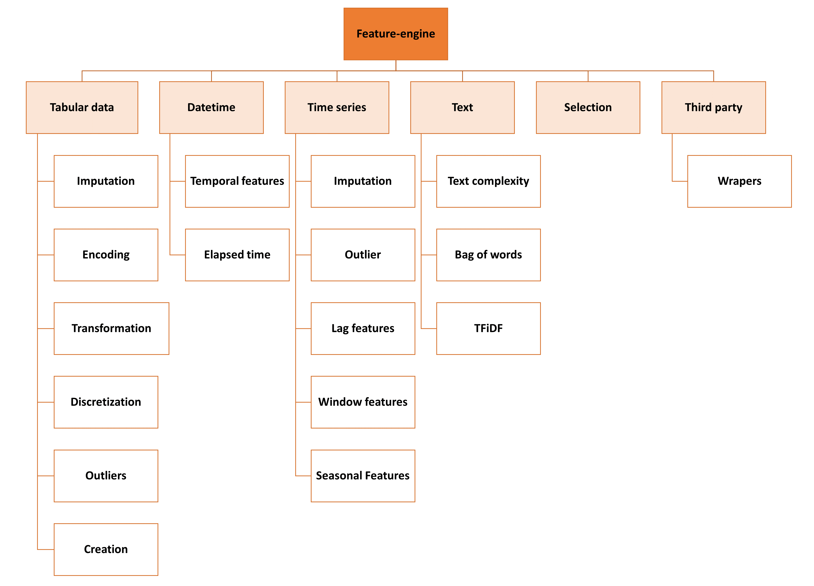

Roadmap
=======

This document provides general directions on what the core contributors would like to
see developed in Feature-engine. As resources are limited, we can't promise when or if
the transformers listed here will be included in the library. We welcome all the help
we can get to support this vision. If you are interested in contributing, please get in
touch.

Purpose
-------

Feature-engine's mission is to simplify and streamline the implementation of end-to-end
feature engineering pipelines. It aims to help users both during the research phase and
while putting a model in production.

Feature-engine makes data engineering easy by allowing the selection of feature subsets
directly within its transformers. It also interlaces well with EDA by returning
dataframes for easy data exploration. Feature-engine’s transformers preserve
Scikit-learn functionality with the methods fit() and transform() and can be integrated
into a Pipeline to simplify putting the model in production.

Feature-engine was designed to be used in real settings. Each transformer has a concrete
aim, and is tailored to certain variables and certain data. Transformers raise errors
and warnings to support the user to use a suitable transformation given the data.
These errors help avoid inadvertedly incorporating missing values to the dataframe at
unwanted stages of the development.

Vision
------

At the moment, Feature-engine's functionality is tailored to cross-sectional or tabular
data, mostly numerical or categorical. But we would like to extend its functionality
to work with datetime, text and time series. In the following figure we show how we
would like the overall structure of Feature-engine to look like:

   Feature-engine structure

Current functionality
---------------------

Most of the functionality for cross-sectional data is already included in the package.
We expand and update this arm of the library, based on user feedback and suggestions
and our own research in the field. In grey, the transformers that are not yet included
in the package:

.. figure::  images/FeatureEnginePackageStructureCrossSectional.png
   :align:   center

   Transformers for cross-sectional data

Wanted functionality
--------------------

We are interested in adding a module that creates date and time related feature from
datetime variables. This module would include transformers to extract all possible date
and time related features, like hr, min, sec, day, year, is_weekend, etc. And it would
also include transformers to capture elapsed time between 2 or more variables.

We would also like to add a module that returns straightforward features from simple
text variables, to capture text complexity, like for example counting the number
of words, unique words, lexical complexity, number of paragraphs and sentences. We would
also consider integrating the Bag of Words and TFiDF from sklearn with a wrapper that
returns a dataframe ready to use to train machine learning models. Below we show more
detail into these new modules.

.. figure::  images/FeatureEnginePackageStructureDatetimeText.png
   :align:   center

   New models wanted: datetime and text

In addition, we are evaluating whether including a module to extract features from time
series is possible, within the current design of the package, and if it adds real value
compared to the functionality already existing in pandas and Scipy. The transformations
we are considering are shown in this image:

.. figure::  images/FeatureEnginePackageStructureTimeseries.png
   :align:   center

   Time series module and the transformations envisioned

Goals
-----

Our main goals are:

- Continue maintaining a high-quality, well-documented collection of canonical tools for data processing
- Expand the documentation with more examples about Feature-engine's functionality
- Expand the documentation with more detail on how to contribute to the package
- Expand the library's functionality as per the precedent paragraphs

For more fine-grained goals and current and lined-up issues please visit the `issue <https://github.com/solegalli/feature_engine/issues/>`_
section in our repo.

