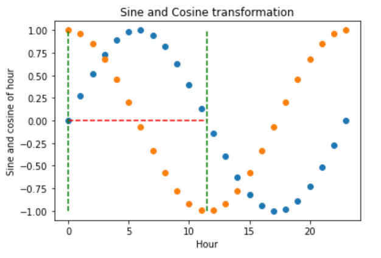

.. _cyclical_features:

.. currentmodule:: feature_engine.creation

CyclicalFeatures
================

Some features are inherently cyclical. Clear examples are **time features**, i.e., those features
derived from datetime variables like the *hours of the day*, the *days of the week*, or the
*months of the year*.

But that’s not the end of it. Many variables related to natural processes are also cyclical,
like, for example, *tides*, *moon cycles*, or *solar energy generation* (which coincides with
light periods, which are cyclical).

In cyclical features, higher values of the variable are closer to lower values.
For example, December (12) is closer to January (1) than to June (6).

How can we convey to machine learning models like linear regression the cyclical nature
of the features?

In the article "Advanced machine learning techniques for building performance simulation,"
the authors engineered cyclical variables by representing them as (x,y) coordinates on a
circle. The idea was that, after preprocessing the cyclical data, the lowest value of every
cyclical feature would appear right next to the largest value.

To represent cyclical features in (x, y) coordinates, the authors created two new features,
deriving the sine and cosine components of the cyclical variable. We call this procedure
**"cyclical encoding."**

Cyclical encoding
-----------------

The trigonometric functions sine and cosine are periodic and repeat their values every
2 pi radians. Thus, to transform cyclical variables into (x, y) coordinates using these
functions, first we need to normalize them to 2 pi radians.

We achieve this by dividing the variables' values by their maximum value. Thus, the two
new features are derived as follows:

- var_sin = sin(variable * (2. * pi / max_value))
- var_cos = cos(variable * (2. * pi / max_value))

In Python, we can encode cyclical features by using the Numpy functions `sin` and `cos`:

.. code:: python

    import numpy as np

    X[f"{variable}_sin"] = np.sin(X["variable"] * (2.0 * np.pi / X["variable"]).max())
    X[f"{variable}_cos"] = np.cos(X["variable"] * (2.0 * np.pi / X["variable"]).max())

We can also use Feature-engine to automate this process.

Cyclical encoding with Feature-engine
-------------------------------------

:class:`CyclicalFeatures()` creates two new features from numerical variables to better
capture the cyclical nature of the original variable. :class:`CyclicalFeatures()` returns
two new features per variable, according to:

- var_sin = sin(variable * (2. * pi / max_value))
- var_cos = cos(variable * (2. * pi / max_value))

where max_value is the maximum value in the variable, and pi is 3.14...

Finding the max_value
~~~~~~~~~~~~~~~~~~~~~

:class:`CyclicalFeatures()` attempts to automate the process of cyclical encoding by
automatically determining the value used to normalize the feature between
0 and 2 * pi radians, which coincides with the cycle of the periodic functions sine and
cosine.

Hence, the values of the variable matter. For example, if the variable `hour` shows values
ranging between 0 and 23, it will create the new features by dividing by 23. If instead,
the variable varies between 1 and 24, it will create the new features by dividing by 24.

If you want to use a specific period to rescale your variables, you can pass a dictionary
containing the variable names as keys, and the values for the scaling as values. In this
way, you can apply cyclical encoding while dividing by 24 to a variable that shows values
between 0 and 23.

Applying cyclical encoding
--------------------------

We'll start by applying cyclical encoding to a toy dataset to get familiar with how to
use Feature-engine for cyclical encoding.

In this example, we'll encode the cyclical features **days of the week** and **months**.
Let's create a toy dataframe with the variables "days" and "months":

.. code:: python

    import pandas as pd
    from feature_engine.creation import CyclicalFeatures

    df = pd.DataFrame({
        'day': [6, 7, 5, 3, 1, 2, 4],
        'months': [3, 7, 9, 12, 4, 6, 12],
        })

In the following output we see the toy dataframe:

.. code:: python

       day  months
    0    6       3
    1    7       7
    2    5       9
    3    3      12
    4    1       4
    5    2       6
    6    4      12

Now we set up :class:`CyclicalFeatures()` to find the maximum value of each variable
automatically:

.. code:: python

    cyclical = CyclicalFeatures(variables=None, drop_original=False)

    X = cyclical.fit_transform(df)

The maximum values used for the transformation are stored in the attribute
`max_values_`:

.. code:: python

    cyclical.max_values_

.. code:: python

    {'day': 7, 'months': 12}

Let's have a look at the transformed dataframe:

.. code:: python

    print(X.head())

We see that the new variables were added at the right of our dataframe.

.. code:: python

       day  months       day_sin   day_cos    months_sin    months_cos
    0    6       3 -7.818315e-01  0.623490  1.000000e+00  6.123234e-17
    1    7       7 -2.449294e-16  1.000000 -5.000000e-01 -8.660254e-01
    2    5       9 -9.749279e-01 -0.222521 -1.000000e+00 -1.836970e-16
    3    3      12  4.338837e-01 -0.900969 -2.449294e-16  1.000000e+00
    4    1       4  7.818315e-01  0.623490  8.660254e-01 -5.000000e-01

Dropping variables after encoding
~~~~~~~~~~~~~~~~~~~~~~~~~~~~~~~~~

In the previous section, we set the parameter `drop_original` to `False`, which means that
we keep the original variables after the cyclical encoding. If we want them dropped after
the feature creation, we can set the parameter to `True`:

.. code:: python

    cyclical = CyclicalFeatures(variables=None, drop_original=True)
    X = cyclical.fit_transform(df)
    print(X.head())

The resulting dataframe contains only the cyclical encoded features; the original variables
are removed:

.. code:: python

            day_sin   day_cos    months_sin    months_cos
    0 -7.818315e-01  0.623490  1.000000e+00  6.123234e-17
    1 -2.449294e-16  1.000000 -5.000000e-01 -8.660254e-01
    2 -9.749279e-01 -0.222521 -1.000000e+00 -1.836970e-16
    3  4.338837e-01 -0.900969 -2.449294e-16  1.000000e+00
    4  7.818315e-01  0.623490  8.660254e-01 -5.000000e-01

We can now use the new features, which convey the cyclical nature of the data, to train
machine learning algorithms, like linear or logistic regression.

Obtaining the name of the resulting features
~~~~~~~~~~~~~~~~~~~~~~~~~~~~~~~~~~~~~~~~~~~~

We can obtain the names of the variables in the transformed dataset as follows:

.. code:: python

    cyclical.get_feature_names_out()

This returns the name of all the variables in the final output:

.. code:: python

    ['day_sin', 'day_cos', 'months_sin', 'months_cos']

Understanding cyclical encoding
-------------------------------

We now know how to convert cyclical variables into (x, y) coordinates of a circle by using
the sine and cosine functions. Let’s now carry out some visualizations to better understand
the effect of this transformation.

Let's create a toy dataframe:

.. code:: python

    import pandas as pd
    import matplotlib.pyplot as plt

    df = pd.DataFrame([i for i in range(24)], columns=['hour'])

If we execute `print(df)`, we'll see the resulting dataframe:

.. code:: python

        hour
    0      0
    1      1
    2      2
    3      3
    4      4
    5      5
    6      6
    7      7
    8      8
    9      9
    10    10
    11    11
    12    12
    13    13
    14    14
    15    15
    16    16
    17    17
    18    18
    19    19
    20    20
    21    21
    22    22
    23    23

Let's now compute the sine and cosine features, and then display the resulting dataframe:

.. code:: python

    cyclical = CyclicalFeatures(variables=None)

    df = cyclical.fit_transform(df)

    print(df.head())

These are the sine and cosine features that represent the hour:

.. code:: python

       hour  hour_sin  hour_cos
    0     0  0.000000  1.000000
    1     1  0.269797  0.962917
    2     2  0.519584  0.854419
    3     3  0.730836  0.682553
    4     4  0.887885  0.460065

Let's now plot the hour variable against its sine transformation. We add perpendicular
lines to flag the hours 0 and 22.

.. code:: python

    plt.scatter(df["hour"], df["hour_sin"])

    # Axis labels
    plt.ylabel('Sine of hour')
    plt.xlabel('Hour')
    plt.title('Sine transformation')

    plt.vlines(x=0, ymin=-1, ymax=0, color='g', linestyles='dashed')
    plt.vlines(x=22, ymin=-1, ymax=-0.25, color='g', linestyles='dashed')

After the transformation using the sine function, we see that the new values for the hours
0 and 22 are closer to each other (follow the dashed lines), which is what we intended:

|

The problem with trigonometric transformations, is that, because they are periodic,
2 different observations can also return similar values after the transformation. Let's
explore that:

.. code:: python

    plt.scatter(df["hour"], df["hour_sin"])

    # Axis labels
    plt.ylabel('Sine of hour')
    plt.xlabel('Hour')
    plt.title('Sine transformation')

    plt.hlines(y=0, xmin=0, xmax=11.5, color='r', linestyles='dashed')

    plt.vlines(x=0, ymin=-1, ymax=0, color='g', linestyles='dashed')
    plt.vlines(x=11.5, ymin=-1, ymax=0, color='g', linestyles='dashed')

In the plot below, we see that the hours 0 and 11.5 obtain very similar values after the
sine transformation, but they are not close to each other. So how can we differentiate them?

.. image:: ../../images/hour_sin2.png

|

To fully encode the information of the hour, we must use the sine and cosine trigonometric
transformations together. Adding the cosine function, which is out of phase respect to the sine
function, breaks the symmetry and assigns a unique codification to each hour.

Let's explore that:

.. code:: python

    plt.scatter(df["hour"], df["hour_sin"])
    plt.scatter(df["hour"], df["hour_cos"])

    # Axis labels
    plt.ylabel('Sine and cosine of hour')
    plt.xlabel('Hour')
    plt.title('Sine and Cosine transformation')

    plt.hlines(y=0, xmin=0, xmax=11.5, color='r', linestyles='dashed')

    plt.vlines(x=0, ymin=-1, ymax=1, color='g', linestyles='dashed')
    plt.vlines(x=11.5, ymin=-1, ymax=1, color='g', linestyles='dashed')

The hour 0, after the transformation, takes the values of sine 0 and cosine 1, which makes
it different from the hour 11.5, which takes the values of sine 0 and cosine -1. In other
words, with the two functions together, we are able to distinguish all observations within
our original variable.

|

Finally, let's vizualise the (x, y) circle coordinates generated by the sine and cosine
features.

.. code:: python

    fig, ax = plt.subplots(figsize=(7, 5))
    sp = ax.scatter(df["hour_sin"], df["hour_cos"], c=df["hour"])
    ax.set(
        xlabel="sin(hour)",
        ylabel="cos(hour)",
    )
    _ = fig.colorbar(sp)

The following plot conveys the intended effect resulting from applying cyclical encoding
to periodic features.

.. image:: ../../images/hour_sin4.png

|

That's it, you now know how to represent cyclical data through the use of trigonometric
functions and cyclical encoding.

Feature-engine vs Scikit-learn
------------------------------

Let's compare the implementations of cyclical encoding between Feature-engine and Scikit-learn.
We'll work with the Bike sharing demand dataset, and we'll follow the implementation of
Cyclical encoding found in the `Time related features documentation <https://scikit-learn.org/stable/auto_examples/applications/plot_cyclical_feature_engineering.html#trigonometric-features>`_
from Scikit-learn.

Let's load the libraries and dataset:

.. code:: python

    import numpy as np
    import pandas as pd

    from sklearn.compose import ColumnTransformer
    from sklearn.datasets import fetch_openml
    from sklearn.preprocessing import FunctionTransformer

    from feature_engine.creation import CyclicalFeatures

    df = fetch_openml("Bike_Sharing_Demand", version=2, as_frame=True).frame

    print(df.head())

In the following output we see the bike sharing dataset:

.. code:: python

       season  year  month  hour holiday  weekday workingday weather  temp  \
    0  spring     0      1     0   False        6      False   clear  9.84
    1  spring     0      1     1   False        6      False   clear  9.02
    2  spring     0      1     2   False        6      False   clear  9.02
    3  spring     0      1     3   False        6      False   clear  9.84
    4  spring     0      1     4   False        6      False   clear  9.84

       feel_temp  humidity  windspeed  count
    0     14.395      0.81        0.0     16
    1     13.635      0.80        0.0     40
    2     13.635      0.80        0.0     32
    3     14.395      0.75        0.0     13
    4     14.395      0.75        0.0      1

To apply cyclical encoding with Scikit-learn, we can use the `FunctionTransformer`:

.. code:: python

    def sin_transformer(period):
        return FunctionTransformer(lambda x: np.sin(x / period * 2 * np.pi))

    def cos_transformer(period):
        return FunctionTransformer(lambda x: np.cos(x / period * 2 * np.pi))

To apply this transformation to multiple variables with different maximum values, we
can combine the transformers within an instance of the `ColumnTransformer`:

.. code:: python

    cyclic_cossin_transformer = ColumnTransformer(
        transformers=[
            ("month_sin", sin_transformer(12), ["month"]),
            ("month_cos", cos_transformer(12), ["month"]),
            ("weekday_sin", sin_transformer(7), ["weekday"]),
            ("weekday_cos", cos_transformer(7), ["weekday"]),
            ("hour_sin", sin_transformer(24), ["hour"]),
            ("hour_cos", cos_transformer(24), ["hour"]),
        ],
    ).set_output(transform="pandas")

Now we can obtain the cyclical encoded features:

.. code:: python

    Xt = cyclic_cossin_transformer.fit_transform(df)

    print(Xt)

In the following output we see the sine and cosine features of the variables month, weekday
and hour:

.. code:: python

           month_sin__month  month_cos__month  weekday_sin__weekday  \
    0          5.000000e-01          0.866025             -0.781831
    1          5.000000e-01          0.866025             -0.781831
    2          5.000000e-01          0.866025             -0.781831
    3          5.000000e-01          0.866025             -0.781831
    4          5.000000e-01          0.866025             -0.781831
    ...                 ...               ...                   ...
    17374     -2.449294e-16          1.000000              0.781831
    17375     -2.449294e-16          1.000000              0.781831
    17376     -2.449294e-16          1.000000              0.781831
    17377     -2.449294e-16          1.000000              0.781831
    17378     -2.449294e-16          1.000000              0.781831

           weekday_cos__weekday  hour_sin__hour  hour_cos__hour
    0                   0.62349        0.000000        1.000000
    1                   0.62349        0.258819        0.965926
    2                   0.62349        0.500000        0.866025
    3                   0.62349        0.707107        0.707107
    4                   0.62349        0.866025        0.500000
    ...                     ...             ...             ...
    17374               0.62349       -0.965926        0.258819
    17375               0.62349       -0.866025        0.500000
    17376               0.62349       -0.707107        0.707107
    17377               0.62349       -0.500000        0.866025
    17378               0.62349       -0.258819        0.965926

    [17379 rows x 6 columns]

With Feature-engine, we can do the same as follows:

.. code:: python

    tr = CyclicalFeatures(drop_original=True)
    Xt = tr.fit_transform(df[["month", "weekday", "hour"]])

    print(Xt)

Note that with less lines of code we obtained a similar result:

.. code:: python

              month_sin  month_cos   weekday_sin  weekday_cos      hour_sin  \
    0      5.000000e-01   0.866025 -2.449294e-16          1.0  0.000000e+00
    1      5.000000e-01   0.866025 -2.449294e-16          1.0  2.697968e-01
    2      5.000000e-01   0.866025 -2.449294e-16          1.0  5.195840e-01
    3      5.000000e-01   0.866025 -2.449294e-16          1.0  7.308360e-01
    4      5.000000e-01   0.866025 -2.449294e-16          1.0  8.878852e-01
    ...             ...        ...           ...          ...           ...
    17374 -2.449294e-16   1.000000  8.660254e-01          0.5 -8.878852e-01
    17375 -2.449294e-16   1.000000  8.660254e-01          0.5 -7.308360e-01
    17376 -2.449294e-16   1.000000  8.660254e-01          0.5 -5.195840e-01
    17377 -2.449294e-16   1.000000  8.660254e-01          0.5 -2.697968e-01
    17378 -2.449294e-16   1.000000  8.660254e-01          0.5 -2.449294e-16

           hour_cos
    0      1.000000
    1      0.962917
    2      0.854419
    3      0.682553
    4      0.460065
    ...         ...
    17374  0.460065
    17375  0.682553
    17376  0.854419
    17377  0.962917
    17378  1.000000

    [17379 rows x 6 columns]

Note, however, that the dataframes are not identical, because by default, :class:`CyclicalFeatures()`
divides the variables by their maximum values:

.. code:: python

    tr.max_values_

With the default implementation, we divided the variable weekday by 6, instead of 7, and
the variable hour by 23, instead of 24, because the values of these variables vary between
0 and 6, and 0 and 23, respectively.

.. code:: python

    {'month': 12, 'weekday': 6, 'hour': 23}

Practically, there isn't a big difference between the values of the dataframes returned by
Scikit-learn and Feature-engine, and I doubt that this subtle difference will incur in a big
change in model performance.

However, if you want to divide the varibles weekday and hour by 7 and 24 respectively, you can
do so like this:

.. code:: python

    tr = CyclicalFeatures(
        max_values={"month": 12, "weekday": 7, "hour": 24},
        drop_original=True,
    )
    Xt = tr.fit_transform(df[["month", "weekday", "hour"]])

    print(Xt)

And now, the values of the dataframes are identical:

.. code:: python

              month_sin  month_cos  weekday_sin  weekday_cos  hour_sin  hour_cos
    0      5.000000e-01   0.866025    -0.781831      0.62349  0.000000  1.000000
    1      5.000000e-01   0.866025    -0.781831      0.62349  0.258819  0.965926
    2      5.000000e-01   0.866025    -0.781831      0.62349  0.500000  0.866025
    3      5.000000e-01   0.866025    -0.781831      0.62349  0.707107  0.707107
    4      5.000000e-01   0.866025    -0.781831      0.62349  0.866025  0.500000
    ...             ...        ...          ...          ...       ...       ...
    17374 -2.449294e-16   1.000000     0.781831      0.62349 -0.965926  0.258819
    17375 -2.449294e-16   1.000000     0.781831      0.62349 -0.866025  0.500000
    17376 -2.449294e-16   1.000000     0.781831      0.62349 -0.707107  0.707107
    17377 -2.449294e-16   1.000000     0.781831      0.62349 -0.500000  0.866025
    17378 -2.449294e-16   1.000000     0.781831      0.62349 -0.258819  0.965926

    [17379 rows x 6 columns]

Ultimately, choosing the right period for the cyclical encoding is the responsibility of
the user, with automation, we can only go that far.

Additional resources
--------------------

For tutorials on how to create cyclical features, check out the following courses:

.. figure::  ../../images/feml.png
   :width: 300
   :figclass: align-center
   :align: left
   :target: https://www.trainindata.com/p/feature-engineering-for-machine-learning

   Feature Engineering for Machine Learning

.. figure::  ../../images/fetsf.png
   :width: 300
   :figclass: align-center
   :align: right
   :target: https://www.trainindata.com/p/feature-engineering-for-forecasting

   Feature Engineering for Time Series Forecasting

|
|
|
|
|
|
|
|
|
|

For a comparison between one-hot encoding, ordinal encoding, cyclical encoding and spline
encoding of cyclical features check out the following
`sklearn demo <https://scikit-learn.org/stable/auto_examples/applications/plot_cyclical_feature_engineering.html>`_.

Check also these Kaggle demo on the use of cyclical encoding with neural networks:

- `Encoding Cyclical Features for Deep Learning <https://www.kaggle.com/code/avanwyk/encoding-cyclical-features-for-deep-learning>`_.
