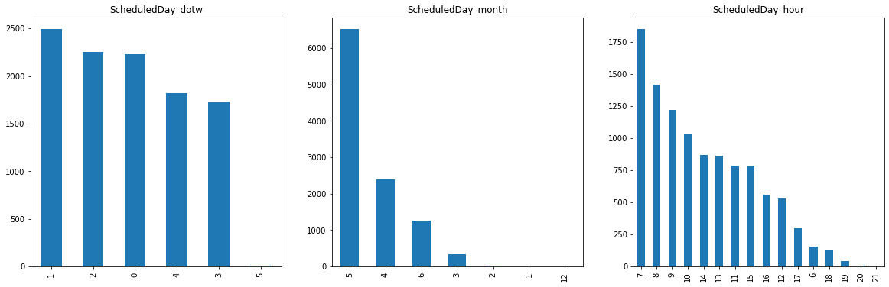

.. _datetime_features:

.. currentmodule:: feature_engine.datetime

DatetimeFeatures
================

The :class:`DatetimeFeatures()` extracts several datetime features from datetime variables
contained in your dataset. It works not only with variables whose original dtype is datetime,
but also with object-like and categorical variables, provided that they indeed contain
data that can be parsed into datetime format. It *cannot* extract features from numerical variables.

**Example**

In the following example we will extract a couple datetime features of our choice from a
specific variable that contains datetime information.

.. code:: python

    # import useful modules and the DatetimeFeatures class
    import pandas as pd
    import matplotlib.pyplot as plt
    from feature_engine.datetime import DatetimeFeatures

    # load the dataset
    data = pd.read_csv('KaggleV2-May-2016.csv')

    # we don't need the ds to be huge for the sake of this demo
    data.drop(np.random.choice(data.index, 100000, replace=False), inplace=True)

    # initialize class
    # we want to extract the features day of the week, month and hour from 
    # the variable *ScheduledDay*
    features_to_extract = ['day_of_the_week', 'month', 'hour']
    date_transformer = DatetimeFeatures(
        variables='ScheduledDay',
        features_to_extract=features_to_extract,
    )

    # plot the extracted features
    plt.figure(figsize=(20,6))
    for i,var in enumerate(["ScheduledDay_dotw", "ScheduledDay_month", "ScheduledDay_hour"]):
        plt.subplot(1, 3, i + 1)
        plt.title(var)
        data_transformed[var].value_counts().plot.bar()
    

