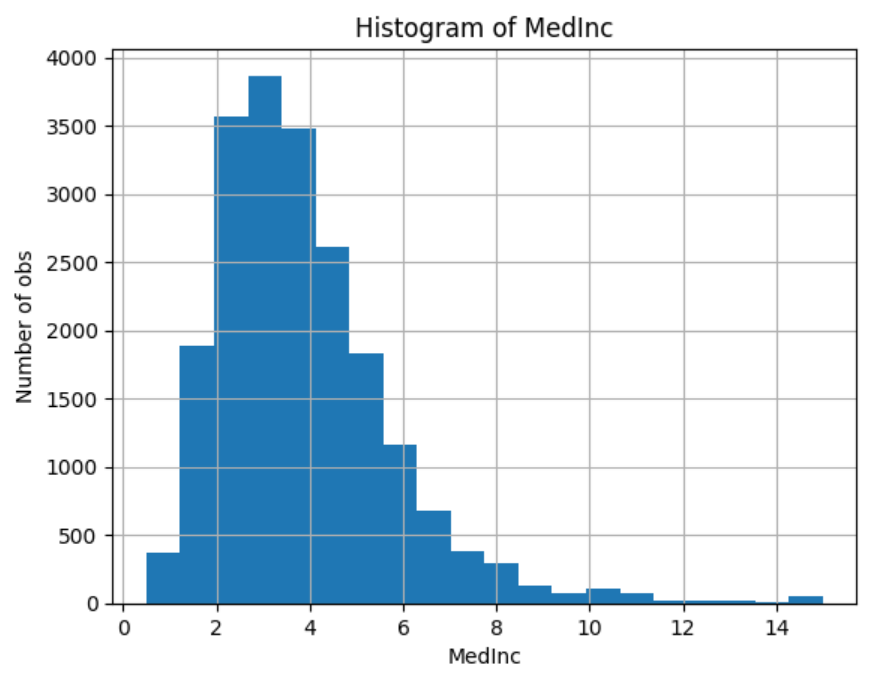
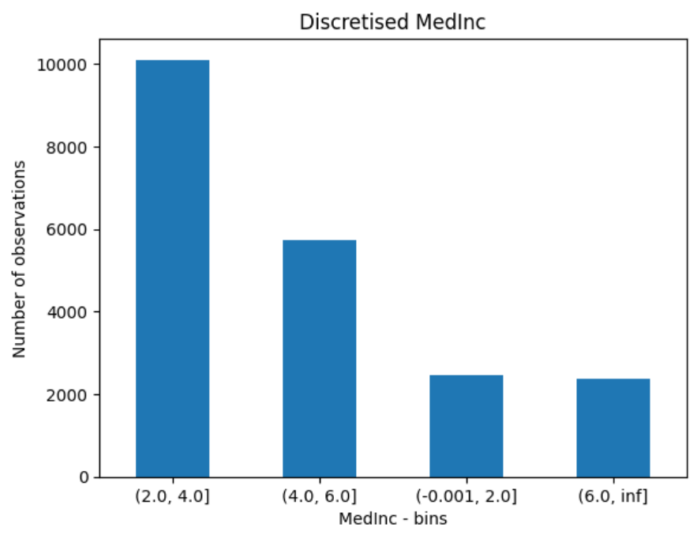
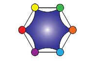
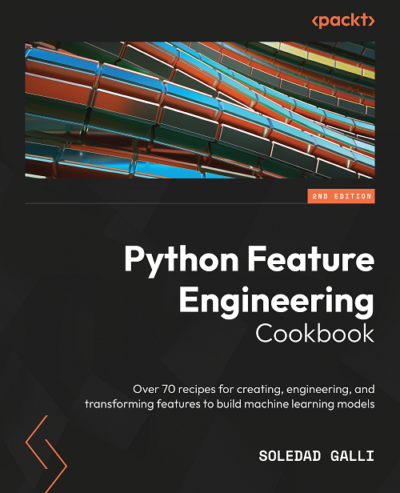

.. _arbitrary_discretiser:

.. currentmodule:: feature_engine.discretisation

ArbitraryDiscretiser
====================

The :class:`ArbitraryDiscretiser()` sorts the variable values into contiguous intervals
which limits are arbitrarily defined by the user. Thus, you must provide a dictionary
with the variable names as keys and a list with the limits of the intervals as values,
when setting up the discretiser.

The :class:`ArbitraryDiscretiser()` works only with numerical variables. The discretiser
will check that the variables entered by the user are present in the train set and cast
as numerical.

Example
-------

Let's take a look at how this transformer works. First, let's load a dataset and plot a
histogram of a continuous variable. We use the california housing dataset that comes
with Scikit-learn.

.. code:: python

    import numpy as np
    import pandas as pd
    import matplotlib.pyplot as plt
    from sklearn.datasets import fetch_california_housing
    from feature_engine.discretisation import ArbitraryDiscretiser

    X, y = fetch_california_housing( return_X_y=True, as_frame=True)

    X['MedInc'].hist(bins=20)
    plt.xlabel('MedInc')
    plt.ylabel('Number of obs')
    plt.title('Histogram of MedInc')
    plt.show()

In the following plot we see a histogram of the variable median income:

Now, let's discretise the variable into arbitrarily determined intervals. We want the
intervals as integers in the resulting transformation, so we set `return_boundaries` to
`False`.

.. code:: python

    user_dict = {'MedInc': [0, 2, 4, 6, np.inf]}

    transformer = ArbitraryDiscretiser(
        binning_dict=user_dict, return_object=False, return_boundaries=False)

    X = transformer.fit_transform(X)

Now, we can go ahead and plot the variable after the transformation:

.. code:: python

    X['MedInc'].value_counts().plot.bar(rot=0)
    plt.xlabel('MedInc - bins')
    plt.ylabel('Number of observations')
    plt.title('Discretised MedInc')
    plt.show()

In the following plot we see the number of observations per interval:

Note that in the above figure the intervals are represented by digits.

Alternatively, we can return the interval limits in the discretised variable by
setting `return_boundaries` to `True`.

.. code:: python

    X, y = fetch_california_housing( return_X_y=True, as_frame=True)

    user_dict = {'MedInc': [0, 2, 4, 6, np.inf]}

    transformer = ArbitraryDiscretiser(
        binning_dict=user_dict, return_object=False, return_boundaries=True)
    X = transformer.fit_transform(X)

    X['MedInc'].value_counts().plot.bar(rot=0)
    plt.xlabel('MedInc - bins')
    plt.ylabel('Number of observations')
    plt.title('Discretised MedInc')
    plt.show()

In the following plot we see the number of observations per interval:

**Discretisation plus encoding**

If we return the interval values as integers, the discretiser has the option to return
the transformed variable as integer or as object. Why would we want the transformed
variables as object?

Categorical encoders in Feature-engine are designed to work with variables of type
object by default. Thus, if you wish to encode the returned bins further, say to try and
obtain monotonic relationships between the variable and the target, you can do so
seamlessly by setting `return_object` to True. You can find an example of how to use
this functionality `here <https://nbviewer.org/github/feature-engine/feature-engine-examples/blob/main/discretisation/ArbitraryDiscretiser_plus_MeanEncoder.ipynb>`_.

Additional resources
--------------------

Check also:

- `Jupyter notebook <https://nbviewer.org/github/feature-engine/feature-engine-examples/blob/main/discretisation/ArbitraryDiscretiser.ipynb>`_
- `Jupyter notebook - Discretiser plus Mean Encoding <https://nbviewer.org/github/feature-engine/feature-engine-examples/blob/main/discretisation/ArbitraryDiscretiser_plus_MeanEncoder.ipynb>`_

For more details about this and other feature engineering methods check out these resources:

   Feature Engineering for Machine Learning

|
|
|
|
|
|
|
|
|
|

Or read our book:

   Python Feature Engineering Cookbook

|
|
|
|
|
|
|
|
|
|
|
|
|

Both our book and course are suitable for beginners and more advanced data scientists
alike. By purchasing them you are supporting Sole, the main developer of Feature-engine.