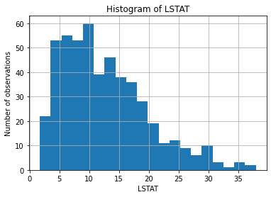
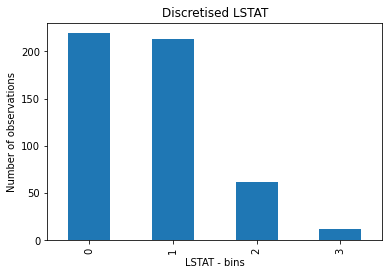
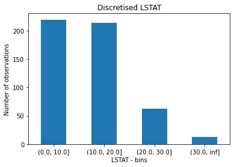

ArbitraryDiscretiser
====================

The ArbitraryDiscretiser() sorts the variable values into contiguous intervals which
limits are arbitrarily defined by the user.

The user must provide a dictionary of variable:list of limits pair when setting up the
discretiser.

The ArbitraryDiscretiser() works only with numerical variables. The discretiser will
check that the variables entered by the user are present in the train set and cast as
numerical.

First, let's load a dataset and plot a histogram of a continuous variable.

.. code:: python

    import numpy as np
    import pandas as pd
    import matplotlib.pyplot as plt
    from sklearn.datasets import load_boston
    from feature_engine.discretisation import ArbitraryDiscretiser

    boston_dataset = load_boston()
    data = pd.DataFrame(boston_dataset.data, columns=boston_dataset.feature_names)

    data['LSTAT'].hist(bins=20)
    plt.xlabel('LSTAT')
    plt.ylabel('Number of observations')
    plt.title('Histogram of LSTAT')
    plt.show()

Now, let's discretise the variable into arbitrarily determined intervals. We want the
interval names as integers, so we set return_boundaries to False.

.. code:: python

    user_dict = {'LSTAT': [0, 10, 20, 30, np.Inf]}

    transformer = ArbitraryDiscretiser(
        binning_dict=user_dict, return_object=False, return_boundaries=False)
    X = transformer.fit_transform(data)

    X['LSTAT'].value_counts().plot.bar()
    plt.xlabel('LSTAT - bins')
    plt.ylabel('Number of observations')
    plt.title('Discretised LSTAT')
    plt.show()

Alternatively, we can return the interval limits in the discretised variable by
setting return_boundaries to True.

.. code:: python

    transformer = ArbitraryDiscretiser(
        binning_dict=user_dict, return_object=False, return_boundaries=True)
    X = transformer.fit_transform(data)

    X['LSTAT'].value_counts().plot.bar(rot=0)
    plt.xlabel('LSTAT - bins')
    plt.ylabel('Number of observations')
    plt.title('Discretised LSTAT')
    plt.show()

