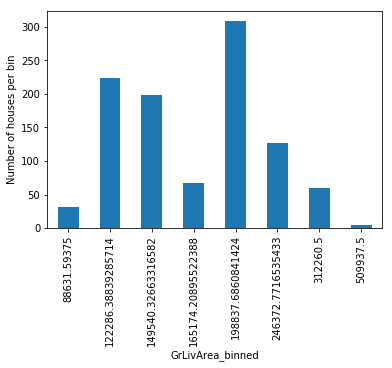
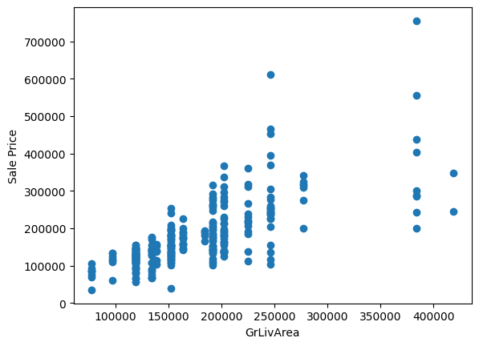
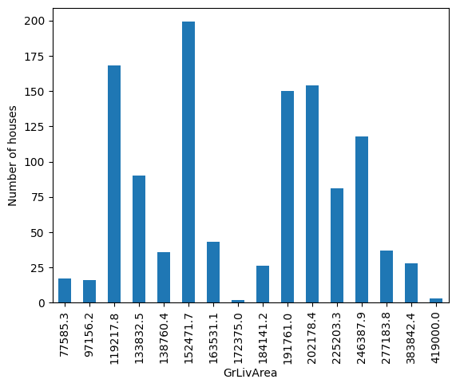

.. _decisiontree_discretiser:

.. currentmodule:: feature_engine.discretisation

DecisionTreeDiscretiser
=======================

Discretization consists of transforming continuous variables into discrete features by creating
a set of contiguous intervals, or bins, that span the range of the variable values.

Discretization is a common data preprocessing step in many data science projects, as it simplifies
continuous attributes and has the potential to improve model performance or speed up model training.

Decision tree discretization
----------------------------

Decision trees make decisions based on discrete partitions over continuous features. During
training, a decision tree evaluates all possible feature values to find the best cut-point, that is,
the feature value at which the split maximizes the information gain, or in other words, reduces the
impurity. It repeats the procedure at each node until it allocates all samples to certain leaf
nodes or end nodes. Hence, classification and regression trees can naturally find the optimal limits
of the intervals to maximize class coherence.

Discretization with decision trees consists of using a decision tree algorithm to identify the optimal
partitions for each continuous variable. After finding the optimal partitions, we sort the variable's
values into those intervals.

Discretization with decision trees is a supervised discretization method, in that, the interval
limits are found based on class or target coherence. In simpler words, we need the target variable
to train the decision trees.

Advantages
~~~~~~~~~~

- The output returned by the decision tree is monotonically related to the target.
- The tree end nodes, or bins, show decreased entropy, that is, the observations within each bin are more similar among themselves than to those of other bins.

Limitations
~~~~~~~~~~~

- Could cause over-fitting
- We need to tune some of the decision tree parameters to obtain the optimal number of intervals.

Decision tree discretizer
-------------------------

The :class:`DecisionTreeDiscretiser()` applies discretization based on the interval limits found
by decision trees algorithms. It uses decision trees to find the optimal interval limits. Next,
it sorts the variable into those intervals.

The transformed variable can either have the limits of the intervals as values, an ordinal number
representing the interval into which the value was sorted, or alternatively, the prediction of the
decision tree. In any case, the number of values of the variable will be finite.

In theory, decision tree discretization creates discrete variables with a monotonic relationship
with the target, and hence, the transformed features would be more suitable to train linear models,
like linear or logistic regression.

Original idea
-------------

The method of decision tree discretization is based on the winning solution of the KDD 2009 competition:

`Niculescu-Mizil, et al. "Winning the KDD Cup Orange Challenge with Ensemble
Selection". JMLR: Workshop and Conference Proceedings 7: 23-34. KDD 2009
<http://proceedings.mlr.press/v7/niculescu09/niculescu09.pdf>`_.

In the original article, each feature in the dataset was re-coded by training a decision tree of limited
depth (2, 3 or 4) using that feature alone, and letting the tree predict the target. The probabilistic
predictions of this decision tree were used as an additional feature that was now linearly (or at least
monotonically) related with the target.

According to the authors, the addition of these new features had a significant impact
on the performance of linear models.

Code examples
-------------

In the following sections, we will do decision tree discretization to showcase the functionality of
the :class:`DecisionTreeDiscretiser()`. We will discretize 2 numerical variables of the Ames house
prices dataset using decision trees.

First, we will transform the variables using the predictions of the decision trees, next, we will
return the interval limits, and finally, we will return the bin order.

Discretization with the predictions of the decision tree
~~~~~~~~~~~~~~~~~~~~~~~~~~~~~~~~~~~~~~~~~~~~~~~~~~~~~~~~

First we load the data and separate it into a training set and a test set:

.. code:: python

    from sklearn.datasets import fetch_openml
    from sklearn.model_selection import train_test_split

    data = fetch_openml(name='house_prices', as_frame=True)
    data = data.frame

    X = data.drop(['SalePrice', 'Id'], axis=1)
    y = data['SalePrice']

    X_train, X_test, y_train, y_test = train_test_split(
        X, y, test_size=0.2, random_state=42)

    print(X_train.head())

In the following output we see the predictor variables of the house prices dataset:

.. code:: python

          MSSubClass MSZoning  LotFrontage  LotArea Street Alley LotShape  \
    254           20       RL         70.0     8400   Pave   NaN      Reg
    1066          60       RL         59.0     7837   Pave   NaN      IR1
    638           30       RL         67.0     8777   Pave   NaN      Reg
    799           50       RL         60.0     7200   Pave   NaN      Reg
    380           50       RL         50.0     5000   Pave  Pave      Reg

         LandContour Utilities LotConfig  ... ScreenPorch PoolArea PoolQC  Fence  \
    254          Lvl    AllPub    Inside  ...           0        0    NaN    NaN
    1066         Lvl    AllPub    Inside  ...           0        0    NaN    NaN
    638          Lvl    AllPub    Inside  ...           0        0    NaN  MnPrv
    799          Lvl    AllPub    Corner  ...           0        0    NaN  MnPrv
    380          Lvl    AllPub    Inside  ...           0        0    NaN    NaN

         MiscFeature MiscVal  MoSold  YrSold  SaleType  SaleCondition
    254          NaN       0       6    2010        WD         Normal
    1066         NaN       0       5    2009        WD         Normal
    638          NaN       0       5    2008        WD         Normal
    799          NaN       0       6    2007        WD         Normal
    380          NaN       0       5    2010        WD         Normal

    [5 rows x 79 columns]

We set up the decision tree discretiser to find the optimal intervals using decision trees.

The :class:`DecisionTreeDiscretiser()` will optimize the depth of the decision tree classifier
or regressor by default and using cross-validation. That's why we need to select the appropriate
metric for the optimization. In this example, we are using decision tree regression, so we select
the mean squared error metric.

We specify in the `bin_output` that we want to replace the continuous attribute values with the
predictions of the decision tree.

.. code:: python

   from feature_engine.discretisation import DecisionTreeDiscretiser

   disc = DecisionTreeDiscretiser(bin_output="prediction",
                                  cv=3,
                                  scoring='neg_mean_squared_error',
                                  variables=['LotArea', 'GrLivArea'],
                                  regression=True)

   disc.fit(X_train, y_train)

The scoring and cv parameter work exactly as those from any scikit-learn estimator. So we can pass
any value that is also valid for those estimators. Check scikit-learn's documentation for more information.

With `fit()` the transformer fits a decision tree for each one of the continuous features. Then,
we can go ahead replace the variable values by the predictions of the trees and display the transformed
variables:

.. code:: python

   train_t = disc.transform(X_train)
   test_t = disc.transform(X_test)

   print(train_t[['LotArea', 'GrLivArea']].head())

In this case, the original values were replaced with the predictions of each one of the decision trees:

.. code:: python

                LotArea      GrLivArea
    254   144174.283688  152471.713568
    1066  144174.283688  191760.966667
    638   176117.741848   97156.250000
    799   144174.283688  202178.409091
    380   144174.283688  202178.409091

Decision trees make discrete predictions, that's why we'll see a limited number of values in the
transformed variables:

.. code:: python

    train_t[['LotArea', 'GrLivArea']].nunique()

.. code:: python

    LotArea       4
    GrLivArea    16
    dtype: int64

The `binner_dict_` stores the details of each decision tree.

.. code:: python

   disc.binner_dict_

.. code:: python

    {'LotArea': GridSearchCV(cv=3, estimator=DecisionTreeRegressor(),
                  param_grid={'max_depth': [1, 2, 3, 4]},
                  scoring='neg_mean_squared_error'),
     'GrLivArea': GridSearchCV(cv=3, estimator=DecisionTreeRegressor(),
                  param_grid={'max_depth': [1, 2, 3, 4]},
                  scoring='neg_mean_squared_error')}

With decision tree discretization, each bin, that is, each prediction value in this case, does not
necessarily contain the same number of observations. Let's check that out with a visualization:

.. code:: python

   import matplotlib.pyplot as plt
   train_t.groupby('GrLivArea')['GrLivArea'].count().plot.bar()
   plt.ylabel('Number of houses')
   plt.show()

Finally, we can determine if we have a monotonic relationship with the target after the transformation:

.. code:: python

    plt.scatter(test_t['GrLivArea'], y_test)
    plt.xlabel('GrLivArea')
    plt.ylabel('Sale Price')
    plt.show()

Rounding the prediction value
^^^^^^^^^^^^^^^^^^^^^^^^^^^^^

Sometimes, the output of the prediction can have multiple values after the comma, which makes the
visualization and interpretation a bit uncomfortable. Fortunately, we can round those values through
the `precision` parameter:

.. code:: python

    disc = DecisionTreeDiscretiser(
        bin_output="prediction",
        precision=1,
        cv=3,
        scoring='neg_mean_squared_error',
        variables=['LotArea', 'GrLivArea'],
        regression=True)

    disc.fit(X_train, y_train)

    train_t= disc.transform(X_train)
    test_t= disc.transform(X_test)

    train_t.groupby('GrLivArea')['GrLivArea'].count().plot.bar()
    plt.ylabel('Number of houses')
    plt.show()

In this example, we are predicting house prices, which is a continuous target. The procedure for
classification models is identical, we just need to set the parameter `regression` to False.

Discretization with interval limits
~~~~~~~~~~~~~~~~~~~~~~~~~~~~~~~~~~~

In this section, instead of replacing the original variable values with the predictions of the
decision tree, we will return the limits of the intervals. When returning interval boundaries,
we need to set the precision to a positive integer.

.. code:: python

    disc = DecisionTreeDiscretiser(
        bin_output="boundaries",
        precision=3,
        cv=3,
        scoring='neg_mean_squared_error',
        variables=['LotArea', 'GrLivArea'],
        regression=True)

    # fit the transformer
    disc.fit(X_train, y_train)

In this case, when we explore the `binner_dict_` attribute, we will see the interval limits instead
of the decision trees:

.. code:: python

    disc.binner_dict_

.. code:: python

    {'LotArea': [-inf, 8637.5, 10924.0, 13848.5, inf],
     'GrLivArea': [-inf,
      749.5,
      808.0,
      1049.0,
      1144.5,
      1199.0,
      1413.0,
      1438.5,
      1483.0,
      1651.5,
      1825.0,
      1969.5,
      2386.0,
      2408.0,
      2661.0,
      4576.0,
      inf]}

The :class:`DecisionTreeDiscretiser()` will use these limits with `pandas.cut` to discretize the
continuous variable values during transform:

.. code:: python

    train_t = disc.transform(X_train)
    test_t = disc.transform(X_test)

    print(train_t[['LotArea', 'GrLivArea']].head())

In the following output we see the interval limits into which the values of the continuous attributes were sorted:

.. code:: python

                    LotArea         GrLivArea
    254      (-inf, 8637.5]  (1199.0, 1413.0]
    1066     (-inf, 8637.5]  (1483.0, 1651.5]
    638   (8637.5, 10924.0]    (749.5, 808.0]
    799      (-inf, 8637.5]  (1651.5, 1825.0]
    380      (-inf, 8637.5]  (1651.5, 1825.0]

To train machine learning algorithms we would follow that up with any categorical data encoding method.

Discretization with ordinal numbers
~~~~~~~~~~~~~~~~~~~~~~~~~~~~~~~~~~~

In the last part of this guide, we will replace the variable values with the number of bin into
which the value was sorted. Here, 0 is the first bin, 1 the second, and so on.

.. code:: python

    disc = DecisionTreeDiscretiser(
        bin_output="bin_number",
        cv=3,
        scoring='neg_mean_squared_error',
        variables=['LotArea', 'GrLivArea'],
        regression=True,
    )

    # fit the transformer
    disc.fit(X_train, y_train)

The `binner_dict_` will also contain the limits of the intervals:

.. code:: python

    disc.binner_dict_

.. code:: python

    {'LotArea': [-inf, 8637.5, 10924.0, 13848.5, inf],
     'GrLivArea': [-inf,
      749.5,
      808.0,
      1049.0,
      1144.5,
      1199.0,
      1413.0,
      1438.5,
      1483.0,
      1651.5,
      1825.0,
      1969.5,
      2386.0,
      2408.0,
      2661.0,
      4576.0,
      inf]}

When we apply transform, :class:`DecisionTreeDiscretiser()` will use these limits with `pandas.cut` to
discretize the continuous variable:

.. code:: python

    train_t = disc.transform(X_train)
    test_t = disc.transform(X_test)

    print(train_t[['LotArea', 'GrLivArea']].head())

In the following output we see the interval numbers into which the values of the continuous attributes
were sorted:

.. code:: python

          LotArea  GrLivArea
    254         0          5
    1066        0          8
    638         1          1
    799         0          9
    380         0          9

Additional considerations
-------------------------

Decision tree discretization uses scikit-learn's DecisionTreeRegressor or DecisionTreeClassifier under
the hood to find the optimal interval limits. These models do not support missing data. Hence, we need
to replace missing values with numbers before proceeding with the disrcretization.

Tutorials, books and courses
----------------------------

Check also for more details on how to use this transformer:

- `Jupyter notebook <https://nbviewer.org/github/feature-engine/feature-engine-examples/blob/main/discretisation/DecisionTreeDiscretiser.ipynb>`_
- `tree_pipe in cell 21 of this Kaggle kernel <https://www.kaggle.com/solegalli/feature-engineering-and-model-stacking>`_

For tutorials about this and other discretization methods and feature engineering techniques check out our online course:

.. figure::  ../../images/feml.png
   :width: 300
   :figclass: align-center
   :align: left
   :target: https://www.trainindata.com/p/feature-engineering-for-machine-learning

   Feature Engineering for Machine Learning

|
|
|
|
|
|
|
|
|
|

Or read our book:

.. figure::  ../../images/cookbook.png
   :width: 200
   :figclass: align-center
   :align: left
   :target: https://www.packtpub.com/en-us/product/python-feature-engineering-cookbook-9781835883587

   Python Feature Engineering Cookbook

|
|
|
|
|
|
|
|
|
|
|
|
|

Both our book and course are suitable for beginners and more advanced data scientists
alike. By purchasing them you are supporting Sole, the main developer of Feature-engine.