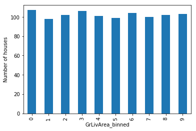

.. _equal_freq_discretiser:

.. currentmodule:: feature_engine.discretisation

EqualFrequencyDiscretiser
=========================

The :class:`EqualFrequencyDiscretiser()` sorts continuous numerical variables into
contiguous equal frequency intervals, that is, intervals that contain approximately the
same proportion of observations. The limits of the intervals are calculated according
to percentiles or quantiles utilising `pandas.qcut()`. You decide the number of
intervals.

**A note on number of intervals**

Common values are 5 and 10. Note that if the variable is highly skewed or not continuous
smaller intervals maybe required. Otherwise, the transformer will introduce np.nan.

The :class:`EqualFrequencyDiscretiser()` works only with numerical variables. A list of
variables can be indicated, or the discretiser will automatically select all numerical
variables in the train set.

**Example**

Let's look at an example using the House Prices Dataset (more details about the
dataset :ref:`here <datasets>`).

Let's load the house prices dataset and  separate it into train and test sets:

.. code:: python

	import numpy as np
	import pandas as pd
	import matplotlib.pyplot as plt
	from sklearn.model_selection import train_test_split

	from feature_engine.discretisation import EqualFrequencyDiscretiser

	# Load dataset
	data = data = pd.read_csv('houseprice.csv')

	# Separate into train and test sets
	X_train, X_test, y_train, y_test =  train_test_split(
		    data.drop(['Id', 'SalePrice'], axis=1),
		    data['SalePrice'], test_size=0.3, random_state=0)

Now we want to discretise the 2 variables indicated below into 10 intervals of equal
number of observations:

.. code:: python

	# set up the discretisation transformer
	disc = EqualFrequencyDiscretiser(q=10, variables=['LotArea', 'GrLivArea'])

	# fit the transformer
	disc.fit(X_train)

With `fit()` the transformer learns the boundaries of each interval. Then, we can go
ahead and sort the values into the intervals:

.. code:: python

	# transform the data
	train_t= disc.transform(X_train)
	test_t= disc.transform(X_test)

The `binner_dict_` stores the interval limits identified for each variable.

.. code:: python

	disc.binner_dict_

.. code:: python

	{'LotArea': [-inf,
	  5007.1,
	  7164.6,
	  8165.700000000001,
	  8882.0,
	  9536.0,
	  10200.0,
	  11046.300000000001,
	  12166.400000000001,
	  14373.9,
	  inf],
	 'GrLivArea': [-inf,
	  912.0,
	  1069.6000000000001,
	  1211.3000000000002,
	  1344.0,
	  1479.0,
	  1603.2000000000003,
	  1716.0,
	  1893.0000000000005,
	  2166.3999999999996,
	  inf]}

With equal frequency discretisation, each bin contains approximately the same number of observations.

.. code:: python

	train_t.groupby('GrLivArea')['GrLivArea'].count().plot.bar()
	plt.ylabel('Number of houses')

We can see below that the intervals contain approximately the same number of
observations.

|

**Discretisation plus encoding**

If we return the interval values as integers, the discretiser has the option to return
the transformed variable as integer or as object. Why would we want the transformed
variables as object?

Categorical encoders in Feature-engine are designed to work with variables of type
object by default. Thus, if you wish to encode the returned bins further, say to try and
obtain monotonic relationships between the variable and the target, you can do so
seamlessly by setting `return_object` to True. You can find an example of how to use
this functionality `here <https://nbviewer.org/github/feature-engine/feature-engine-examples/blob/main/discretisation/EqualFrequencyDiscretiser_plus_WoEEncoder.ipynb>`_.

Additional resources
--------------------

Check also for more details on how to use this transformer:

- `Jupyter notebook <https://nbviewer.org/github/feature-engine/feature-engine-examples/blob/main/discretisation/EqualFrequencyDiscretiser.ipynb>`_
- `Jupyter notebook - Discretiser plus Weight of Evidence encoding <https://nbviewer.org/github/feature-engine/feature-engine-examples/blob/main/discretisation/EqualFrequencyDiscretiser_plus_WoEEncoder.ipynb>`_

For more details about this and other feature engineering methods check out these resources:

.. figure::  ../../images/feml.png
   :width: 300
   :figclass: align-center
   :align: left
   :target: https://www.trainindata.com/p/feature-engineering-for-machine-learning

   Feature Engineering for Machine Learning

|
|
|
|
|
|
|
|
|
|

Or read our book:

.. figure::  ../../images/cookbook.png
   :width: 200
   :figclass: align-center
   :align: left
   :target: https://packt.link/0ewSo

   Python Feature Engineering Cookbook

|
|
|
|
|
|
|
|
|
|
|
|
|

Both our book and course are suitable for beginners and more advanced data scientists
alike. By purchasing them you are supporting Sole, the main developer of Feature-engine.