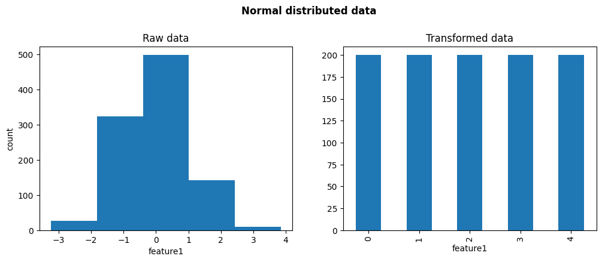
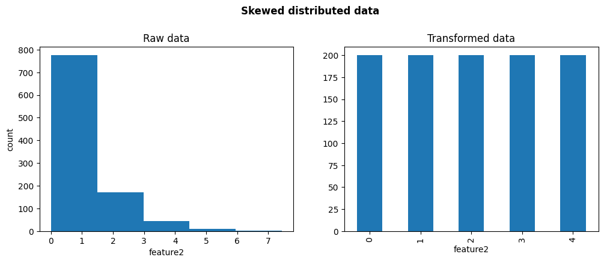

.. _equal_freq_discretiser:

.. currentmodule:: feature_engine.discretisation

EqualFrequencyDiscretiser
=========================

Equal frequency discretisation involves dividing continuous attributes into bins that
each contain approximately the same number of observations. The boundaries of these
bins are determined by specific **quantile values**, based on the desired number of bins.

.. tip::

    This method ensures a more uniform distribution of data points across the value range,
    which helps in handling skewed data and outliers more effectively.

Advantages and Limitations
--------------------------

Equal frequency discretisation has advantages and limitations:

Advantages
~~~~~~~~~~

Advantages of equal frequency binning include:

- **Algorithm Efficiency:** Enhances the performance of data mining and machine learning algorithms by providing a simplified representation of the dataset.
- **Outlier Management:** Efficiently mitigates the effect of outliers by grouping them into the extreme bins.
- **Data Smoothing:** Helps smooth the data, reduces noise, and improves the model's ability to generalise.
- **Improved value distribution:** Returns an uniform distribution of values across the value range.

Equal frequency discretisation improves the data distribution, **optimising the spread of values**. This is particularly
beneficial for datasets with skewed distributions (see the Python implementation section
for an example).

Limitations
~~~~~~~~~~~

On the other hand, equal frequency binning can lead to a loss of information by aggregating data into broader categories.
This is particularly concerning if the data in the same bin has predictive information about the target.

Let's consider a binary classifier task using a decision tree model. A bin with a high proportion of both target categories
would potentially impact the model's performance in this scenario.

EqualFrequencyDiscretiser
-------------------------

Feature-engine's :class:`EqualFrequencyDiscretiser` applies equal frequency discretisation to numerical variables. It uses
the `pandas.qcut()` function under the hood to determine the interval limits.

You can specify the variables to be discretised by passing their names in a list when setting up the transformer. Alternatively,
:class:`EqualFrequencyDiscretiser` will automatically infer the data types to compute the interval limits for all numeric variables.

**Optimal number of intervals:** With :class:`EqualFrequencyDiscretiser`, the user defines the number of bins. Smaller intervals
may be required if the variable is highly skewed or not continuous.

**Integration with scikit-learn:** :class:`EqualFrequencyDiscretiser` and all other feature-engine transformers seamlessly integrate
with scikit-learn `pipelines <https://scikit-learn.org/stable/modules/generated/sklearn.pipeline.Pipeline.html>`_.

Python implementation
---------------------

In this section, we'll show the main functionality of :class:`EqualFrequencyDiscretiser`

Load dataset
~~~~~~~~~~~~

We'll use the Ames House Prices' Dataset. First, let's load the dataset and split it into train and
test sets:

.. code:: python

    import matplotlib.pyplot as plt
    from sklearn.datasets import fetch_openml
    from sklearn.model_selection import train_test_split

    from feature_engine.discretisation import EqualFrequencyDiscretiser

    # Load dataset
    X, y = fetch_openml(
        name='house_prices', version=1, return_X_y=True, as_frame=True)
    X.set_index('Id', inplace=True)

    # Separate into train and test sets
    X_train, X_test, y_train, y_test =  train_test_split(
        X, y, test_size=0.3, random_state=42)

Equal-frequency Discretisation
~~~~~~~~~~~~~~~~~~~~~~~~~~~~~~

Let's discretise two variables, LotArea and GrLivArea, into 10 intervals of equal
number of observations.

.. code:: python

    # Set up the discretisation transformer
    disc = EqualFrequencyDiscretiser(
        q=10,
        variables=['LotArea','GrLivArea'],
        )

    # Fit the transformer
    disc.fit(X_train)

.. note::

    If we do not specify the variables to discretise, :class:`EqualFrequencyDiscretiser` will automatically
    infer the data types and compute the interval limits for all numeric variables.

With the `fit()` method, the discretiser learns the bin boundaries and saves them into a dictionary so we can use them
to transform new data:

.. code:: python

	# Learned limits for each variable
	disc.binner_dict_

In the following output, we see the interval limits calculated for each variable:

.. code:: python

	{'LotArea': [-inf,
	  5000.0,
	  7105.6,
	  8099.200000000003,
	  8874.0,
	  9600.0,
	  10318.400000000001,
	  11173.5,
	  12208.2,
	  14570.699999999999,
	  inf],
	 'GrLivArea': [-inf,
	  918.5,
	  1080.4,
	  1218.0,
	  1348.4,
	  1476.5,
	  1601.6000000000001,
	  1717.6999999999998,
	  1893.0000000000005,
	  2166.3999999999996,
	  inf]}

Note that the lower and upper boundaries are set to -inf and inf, respectively. This behavior ensures that the transformer
is able to allocate to the extreme bins values that are smaller or greater than the observed minimum and maximum
values in the training set.

.. note::

    :class:`EqualFrequencyDiscretiser` will not work in the presence of missing values. Therefore, we should either remove or
    impute missing values before fitting the transformer.

Let's now discretise the variables in the training and test sets:

.. code:: python

	# Transform the data
	train_t = disc.transform(X_train)
	test_t = disc.transform(X_test)

Let's visualise the first rows of the raw data:

.. code:: python

	# Raw data
	print(X_train[['LotArea','GrLivArea']].head())

Here we see the original variables:

.. code:: python

            LotArea  GrLivArea
    Id
    136     10400       1682
    1453     3675       1072
    763      8640       1547
    933     11670       1905
    436     10667       1661

Let's display the transformed variables now:

.. code:: python

    # Transformed data
    print(train_t[['LotArea','GrLivArea']].head())

Here we observe the variables after discretisation:

.. code:: python

		  LotArea  GrLivArea
	Id                      
	136         6          6
	1453        0          1
	763         3          5
	933         7          8
	436         6          6

The transformed data now contains discrete values corresponding to the ordered computed
buckets (0 being the first and q-1 the last).

Now, let's visualise the data with a histogram of the original distribution next to a bar
plot of the discretised variable:

.. code:: python

	# Instantiate a figure with two axes
	fig, axes = plt.subplots(ncols=2, figsize=(10,5))

	# Plot raw distribution
	X_train['GrLivArea'].plot.hist(bins=disc.q, ax=axes[0])
	axes[0].set_title('Raw data with equal width binning')
	axes[0].set_xlabel('GrLivArea')

	# Plot transformed distribution
	train_t['GrLivArea'].value_counts().sort_index().plot.bar(ax=axes[1])
	axes[1].set_title('Transformed data with equal frequency binning')

	plt.tight_layout(w_pad=2)
	plt.show()

As we see in the following image, the intervals contain approximately the same number of
observations and a uniform distribution:

Note that the discretised variables are of type integer by default:

.. code:: python

	train_t[['LotArea','GrLivArea']].dtypes

We see that the dtype of the variable after discretisation is integer:

.. code:: python

	LotArea      int64
	GrLivArea    int64
	dtype: object

Return variables as object
~~~~~~~~~~~~~~~~~~~~~~~~~~

Categorical encoders in Feature-engine are designed to work by default with variables of type object. Therefore, to further
encode the discretised output with feature-engine's encoders, we can set `return_object=True` instead. This will return the transformed
variables as object.

Let's say we want to obtain monotonic relationships between the variable and the target. We can do that seamlessly by setting
`return_object` to True. A tutorial of how to use this functionality is available
`here <https://nbviewer.org/github/feature-engine/feature-engine-examples/blob/main/discretisation/EqualFrequencyDiscretiser_plus_WoEEncoder.ipynb>`_.

Return bin boundaries
~~~~~~~~~~~~~~~~~~~~~

If we want to output the intervals limits instead of integers, we can set `return_boundaries` to `True`:

.. code:: python

    # Set up the discretisation transformer
    disc = EqualFrequencyDiscretiser(
        q=10,
        variables=['LotArea','GrLivArea'],
        return_boundaries=True)

    # Fit the transformer
    disc.fit(X_train)

    # Transform test set & visualise limit
    test_t = disc.transform(X_test)

    # Visualise output (boundaries)
    print(test_t[['LotArea','GrLivArea']].head())

The transformed variables now show the interval limits in the output. We can immediately see that the bin width for these
intervals varies. In other words, they don't have the same width, contrarily to what we see with :ref:`equal width discretisation <equal_width_discretiser>`.

.. code:: python

                  LotArea         GrLivArea
	Id                                        
	893     (8099.2, 8874.0]   (918.5, 1080.4]
	1106  (12208.2, 14570.7]     (2166.4, inf]
	414     (8874.0, 9600.0]   (918.5, 1080.4]
	523       (-inf, 5000.0]  (1601.6, 1717.7]
	1037  (12208.2, 14570.7]  (1601.6, 1717.7]

Unlike the variables discretised into integers, these variables cannot be used to train machine learning models; however,
they are still highly helpful for data analysis in this format, and they may be sent to any Feature-engine encoder for
additional processing.

Binning skewed data
~~~~~~~~~~~~~~~~~~~

Let's now show the benefits of equal frequency discretisation for skewed variables. We'll
start by importing the libraries and classes:

.. code:: python

	import numpy as np
	import pandas as pd
	import matplotlib.pyplot as plt
	from feature_engine.discretisation import EqualFrequencyDiscretiser

Now, we'll create a toy dataset with a variable that is normally distributed and another
one that is skewed:

.. code:: python

	# Set seed for reproducibility
	np.random.seed(42)

	# Generate a normally distributed data
	normal_data = np.random.normal(loc=0, scale=1, size=1000)

	# Generate a right-skewed data using exponential distribution
	skewed_data = np.random.exponential(scale=1, size=1000)

	# Create dataframe with simulated data
	X = pd.DataFrame({'feature1': normal_data, 'feature2': skewed_data})

Let's discretise both variables into 5 equal frequency bins:

.. code:: python

	# Instantiate discretiser
	disc = EqualFrequencyDiscretiser(q=5)

	# Transform simulated data
	X_transformed = disc.fit_transform(X)

Let's plot the original distribution and the distribution after discretisation for the variable that was normally
distributed:

.. code:: python

	fig, axes = plt.subplots(1, 2, figsize=(12, 4))

	axes[0].hist(X.feature1, bins=disc.q)
	axes[0].set(xlabel='feature1', ylabel='count', title='Raw data')

	X_transformed.feature1.value_counts().sort_index().plot.bar(ax=axes[1])
	axes[1].set_title('Transformed data')

	plt.suptitle('Normal distributed data', weight='bold', size='large', y=1.05)

	plt.show()

In the following image, we see that after the discretisation there is an even distribution of the values across
the value range, hence, the variable does no look normally distributed any more.

Let's now plot the original distribution and the distribution after discretisation for the variable that was skewed:

.. code:: python

	fig, axes = plt.subplots(1, 2, figsize=(12, 4))

	axes[0].hist(X.feature2, bins=disc.q)
	axes[0].set(xlabel='feature2', ylabel='count', title='Raw data')

	X_transformed.feature2.value_counts().sort_index().plot.bar(ax=axes[1])
	axes[1].set_title('Transformed data')

	plt.suptitle('Skewed distributed data', weight='bold', size='large', y=1.05)

	plt.show()

In the following image, we see that after the discretisation there is an even distribution of the values across
the value range.

See Also
--------

For alternative binning techniques, check out the following resources:

- Further feature-engine :ref:`discretisers / binning methods <discretization_transformers>`
- Scikit-learn's `KBinsDiscretizer <https://scikit-learn.org/stable/modules/generated/sklearn.preprocessing.KBinsDiscretizer.html#sklearn.preprocessing.KBinsDiscretizer>`_.

Check out also:

- `Pandas qcut <https://pandas.pydata.org/pandas-docs/stable/reference/api/pandas.qcut.html>`_.

Additional resources
--------------------

For more details about this and other feature engineering methods check out these resources:

- `Feature Engineering for Machine Learning <https://www.trainindata.com/p/feature-engineering-for-machine-learning>`_, online course.
- `Feature Engineering for Time Series Forecasting <https://www.trainindata.com/p/feature-engineering-for-forecasting>`_, online course.
- `Python Feature Engineering Cookbook <https://www.packtpub.com/en-us/product/python-feature-engineering-cookbook-9781835883587>`_, book.

Both our book and courses are suitable for beginners and more advanced data scientists
alike. By purchasing them you are supporting `Sole <https://linkedin.com/in/soledad-galli>`_,
the main developer of feature-engine.
