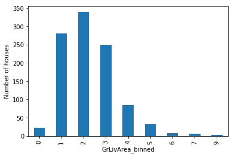

.. _equal_width_discretiser:

.. currentmodule:: feature_engine.discretisation

EqualWidthDiscretiser
=====================

Equal width discretization consist of dividing continuous variables into intervals of equal width, calculated
using the following formula:

.. math::

    bin_{width} = ( max(X) - min(X) ) / bins

Here, `bins` is the number of intervals specified by the user and `max(X)` and `min(X)` are the minimum and maximum values
of the variable to discretize.

Discretization is a common data preprocessing technique used in data science. It's also known as data binning (or simply
"binning").

Advantages and Limitations
--------------------------

Equal binning discretization has some advantages and also shortcomings.

Advantages
~~~~~~~~~~

Some advantages of equal width binning:

- **Algorithm Efficiency:** Enhances the performance of data mining and machine learning algorithms by providing a simplified representation of the dataset.
- **Outlier Management:** Efficiently mitigates the effect of outliers by grouping them into the extreme bins, thus preserving the integrity of the main data distribution.
- **Data Smoothing:** Helps smooth the data, reduces noise, and improves the model's ability to generalize.

Limitations
~~~~~~~~~~~

On the other hand, equal width discretzation can lead to a loss of information by aggregating data into broader categories.
This is particularly concerning if the data in the same bin has predictive information about the target.

Let's consider a binary classifier task using a decision tree model. A bin with a high proportion of both target categories would
potentially impact the model's performance in this scenario.

EqualWidthDiscretiser
---------------------

Feture-engine's :class:`EqualWidthDiscretiser()` applies equal width discretization to numerical variables. It uses
the `pandas.cut()` function under the hood to find the interval limits and then sort the continuous variables into
the bins.

You can specify the variables to be discretized by passing their names in a list when you set up the transformer. Alternatively,
:class:`EqualWidthDiscretiser()` will automatically infer the data types to compute the interval limits for all numeric
variables.

**Optimal number of intervals:** With :class:`EqualWidthDiscretiser()`, the user defines the number of bins. Smaller intervals	
may be required if the variable is highly skewed or not continuous.

**Integration with scikit-learn:** :class:`EqualWidthDiscretiser()` and all other Feature-engine transformers seamlessly
integrate with scikit-learn `pipelines <https://scikit-learn.org/stable/modules/generated/sklearn.pipeline.Pipeline.html>`_.

Python code example
-------------------

In this section, we'll show the main functionality of :class:`EqualWidthDiscretiser()`.

Load dataset
~~~~~~~~~~~~

In this example, we'll use the Ames House Prices' Dataset. First, let's load the dataset and split it into train and
test sets:

.. code:: python

	import matplotlib.pyplot as plt
	from sklearn.datasets import fetch_openml
	from sklearn.model_selection import train_test_split

	from feature_engine.discretisation import EqualFrequencyDiscretiser

	# Load dataset
	X, y = fetch_openml(name='house_prices', version=1, return_X_y=True, as_frame=True)
	X.set_index('Id', inplace=True)

	# Separate into train and test sets
	X_train, X_test, y_train, y_test =  train_test_split(X, y, test_size=0.3, random_state=42)

Equal-width Discretization
~~~~~~~~~~~~~~~~~~~~~~~~~~

In this example, let's discretize two variables, LotArea and GrLivArea, into 10 intervals of equal width:

.. code:: python

	# List the target numeric variables for equal-width discretization
	TARGET_NUMERIC_FEATURES= ['LotArea','GrLivArea']

	# Set up the discretization transformer
	disc = EqualWidthDiscretiser(bins=10, variables=TARGET_NUMERIC_FEATURES)

	# Fit the transformer
	disc.fit(X_train)

Note that if we do not specify the variables (default=`None`), :class:`EqualWidthDiscretiser` will automatically infer
the data types to compute the interval limits for all numeric variables.

With the `fit()` method, the discretizer learns the bin boundaries and saves them into a dictionary so we can use them
to transform unseen data:

.. code:: python

	# Learned limits for each variable
	disc.binner_dict_

.. code:: python

	{'LotArea': [-inf,
	  22694.5,
	  44089.0,
	  65483.5,
	  86878.0,
	  108272.5,
	  129667.0,
	  151061.5,
	  172456.0,
	  193850.5,
	  inf],
	 'GrLivArea': [-inf,
	  864.8,
	  1395.6,
	  1926.3999999999999,
	  2457.2,
	  2988.0,
	  3518.7999999999997,
	  4049.5999999999995,
	  4580.4,
	  5111.2,
	  inf]}

Note that the lower and upper boundaries are set to -inf and inf, respectively. This behavior ensures that the transformer
will be able to allocate to the extreme bins values that are smaller or greater than the observed minimum and maximum
values in the training set.

:class:`EqualWidthDiscretiser` will not work in the presence of missing values. Therefore, we should either remove or
impute missing values before fitting the transformer.

.. code:: python

	# Transform the data (data discretization)
	train_t = disc.transform(X_train)
	test_t = disc.transform(X_test)

Let's visualize the first rows of the raw data and the transformed data:

.. code:: python

	# Raw data
	print(X_train[TARGET_NUMERIC_FEATURES].head())

Here we see the original variables:

.. code:: python

		  LotArea  GrLivArea
	Id                      
	136     10400       1682
	1453     3675       1072
	763      8640       1547
	933     11670       1905
	436     10667       1661

.. code:: python

	# Transformed data
	print(train_t[TARGET_NUMERIC_FEATURES].head())

Here we observe the variables after discretization:

.. code:: python

		  LotArea  GrLivArea
	Id                      
	136         0          2
	1453        0          1
	763         0          2
	933         0          2
	436         0          2

The transformed data now contains discrete values corresponding to the ordered computed buckets (0 being the first and
bins-1 the last).

Now, let's check out the number of observations per bin by creating a bar plot:

.. code:: python

	train_t['GrLivArea'].value_counts().sort_index().plot.bar()
	plt.ylabel('Number of houses')
	plt.show()

As we see in the following image, the intervals contain different number of observations.  It's a similar output to a
histogram:

|

Equal width discretization does not improve the spread of values over the value range. If the variable is skewed, it will
still be skewed after the discretization.

Finally, since the default value for the `return_object` parameter is `False`, the transformer outputs integer variables:

.. code:: python

	train_t[TARGET_NUMERIC_FEATURES].dtypes

.. code:: python

	LotArea      int64
	GrLivArea    int64
	dtype: object

Return variables as object
~~~~~~~~~~~~~~~~~~~~~~~~~~

Categorical encoders in Feature-engine are designed to work by default with variables of type object. Therefore, to
further encode the discretized output with Feature-engine's encoders, we can set `return_object=True` instead. This will
return the transformed variables as object.

Let's say we want to obtain monotonic relationships between the variable and the target. We can do that seamlessly by
setting `return_object` to `True`. A tutorial of how to use this functionality is available
`here <https://nbviewer.org/github/feature-engine/feature-engine-examples/blob/main/discretisation/EqualWidthDiscretiser_plus_OrdinalEncoder.ipynb>`_.

Return bin boundaries
~~~~~~~~~~~~~~~~~~~~~

If we want to output the intervals limits instead of integers, we can set `return_boundaries` to `True`:

.. code:: python

    # Set up the discretization transformer
    disc = EqualFrequencyDiscretiser(
        bins=10,
        variables=TARGET_NUMERIC_FEATURES,
        return_boundaries=True)

    # Fit the transformer
    disc.fit(X_train)

    # Transform test set & visualize limit
    test_t = disc.transform(X_test)

    # Visualize output (boundaries)
    print(test_t[TARGET_NUMERIC_FEATURES].head())

In the following output we see that the transformed variables now display the interval limits. While we can't use these
variables to train machine learning models, as opposed to the variables discretized into integers, they are very useful
in this format for data analysis, and they can also be passed on to any Feature-engine encoder for further processing.

.. code:: python

		     LotArea         GrLivArea
	Id                                     
	893   (-inf, 22694.5]   (864.8, 1395.6]
	1106  (-inf, 22694.5]  (2457.2, 2988.0]
	414   (-inf, 22694.5]   (864.8, 1395.6]
	523   (-inf, 22694.5]  (1395.6, 1926.4]
	1037  (-inf, 22694.5]  (1395.6, 1926.4]

See Also
--------

For alternative binning techniques, check out the following resources:

- Further feature-engine :ref:`discretizers / binning methods <discretization_transformers>`
- Scikit-learn's `KBinsDiscretizer <https://scikit-learn.org/stable/modules/generated/sklearn.preprocessing.KBinsDiscretizer.html#sklearn.preprocessing.KBinsDiscretizer>`_.

Check out also:

- `Pandas cut <https://pandas.pydata.org/pandas-docs/stable/reference/api/pandas.cut.html>`_.

Additional resources
--------------------

Check also for more details on how to use this transformer:

- `Jupyter notebook <https://nbviewer.org/github/feature-engine/feature-engine-examples/blob/main/discretisation/EqualWidthDiscretiser.ipynb>`_
- `Jupyter notebook - Discretizer plus Ordinal encoding <https://nbviewer.org/github/feature-engine/feature-engine-examples/blob/main/discretisation/EqualWidthDiscretiser_plus_OrdinalEncoder.ipynb>`_

For more details about this and other feature engineering methods check out these resources:

.. figure::  ../../images/feml.png
   :width: 300
   :figclass: align-center
   :align: left
   :target: https://www.trainindata.com/p/feature-engineering-for-machine-learning

   Feature Engineering for Machine Learning

|
|
|
|
|
|
|
|
|
|

Or read our book:

.. figure::  ../../images/cookbook.png
   :width: 200
   :figclass: align-center
   :align: left
   :target: https://www.packtpub.com/en-us/product/python-feature-engineering-cookbook-9781835883587

   Python Feature Engineering Cookbook

|
|
|
|
|
|
|
|
|
|
|
|
|

Both our book and course are suitable for beginners and more advanced data scientists
alike. By purchasing them you are supporting Sole, the main developer of Feature-engine.
