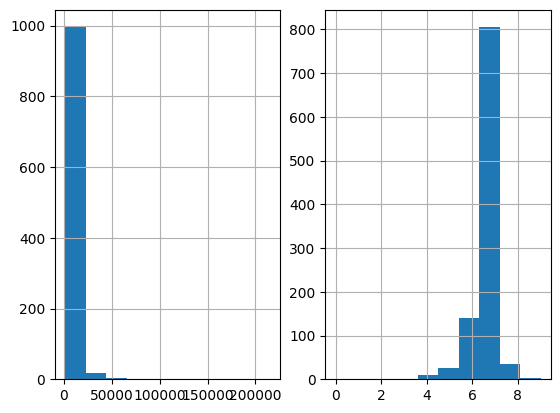

.. _increasing_width_discretiser:

.. currentmodule:: feature_engine.discretisation

GeometricWidthDiscretiser
=========================

The :class:`GeometricWidthDiscretiser()` divides continuous numerical variables into
intervals of increasing width. The width of each succeeding interval is larger than the
previous interval by a constant amount (cw).

The constant amount is calculated as:

    .. math::
        cw = (Max - Min)^{1/n}

were Max and Min are the variable's maximum and minimum value, and n is the number of
intervals.

The sizes of the intervals themselves are calculated with a geometric progression:

    .. math::
        a_{i+1} = a_i cw

Thus, the first interval's width equals cw, the second interval's width equals 2 * cw,
and so on.

Note that the proportion of observations per interval may vary.

This discretisation technique is great when the distribution of the variable is right skewed.

Note: The width of some bins might be very small. Thus, to allow this transformer
to work properly, it might help to increase the precision value, that is,
the number of decimal values allowed to define each bin. If the variable has a
narrow range or you are sorting into several bins, allow greater precision
(i.e., if precision = 3, then 0.001; if precision = 7, then 0.0001).

The :class:`GeometricWidthDiscretiser()` works only with numerical variables. A list of
variables to discretise can be indicated, or the discretiser will automatically select
all numerical variables in the train set.

**Example**

Let's look at an example using the house prices dataset (more details about the
dataset :ref:`here <datasets>`).

Let's load the house prices dataset and separate it into train and test sets:

.. code:: python

	import numpy as np
	import pandas as pd
	import matplotlib.pyplot as plt
	from sklearn.model_selection import train_test_split

	from feature_engine.discretisation import GeometricWidthDiscretiser

	# Load dataset
	data = pd.read_csv('houseprice.csv')

	# Separate into train and test sets
	X_train, X_test, y_train, y_test =  train_test_split(
		    data.drop(['Id', 'SalePrice'], axis=1),
		    data['SalePrice'], test_size=0.3, random_state=0)

Now, we want to discretise the 2 variables indicated below into 10 intervals of increasing
width:

.. code:: python

	# set up the discretisation transformer
	disc = GeometricWidthDiscretiser(bins=10, variables=['LotArea', 'GrLivArea'])

	# fit the transformer
	disc.fit(X_train)

With `fit()` the transformer learns the boundaries of each interval. Then, we can go
ahead and sort the values into the intervals:

.. code:: python

	# transform the data
	train_t= disc.transform(X_train)
	test_t= disc.transform(X_test)

The `binner_dict_` stores the interval limits identified for each variable.

.. code:: python

	disc.binner_dict_

.. code:: python

	'LotArea': [-inf,
        1303.412,
        1311.643,
        1339.727,
        1435.557,
        1762.542,
        2878.27,
        6685.32,
        19675.608,
        64000.633,
        inf],
	'GrLivArea': [-inf,
        336.311,
        339.34,
        346.34,
        362.515,
        399.894,
        486.27,
        685.871,
        1147.115,
        2212.974,
        inf]}

With increasing width discretisation, each bin does not necessarily contain the same number
of observations. This transformer is suitable for variables with right skewed distributions.

Let's compare the variable distribution before and after the discretization:

.. code:: python

    fig, ax = plt.subplots(1, 2)
    X_train['LotArea'].hist(ax=ax[0], bins=10);
    train_t['LotArea'].hist(ax=ax[1], bins=10);

We can see below that the intervals contain different number of observations. We can also
see that the shape from the distribution changed from skewed to a more "bell shaped"
distribution.

|

**Discretisation plus encoding**

If we return the interval values as integers, the discretiser has the option to return
the transformed variable as integer or as object. Why would we want the transformed
variables as object?

Categorical encoders in Feature-engine are designed to work with variables of type
object by default. Thus, if you wish to encode the returned bins further, say to try and
obtain monotonic relationships between the variable and the target, you can do so
seamlessly by setting `return_object` to True. You can find an example of how to use
this functionality `here <https://nbviewer.org/github/feature-engine/feature-engine-examples/blob/main/discretisation/GeometricWidthDiscretiser_plus_MeanEncoder.ipynb>`_.

Additional resources
--------------------

Check also for more details on how to use this transformer:

- `Jupyter notebook - Geometric Discretiser <https://nbviewer.org/github/feature-engine/feature-engine-examples/blob/main/discretisation/GeometricWidthDiscretiser.ipynb>`_
- `Jupyter notebook - Geometric Discretiser plus Mean encoding <https://nbviewer.org/github/feature-engine/feature-engine-examples/blob/main/discretisation/GeometricWidthDiscretiser_plus_MeanEncoder.ipynb>`_

For more details about this and other feature engineering methods check out these resources:

.. figure::  ../../images/feml.png
   :width: 300
   :figclass: align-center
   :align: left
   :target: https://www.trainindata.com/p/feature-engineering-for-machine-learning

   Feature Engineering for Machine Learning

|
|
|
|
|
|
|
|
|
|

Or read our book:

.. figure::  ../../images/cookbook.png
   :width: 200
   :figclass: align-center
   :align: left
   :target: https://www.packtpub.com/en-us/product/python-feature-engineering-cookbook-9781835883587

   Python Feature Engineering Cookbook

|
|
|
|
|
|
|
|
|
|
|
|
|

Both our book and course are suitable for beginners and more advanced data scientists
alike. By purchasing them you are supporting Sole, the main developer of Feature-engine.