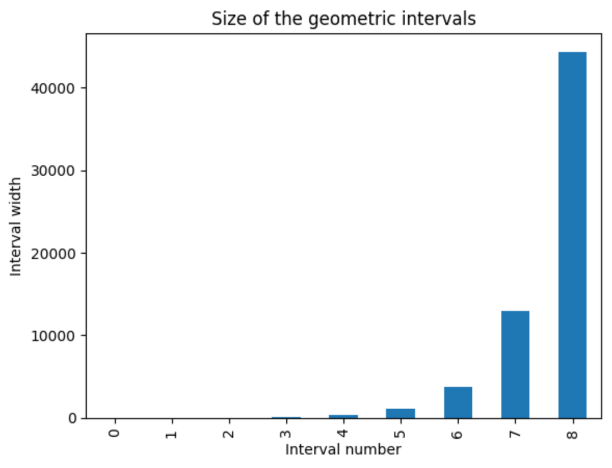
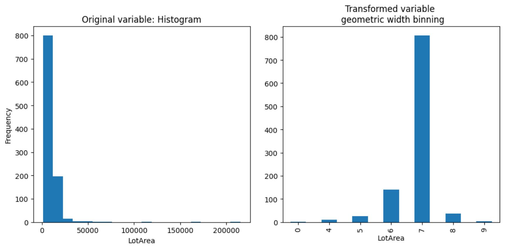

.. _increasing_width_discretiser:

.. currentmodule:: feature_engine.discretisation

GeometricWidthDiscretiser
=========================

The :class:`GeometricWidthDiscretiser()` divides continuous numerical variables into
intervals of increasing width, where each interval boundary is obtained by raising a
constant factor (cw) to increasing powers.

The constant factor is calculated as:

.. math::

        cw = (Max - Min)^{1/n}

where Max and Min are the variable's maximum and minimum value, and n is the number of
intervals.

The upper boundary of the i-th interval is then calculated as:

.. math::

        b_i = Min + cw^i

Because boundaries increase as powers of cw, interval widths grow multiplicatively as i
increases: each interval is roughly cw times wider than the one before it. The first
interval is the exception, as it is anchored directly to the variable's minimum rather
than to the next power of cw in the sequence, so it is narrower than this pattern would
suggest. You can see this in practice in the "Interval width" section below, where the
width of the first interval breaks from the otherwise constant growth ratio of the rest.

.. note::

    The proportion of observations per interval may vary.

This discretisation technique is great when the distribution of the variable is right skewed.

.. tip::

    The width of some bins might be very small. Thus, to allow this transformer
    to work properly, it might help to increase the precision value, that is,
    the number of decimal values allowed to define each bin. If the variable has a
    narrow range or you are sorting into several bins, allow greater precision
    (i.e., if precision = 3, then 0.001; if precision = 7, then 0.0001).

:class:`GeometricWidthDiscretiser()` works only with numerical variables. A list of
variables to discretise can be indicated, or the discretiser will automatically select
all numerical variables in the train set.

.. attention::

    **New in version 2.0:** When `variables` is `None`, :class:`GeometricWidthDiscretiser()` used to
    raise an error if the dataframe contained no numerical variables. You can now
    set the new parameter `return_empty` to `True` to make the transformer return an
    empty list of variables and skip the discretisation instead, leaving the dataframe
    unchanged. This lets you reuse the same pipeline across different datasets or
    projects, some of which may not contain numerical variables, without building a
    tailored pipeline for each one. `return_empty` will default to `True` from version
    2.1 onwards.

Python implementation
---------------------

Let's look at an example using the house prices dataset. Let's load the house prices
dataset and separate it into train and test sets:

.. code:: python

    import numpy as np
    import pandas as pd
    import matplotlib.pyplot as plt
    from sklearn.datasets import fetch_openml
    from sklearn.model_selection import train_test_split

    from feature_engine.discretisation import GeometricWidthDiscretiser

    # Load dataset
    data = fetch_openml(
        name='house_prices',
        version=1,
        as_frame=True,
        parser='auto',
    ).frame

    # Separate into train and test sets
    X_train, X_test, y_train, y_test =  train_test_split(
            data.drop(['Id', 'SalePrice'], axis=1),
            data['SalePrice'], test_size=0.3, random_state=0)

Now, we want to discretise the 2 variables indicated below into 10 intervals of increasing
width:

.. code:: python

    # set up the discretisation transformer
    disc = GeometricWidthDiscretiser(
        bins=10, variables=['LotArea', 'GrLivArea'])

    # fit the transformer
    disc.fit(X_train)

With `fit()` the transformer learned the boundaries of each interval. Then, we can go
ahead and sort the values into the intervals:

.. code:: python

	# transform the data
	train_t = disc.transform(X_train)
	test_t = disc.transform(X_test)

The `binner_dict_` stores the interval limits identified for each variable.

.. code:: python

	disc.binner_dict_

In the following output, we see the interval limits determined for each variable:

.. code:: python

	'LotArea': [-inf,
        1303.412,
        1311.643,
        1339.727,
        1435.557,
        1762.542,
        2878.27,
        6685.32,
        19675.608,
        64000.633,
        inf],
	'GrLivArea': [-inf,
        336.311,
        339.34,
        346.34,
        362.515,
        399.894,
        486.27,
        685.871,
        1147.115,
        2212.974,
        inf]}

Interval width
~~~~~~~~~~~~~~

The interval width varies. Let's print out the width of each interval to corroborate that:

.. code:: python

    bin_0 = X_train['LotArea'].min()
    interval = []
    for bin_ in disc.binner_dict_['LotArea'][1:-1]:
        int_ = bin_ - bin_0
        print(int_)
        interval.append(int_)
        bin_0 = bin_

In the following output we see how the width of each interval increases:

.. code:: python

    3.4121664944211716
    8.230713691228857
    28.084565482384278
    95.82921334936668
    326.98523097744055
    1115.728049311767
    3807.0498667474258
    12990.287997905882
    44325.025459335004

To better examine the width of the intervals, we can plot the interval number vs its width:

.. code:: python

    pd.Series(interval).plot.bar()
    plt.title("Size of the geometric intervals")
    plt.ylabel("Interval width")
    plt.xlabel("Interval number")
    plt.plot()

In the following image we see the how the width of the interval (y-axis) increases with the
interval number (x-axis):

.. tip::

    This transformer is suitable for variables with right skewed distributions.

Observations per bin
~~~~~~~~~~~~~~~~~~~~

With increasing width discretisation, each bin does not necessarily contain the same number
of observations.

Let's compare the variable distribution before and after the discretisation. We'll plot a
histogram of the original variable next to a bar plot of the discretised variable:

.. code:: python

	# Instantiate a figure with two axes
	fig, axes = plt.subplots(ncols=2, figsize=(10,5))

	# Plot raw distribution
	X_train['LotArea'].plot.hist(bins=20, ax=axes[0])
	axes[0].set_title('Original variable: Histogram')
	axes[0].set_xlabel('LotArea')

	# Plot transformed distribution
	train_t['LotArea'].value_counts().sort_index().plot.bar(ax=axes[1])
	axes[1].set_title('Transformed variable \n geometric width binning')

	plt.tight_layout(w_pad=2)
	plt.show()

We can see on the right panel (bar plot) that the intervals contain different numbers of
observations. We can also see that the shape from the distribution changed from skewed
(left panel) to a more "bell shaped" distribution (right panel).

|

Return variables as object
~~~~~~~~~~~~~~~~~~~~~~~~~~

If we return the interval values as integers, the discretiser has the option to return
the transformed variable as integer or as object. Why would we want the transformed
variables as object?

Categorical encoders in feature-engine are designed to work with variables of type
object by default. Thus, if you wish to encode the returned bins further, say to try and
obtain monotonic relationships between the variable and the target, you can do so
seamlessly by setting `return_object` to `True`. You can find an example of how to use
this functionality `here <https://nbviewer.org/github/feature-engine/feature-engine-examples/blob/main/discretisation/GeometricWidthDiscretiser_plus_MeanEncoder.ipynb>`_.

Additional resources
--------------------

For more details about this and other feature engineering methods check out these resources:

- `Feature Engineering for Machine Learning <https://www.trainindata.com/p/feature-engineering-for-machine-learning>`_, online course.
- `Feature Engineering for Time Series Forecasting <https://www.trainindata.com/p/feature-engineering-for-forecasting>`_, online course.
- `Python Feature Engineering Cookbook <https://www.packtpub.com/en-us/product/python-feature-engineering-cookbook-9781835883587>`_, book.

Both our book and courses are suitable for beginners and more advanced data scientists
alike. By purchasing them you are supporting `Sole <https://linkedin.com/in/soledad-galli>`_,
the main developer of feature-engine.