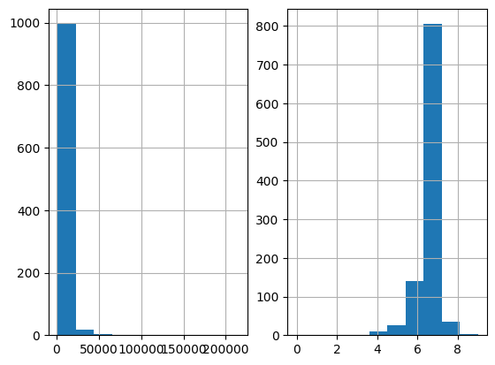

.. _increasing_width_discretiser:

.. currentmodule:: feature_engine.discretisation

IncreasingWidthDiscretiser
==========================

The :class:`IncreasingWidthDiscretiser()` divides continuous numerical variables into
intervals of increasing width with equal increments. Note that the
proportion of observations per interval may vary.

Sizes of the intervals will follow geometric progression

    .. math::
        a_i+1 = a_i r^(n+i)
	
where n is the number of bins and a is the size of the next interval.

This discretisation technique is great when the distribution of the variable is right skewed.

The :class:`IncreasingWidthDiscretiser()` works only with numerical variables. A list of
variables to discretise can be indicated, or the discretiser will automatically select
all numerical variables in the train set.

**Note**

This discretiser could be numerically unstable when the values of the variable are small (their order of magnitude is small).

**Example**

Let's look at an example using the House Prices Dataset (more details about the
dataset :ref:`here <datasets>`).

Let's load the house prices dataset and  separate it into train and test sets:

.. code:: python

	import numpy as np
	import pandas as pd
	import matplotlib.pyplot as plt
	from sklearn.model_selection import train_test_split

	from feature_engine.discretisation import IncreasingWidthDiscretiser

	# Load dataset
	data = pd.read_csv('houseprice.csv')

	# Separate into train and test sets
	X_train, X_test, y_train, y_test =  train_test_split(
		    data.drop(['Id', 'SalePrice'], axis=1),
		    data['SalePrice'], test_size=0.3, random_state=0)

Now we want to discretise the 2 variables indicated below into 10 intervals of increasing
width:

.. code:: python

	# set up the discretisation transformer
	disc = IncreasingWidthDiscretiser(bins=10, variables=['LotArea', 'GrLivArea'])

	# fit the transformer
	disc.fit(X_train)

With `fit()` the transformer learns the boundaries of each interval. Then, we can go
ahead and sort the values into the intervals:

.. code:: python

	# transform the data
	train_t= disc.transform(X_train)
	test_t= disc.transform(X_test)

The `binner_dict_` stores the interval limits identified for each variable.

.. code:: python

	disc.binner_dict_

.. code:: python

	'LotArea': [-inf,
        1303.412,
        1311.643,
        1339.727,
        1435.557,
        1762.542,
        2878.27,
        6685.32,
        19675.608,
        64000.633,
        inf],
	 'GrLivArea': [-inf,
        336.311,
        339.34,
        346.34,
        362.515,
        399.894,
        486.27,
        685.871,
        1147.115,
        2212.974,
        inf]}

With increasing width discretisation, each bin does not necessarily contain the same number of observations.
It will also "skew" distribution. It could be useful to apply it to right skewed distribution
to get more symmetrical one.

.. code:: python

    fig, ax = plt.subplots(1, 2)
    X_train['LotArea'].hist(ax=ax[0], bins=10);
    train_t['LotArea'].hist(ax=ax[1], bins=10);

We can see below that the intervals contain different number of observations.

|

**Discretisation plus encoding**

If we return the interval values as integers, the discretiser has the option to return
the transformed variable as integer or as object. Why would we want the transformed
variables as object?

Categorical encoders in Feature-engine are designed to work with variables of type
object by default. Thus, if you wish to encode the returned bins further, say to try and
obtain monotonic relationships between the variable and the target, you can do so
seamlessly by setting `return_object` to True. You can find an example of how to use
this functionality `here <https://nbviewer.org/github/feature-engine/feature-engine-examples/blob/main/discretisation/IncreasingWidthDiscretiser_plus_MeanEncoder.ipynb>`_.

More details
^^^^^^^^^^^^

Check also for more details on how to use this transformer:

- `Jupyter notebook <https://nbviewer.org/github/feature-engine/feature-engine-examples/blob/main/discretisation/IncreasingWidthDiscretiser.ipynb>`_
- `Jupyter notebook - Discretiser plus Ordinal encoding <https://nbviewer.org/github/feature-engine/feature-engine-examples/blob/main/discretisation/IncreasingWidthDiscretiser_plus_MeanEncoder.ipynb>`_

All notebooks can be found in a `dedicated repository <https://github.com/feature-engine/feature-engine-examples>`_.
