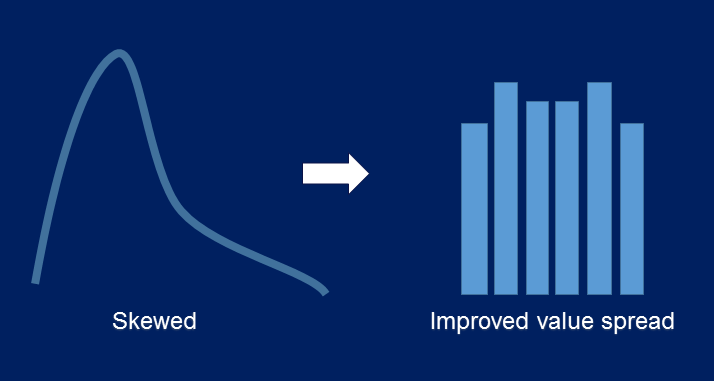

.. _discretization_transformers:

.. -*- mode: rst -*-

Discretisation
==============

Feature-engine's variable discretisation transformers transform continuous numerical
variables into discrete variables. The discrete variables will contain contiguous
intervals in the case of the equal frequency and equal width transformers. The
Decision Tree discretiser will return a discrete variable, in the sense that the
new feature takes a finite number of values.

The following illustration shows the process of discretisation:

With discretisation, sometimes we can obtain a more homogeneous value spread from an
originally skewed variable. But this is not always possible.

**Discretisation plus encoding**

Very often, after we discretise the numerical continuous variables into discrete intervals
we want to proceed their engineering as if they were categorical. This is common practice.
Throughout the user guide, we point to jupyter notebooks that showcase this functionality.

**Discretisers**

.. toctree::
   :maxdepth: 1

   EqualFrequencyDiscretiser
   EqualWidthDiscretiser
   ArbitraryDiscretiser
   DecisionTreeDiscretiser
   GeometricWidthDiscretiser
