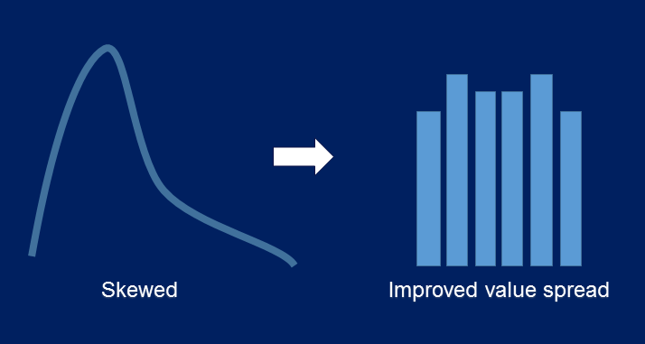

.. _discretization_transformers:

.. -*- mode: rst -*-

Discretisation
==============

Data discretisation, also known as binning, is the process of grouping continuous
variable values into adjacent intervals. This procedure transforms continuous
variables into discrete ones and is commonly used in data science and machine learning.

The following illustration shows the process of discretisation:

.. tip::

    With discretisation, we can often make the value spread of skewed variables more
    homogeneous across the value range.

In discretisation, we convert continuous variables into discrete features. This involves
calculating the boundaries of contiguous intervals that cover the entire range of
variable values. The original values are then sorted into these intervals.

A key challenge in discretisation is determining the thresholds or boundaries that define
the intervals into which the continuous values are sorted. To address this,
various discretisation methods are available, each with its own advantages and limitations.

How is Discretisation Useful?
-----------------------------

Several regression and classification models, such as decision trees and Naive Bayes,
perform better with discrete values.

Decision trees make decisions based on discrete attribute partitions. A decision tree
evaluates all feature values during training to determine the optimal cut-point.
Consequently, the more values a feature has, the longer the decision tree's training
time. Therefore, discretising continuous features can speed up the training process.

Discretisation also offers additional benefits. Discrete values are easier for people
to interpret. Moreover, when observations are sorted into bins with equal frequency,
skewed values become more evenly distributed across the range.

Furthermore, discretisation can reduce the impact of outliers by grouping them into
the lower or upper intervals, along with the other values in the distribution. This
approach helps prevent outliers from biasing the coefficients in linear regression models.

Overall, discretisation of continuous features simplifies the data, accelerates the
learning process, and can lead to more accurate results.

Shortcomings of Discretisation
------------------------------

Discretisation can lead to information loss, for instance, by combining
values that are strongly associated with different target classes into the same bin.

.. note::

    The goal of a discretisation algorithm is to determine the fewest possible intervals
    without significant information loss. The algorithm's task, then, is to identify the
    optimal cut-points for those intervals.

    This brings up the question of how to discretise variables in machine learning.

Discretisation Methods
----------------------

The most popular discretisation algorithms are equal-width and equal-frequency
discretisation. These are unsupervised techniques, as they determine the interval
limits without considering the target variable.

Another unsupervised method consists of using
k-means to find the interval limits. In all of these methods, the user must specify
the number of bins into which the continuous data will be sorted in advance.

On the other hand, decision tree-based discretisation techniques can automatically
determine the cut-points and the optimal number of divisions. This is a supervised
method, as it uses the target variable to guide the determination of interval limits.

Feature-engine's Discretisers
-----------------------------

Feature-engine's discretisation transformers transform continuous variables into
discrete features. They use different logic to determine the limits of those intervals.

**Summary of Feature-engine's discretisers**

=====================================  ========================================================================
      Transformer                           Functionality
=====================================  ========================================================================
:class:`EqualFrequencyDiscretiser()`     Sorts values into intervals with similar number of observations.
:class:`EqualWidthDiscretiser()`         Sorts values into intervals of equal size.
:class:`ArbitraryDiscretiser()`          Sorts values into intervals predefined by the user.
:class:`DecisionTreeDiscretiser()`       Replaces values by predictions of a decision tree, which are discrete.
:class:`GeometricWidthDiscretiser()`     Sorts variable into geometrical intervals.
=====================================  ========================================================================

Discretisers
------------

.. toctree::
   :maxdepth: 1

   EqualFrequencyDiscretiser
   EqualWidthDiscretiser
   ArbitraryDiscretiser
   DecisionTreeDiscretiser
   GeometricWidthDiscretiser
