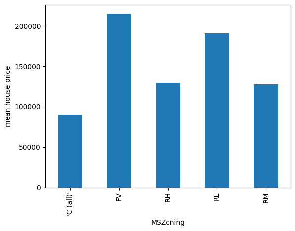
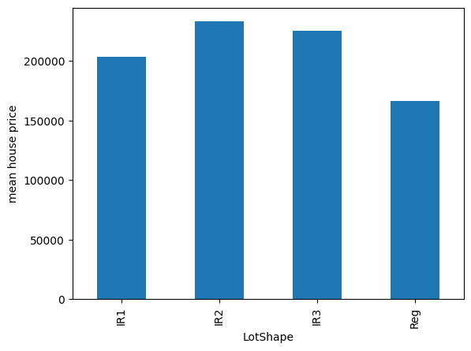
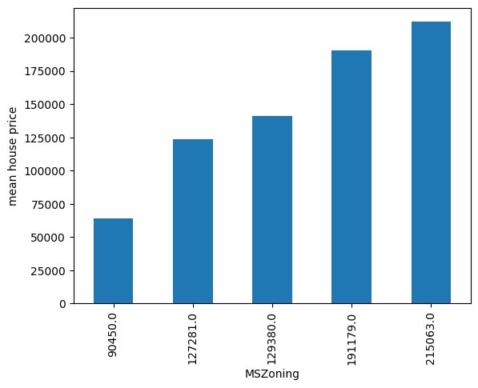
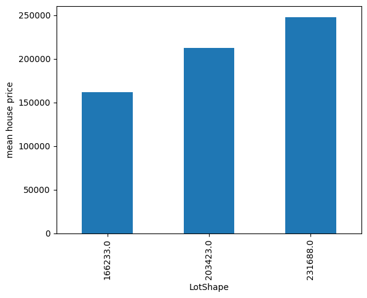

.. _decisiontree_encoder:

.. currentmodule:: feature_engine.encoding

DecisionTreeEncoder
===================

Categorical encoding is the process of transforming the strings of categorical features
into numbers. Common procedures replace categories with ordinal numbers, counts,
frequencies, or the target mean value.

We can also replace the categories with the predictions made by a decision tree based
on that category value.

The process consists of fitting a decision tree using a single feature to predict the
target. The decision tree will try to find a relationship between these variables, if
one exists, and then we'll use the predictions as mappings to replace the categories.

The advantage of this procedure is that it captures some information about the relationship
between the variables during the encoding. And if there is a relationship between the
categorical feature and the target, the resulting encoded variable would have a monotonic
relationship with the target, which can be useful for linear models.

On the downside, it could cause overfitting, and it adds computational complexity to the
pipeline because we are fitting a tree per feature. If you plan to encode your features
with decision trees, make sure you have appropriate validation strategies and train the
decision trees with regularization.

DecisionTreeEncoder
-------------------

The :class:`DecisionTreeEncoder()` replaces categories in the variable with
the predictions of a decision tree.

The :class:`DecisionTreeEncoder()`  uses Scikit-learn's decision trees under the hood.
As these models can't handle non-numerical data, the :class:`DecisionTreeEncoder()` first
replaces the categories with ordinal numbers and then fits the trees.

You have the option to encode the categorical values into integers assigned arbitrarily
or ordered based on the mean target value per category (for more details, check the
:class:`OrdinalEncoder()`, which is used by :class:`DecisionTreeEncoder()` under the hood).
You can regulate this behaviour with the parameter `encoding_method`. As decision trees
are able to pick non-linear relationships, replacing categories with arbitrary numbers
should be enough in practice.

After this, the transformer fits a decision tree using this numerical variable to predict
the target. Finally, the original categorical variable is replaced by the
predictions of the decision tree.

In the attribute `encoding_dict_` you'll find the mappings from category to numerical
value. The category is the original value and the numerical value is the prediction
of the decision tree for the category.

The motivation for the :class:`DecisionTreeEncoder()` is to try and create monotonic
relationships between the categorical variables and the target.

Python example
--------------

Let's look at an example using the Titanic Dataset. First, let's load the data and
separate it into train and test:

.. code:: python

    from sklearn.model_selection import train_test_split
    from feature_engine.datasets import load_titanic
    from feature_engine.encoding import DecisionTreeEncoder

    X, y = load_titanic(
        return_X_y_frame=True,
        handle_missing=True,
        predictors_only=True,
        cabin="letter_only",
    )

    X_train, X_test, y_train, y_test = train_test_split(
        X, y, test_size=0.3, random_state=0,
    )

    print(X_train[['cabin', 'pclass', 'embarked']].head(10))

We will encode the following categorical variables:

.. code:: python

        cabin  pclass embarked
    501      M       2        S
    588      M       2        S
    402      M       2        C
    1193     M       3        Q
    686      M       3        Q
    971      M       3        Q
    117      E       1        C
    540      M       2        S
    294      C       1        C
    261      E       1        S

We set up the encoder to encode the variables above with 3 fold cross-validation, using
a grid search to find the optimal depth of the decision tree (this is the default
behaviour of the :class:`DecisionTreeEncoder()`). In this example, we optimize the
tree using the roc-auc metric.

.. code:: python

    encoder = DecisionTreeEncoder(
        variables=['cabin', 'pclass', 'embarked'],
        regression=False,
        scoring='roc_auc',
        cv=3,
        random_state=0,
        ignore_format=True)

    encoder.fit(X_train, y_train)

With `fit()` the :class:`DecisionTreeEncoder()` fits 1 decision tree per variable. The
mappings are stored in the `encoding_dict_`:

.. code:: python

    encoder.encoder_dict_

In the following output we see the values that will be used to replace each category
in each variable:

.. code:: python

    {'cabin': {'M': 0.30484330484330485,
      'E': 0.6116504854368932,
      'C': 0.6116504854368932,
      'D': 0.6981132075471698,
      'B': 0.6981132075471698,
      'A': 0.6981132075471698,
      'F': 0.6981132075471698,
      'T': 0.0,
      'G': 0.5},
     'pclass': {2: 0.43617021276595747,
      3: 0.25903614457831325,
      1: 0.6173913043478261},
     'embarked': {'S': 0.3389570552147239,
      'C': 0.553072625698324,
      'Q': 0.37349397590361444,
      'Missing': 1.0}}

Now we can go ahead and transform the categorical variables into numbers, using the
predictions of these trees:

.. code:: python

    train_t = encoder.transform(X_train)
    test_t = encoder.transform(X_test)

    train_t[['cabin', 'pclass', 'embarked']].head(10)

We can see the encoded variables below:

.. code:: python

            cabin    pclass  embarked
    501   0.304843  0.436170  0.338957
    588   0.304843  0.436170  0.338957
    402   0.304843  0.436170  0.553073
    1193  0.304843  0.259036  0.373494
    686   0.304843  0.259036  0.373494
    971   0.304843  0.259036  0.373494
    117   0.611650  0.617391  0.553073
    540   0.304843  0.436170  0.338957
    294   0.611650  0.617391  0.553073
    261   0.611650  0.617391  0.338957

Rounding the predictions
~~~~~~~~~~~~~~~~~~~~~~~~

The predictions of the decision tree can have a lot of decimals after the comma. When this
happens, reading the categorical variables might be confusing. We can control the precision
of the output to return less decimals after the comma like this:

.. code:: python

    encoder = DecisionTreeEncoder(
        variables=['cabin', 'pclass', 'embarked'],
        regression=False,
        scoring='roc_auc',
        cv=3,
        random_state=0,
        ignore_format=True,
        precision=2,
    )

    encoder.fit(X_train, y_train)

Now, the mappings for each category contain 2 decimals at most:

.. code:: python

    encoder.encoder_dict_

In the following output we see the values that will be used to replace each category
in each variable:

.. code:: python

    {'cabin': {'M': 0.3,
      'E': 0.61,
      'C': 0.61,
      'D': 0.7,
      'B': 0.7,
      'A': 0.7,
      'F': 0.7,
      'T': 0.0,
      'G': 0.5},
     'pclass': {2: 0.44, 3: 0.26, 1: 0.62},
     'embarked': {'S': 0.34, 'C': 0.55, 'Q': 0.37, 'Missing': 1.0}}

Now we can go ahead and transform the categorical variables into numbers, using the
predictions of these trees:

.. code:: python

    train_t = encoder.transform(X_train)
    test_t = encoder.transform(X_test)

    train_t[['cabin', 'pclass', 'embarked']].head(10)

We can see the encoded variables below:

.. code:: python

          cabin  pclass  embarked
    501    0.30    0.44      0.34
    588    0.30    0.44      0.34
    402    0.30    0.44      0.55
    1193   0.30    0.26      0.37
    686    0.30    0.26      0.37
    971    0.30    0.26      0.37
    117    0.61    0.62      0.55
    540    0.30    0.44      0.34
    294    0.61    0.62      0.55
    261    0.61    0.62      0.34

We can also revert the data to its original representation as follows:

.. code:: python

    revert = encoder.inverse_transform(test_t)
    revert[['cabin', 'pclass', 'embarked']].head(10)

In the following output we see that with inverse transform, we obtain the original
categories from the tree predictions:

.. code:: python

         cabin  pclass embarked
    1139     M       3        S
    533      M       2        S
    459      M       2        S
    1150     M       3        S
    393      M       2        S
    1189     G       3        S
    5        C       1        S
    231      C       1        S
    330      M       2        S
    887      M       3        S

Collisions
----------

This encoder can lead to collisions. Collisions are instances where different categories
are encoded with the same number. It is useful to reduce cardinality. On the other hand,
if the mappings are not meaningful we might lose the information contained in those
categories.

When there are collisions, `inverse_transform` would revert to only 1 of the categories,
so some of the original information will be lost with the inverse transformation.

Unseen categories
-----------------

Unseen categories are labels that appear in the test set, or in live data, that were not
present in the training set. As the decision tree is trained on the training set, there
will only be mappings for seen categories.

By default, :class:`DecisionTreeEncoder()` will ignore unseen categories, which means that
they will be replaced by NAN after the encoding. You can instruct the encoder to raise an
error when it encounters unseen categories (parameter `unseen`). Alternatively, this
encoder allows you to set up an arbitrary number to replace unseen categories
(param `fill_value`).

Monotonic variables
-------------------

We mentioned previously that the idea of this encoding is to create features whose values
grow monotonically with the target. Let's explore that. We'll use the house prices dataset:

.. code:: python

    import matplotlib.pyplot as plt
    from sklearn.datasets import fetch_openml
    from sklearn.model_selection import train_test_split

    from feature_engine.encoding import DecisionTreeEncoder

    # Load dataset
    X, y = fetch_openml(name='house_prices', version=1,
                        return_X_y=True, as_frame=True)

    X_train, X_test, y_train, y_test = train_test_split(
        X, y, test_size=0.3, random_state=42)

Let's now plot the mean house price per category of the variable `MNZoning`:

.. code:: python

    y_train.groupby(X_train["MSZoning"]).mean().plot.bar()
    plt.ylabel("mean house price")
    plt.show()

In the following image, we see that there isn't a monotonic relationship between the
current order of the categories and the house price:

Let's explore another variable:

.. code:: python

    y_train.groupby(X_train["LotShape"]).mean().plot.bar()
    plt.ylabel("mean house price")
    plt.show()

In the following image we see that there isn't a monotonic relationship between `LotShape`
and the house price either:

Let's now encode these variables using decision trees:

.. code:: python

    encoder = DecisionTreeEncoder(
        variables=["MSZoning", 'LotShape'],
        regression=True,
        cv=3,
        random_state=0,
        ignore_format=True,
        precision=0,
    )

    encoder.fit(X_train, y_train)

Let's check out the created mappings:

.. code:: python

    encoder.encoder_dict_

Below we see the values that will be used to replace each category:

.. code:: python

    {'MSZoning': {'RL': 191179.0,
      'RM': 127281.0,
      'FV': 215063.0,
      "'C (all)'": 90450.0,
      'RH': 129380.0},
     'LotShape': {'Reg': 166233.0,
      'IR1': 203423.0,
      'IR2': 231688.0,
      'IR3': 231688.0}}

Let's now encode the variables:

.. code:: python

    train_t = encoder.transform(X_train)
    test_t = encoder.transform(X_test)

    print(train_t[["MSZoning", 'LotShape']].head(10))

We see the encoded variables in the following output:

.. code:: python

          MSZoning  LotShape
    135   191179.0  166233.0
    1452  127281.0  166233.0
    762   215063.0  166233.0
    932   191179.0  203423.0
    435   191179.0  231688.0
    629   191179.0  166233.0
    1210  191179.0  166233.0
    1118  191179.0  166233.0
    1084  191179.0  231688.0
    158   215063.0  166233.0

And now, let's plot the mean house price per category again, after the encoding:

.. code:: python

    y_test.groupby(test_t["MSZoning"]).mean().plot.bar()
    plt.ylabel("mean house price")
    plt.show()

In the following image we see that the categories are ordered in a way that created a
monotonic relationship with the target variable:

Let's repeat that for the second variable:

.. code:: python

    y_test.groupby(test_t["LotShape"]).mean().plot.bar()
    plt.ylabel("mean house price")
    plt.show()

In the following image we also see a monotonic relationship after the encoding:

Note
~~~~

Not every encoding will result in monotonic relationshops. For that to occur there needs to
be some sort of relationship between the target and the categories that can be captured by
the decision tree. Use with caution.

Additional resources
--------------------

In the following notebook, you can find more details into the :class:`DecisionTreeEncoder()`
functionality and example plots with the encoded variables:

- `Jupyter notebook <https://nbviewer.org/github/feature-engine/feature-engine-examples/blob/main/encoding/DecisionTreeEncoder.ipynb>`_

For more details about this and other feature engineering methods check out these resources:

.. figure::  ../../images/feml.png
   :width: 300
   :figclass: align-center
   :align: left
   :target: https://www.trainindata.com/p/feature-engineering-for-machine-learning

   Feature Engineering for Machine Learning

|
|
|
|
|
|
|
|
|
|

Or read our book:

.. figure::  ../../images/cookbook.png
   :width: 200
   :figclass: align-center
   :align: left
   :target: https://www.packtpub.com/en-us/product/python-feature-engineering-cookbook-9781835883587

   Python Feature Engineering Cookbook

Both our book and course are suitable for beginners and more advanced data scientists
alike. By purchasing them you are supporting Sole, the main developer of Feature-engine.