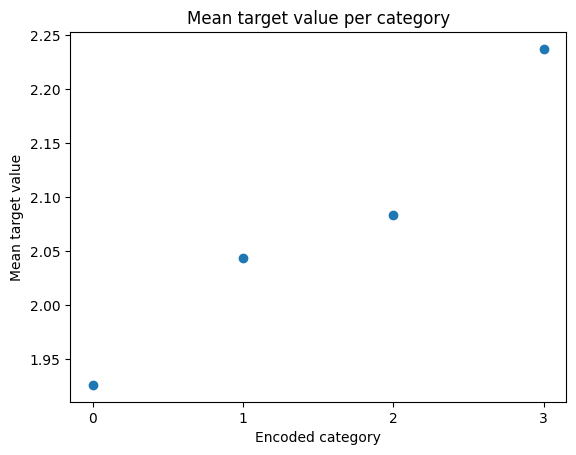

.. _ordinal_encoder:

.. currentmodule:: feature_engine.encoding

Ordinal Encoding
================

Ordinal encoding consists of converting categorical data into numeric data by assigning a unique integer to each category, 
and is a common data preprocessing step in most data science projects.

Ordinal encoding is particularly useful when an inherent ordering or ranking is present within the categorical variable. 
For example, the variable **size** with values *small*, *medium*, and *large* exhibits a clear ranking, i.e., small 
< medium < large, thereby making ordinal encoding an appropriate encoding method. 

In practice, we apply ordinal encoding regardless of the intrinsic ordering of the variable because some machine learning 
models, like, for example, decision tree-based models, are able to learn from these arbitrarily assigned values. 

One of the advantages of ordinal encoding is that it keeps the feature space compact as opposed to one-hot encoding, which 
can significantly increase the dimensionality of the dataset.

Arbitrary vs ordered ordinal encoding
-------------------------------------

In ordinal encoding, the categorical variable can be encoded into numeric values either arbitrarily or based on some 
defined logic.

Arbitrary ordinal encoding
~~~~~~~~~~~~~~~~~~~~~~~~~~

**Arbitrary ordinal encoding** is the traditional way to perform ordinal encoding, where each category is replaced by a 
unique numeric value without any further consideration. This encoding method assigns numbers to the categories based on 
their order of appearance in the dataset, incrementing the value for each new category encountered.

Assigning ordinal numbers arbitrarily provides a simple way of obtaining numerical variables from categorical data and it 
tends to work well with decision tree based machine learning models.

Ordered ordinal encoding
~~~~~~~~~~~~~~~~~~~~~~~~

**Ordered ordinal encoding** is a more sophisticated way to implement ordinal encoding. It consists of first sorting the 
categories based on the mean value of the target variable associated with each category and then assigning the numeric 
values according to this order.

For example, for the variable `colour`, if the mean of the target
for blue, red and grey is 0.5, 0.8 and 0.1 respectively, then we first sort the categories by their mean values: grey (0.1), 
blue (0.5), red (0.8). Then, we replace grey with 0, blue with 1, and red with 2.

Ordered encoding attempts to define a monotonic relationship between the encoded variable and the target variable. This 
method helps machine learning algorithms, particularly linear models (like linear regression), better capture and learn 
the relationship between the encoded feature and the target.

Keep in mind that ordered ordinal encoding will create a monotonic relationship between the encoded variable and the target 
variable **only** when *there is* an intrinsic relationship between the categories and the target variable.

Unseen categories
-----------------

Ordinal encoding can't inherently deal with unseen categories. 

**Unseen categories** are categorical values that appear in test, validation, or live data but were not present in the 
training data. These categories are problematic because the encoding methods generate mappings only for categories present 
in the training data. This means that we would lack encodings for any new, unseen category values. Unseen categories cause 
errors during inference time (the phase when the machine learning model is used to make predictions on new data) because our 
feature engineering pipeline is unable to convert that value into a number.

Ordinal encoding by itself does not deal with unseen categories. However, we could replace the unseen category with an 
arbitrary value, such as -1 (remember that ordinal encoding starts at 0). This procedure might work well for linear models 
because -1 will be the smallest value for the categorical variable, and since linear models establish linear relationships 
between variables and targets, it will return the lowest (or highest) response value for unseen categories.

However, for tree-based models, this method of replacing unseen categories might not be effective because trees create 
non-linear partitions, making it difficult to predict in advance how the tree will handle a value of -1, leading to 
unpredictable results.

If we expect our variables to have a large number of unseen categories, it is better to opt for another encoding technique 
that can handle unseen categories out of the box, such as target encoding, or conversely, group rare categories together.

Pros and cons of ordinal encoding
----------------------------------

Ordinal encoding is quick and easy to implement, and it does not increase the dimensionality of the dataset, as does 
one-hot encoding.

On the downside, it can impose misleading relationships between the categories; it does not have the ability to deal with 
unseen categories; and it is not suitable for a large number of categories, i.e., features with high cardinality.

Ordinal encoding vs label encoding
----------------------------------

Ordinal encoding is sometimes also referred to as label encoding. They follow the same procedure. Scikit-learn provides 
2 different transformers: the OrdinalEncoder and the LabelEncoder. Both replace values, that is, categories, with ordinal 
data. The OrdinalEncoder is designed to transform the predictor variables (those in the training set), while the LabelEncoder 
is designed to transform the target variable. The end result of both transformers is the same; the original values are 
replaced by ordinal numbers.

In our view, this has raised some confusion as to whether label encoding and ordinal encoding consist of different ways of 
preprocessing categorical data. Some argue that label encoding consists of replacing categories with numbers assigned 
arbitrarily, whereas ordinal encoding consists of assigning numbers based on an inherent order of the variable (like 
that of the variable size). We make no such distinction and consider both techniques interchangeably. 

OrdinalEncoder
--------------

Feature-engine's :class:`OrdinalEncoder()` implements ordinal encoding. That is, it encodes categorical features by 
replacing each category with a unique number ranging from 0 to k-1, where 'k' is the distinct number of categories in 
the dataset. 

:class:`OrdinalEncoder()` supports both **arbitrary** and **ordered** encoding methods. The desired approach can be 
specified using the `encoding_method` parameter that accepts either **"arbitrary"** or **"ordered"**. If not defined, 
`encoding_method` defaults to `"ordered"`.

If the `encoding_method` is defined as **"arbitrary"**, then :class:`OrdinalEncoder()` will assign numeric values to the 
categorical variable on a first-come first-served basis i.e., in the order the categories are encountered in the dataset.

If the `encoding_method` is defined as **"ordered"**, then :class:`OrdinalEncoder()` will assign numeric values according 
to the mean of the target variable for each category. The categories with the highest target mean value will be replaced by 
an integer value k-1, while the category with the lowest target mean value will be replaced by 0. Here 'k' is the distinct 
number of categories.

When encountering unseen categories, :class:`OrdinalEncoder()` has the option to raise an error and fail, ignore the rare 
category, in which case it will be encoded as `np.nan`, or encode it into -1. You can define this behaviour through the 
`unseen` parameter.  

Python Implementation
---------------------

In the rest of the page, we'll show different ways how we can use ordinal encoding through Feature-engine's 
:class:`OrdinalEncoder()`.

Arbitrary ordinal encoding
~~~~~~~~~~~~~~~~~~~~~~~~~~

We'll show how ordinal encoding is implemented by Feature-engine's :class:`OrdinalEncoder()` using the **Titanic Dataset**.

Let's load the dataset and split it into train and test sets:

.. code:: python

    import pandas as pd
    from sklearn.model_selection import train_test_split
    from feature_engine.datasets import load_titanic
    from feature_engine.encoding import OrdinalEncoder

    X, y = load_titanic(
        return_X_y_frame=True,
        handle_missing=True,
        predictors_only=True,
        cabin="letter_only",
    )

    X_train, X_test, y_train, y_test = train_test_split(
        X, y, test_size=0.3, random_state=0,
    )

    print(X_train.head())

We see the Titanic dataset below:

.. code:: python

         pclass    sex     age         sibsp   parch     fare    cabin  embarked
 501        2     female   13.000000      0      1     19.5000     M        S
 588        2     female    4.000000      1      1     23.0000     M        S
 402        2     female   30.000000      1      0     13.8583     M        C
 1193       3     male     29.881135      0      0      7.7250     M        Q
 686        3     female   22.000000      0      0      7.7250     M        Q

Let's set up the :class:`OrdinalEncoder()` to encode the categorical variables `cabin', `embarked`, and `sex` with 
integers assigned arbitrarily:

.. code:: python

 encoder = OrdinalEncoder(
          encoding_method='arbitrary',
          variables=['cabin', 'embarked', 'sex'])

:class:`OrdinalEncoder()` will encode **all** categorical variables in the training set by default, unless we specify 
which variables to encode, as we did in the previous code block.

Let's fit the encoder so that it learns the mappings for each category:

.. code:: python

 encoder.fit(X_train)

The encoding mappings are stored in its `encoder_dict_` parameter. Let's display them:

.. code:: python

 encoder.encoder_dict_

In the `encoder_dict_` we find the integers that will replace each one of the categories of each variable to encode. With 
this dictionary, we can map the original value of the variable to the new value.

.. code:: python

 {'cabin': {'M': 0,
  'E': 1,
  'C': 2,
  'D': 3,
  'B': 4,
  'A': 5,
  'F': 6,
  'T': 7,
  'G': 8},
 'embarked': {'S': 0, 'C': 1, 'Q': 2, 'Missing': 3},
 'sex': {'female': 0, 'male': 1}}

According to the previous mappings, the category M in the variable cabin will be replaced by 0, the category E will be 
replaced by 1, and so on.

With the mappings ready, we can go ahead and transform data. The `transform()` method applies the learned mappings to the 
categorical features in the train and test sets, returning ordinal variables.

.. code:: python

    train_t = encoder.transform(X_train)
    test_t = encoder.transform(X_test)

    print(train_t.head())

In the following output, we see the resulting dataframe, where the original variable values in cabin, embarked and sex, 
are now replaced with integers:

.. code:: python

         pclass  sex        age     sibsp  parch   fare    cabin  embarked
 501        2      0     13.000000     0      1    19.5000     0       0
 588        2      0     4.000000      1      1    23.0000     0       0
 402        2      0     30.000000     1      0    13.8583     0       1
 1193       3      1     29.881135     0      0    7.7250      0       2
 686        3      0     22.000000     0      0    7.7250      0       2

Inverse transform
~~~~~~~~~~~~~~~~~

We can use the `inverse_transform()` method to revert the encoded values back to the original categories. This can be 
useful for model interpretation, debugging, or when we need to present results to stakeholders in their original 
categorical form.

.. code:: python

   train_inv = encoder.inverse_transform(train_t)

   print(train_inv.head())

The previous command returns a dataframe with the original category values:

.. code:: python

       pclass     sex        age      sibsp  parch     fare   cabin embarked
 501        2    female    13.000000      0      1    19.5000     M        S
 588        2    female     4.000000      1      1    23.0000     M        S
 402        2    female    30.000000      1      0    13.8583     M        C
 1193       3    male      29.881135      0      0     7.7250     M        Q
 686        3    female    22.000000      0      0     7.7250     M        Q

Encoding numerical variables
~~~~~~~~~~~~~~~~~~~~~~~~~~~~

Numerical variables can also be categorical in nature. :class:`OrdinalEncoder()` will only encode variables of data type 
object or categorical by default. However, we can encode numerical variables as well by setting `ignore_format=True`.

In the Titanic dataset, the variable **pclass** represents the class in which the passenger was traveling (that is, first 
class, second class, and third class). This variable is probably good as it is and doesn't require further data preprocessing, 
but to show how to encode numerical variables with :class:`OrdinalEncoder()`, we will treat it as categorical and proceed with 
ordinal encoding.

Let's set up :class:`OrdinalEncoder()` to encode the variable pclass with ordinal numbers, and then fit it to the training 
set, so that it learns the mappings:

.. code:: python

 encoder = OrdinalEncoder(
    encoding_method='arbitrary',
    variables=['pclass'],
    ignore_format=True)

 train_t = encoder.fit_transform(X_train)

The `fit_transform()` method fits the encoder to the training data, learning the mappings for each category, and then 
transforms the training data using these mappings. Let's look at the resulting encodings.

.. code:: python

 encoder.encoder_dict_

The resulting encodings will be:

.. code:: python

 {'pclass': {2: 0, 3: 1, 1: 2}}

We see that the second class will be replaced by 0, the third class by 1, and the first class by 2.

If you want to see the resulting dataframe, go ahead and execute `train_t.head()`.

Ordered ordinal encoding
~~~~~~~~~~~~~~~~~~~~~~~~

Ordered encoding consists of assigning the integers based on the mean target.
We will use the **California Housing Dataset** to demonstrate ordered encoding. This dataset contains numeric features 
such as *MedInc*, *HouseAge* and *AveRooms*, among others. The target variable is *MedHouseVal* i.e., the median house 
value for California districts, expressed in hundreds of thousands of dollars ($100,000).

Let's first set up the dataset.

.. code:: python

 import pandas as pd
 import matplotlib.pyplot as plt
 from sklearn.model_selection import train_test_split
 from feature_engine.encoding import OrdinalEncoder
 from sklearn.datasets import fetch_california_housing

 housing = fetch_california_housing(as_frame=True)
 data = housing.frame

 print(data.head())

Below, we see the dataset:

.. code:: python

    MedInc  HouseAge  AveRooms  AveBedrms  Population  AveOccup  Latitude  \
 0  8.3252      41.0  6.984127   1.023810       322.0  2.555556     37.88   
 1  8.3014      21.0  6.238137   0.971880      2401.0  2.109842     37.86   
 2  7.2574      52.0  8.288136   1.073446       496.0  2.802260     37.85   
 3  5.6431      52.0  5.817352   1.073059       558.0  2.547945     37.85   
 4  3.8462      52.0  6.281853   1.081081       565.0  2.181467     37.85   

    Longitude  MedHouseVal  
 0    -122.23        4.526  
 1    -122.22        3.585  
 2    -122.24        3.521  
 3    -122.25        3.413  
 4    -122.25        3.422  

To demonstrate the power of ordered encoding, we will convert the `HouseAge` variable, which is continuous, into a 
categorical variable with four classes: *new*, *newish*, *old*, and *very old*.

.. code:: python

 data['HouseAgeCategorical'] = pd.qcut(data['HouseAge'], q=4, labels=['new',   'newish', 'old', 'very_old'])

 print(data[['HouseAge', 'HouseAgeCategorical']].head())

.. code:: python

      HouseAge HouseAgeCategorical
 0      41.0   very_old
 1      21.0     newish
 2      52.0   very_old
 3      52.0   very_old
 4      52.0   very_old

The categories of **HouseAgeCategorical** (*new*, *newish*, *old*, *very_old*) are discrete and represent ranges of 
house ages. They very likely have an ordinal relationship with the target, as older houses tend to be cheaper, making 
them a suitable candidate for ordered encoding.

Now let's split the data into training and test sets.

.. code:: python

 X = data.drop('MedHouseVal', axis=1)
 y = data['MedHouseVal']

 X_train, X_test, y_train, y_test = train_test_split(X, y, test_size=0.3, random_state=0)

 print(X_train.head())

The training set now includes the categorical feature we created for *HouseAge*.

.. code:: python

       MedInc  HouseAge  AveRooms  AveBedrms  Population  AveOccup  Latitude  \
 1989  1.9750      52.0  2.800000   0.700000       193.0  4.825000     36.73   
 256   2.2604      43.0  3.671480   1.184116       836.0  3.018051     37.77   
 7887  6.2990      17.0  6.478022   1.087912      1387.0  3.810440     33.87   
 4581  1.7199      17.0  2.518000   1.196000      3051.0  3.051000     34.06   
 1993  2.2206      50.0  4.622754   1.161677       606.0  3.628743     36.73   

      Longitude HouseAgeCategorical  
 1989    -119.79           very_old  
 256     -122.21           very_old  
 7887    -118.04                new  
 4581    -118.28                new  
 1993    -119.81           very_old  

Let's define the :class:`OrdinalEncoder()` to encode the categorical variable **HouseAgeCategorical** using **ordered** 
encoding.

.. code:: python

 ordered_encoder = OrdinalEncoder(
    encoding_method='ordered',
    variables=['HouseAgeCategorical']
 )

Let's fit the encoder so that it learns the mappings. Note that for ordered ordinal encoding, we need to pass the target 
variable to the `fit()` method:

.. code:: python

 X_train_t = ordered_encoder.fit_transform(X_train, y_train)
 X_test_t = ordered_encoder.transform(X_test)

Note that we first fit the encoder on the training data and then transformed both the training and test data, using the 
mappings learned from the training set.

Let's display the resulting dataframe:

.. code:: python

 print(X_train_t.head())

We can see the resulting dataframe below, where the variable HouseAgeCategorical now contains the encoded values.

.. code:: python

       MedInc  HouseAge  AveRooms  AveBedrms  Population  AveOccup  Latitude  \
 1989  1.9750      52.0  2.800000   0.700000       193.0  4.825000     36.73   
 256   2.2604      43.0  3.671480   1.184116       836.0  3.018051     37.77   
 7887  6.2990      17.0  6.478022   1.087912      1387.0  3.810440     33.87   
 4581  1.7199      17.0  2.518000   1.196000      3051.0  3.051000     34.06   
 1993  2.2206      50.0  4.622754   1.161677       606.0  3.628743     36.73   

      Longitude   HouseAgeCategorical  
 1989    -119.79                    3  
 256     -122.21                    3  
 7887    -118.04                    0  
 4581    -118.28                    0  
 1993    -119.81                    3  

Let's check out the resulting mappings from category to integer:

.. code:: python
    
 ordered_encoder.encoder_dict_

We see the values that will be used to replace the categories in the following display:

.. code:: python

 {'HouseAgeCategorical': 
  {'new': 0, 
   'newish': 1, 
   'old': 2, 
   'very_old': 3}
 }

To understand the result, let's check out the mean target values for each category in **HouseAgeCategorical**:

.. code:: python

 test_set = X_test_t.join(y_test)
 mean_target_per_encoded_category = test_set[['HouseAgeCategorical', 'MedHouseVal']].groupby('HouseAgeCategorical').mean().reset_index()
 print(mean_target_per_encoded_category)

This will result in the following output:

.. code:: python

      HouseAgeCategorical  MedHouseVal
 0     0                   1.925929
 1     1                   2.043071
 2     2                   2.083013
 3     3                   2.237240

The categories were first sorted based on their target mean values, and then the numbers were assigned according to 
this order. For example, houses in the *very_old* age category encoded as '3' have an average median house value of 
approximately $223,724, while those in the *new* age category encoded as '0' have an average median house value of 
approximately $192,593. This is in principle, contrary to what we assumed in the first place: that older houses would be 
cheaper. But this is what the data tells us.

We can now plot the target mean value for each category after encoding for the test set to show the monotonic relationship.

.. code:: python

 mean_target_per_encoded_category['HouseAgeCategorical'] = mean_target_per_encoded_category['HouseAgeCategorical'].astype(str)
 plt.scatter(mean_target_per_encoded_category['HouseAgeCategorical'], mean_target_per_encoded_category['MedHouseVal'])
 plt.title('Mean target value per category')
 plt.xlabel('Encoded category')
 plt.ylabel('Mean target value')
 plt.show()

This will give us the following output:

As we see in the above plot, ordered ordinal encoding was able to capture the monotonic relationship between the 
`HouseAgeCategorical` variable and the median house value, allowing the machine learning models to learn this trend that 
might otherwise go unnoticed.

The power of ordinal ordered encoder resides in its intrinsic capacity of finding monotonic relationships.

Additional resources
--------------------

In the following notebook, you can find more details into the :class:`OrdinalEncoder()`'s
functionality and example plots with the encoded variables:

- `Jupyter notebook <https://nbviewer.org/github/feature-engine/feature-engine-examples/blob/main/encoding/OrdinalEncoder.ipynb>`_

For more details about this and other feature engineering methods check out these resources and tutorials:

.. figure::  ../../images/feml.png
   :width: 300
   :figclass: align-center
   :align: left
   :target: https://www.trainindata.com/p/feature-engineering-for-machine-learning

   Feature Engineering for Machine Learning

|
|
|
|
|
|
|
|
|
|

Or read our book:

.. figure::  ../../images/cookbook.png
   :width: 200
   :figclass: align-center
   :align: left
   :target: https://www.packtpub.com/en-us/product/python-feature-engineering-cookbook-9781835883587

   Python Feature Engineering Cookbook

|
|
|
|
|
|
|
|
|
|
|
|
|

Both our book and course are suitable for beginners and more advanced data scientists
alike. By purchasing them you are supporting Sole, the main developer of Feature-engine.