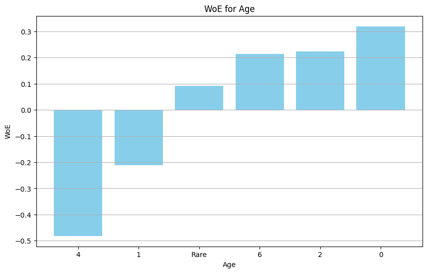

.. _woe_encoder:

.. currentmodule:: feature_engine.encoding

Weight of Evidence (WoE)
========================

The term Weight of Evidence (WoE) can be traced to the financial sector, especially to
1983, when it took on an important role in describing the key components of credit risk
analysis and credit scoring. Since then, it has been used for medical research, GIS
studies, and more (see references below for review).

The WoE is a statistical data-driven method based on Bayes' theorem and the concepts of
prior and posterior probability, so the concepts of log odds, events, and non-events
are crucial to understanding how the weight of evidence works.

The WoE is only defined for binary classification problems. In other words, we can only
encode variables using the WoE when the target variable is binary.

Formulation
-----------

The weight of evidence is given by:

.. math::

    log( p(X=xj|Y = 1) / p(X=xj|Y=0) )

We discuss the formula in the next section.

Calculation
-----------

How is the WoE calculated? Let's say we have a dataset with a binary dependent variable
with two categories, 0 and 1, and a categorical predictor variable named variable A
with three categories (A1, A2, and A3). The dataset has the following characteristics:

- There are 20 positive (1) cases and 80 negative (0) cases in the target variable.
- Category A1 has 10 positive cases and 15 negative cases.
- Category A2 has 5 positive cases and 15 negative cases.
- Category A3 has 5 positive cases and 50 negative cases.

First, we find out the number of instances with a positive target value (1) per category,
and then we divide that by the total number of positive cases in the data. Then we determine
the number of instances with target value of 0 per category and divide that by the total
number of negative instances in the dataset:

- For category A1, we have 10 positive cases and 15 negative cases, resulting in a positive ratio of 10/20 and a negative ratio of 15/80. This means that the positive ratio is 0.5 and the negative ratio is 0.1875.
- For category A2, we have 5 positive cases out of 20 positive cases, giving us a  positive ratio of 5/20 and a negative ratio of 15/80. This results in a positive ratio of 0.25 and a negative ratio of 0.1875.
- For category A3, we have 5 positive cases out of 20 positive cases, resulting in a positive ratio of 5/20, and a 50/80 negative ratio. So the positive ratio is 0.25, and the negative ratio is 0.625.

Now we calculate the log of the ratio of positive cases in each category:

- For category A1, we have log (0.5/ 0.1875) = 0.98.
- For category A2, we have log (0.25/ 0.1875) = 0.28.
- For category A3, we have log (0.25/0.625) =-0.91.

Finally, we replace the categories (A1, A2, and A3) of the independent variable A with
the WoE values: 0.98, 0.28, -0.91.

Characteristics of the WoE
--------------------------

The beauty of the WoE, is that we can directly understand the impact of the category on
the probability of success (target variable being 1):

- If WoE values are negative, there are more negative cases than positive cases for the category.
- If WoE values are positive, there are more positive cases than negative cases for that category.
- If WoE is 0, then there is an equal number of positive and negative cases for that category.

In other words, for categories with positive WoE, the probability of success is high,
for categories with negative WoE, the probability of success is low, and for those with
WoE of zero, there are equal chances for both target outcomes.

Advantages of the WoE
---------------------

In addition to the intuitive interpretation of the WoE values, the WoE shows the following
advantages:

- It creates monotonic relationships between the encoded variable and the target.
- It returns numeric variables on a similar scale.

Uses of the WoE
---------------

In general, we use the WoE to encode both categorical and numerical variables. For
continuous variables, we first need to do binning, that is, sort the variables into
discrete intervals. You can do this by preprocessing the variable using any of
Feature-engine's discretizers.

Some authors have extended the Weight of Evidence approach to neural networks and other
algorithms, and although they have shown good results, the predictive modeling performance
of Weight of Evidence was superior when used with logistic regression models (see
reference below).

Limitations of the WoE
----------------------

As the methodology to calculate the WoE is based on ratios and logarithm, the WoE value
is not defined when `p(X=xj|Y = 1) = 0` or `p(X=xj|Y=0) = 0`. For the latter, the division
by 0 is not defined, and for the former, the log of 0 is not defined.

This occurs when a category shows only 1 of the possible values of the target (either it
always takes 1 or 0). In practice, this happens mostly when a category has a low frequency
in the dataset, that is, when only very few observations show that category.

To overcome this limitation, consider using a variable transformation method to group
those categories together, for example by using Feature-engine's :class:`RareLabelEncoder()`.

Taking into account the above considerations, conducting a detailed exploratory data
analysis (EDA) is essential as part of the data science and model-building process.
Integrating these considerations and practices not only enhances the feature engineering
process but also improves the performance of your models.

Unseen categories
-----------------

When using the WoE, we define the mappings, that is, the WoE values per category using
the observations from the training set. If the test set shows new (unseen) categories,
we'll lack a WoE value for them, and won't be able to encode them.

This is a known issue, without an elegant solution. If the new values appear in continuous
variables, consider changing the size and number of the intervals. If the unseen categories
appear in categorical variables, consider grouping low frequency categories before doing
the encoding.

WoEEncoder
----------

The :class:`WoEEncoder()` allows you to automate the process of calculating weight of
evidence for a given set of features. By default, :class:`WoEEncoder()` will encode all
categorical variables. You can encode just a subset by passing the variables names in a
list to the `variables` parameter.

By default, :class:`WoEEncoder()` will not encode numerical variables, instead, it will
raise an error. If you want to encode numerical, for example discrete variables, set
`ignore_format` to `True`.

:class:`WoEEncoder()` does not handle missing values automatically, so make sure to
replace them with a suitable value before the encoding. You can impute missing values
with Feature-engine's imputers.

:class:`WoEEncoder()` will ignore unseen categories by default, in which case, they will
be replaced by np.nan after the encoding. You have the option to make the encoder raise
an error instead, by setting `unseen='raise'`. You can also replace unseen categories
by an arbitrary value you need to define in `fill_value`, although we do not recommend
this option because it may lead to unpredictable results.

Python example
--------------

In the rest of the document, we'll show :class:`WoEEncoder()`'s functionality. Let's
look at an example using the Titanic Dataset.

First, let's load the data and separate the dataset into train and test:

.. code:: python

    from sklearn.model_selection import train_test_split
    from feature_engine.datasets import load_titanic
    from feature_engine.encoding import WoEEncoder, RareLabelEncoder

    X, y = load_titanic(
        return_X_y_frame=True,
        handle_missing=True,
        predictors_only=True,
        cabin="letter_only",
    )

    X_train, X_test, y_train, y_test = train_test_split(
        X, y, test_size=0.3, random_state=0,
    )

    print(X_train.head())

We see the resulting dataframe below:

.. code:: python

          pclass     sex        age  sibsp  parch     fare cabin embarked
    501        2  female  13.000000      0      1  19.5000     M        S
    588        2  female   4.000000      1      1  23.0000     M        S
    402        2  female  30.000000      1      0  13.8583     M        C
    1193       3    male  29.881135      0      0   7.7250     M        Q
    686        3  female  22.000000      0      0   7.7250     M        Q

Before we encode the variables, we group infrequent categories into one
category, which we'll call 'Rare'. For this, we use the :class:`RareLabelEncoder()` as
follows:

.. code:: python

    # set up a rare label encoder
    rare_encoder = RareLabelEncoder(
        tol=0.1,
        n_categories=2,
        variables=['cabin', 'pclass', 'embarked'],
        ignore_format=True,
    )

    # fit and transform data
    train_t = rare_encoder.fit_transform(X_train)
    test_t = rare_encoder.transform(X_train)

Note that we pass `ignore_format=True` because pclass is numeric.

Now, we set up :class:`WoEEncoder()` to replace the categories by the weight of the
evidence, only in the 3 indicated variables:

.. code:: python

    # set up a weight of evidence encoder
    woe_encoder = WoEEncoder(
        variables=['cabin', 'pclass', 'embarked'],
        ignore_format=True,
    )

    # fit the encoder
    woe_encoder.fit(train_t, y_train)

With `fit()` the encoder learns the weight of the evidence for each category, which are
stored in its `encoder_dict_` parameter:

.. code:: python

	woe_encoder.encoder_dict_

In the `encoder_dict_` we find the WoE for each one of the categories of the
variables to encode. This way, we can map the original values to the new values:

.. code:: python

    {'cabin': {'M': -0.35752781962490193, 'Rare': 1.083797390800775},
     'pclass': {'1': 0.9453018143294478,
      '2': 0.21009172435857942,
      '3': -0.5841726684724614},
     'embarked': {'C': 0.679904786667102,
      'Rare': 0.012075414091446468,
      'S': -0.20113381737960143}}

Now, we can go ahead and encode the variables:

.. code:: python

    train_t = woe_encoder.transform(train_t)
    test_t = woe_encoder.transform(test_t)

    print(train_t.head())

Below we see the resulting dataset with the weight of the evidence replacing the original
variable values:

.. code:: python

            pclass     sex        age  sibsp  parch     fare     cabin  embarked
    501   0.210092  female  13.000000      0      1  19.5000 -0.357528 -0.201134
    588   0.210092  female   4.000000      1      1  23.0000 -0.357528 -0.201134
    402   0.210092  female  30.000000      1      0  13.8583 -0.357528  0.679905
    1193 -0.584173    male  29.881135      0      0   7.7250 -0.357528  0.012075
    686  -0.584173  female  22.000000      0      0   7.7250 -0.357528  0.012075

WoE in categorical and numerical variables
~~~~~~~~~~~~~~~~~~~~~~~~~~~~~~~~~~~~~~~~~~

In the previous example, we encoded only the variables 'cabin', 'pclass', 'embarked',
and left the rest of the variables untouched. In the following example, we will use
Feature-engine's pipeline to transform variables in sequence. We'll group rare categories
in categorical variables. Next, we'll discretize numerical variables. And finally, we'll
encode them all with the WoE.

First, let's load the data and separate it into train and test:

.. code:: python

    from sklearn.model_selection import train_test_split
    from feature_engine.datasets import load_titanic
    from feature_engine.encoding import WoEEncoder, RareLabelEncoder
    from feature_engine.pipeline import Pipeline
    from feature_engine.discretisation import EqualFrequencyDiscretiser

    X, y = load_titanic(
        return_X_y_frame=True,
        handle_missing=True,
        predictors_only=True,
        cabin="letter_only",
    )

    X_train, X_test, y_train, y_test = train_test_split(
        X, y, test_size=0.3, random_state=0,
    )

    print(X_train.head())

We see the resulting dataset below:

.. code:: python

          pclass     sex        age  sibsp  parch     fare cabin embarked
    501        2  female  13.000000      0      1  19.5000     M        S
    588        2  female   4.000000      1      1  23.0000     M        S
    402        2  female  30.000000      1      0  13.8583     M        C
    1193       3    male  29.881135      0      0   7.7250     M        Q
    686        3  female  22.000000      0      0   7.7250     M        Q

Let's define lists with the categorical and numerical variables:

.. code::: python

    categorical_features = ['cabin', 'pclass', 'embarked', 'sex', 'sibsp', 'parch']
    numerical_features = ['fare', 'age']
    all = categorical_features + numerical_features

Now, we will set up the pipeline to first discretize the numerical variables, then group
rare labels and low frequency intervals into a common group, and finally encode all
variables with the WoE:

.. code::: python

    pipe = Pipeline(
        [
            ("disc", EqualFrequencyDiscretiser(variables=numerical_features)),
            ("rare_label", RareLabelEncoder(tol=0.1, n_categories=2, variables=all, ignore_format=True)),
            ("woe", WoEEncoder(variables=all)),
        ])

We have created a variable transformation pipeline with the following steps:

- First, we use :class:`EqualFrequencyDiscretiser()` to do binning of the numerical variables.
- Next, we use :class:`RareLabelEncoder()` to group infrequent categories and intervals into one group.
- Finally, we use the :class:`WoEEncoder()` to replace values in all variables with the weight of the evidence.

Now, we can go ahead and fit the pipeline to the train set so that the different
transformers learn the parameters for the variable transformation.

.. code:: python

    X_trans_t = pipe.fit_transform(X_train, y_train)

    print(X_trans_t.head())

We see the resulting dataframe below:

.. code:: python

            pclass      sex       age     sibsp     parch      fare     cabin  \
    501   0.210092  1.45312  0.319176 -0.097278  0.764646  0.020285 -0.357528
    588   0.210092  1.45312  0.319176  0.458001  0.764646  0.248558 -0.357528
    402   0.210092  1.45312  0.092599  0.458001 -0.161255 -0.133962 -0.357528
    1193 -0.584173 -0.99882 -0.481682 -0.097278 -0.161255  0.020285 -0.357528
    686  -0.584173  1.45312  0.222615 -0.097278 -0.161255  0.020285 -0.357528

          embarked
    501  -0.201134
    588  -0.201134
    402   0.679905
    1193  0.012075
    686   0.012075

Finally, we can visualize the values of the WoE encoded variables respect to the original
values to corroborate the sigmoid function shape, which is the expected behavior of the
WoE:

.. code:: python

    import matplotlib.pyplot as plt
    age_woe = pipe.named_steps['woe'].encoder_dict_['age']

    sorted_age_woe = dict(sorted(age_woe.items(), key=lambda item: item[1]))
    categories = [str(k) for k in sorted_age_woe.keys()]
    log_odds = list(sorted_age_woe.values())

    plt.figure(figsize=(10, 6))
    plt.bar(categories, log_odds, color='skyblue')
    plt.xlabel('Age')
    plt.ylabel('WoE')
    plt.title('WoE for Age')
    plt.grid(axis='y')
    plt.show()

In the following plot, we can see the WoE for different categories of the variable
'age':

|
|
|
|
|
|
|
|
|
|
|
|
|
|
|
|
|

The WoE values are in the y-axis, and the categories are in the x-axis. We see that the
WoE values are monotonically increasing, which is the expected behavior of the WoE. If
we look at category 4, we can see the WoE is around -0.45 which means that in this age
bracket there was a small portion of positive cases (people who survived) compared to
negative cases (non-survivors). In other words, people within this age interval had
a low probability of survival.

Adding a model to the pipeline
~~~~~~~~~~~~~~~~~~~~~~~~~~~~~~

To complete the demo, we can add a logistic regression model to the pipeline to obtain
predictions of survival after the variable transformation.

.. code:: python

    from sklearn.linear_model import LogisticRegression
    from sklearn.metrics import accuracy_score

    pipe = Pipeline(
        [
            ("disc", EqualFrequencyDiscretiser(variables=numerical_features)),
            ("rare_label", RareLabelEncoder(tol=0.1, n_categories=2, variables=all, ignore_format=True)),
            ("woe", WoEEncoder(variables=all)),
            ('model', LogisticRegression(random_state=0)),
        ])

    pipe.fit(X_train, y_train)
    y_pred = pipe.predict(X_test)
    accuracy = accuracy_score(y_test, y_pred)
    print(f"Accuracy: {accuracy:.2f}")

The accuracy of the model is shown below:

.. code:: python

    Accuracy: 0.76

The accuracy of the model is 0.76, which is a good result for a first model. We can
improve the model by tuning the hyperparameters of the logistic regression model. Please
note that accuracy may not be the best metric for this problem, as the dataset is
imbalanced. We recommend using other metrics such as the F1 score, precision, recall, or
the ROC-AUC score. You can learn more about imbalance datasets in our
`course <https://www.trainindata.com/p/machine-learning-with-imbalanced-data>`_.

Weight of Evidence and Information Value
----------------------------------------

A common extension of the WoE is the information value (IV), which is a measure of the
predictive power of a variable. The IV is calculated as follows:

.. math::

    IV = \sum_{i=1}^{n} (p_{i} - q_{i}) \cdot WoE_{i}

Where, `pi` is the percentage of positive cases in the i-th category, `qi` is the
percentage of negative cases in the i-th category, and WoE_{i} is the weight of evidence
of the i-th category.

The IV is a measure of the predictive power of a variable. The higher the IV value, the
more predictive the variable is. So the combination of WoE with information value can be
used for feature selection for binary classification problems.

Weight of Evidence and Information Value within Feature-engine
~~~~~~~~~~~~~~~~~~~~~~~~~~~~~~~~~~~~~~~~~~~~~~~~~~~~~~~~~~~~~~

If you're asking yourself whether Feature-engine allows you to automate this process,
the answer is: of course! You can utilize the :class:`SelectByInformationValue()` class
and it will handle all these steps for you. Again, remember the given considerations.

References
----------

- `Weight of Evidence: A Review of Concept and Methods <https://onlinelibrary.wiley.com/doi/abs/10.1111/j.1539-6924.2005.00699.x>`_
- `Comparison and evaluation of landslide susceptibility maps obtained from weight of evidence, logistic regression, and artificial neural network models <https://link.springer.com/article/10.1007/s11069-018-3299-7>`_
- `Can weight of evidence, quantitative bias, and bounding methods evaluate robustness of real-world evidence for regulator and health technology assessment decisions on medical interventions <https://www.sciencedirect.com/science/article/pii/s0149291823003557>`_

Additional resources
--------------------

In the following notebooks, you can find more details into the :class:`WoEEncoder()`
functionality and example plots with the encoded variables:

- `WoE in categorical variables <https://nbviewer.org/github/feature-engine/feature-engine-examples/blob/main/encoding/WoEEncoder.ipynb>`_
- `WoE in numerical variables <https://nbviewer.org/github/feature-engine/feature-engine-examples/blob/main/discretisation/EqualFrequencyDiscretiser_plus_WoEEncoder.ipynb>`_

For more details about this and other feature engineering methods check out these resources:

.. figure::  ../../images/feml.png
   :width: 300
   :figclass: align-center
   :align: left
   :target: https://www.trainindata.com/p/feature-engineering-for-machine-learning

   Feature Engineering for Machine Learning

|
|
|
|
|
|
|
|
|
|

Or read our book:

.. figure::  ../../images/cookbook.png
   :width: 200
   :figclass: align-center
   :align: left
   :target: https://www.packtpub.com/en-us/product/python-feature-engineering-cookbook-9781835883587

   Python Feature Engineering Cookbook

|
|
|
|
|
|
|
|
|
|
|
|
|

Both our book and course are suitable for beginners and more advanced data scientists
alike. By purchasing them you are supporting Sole, the main developer of Feature-engine.