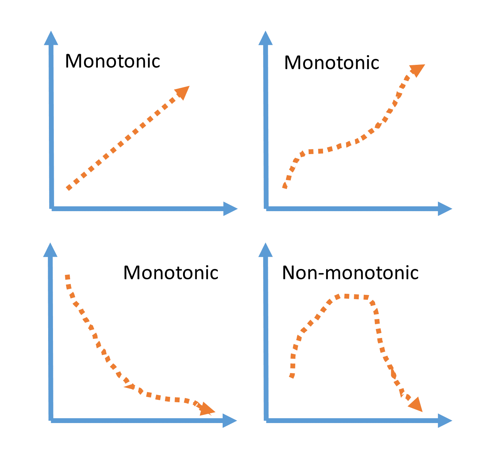

.. -*- mode: rst -*-
.. _encoding_user_guide:

.. currentmodule:: feature_engine.encoding

Categorical Encoding
====================

Categorical encoding is the process of converting categorical variables into numeric 
features. It is an important feature engineering step in most data science projects, 
as it ensures that machine learning algorithms can appropriately handle and interpret 
categorical data.

There are various categorical encoding methods that we can use to encode categorical 
features. One hot encoding and ordinal encoding are the most well known, but other 
encoding techniques can help tackle high cardinality and rare categories before and 
after training machine learning models.

Feature-engine's categorical encoders replace the variables' categorical values by 
estimated or arbitrary numerical values through various encoding methods. In this page, 
we will discuss categorical features and the importance of categorical encoding in more 
detail, and then introduce the various encoding techniques supported by Feature-engine.

Categorical features
--------------------

Categorical variables are those whose values are selected from a group of categories 
or labels. Their values can be strings or numbers.

*Color* is a categorical feature that can take values such as *red*, *yellow* or 
*orange*, among others. Similarly, *size* is another categorical feature, with 
the values of *small*, *medium* and *large*. 

Nominal data vs ordinal data
----------------------------

Categorical features can be **nominal** or **ordinal**.

**Nominal features** are categorical features whose categories don't have a defined ranking 
or inherent order. *Color* is an example of a nominal feature because each color is an 
independent entity, without a logical ordering or ranking.

**Ordinal features** are categorical features whose categories show an inherent order or 
ranking. *Size* is an example of an ordinal feature, as the different sizes can be ordered 
from smallest to largest.

Understanding if categorical features are *nominal* or *ordinal* can help us choose the 
most appropriate encoding method to transform their values into numbers.

Identifying categorical features
--------------------------------

We can identify categorical features by inspecting their data types. With pandas' `dtypes` 
we can obtain the data types of all variables in a dataframe; features with non-numeric data 
types such as *string*, *object* or *categorical* are, in general, categorical. 

Categorical features can also be numeric, however, like for example the features *Store ID*, 
*SKU ID* or *Zip Code*. Although these variables have numeric values, they are categorical.

Cardinality
-----------

**Cardinality** refers to the number of unique categories of a categorical variable. F
or example, the cardinality of the variable 'size', which takes the values 'small', 
'medium' and 'large' is 3. 

A categorical variable is said to have a **low cardinality** when the number of distinct 
values is relatively small. Alternatively, a categorical feature is said to have a **high 
cardinality** when the number of distinct categories is large. 

Highly cardinal features can pose challenges. It can lead to overfitting in tree-based 
models, and it can also lead to unseen categories in test or live data. As we will see 
later, if we do not account for unseen categories when designing the machine learning 
pipeline, the machine learning model will not know how to process them and will return 
an error or an inaccurate prediction.

Unseen categories
-----------------

**Unseen categories** are categorical values that appear in the test or validation 
datasets, or even in live data after model deployment, that were not present in the 
training data, and therefore were not **seen** by the machine learning model.

Unseen categories are challenging for various reasons. Firstly, when we create mappings 
from categorical values to numbers by using an encoding technique, we only generate 
mappings for those categories *present* in the training set. Hence, we'd lack a mapping 
for a new, unseen value.

We may feel tempted to replace unseen categories by 0, or an arbitrary value, or just have 
0s in all dummy variables if we used one hot encoding, but this may make the machine learning 
model behave unexpectedly leading to inaccurate predictions.

Ideally, we want to account for the potential presence of unseen categories during the 
training of the model, and more generally, during the training of the entire machine 
learning pipeline, that is, including the feature engineering and categorical encoding 
steps. Some categorical encoding methods can account for unseen categories, as we will 
see later on.

Importance of categorical encoding
----------------------------------

Most machine learning algorithms, like *linear regression*, *support vector machines* 
and *logistic regression*, require input data to be numeric because they use numerical 
computations to learn the relationship between the predictor features and the target 
variable. These algorithms are not inherently capable of interpreting categorical data. 
Thus, categorical encoding is a crucial step that ensures that the input data is compatible 
with the expectations of the machine learning models.

Some implementations of *decision tree* based algorithms can directly handle categorical data. 
We'd still recommend encoding categorical features, for example, to reduce cardinality and 
account for unseen categories.

Overfitting
------------

Overfitting occurs when a machine learning model learns the noise and random fluctuations 
present in the training data in addition to the underlying relationships. This results in a 
model that performs exceptionally well on the training data but fails to generalize on unseen 
data (i.e., the model shows low performance on the validation data set).

High cardinality features can lead to overfitting, particularly in tree-based models such 
as decision trees or random forests. Overfitting occurs because tree-based models will try 
to perform extensive splitting on the high cardinality feature, making the final tree overly 
complex. This often leads to poor generalization. Reducing cardinality, often helps mitigate 
the problem.

Encoding pipeline
-----------------

Many categorical encoding methods learn parameters from data. These parameters are  used to 
replace the original categorical values. To prevent overfitting and evaluate the machine learning 
pipelines accurately, it is key to split the dataset into a training and a testing sets before 
fitting the encoders. In other words, the encoders should learn the encoding parameters only 
from the **training data**.

Encoding methods
----------------

There are various methods to transform categorical variables into numerical features. One hot 
encoding and ordinal encoding are the most commonly used, but other methods can mitigate high 
cardinality and account for unseen categories.

In the rest of this page, we'll introduce various methods for encoding categorical data, and 
highlight the Feature-engine transformer that can carry out this transformation.

One hot encoding
~~~~~~~~~~~~~~~~

One-hot encoding (OHE) consists of replacing categorical variables by a set of binary variables 
each representing one of the unique categories in the variable. The binary variable takes the 
value 1, if the observation shows the category, or alternatively, 0.

One hot encoding is particularly suitable for linear models because it treats each category 
independently, and linear models can process binary variables effectively.

One hot encoding, however, increases the dimensionality of the dataset, as it adds a new 
variable per category. Hence, OHE may not be suitable for encoding high cardinality features, 
as it can drastically increase the dimensionality of the dataset, often leading to a set of 
variables that are highly correlated or even identical.

Feature-engine's :class:`OneHotEncoder` implements one hot encoding.

One hot encoding of frequent categories
~~~~~~~~~~~~~~~~~~~~~~~~~~~~~~~~~~~~~~~~
To prevent a massive increase of the feature space, some data scientists create binary 
variables through one hot encoding of the **most frequent categories** in the variable. 
Less frequent values are treated collectively and represented as 0 in all the binary 
variables created for the frequent categories.

One hot encoding of frequent categories can then help tackle high cardinality and also 
unseen categories, because unseen categories will be also encoded as an infrequent value.

Feature-engine's :class:`OneHotEncoder` can implement one hot encoding of frequent categories.

Ordinal Encoding
~~~~~~~~~~~~~~~~

In ordinal encoding, each category is replaced with an integer value. These numbers are, 
in general, assigned arbitrarily. With Feature-engine's :class:`OrdinalEncoder`, we have the 
option to assign integers arbitrarily, or alternatively, ordered based on the mean target 
value per category.

Ordinal encoding is a preferred option when the categorical variable has an inherent order. 
Examples include the variable **size**, with values 'small', 'medium' and 'large', and the 
variable **education level**, with values such as 'high school', 'bachelors', 'masters' and 
'PhD', among others.

Ordinal encoding is suitable for decision trees-based models, because these models have the 
ability to interpret non-linear relationships between the encoded variables and the target, and 
prefer low feature spaces.

Ordinal encoding, however, lacks the ability to handle unseen categories. If a new category 
appears in later stages, the encoder will not know what number to assign to it, because the 
category to integer mappings are generated based on the training set. This can result in errors 
and disrupt the machine learning pipeline. Therefore, it's most effective to use ordinal encoding 
in situations where the number of categories is fixed and won't change over time.

Feature-engine's :class:`OrdinalEncoder` implements ordinal encoding.

Count and Frequency Encoding
~~~~~~~~~~~~~~~~~~~~~~~~~~~~

Count and frequency encoding consist of mapping the categories to either the count or percentage of 
observations per category observed in the training data set. Count and frequency encoding are suitable 
when the frequency of occurrence of categories is meaningful and has some predictive power. 

Count and frequency encoding work well with high cardinality and does not increase the dimensionality 
of the dataset, as opposed to one-hot encoding. However, when two or more categories have the same 
count, this encoding method will assign same value to them, and the model might not be able to 
distinguish two observations based on that feature alone.

Count and frequency encoding can't handle unseen categories on its own. To manage unseen 
categories, we can assign them a frequency or count of '0' explicitly, which represents 
the frequency of the category on the training set, to prevent failure during inference 
time (i.e., while making predictions) or while encoding live data.

Feature-engine's :class:`CountFrequencyEncoder` implements cound and frequency encoding.

Mean Encoding
~~~~~~~~~~~~~

Mean encoding, or target encoding, consists of replacing each category with a blend of the 
mean value of the target variable for the observations within that category with the general 
target mean. 

This encoding procedure was designed specifically to account for features with high 
cardinality. When there is high cardinality, there will be categories that are highly 
represented in the data, and those that are rare. With mean encoding, we'd replace categories 
that are highly present with a value that is closer to the target mean per category, 
whereas rare categories will be replaced by values closer to the general target mean. 
Like this, unseen categories will be accounted automatically and replaced by the target 
mean value across the training data set.

The mean encoding method directly ties the categorical feature to the target variable, 
hence, it is prone to overfitting. When encoding categories with the target mean, make 
sure to have proper validation strategies in place.

Feature-engine's :class:`MeanEncoder` implements mean encoding.

WoE Encoding
~~~~~~~~~~~~

The WoE encoding replaces categories by the weight of evidence, which is given by:

.. math::

    log( p(X=xj|Y = 1) / p(X=xj|Y=0) )

This encoding is primarily used in the finance industry. 

WoE is a measure of "goodness" or "strength" of a category at predicting the target outcome 
being '1' or 'positive'. It means that categories with high values of WoE are strong predictors 
of the positive class. 

WoE encoding can only be used with **binary classification** where the target variable has 
two possible outcomes such as '1' and '0'. This characteristic of WoE encoding makes it highly 
compatible with logistic regression whose fundamentals are also based on the concept of log odds. 

Feature-engine's :class:`WoEEncoder` implements WoE encoding.

Decision Tree Encoding
~~~~~~~~~~~~~~~~~~~~~~

The decision tree encoding consists of replacing each category with the output of a decision 
tree model.

In decision tree encoding, a decision tree is trained using the categorical feature to 
predict the target variable. The decision tree splits the data based of each category, 
eventually leading the observations to a final leaf. Each category is then replaced by 
the prediction of the tree, which consists of the mean target value calculated over the 
observations that ended in that leaf. 

Feature-engine's :class:`DecisionTreeEncoder` implements decision tree encoding.

Rare Label Encoding
~~~~~~~~~~~~~~~~~~~

We mentioned previously that high cardinality can lead to infrequent and unseen categories. 
This in turn can result in failures during the encoding of new data. A common way to account 
for infrequent categories is to treat them collectively as an additional group. We call this 
process rare label encoding.

Rare label encoding helps reduce the cardinality of the features. This can be beneficial for 
models and humans alike, as it simplifies the input feature. 

Rare label encoding can be used in conjunction with other encoding methods, like one-hot 
encoding, ordinal encoding and weight of evidence, to prevent explosion of the feature space, 
or the lack of mappings for less frequent values.

Feature-engine's :class:`RareLabelEncoder` implements rare label encoding.

String Similarity Encoding
~~~~~~~~~~~~~~~~~~~~~~~~~~

The string similarity encoding consists of replacing categorical variables with a set of 
float variables that capture the similarity between the category names. The new variables 
have values between `0` and `1`, where `0` indicates no similarity and `1` is an exact match 
between the names of the categories.

String similarity encoding is well suited for "dirty" categorical features. We call the categorical 
data as "dirty" when there are misspellings (bachelors vs bachlors), abbreviations used in 
some instances while full words in others (U.S. vs United States), etc. Most encoding methods
would consider each of these categories as distinct even if they refer to the same category. 
To prevent this from happening, we can use string similarity to first compute the "distance" 
between each unique category, and then we could group the highly similar categories together.

String similarity encoding reduces the cardinality and also enhances the model performance by 
blending similar categories together.

Feature-engine's :class:`StringSimilarityEncoder` implements string similarity encoding.

**Summary of Feature-engine's encoders characteristics**

=================================== ============ ================= ============== ===============================================================
    Transformer                     Regression	 Classification	   Multi-class    Description
=================================== ============ ================= ============== ===============================================================
:class:`OneHotEncoder()`	           √	            √               √         Adds dummy variables to represent each category
:class:`OrdinalEncoder()`	           √	            √    	        √         Replaces categories with an integer
:class:`CountFrequencyEncoder()`	   √	            √               √         Replaces categories with their count or frequency
:class:`MeanEncoder()`                 √	            √               x         Replaces categories with the targe mean value
:class:`WoEEncoder()`	               x	            √	            x         Replaces categories with the weight of the evidence
:class:`DecisionTreeEncoder()`	       √	            √     	        √         Replaces categories with the predictions of a decision tree
:class:`RareLabelEncoder()`	           √	            √     	        √         Groups infrequent categories into a single one
:class:`StringSimilarityEncoder()`	   √	            √     	        √         Replaces categories with distances values
=================================== ============ ================= ============== ===============================================================

Feature-engine's categorical encoders work only with categorical variables by default.
From version 1.1.0, you have the option to set the parameter `ignore_format` to `False`,
and make the transformers also accept numerical variables as input.

**Monotonicity**

Most Feature-engine's encoders will return, or attempt to return monotonic relationships
between the encoded variable and the target. A monotonic relationship is one in which
the variable value increases as the values in the other variable increase, or decrease.
See the following illustration as examples:

Monotonic relationships tend to help improve the performance of linear models and build
shallower decision trees.

**Regression vs Classification**

Most Feature-engine's encoders are suitable for both regression and classification, with
the exception of the :class:`WoEEncoder()` which is
designed solely for **binary** classification.

**Multi-class classification**

Finally, some Feature-engine's encoders can handle multi-class targets off-the-shelf for
example the :class:`OneHotEncoder()`, the :class:`CountFrequencyEncoder()` and the
:class:`DecisionTreeEncoder()`.

Note that while the :class:`MeanEncoder()` and the :class:`OrdinalEncoder()` will operate
with multi-class targets, but the mean of the classes may not be significant and this will
defeat the purpose of these encoding techniques.

Alternative encoding techniques
-------------------------------

In addition to the categorical encoding methods supported by Feature-engine, there are 
other methods like feature hashing or binary encoding. These methods are supported by the 
Python library category encoders. For the time being, we decided not to support these 
transformations because they return features that are not easy to interpret. And hence, 
it is very hard to make sense of the outputs of machine learning models trained on 
categorical variables encoded with these methods.

Additional resources
--------------------

For tutorials about this and other feature engineering methods check out these resources:

.. figure::  ../../images/feml.png
   :width: 300
   :figclass: align-center
   :align: left
   :target: https://www.trainindata.com/p/feature-engineering-for-machine-learning

   Feature Engineering for Machine Learning

|
|
|
|
|
|
|
|
|
|

Or read our book:

.. figure::  ../../images/cookbook.png
   :width: 200
   :figclass: align-center
   :align: left
   :target: https://www.packtpub.com/en-us/product/python-feature-engineering-cookbook-9781835883587

   Python Feature Engineering Cookbook

|
|
|
|
|
|
|
|
|
|
|
|
|

Both our book and course are suitable for beginners and more advanced data scientists
alike. By purchasing them you are supporting Sole, the main developer of Feature-engine.

Encoders
--------

.. toctree::
   :maxdepth: 1

   OneHotEncoder
   OrdinalEncoder
   CountFrequencyEncoder
   MeanEncoder
   WoEEncoder
   DecisionTreeEncoder
   RareLabelEncoder
   StringSimilarityEncoder
