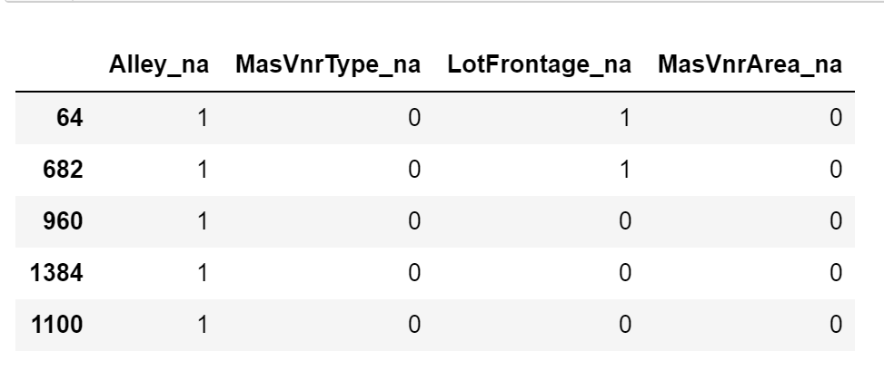

.. _add_missing_indicator:

.. currentmodule:: feature_engine.imputation

AddMissingIndicator
===================

The :class:`AddMissingIndicator()` adds a binary variable indicating if observations are
missing (missing indicator). It adds missing indicators to both categorical and numerical
variables.

You can select the variables for which the missing indicators should be created passing
a variable list to the `variables` parameter. Alternatively, the imputer will
automatically select all variables.

The imputer has the option to add missing indicators to all variables or only to those
that have missing data in the train set. You can change the behaviour using the
parameter `missing_only`.

If `missing_only=True`, missing indicators will be added only to those variables with
missing data in the train set. This means that if you passed a variable list to
`variables` and some of those variables did not have missing data, no missing indicators
will be added to them. If it is paramount that all variables in your list get their
missing indicators, make sure to set `missing_only=False`.

It is recommended to use `missing_only=True` when not passing a list of variables to
impute.

Below a code example using the House Prices Dataset (more details about the dataset
:ref:`here <datasets>`).

First, let's load the data and separate it into train and test:

.. code:: python

	import numpy as np
	import pandas as pd
	import matplotlib.pyplot as plt
	from sklearn.model_selection import train_test_split

	from feature_engine.imputation import AddMissingIndicator

	# Load dataset
	data = pd.read_csv('houseprice.csv')

	# Separate into train and test sets
	X_train, X_test, y_train, y_test = train_test_split(
    	data.drop(['Id', 'SalePrice'], axis=1), data['SalePrice'], test_size=0.3, random_state=0)

Now we set up the imputer to add missing indicators to the 4 indicated variables:

.. code:: python

	# set up the imputer
	addBinary_imputer = AddMissingIndicator(
        variables=['Alley', 'MasVnrType', 'LotFrontage', 'MasVnrArea'],
        )

	# fit the imputer
	addBinary_imputer.fit(X_train)

Because we left the default value for `missing_only`, the :class:`AddMissingIndicator()`
will check if the variables indicated above have missing data in X_train. If they do,
missing indicators will be added for all 4 variables looking forward. If one of them
had not had missing data in X_train, missing indicators would have been added to the
remaining 3 variables only.

We can know which variables will have missing indicators by looking at the variable list
in the :class:`AddMissingIndicator()`'s attribute `variables_`.

Now, we can go ahead and add the missing indicators:

.. code:: python

	# transform the data
	train_t = addBinary_imputer.transform(X_train)
	test_t = addBinary_imputer.transform(X_test)

	train_t[['Alley_na', 'MasVnrType_na', 'LotFrontage_na', 'MasVnrArea_na']].head()

Note that after adding missing indicators, we still need to replace NA in the original
variables if we plan to use them to train machine learning models.

Tip
---

Missing indicators are commonly used together with random sampling, mean or median
imputation, or frequent category imputation.

Additional resources
--------------------

In the following Jupyter notebook you will find more details on the functionality of the
:class:`AddMissingIndicator()`, including how to use the parameter `missing_indicator` and
how to select the variables automatically.

- `Jupyter notebook <https://nbviewer.org/github/feature-engine/feature-engine-examples/blob/main/imputation/AddMissingIndicator.ipynb>`_

For more details about this and other feature engineering methods check out these resources:

.. figure::  ../../images/feml.png
   :width: 300
   :figclass: align-center
   :align: left
   :target: https://www.trainindata.com/p/feature-engineering-for-machine-learning

   Feature Engineering for Machine Learning

|
|
|
|
|
|
|
|
|
|

Or read our book:

.. figure::  ../../images/cookbook.png
   :width: 200
   :figclass: align-center
   :align: left
   :target: https://www.packtpub.com/en-us/product/python-feature-engineering-cookbook-9781835883587

   Python Feature Engineering Cookbook

|
|
|
|
|
|
|
|
|
|
|
|
|

Both our book and course are suitable for beginners and more advanced data scientists
alike. By purchasing them you are supporting Sole, the main developer of Feature-engine.