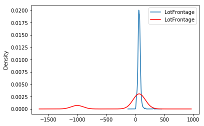

.. _arbitrary_number_imputer:

.. currentmodule:: feature_engine.imputation

ArbitraryNumberImputer
======================

The :class:`ArbitraryNumberImputer()` replaces missing data with an arbitrary numerical
value determined by the user. It works only with numerical variables.

The :class:`ArbitraryNumberImputer()` can find and impute all numerical variables
automatically. Alternatively, you can pass a list of the variables you want to impute
to the `variables` parameter.

You can impute all variables with the same number, in which case you need to define
the variables to impute in the `variables` parameter and the imputation number in
`arbitrary_number` parameter. For example, you can impute varA and varB with 99
like this:

.. code-block:: python

    transformer = ArbitraryNumberImputer(
            variables = ['varA', 'varB'],
            arbitrary_number = 99
            )

    Xt = transformer.fit_transform(X)

You can also impute different variables with different numbers. To do this, you need to
pass a dictionary with the variable names and the numbers to use for their imputation
to the `imputer_dict` parameter. For example, you can impute varA with 1 and varB
with 99 like this:

.. code-block:: python

    transformer = ArbitraryNumberImputer(
            imputer_dict = {'varA' : 1, 'varB': 99}
            )

    Xt = transformer.fit_transform(X)

Below a code example using the House Prices Dataset (more details about the dataset
:ref:`here <datasets>`).

First, let's load the data and separate it into train and test:

.. code:: python

	import numpy as np
	import pandas as pd
	import matplotlib.pyplot as plt
	from sklearn.model_selection import train_test_split

	from feature_engine.imputation import ArbitraryNumberImputer

	# Load dataset
	data = pd.read_csv('houseprice.csv')

	# Separate into train and test sets
	X_train, X_test, y_train, y_test = train_test_split(
                                    data.drop(['Id', 'SalePrice'], axis=1),
                                    data['SalePrice'],
                                    test_size=0.3,
                                    random_state=0,
                                    )

Now we set up the :class:`ArbitraryNumberImputer()` to impute 2 variables from the
dataset with the number -999:

.. code:: python

	# set up the imputer
	arbitrary_imputer = ArbitraryNumberImputer(
            arbitrary_number=-999,
            variables=['LotFrontage', 'MasVnrArea'],
            )

	# fit the imputer
	arbitrary_imputer.fit(X_train)

With `fit()`, the transformer does not learn any parameter. It just assigns the imputation
values to each variable, which can be found in the attribute `imputer_dict_`.

With transform, we replace the missing data with the arbitrary values both in train and
test sets:

.. code:: python

	# transform the data
	train_t= arbitrary_imputer.transform(X_train)
	test_t= arbitrary_imputer.transform(X_test)

Note that after the imputation, if the percentage of missing values is relatively big,
the variable distribution will differ from the original one (in red the imputed
variable):

.. code:: python

	fig = plt.figure()
	ax = fig.add_subplot(111)
	X_train['LotFrontage'].plot(kind='kde', ax=ax)
	train_t['LotFrontage'].plot(kind='kde', ax=ax, color='red')
	lines, labels = ax.get_legend_handles_labels()
	ax.legend(lines, labels, loc='best')

Additional resources
--------------------

In the following Jupyter notebook you will find more details on the functionality of the
:class:`ArbitraryNumberImputer()`, including how to select numerical variables automatically.
You will also see how to navigate the different attributes of the transformer.

- `Jupyter notebook <https://nbviewer.org/github/feature-engine/feature-engine-examples/blob/main/imputation/ArbitraryNumberImputer.ipynb>`_

For more details about this and other feature engineering methods check out these resources:

.. figure::  ../../images/feml.png
   :width: 300
   :figclass: align-center
   :align: left
   :target: https://www.trainindata.com/p/feature-engineering-for-machine-learning

   Feature Engineering for Machine Learning

|
|
|
|
|
|
|
|
|
|

Or read our book:

.. figure::  ../../images/cookbook.png
   :width: 200
   :figclass: align-center
   :align: left
   :target: https://packt.link/0ewSo

   Python Feature Engineering Cookbook

|
|
|
|
|
|
|
|
|
|
|
|
|

Both our book and course are suitable for beginners and more advanced data scientists
alike. By purchasing them you are supporting Sole, the main developer of Feature-engine.