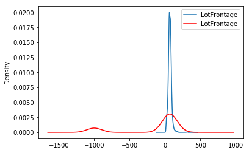

.. _arbitrary_number_imputer:

.. currentmodule:: feature_engine.imputation

ArbitraryNumberImputer
======================

The :class:`ArbitraryNumberImputer()` replaces missing data with an arbitrary numerical
value determined by the user. It works only with numerical variables.

The :class:`ArbitraryNumberImputer()` can find and impute all numerical variables
automatically. Alternatively, you can pass a list of the variables you want to impute
to the `variables` parameter.

You can impute all variables with the same number, in which case you need to define
the variables to impute in the `variables` parameter and the imputation number in
`arbitrary_number` parameter. For example, you can impute varA and varB with 99
like this:

.. code-block:: python

    transformer = ArbitraryNumberImputer(
            variables = ['varA', 'varB'],
            arbitrary_number = 99
            )

    Xt = transformer.fit_transform(X)

You can also impute different variables with different numbers. To do this, you need to
pass a dictionary with the variable names and the numbers to use for their imputation
to the `imputer_dict` parameter. For example, you can impute varA with 1 and varB
with 99 like this:

.. code-block:: python

    transformer = ArbitraryNumberImputer(
            imputer_dict = {'varA' : 1, 'varB': 99}
            )

    Xt = transformer.fit_transform(X)

Python implementation
---------------------

Below a code example using the house prices dataset.

First, let's load the data and separate it into train and test:

.. code:: python

    import matplotlib.pyplot as plt
    from sklearn.datasets import fetch_openml
    from sklearn.model_selection import train_test_split

    from feature_engine.imputation import ArbitraryNumberImputer

    # Load dataset
    X, y = fetch_openml(
        name='house_prices',
        version=1,
        return_X_y=True,
        as_frame=True,
        parser='auto',
    )

    # Separate into train and test sets
    X_train, X_test, y_train, y_test = train_test_split(
        X,
        y,
        test_size=0.3,
        random_state=0,
    )

Now we set up the :class:`ArbitraryNumberImputer()` to impute 2 variables from the
dataset with the number -999:

.. code:: python

	# set up the imputer
	arbitrary_imputer = ArbitraryNumberImputer(
            arbitrary_number=-999,
            variables=['LotFrontage', 'MasVnrArea'],
            )

	# fit the imputer
	arbitrary_imputer.fit(X_train)

With `fit()`, the transformer does not learn any parameter. It just assigns the imputation
values to each variable, which can be found in the attribute `imputer_dict_`.

With transform, we replace the missing data with the arbitrary values both in train and
test sets:

.. code:: python

	# transform the data
	train_t = arbitrary_imputer.transform(X_train)
	test_t = arbitrary_imputer.transform(X_test)

Note that after the imputation, if the percentage of missing values is relatively large,
the variable distribution will differ from the original one.

Let's create a density plot to observe the change in the distribution:

.. code:: python

	fig = plt.figure()
	ax = fig.add_subplot(111)
	X_train['LotFrontage'].plot(kind='kde', ax=ax)
	train_t['LotFrontage'].plot(kind='kde', ax=ax, color='red')
	lines, labels = ax.get_legend_handles_labels()
	ax.legend(lines, labels, loc='best')

In the following image, we see the distribution of LotFrontage before and after the
imputation (in red the imputed variable):

Additional resources
--------------------

For tutorials about missing data imputation methods check out these resources:

- `Feature Engineering for Machine Learning <https://www.trainindata.com/p/feature-engineering-for-machine-learning>`_, online course.
- `Feature Engineering for Time Series Forecasting <https://www.trainindata.com/p/feature-engineering-for-forecasting>`_, online course.
- `Python Feature Engineering Cookbook <https://www.packtpub.com/en-us/product/python-feature-engineering-cookbook-9781835883587>`_, book.

Both our book and courses are suitable for beginners and more advanced data scientists
alike. By purchasing them you are supporting `Sole <https://linkedin.com/in/soledad-galli>`_,
the main developer of feature-engine.