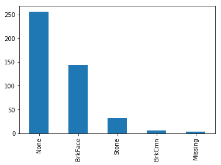
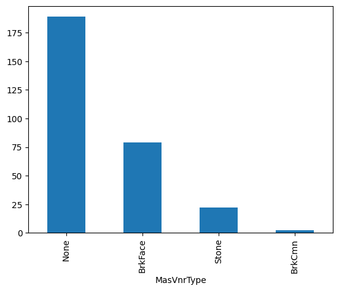

.. _categorical_imputer:

.. currentmodule:: feature_engine.imputation

CategoricalImputer
==================

Categorical data are common in most data science projects and can also show missing
values. There are **2 main imputation methods** that are used to replace missing data in
categorical variables. One method consists of replacing the missing values with the most
frequent category. The second method consists of replacing missing values with a dedicated
string, for example, "Missing."

Scikit-learn's machine learning algorithms can neither handle missing data nor categorical
variables out of the box. Hence, during data preprocessing, we need to use imputation
techniques to replace the nan values by any permitted value and then proceed with
categorical encoding, before training classification or regression models.

Handling missing values
-----------------------

Feature-engine's :class:`CategoricalImputer()` can replace missing data in categorical
variables with an arbitrary value, like the string 'Missing', or with the most frequent
category.

You can impute a subset of the categorical variables by passing their names to
:class:`CategoricalImputer()` in a list. Alternatively, the categorical imputer automatically
finds and imputes all variables of type object and categorical found in the training dataframe.

Originally, we designed this imputer to work only with categorical variables. In version
1.1.0, we introduced the parameter `ignore_format` to allow the imputer to also impute
numerical variables with this functionality. This is because, in some cases, variables
that are by nature categorical have numerical values.

Python implementation
---------------------

We'll show the :class:`CategoricalImputer()`'s data imputation functionality using the
Ames house prices dataset. We'll start by loading the necessary libraries, functions and
classes, loading the dataset, and separating it into a training and a test set.

.. code:: python

    import matplotlib.pyplot as plt
    from sklearn.datasets import fetch_openml
    from sklearn.model_selection import train_test_split

    from feature_engine.imputation import CategoricalImputer

    data = fetch_openml(name='house_prices', as_frame=True)
    data = data.frame

    X = data.drop(['SalePrice', 'Id'], axis=1)
    y = data['SalePrice']

    X_train, X_test, y_train, y_test = train_test_split(
        X, y, test_size=0.2, random_state=42)

    print(X_train.head())

In the following output we see the predictor variables of the house prices dataset:

.. code:: python

          MSSubClass MSZoning  LotFrontage  LotArea Street Alley LotShape  \
    254           20       RL         70.0     8400   Pave   NaN      Reg
    1066          60       RL         59.0     7837   Pave   NaN      IR1
    638           30       RL         67.0     8777   Pave   NaN      Reg
    799           50       RL         60.0     7200   Pave   NaN      Reg
    380           50       RL         50.0     5000   Pave  Pave      Reg

         LandContour Utilities LotConfig  ... ScreenPorch PoolArea PoolQC  Fence  \
    254          Lvl    AllPub    Inside  ...           0        0    NaN    NaN
    1066         Lvl    AllPub    Inside  ...           0        0    NaN    NaN
    638          Lvl    AllPub    Inside  ...           0        0    NaN  MnPrv
    799          Lvl    AllPub    Corner  ...           0        0    NaN  MnPrv
    380          Lvl    AllPub    Inside  ...           0        0    NaN    NaN

         MiscFeature MiscVal  MoSold  YrSold  SaleType  SaleCondition
    254          NaN       0       6    2010        WD         Normal
    1066         NaN       0       5    2009        WD         Normal
    638          NaN       0       5    2008        WD         Normal
    799          NaN       0       6    2007        WD         Normal
    380          NaN       0       5    2010        WD         Normal

    [5 rows x 79 columns]

These 2 variables show null values, let's check that out:

.. code:: python

    X_train[['Alley', 'MasVnrType']].isnull().sum()

We see the null values in the following output:

.. code:: python

    Alley         1094
    MasVnrType       6
    dtype: int64

Imputation with an arbitrary string
~~~~~~~~~~~~~~~~~~~~~~~~~~~~~~~~~~~

Let's set up the categorical imputer to impute these 2 variables with the arbitrary
string 'missing':

.. code:: python

   imputer = CategoricalImputer(
       variables=['Alley', 'MasVnrType'],
       fill_value="missing",
   )

   imputer.fit(X_train)

During fit, the transformer corroborates that the 2 variables are of type object or
categorical and creates a dictionary of variable to replacement value.

We can check the value that will be use to "fillna" as follows:

.. code:: python

    imputer.fill_value

We can check the dictionary with the replacement values per variable like this:

.. code:: python

    imputer.imputer_dict_

The dictionary contains the names of the variables in its keys and the imputation
value among its values. In this case, the result is not super exciting because we
are replacing nan values in all variables with the same value:

.. code:: python

    {'Alley': 'missing', 'MasVnrType': 'missing'}

We can now go ahead and impute the missing data and then plot the categories in the
resulting variable after the imputation:

.. code:: python

    train_t = imputer.transform(X_train)
    test_t = imputer.transform(X_test)

    test_t['MasVnrType'].value_counts().plot.bar()
    plt.ylabel("Number of observations")
    plt.show()

In the following plot, we see the presence of the category "missing", corresponding to
the imputed values:

|

Imputation with the most frequent category
~~~~~~~~~~~~~~~~~~~~~~~~~~~~~~~~~~~~~~~~~~

Let's now impute the variables with the most frequent category instead:

.. code:: python

   imputer = CategoricalImputer(
       variables=['Alley', 'MasVnrType'],
       imputation_method="frequent"
   )

   imputer.fit(X_train)

We can find the most frequent category per variable in the imputer dictionary:

.. code:: python

    imputer.imputer_dict_

In the following output, we see that the most frequent category for `Alley` is `'Grvl'` and the
most frequent value for `MasVnrType` is `'None'`.

.. code:: python

    {'Alley': 'Grvl', 'MasVnrType': 'None'}

We can now go ahead and impute the missing data to obtain a complete dataset, at least
for these 2 variables, and then plot the distribution of values after the
imputation:

.. code:: python

    train_t = imputer.transform(X_train)
    test_t = imputer.transform(X_test)

    test_t['MasVnrType'].value_counts().plot.bar()
    plt.ylabel("Number of observations")
    plt.show()

In the following image we see the resulting variable distribution:

|

Automatically impute all categorical variables
~~~~~~~~~~~~~~~~~~~~~~~~~~~~~~~~~~~~~~~~~~~~~~

:class:`CategoricalImputer()` can automatically find and impute all categorical features
in the training dataset when we set the parameter `variables` to None:

.. code:: python

   imputer = CategoricalImputer(
       variables=None,
   )

   train_t = imputer.fit_transform(X_train)
   test_t = imputer.transform(X_test)

We can find the categorical variables in the `variables_` attribute:

.. code:: python

    imputer.variables_

Below, we see the list of categorical variables that were found in the training
dataframe:

.. code:: python

    ['MSZoning',
     'Street',
     'Alley',
     'LotShape',
     'LandContour',
     ...
     'SaleType',
     'SaleCondition']

Categorical features with 2 modes
~~~~~~~~~~~~~~~~~~~~~~~~~~~~~~~~~

It is possible that one variable has more than one mode. In that case, the
transformer will raise an error. For example, when you set the transformer to
impute the variable ‘PoolQC` with the most frequent value:

.. code:: python

   imputer = CategoricalImputer(
       variables=['PoolQC'],
       imputation_method="frequent"
   )

   imputer.fit(X_train)

'PoolQC`  has more than 1 mode, so the transformer raises the following error:

.. code:: python

        196     self.imputer_dict_ = {var: mode_vals[0]}
        198 # imputing multiple variables:
        199 else:
        200     # Returns a dataframe with 1 row if there is one mode per
        201     # variable, or more rows if there are more modes:

    ValueError: The variable PoolQC contains multiple frequent categories.

We can check that the variable has various modes like this:

.. code:: python

    X_train['PoolQC'].mode()

We see that this variable has 3 categories with similar maximum number of observations:

.. code:: python

    0    Ex
    1    Fa
    2    Gd
    Name: PoolQC, dtype: object

Considerations
--------------

Replacing missing values in categorical features with a bespoke category is standard
practice and perhaps the more natural thing to do. We'll probably want to impute with
the most frequent category when the percentage of missing values is small and the
cardinality of the variable is low, not to introduce unnecessary noise.

Combining imputation with data analysis is useful to decide the most convenient imputation
method as well as the impact of the imputation on the variable distribution. Note that the
variable distribution and its cardinality will affect the performance and workings of
machine learning models.

Imputation with the most frequent category will blend the missing values with the most
common values of the variable. Hence, it is common practice to add dummy variables to
indicate that the values were originally missing. See :class:`AddMissingIndicator`.

Additional resources
--------------------

For more details about this and other feature engineering methods check out these resources:

.. figure::  ../../images/feml.png
   :width: 300
   :figclass: align-center
   :align: left
   :target: https://www.trainindata.com/p/feature-engineering-for-machine-learning

   Feature Engineering for Machine Learning

|
|
|
|
|
|
|
|
|
|

Or read our book:

.. figure::  ../../images/cookbook.png
   :width: 200
   :figclass: align-center
   :align: left
   :target: https://www.packtpub.com/en-us/product/python-feature-engineering-cookbook-9781835883587

   Python Feature Engineering Cookbook

|
|
|
|
|
|
|
|
|
|
|
|
|

Both our book and course are suitable for beginners and more advanced data scientists
alike. By purchasing them you are supporting Sole, the main developer of Feature-engine.
