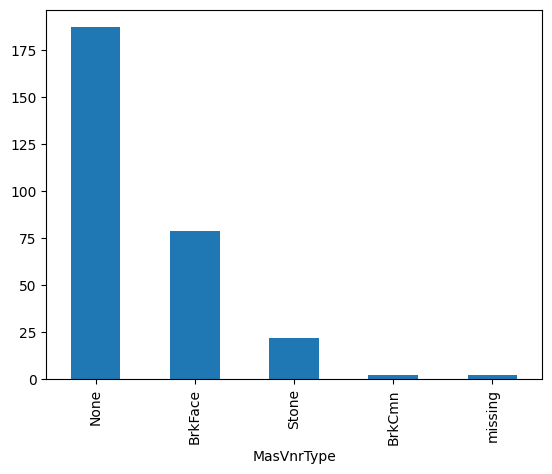

.. _categorical_imputer:

.. currentmodule:: feature_engine.imputation

CategoricalImputer
==================

The :class:`CategoricalImputer()` replaces missing data in categorical variables with an
arbitrary value, like the string 'Missing' or by the most frequent category.

You can indicate which variables to impute passing the variable names in a list, or the
imputer automatically finds and selects all variables of type object and categorical.

Originally, we designed this imputer to work only with categorical variables. From version
1.1.0 we introduced the parameter `ignore_format` to allow the imputer to also impute
numerical variables with this functionality. This is, because in some cases, variables
that are by nature categorical, have numerical values.

Below a code example using the House Prices Dataset (more details about the dataset
:ref:`here <datasets>`).

In this example, we impute 2 variables from the dataset with the string 'Missing', which
is the default functionality of the transformer:

.. code:: python

	import numpy as np
	import pandas as pd
	import matplotlib.pyplot as plt
	from sklearn.model_selection import train_test_split

	from feature_engine.imputation import CategoricalImputer

	# Load dataset
	data = pd.read_csv('houseprice.csv')

	# Separate into train and test sets
	X_train, X_test, y_train, y_test = train_test_split(
    	data.drop(['Id', 'SalePrice'], axis=1), data['SalePrice'], test_size=0.3, random_state=0)

	# set up the imputer
	imputer = CategoricalImputer(variables=['Alley', 'MasVnrType'])

	# fit the imputer
	imputer.fit(X_train)

	# transform the data
	train_t= imputer.transform(X_train)
	test_t= imputer.transform(X_test)

	test_t['MasVnrType'].value_counts().plot.bar()

Note in the plot the presence of the category "Missing" which is added after the imputation:

Additional resources
--------------------

In the following Jupyter notebook you will find more details on the functionality of the
:class:`EndTailImputer()`, including how to select numerical variables automatically.
You will also find demos on how to impute using the maximum value or the interquartile
range proximity rule.

Check also this `Jupyter notebook <https://nbviewer.org/github/feature-engine/feature-engine-examples/blob/main/imputation/CategoricalImputer.ipynb>`_

For more details about this and other feature engineering methods check out these resources:

.. figure::  ../../images/feml.png
   :width: 300
   :figclass: align-center
   :align: left
   :target: https://www.trainindata.com/p/feature-engineering-for-machine-learning

   Feature Engineering for Machine Learning

|
|
|
|
|
|
|
|
|
|

Or read our book:

.. figure::  ../../images/cookbook.png
   :width: 200
   :figclass: align-center
   :align: left
   :target: https://packt.link/0ewSo

   Python Feature Engineering Cookbook

|
|
|
|
|
|
|
|
|
|
|
|
|

Both our book and course are suitable for beginners and more advanced data scientists
alike. By purchasing them you are supporting Sole, the main developer of Feature-engine.