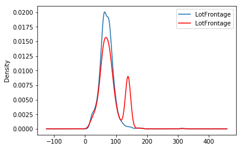

.. _end_tail_imputer:

.. currentmodule:: feature_engine.imputation

EndTailImputer
==============

The :class:`EndTailImputer()` replaces missing data with a value at the end of the distribution.
The value can be determined using the mean plus or minus a number of times the standard
deviation, or using the inter-quartile range proximity rule. The value can also be
determined as a factor of the maximum value.

You decide whether the missing data should be placed at the right or left tail of
the variable distribution.

In a sense, the :class:`EndTailImputer()` **"automates"** the work of the
:class:`ArbitraryNumberImputer()` because it will find automatically "arbitrary values"
far out at the end of the variable distributions.

:class:`EndTailImputer()` works only with numerical variables. You can impute only a
subset of the variables in the data by passing the variable names in a list. Alternatively,
the imputer will automatically select all numerical variables in the train set.

Below a code example using the House Prices Dataset (more details about the dataset
:ref:`here <datasets>`).

First, let's load the data and separate it into train and test:

.. code:: python

	import numpy as np
	import pandas as pd
	import matplotlib.pyplot as plt
	from sklearn.model_selection import train_test_split

	from feature_engine.imputation import EndTailImputer

	# Load dataset
	data = pd.read_csv('houseprice.csv')

	# Separate into train and test sets
	X_train, X_test, y_train, y_test = train_test_split(
                                            data.drop(['Id', 'SalePrice'], axis=1),
                                            data['SalePrice'],
                                            test_size=0.3,
                                            random_state=0,
                                            )

Now we set up the :class:`EndTailImputer()` to impute in this case only 2 variables
from the dataset. We instruct the imputer to find the imputation values using the mean
plus 3 times the standard deviation as follows:

.. code:: python

	# set up the imputer
	tail_imputer = EndTailImputer(imputation_method='gaussian',
                                  tail='right',
                                  fold=3,
                                  variables=['LotFrontage', 'MasVnrArea'])
	# fit the imputer
	tail_imputer.fit(X_train)

With fit, the :class:`EndTailImputer()` learned the imputation values for the indicated
variables and stored it in one of its attributes. We can now go ahead and impute both
the train and the test sets.

.. code:: python

	# transform the data
	train_t= tail_imputer.transform(X_train)
	test_t= tail_imputer.transform(X_test)

Note that after the imputation, if the percentage of missing values is relatively big,
the variable distribution will differ from the original one (in red the imputed
variable):

.. code:: python

	fig = plt.figure()
	ax = fig.add_subplot(111)
	X_train['LotFrontage'].plot(kind='kde', ax=ax)
	train_t['LotFrontage'].plot(kind='kde', ax=ax, color='red')
	lines, labels = ax.get_legend_handles_labels()
	ax.legend(lines, labels, loc='best')

Additional resources
--------------------

In the following Jupyter notebook you will find more details on the functionality of the
:class:`CategoricalImputer()`, including how to select numerical variables automatically,
how to impute with the most frequent category, and how to impute with a used defined
string.

- `Jupyter notebook <https://nbviewer.org/github/feature-engine/feature-engine-examples/blob/main/imputation/EndTailImputer.ipynb>`_

For more details about this and other feature engineering methods check out these resources:

.. figure::  ../../images/feml.png
   :width: 300
   :figclass: align-center
   :align: left
   :target: https://www.trainindata.com/p/feature-engineering-for-machine-learning

   Feature Engineering for Machine Learning

|
|
|
|
|
|
|
|
|
|

Or read our book:

.. figure::  ../../images/cookbook.png
   :width: 200
   :figclass: align-center
   :align: left
   :target: https://www.packtpub.com/en-us/product/python-feature-engineering-cookbook-9781835883587

   Python Feature Engineering Cookbook

|
|
|
|
|
|
|
|
|
|
|
|
|

Both our book and course are suitable for beginners and more advanced data scientists
alike. By purchasing them you are supporting Sole, the main developer of Feature-engine.