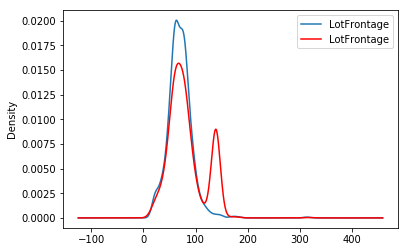

.. _end_tail_imputer:

.. currentmodule:: feature_engine.imputation

EndTailImputer
==============

The :class:`EndTailImputer()` replaces missing data with a value at the end of the distribution.
The value can be determined using the mean plus or minus a number of times the standard
deviation, or using the inter-quartile range proximity rule. The value can also be
determined as a factor of the maximum value.

You decide whether the missing data should be placed at the right or left tail of
the variable distribution.

.. tip::

    The :class:`EndTailImputer()` **"automates"** the work of the
    :class:`ArbitraryNumberImputer()` by automatically finding "arbitrary values"
    far out at the end of the variable distributions.

:class:`EndTailImputer()` works only with numerical variables. You can impute only a
subset of the variables in the data by passing the variable names in a list. Alternatively,
the imputer will automatically select all numerical variables in the train set.

Python implementation
---------------------

Below a code example using the house prices dataset.

First, let's load the data and separate it into train and test:

.. code:: python

    import matplotlib.pyplot as plt
    from sklearn.datasets import fetch_openml
    from sklearn.model_selection import train_test_split

    from feature_engine.imputation import EndTailImputer

    # Load dataset
    X, y = fetch_openml(
        name='house_prices',
        version=1,
        return_X_y=True,
        as_frame=True,
        parser='auto',
    )

    # Separate into train and test sets
    X_train, X_test, y_train, y_test = train_test_split(
        X,
        y,
        test_size=0.3,
        random_state=0,
    )

Now we set up the :class:`EndTailImputer()` to impute only 2 variables
from the dataset. We instruct the imputer to find the imputation values using the mean
plus 3 times the standard deviation as follows:

.. code:: python

    # set up the imputer
    tail_imputer = EndTailImputer(
        imputation_method='gaussian',
        tail='right',
        fold=3,
        variables=['LotFrontage', 'MasVnrArea']
    )

    # fit the imputer
    tail_imputer.fit(X_train)

With fit, the :class:`EndTailImputer()` learned the imputation values for the indicated
variables and stored it in one of its attributes. We can now go ahead and impute both
the train and the test sets.

.. code:: python

	# transform the data
	train_t = tail_imputer.transform(X_train)
	test_t = tail_imputer.transform(X_test)

Note that after the imputation, if the percentage of missing values is relatively large,
the variable distribution will differ from the original one.

Let's create a density plot to observe the change in the distribution:

.. code:: python

	fig = plt.figure()
	ax = fig.add_subplot(111)
	X_train['LotFrontage'].plot(kind='kde', ax=ax)
	train_t['LotFrontage'].plot(kind='kde', ax=ax, color='red')
	lines, labels = ax.get_legend_handles_labels()
	ax.legend(lines, labels, loc='best')

In the following image, we see the distribution of LotFrontage before and after the
imputation (in red the imputed variable):

The second peak corresponds to the missing data, which were replaced with a value at that
side of the distribution.

Additional resources
--------------------

For tutorials about missing data imputation methods check out these resources:

- `Feature Engineering for Machine Learning <https://www.trainindata.com/p/feature-engineering-for-machine-learning>`_, online course.
- `Feature Engineering for Time Series Forecasting <https://www.trainindata.com/p/feature-engineering-for-forecasting>`_, online course.
- `Python Feature Engineering Cookbook <https://www.packtpub.com/en-us/product/python-feature-engineering-cookbook-9781835883587>`_, book.

Both our book and courses are suitable for beginners and more advanced data scientists
alike. By purchasing them you are supporting `Sole <https://linkedin.com/in/soledad-galli>`_,
the main developer of Feature-engine.