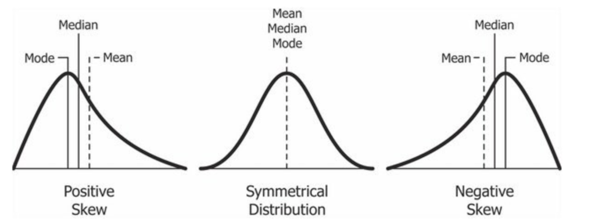
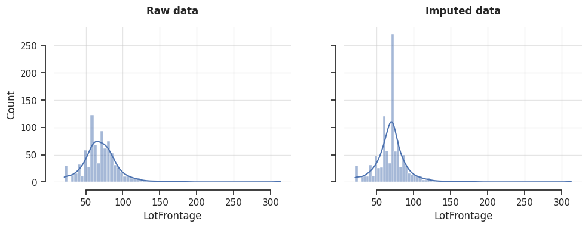

.. _mean_median_imputer:

.. currentmodule:: feature_engine.imputation

MeanMedianImputer
=================

Mean imputation and median imputation consist of replacing missing data in numerical 
variables with the variable's mean or median. These simple univariate missing data 
imputation techniques are among the most commonly used when preparing data for data 
science projects. Take a look, for example, at the winning solution of the KDD 2009 
cup: `Winning the KDD Cup Orange Challenge with Ensemble Selection <http://www.mtome.com/Publications/CiML/CiML-v3-book.pdf>`_. 

Typically, mean imputation and median imputation are done alongside adding missing 
indicators to tell the models that although this observation looks like the majority 
(that is, the mean or the median value), it was actually a missing value.

Mean Imputation vs Median Imputation
------------------------------------

In practice, we use mean imputation or median imputation without giving much thought to 
the distributions of the variables we want to impute. However, it's good to consider 
that the mean is a good estimate of the center of the variable when the variable has a 
symmetrical distribution. Therefore, we'd use mean imputation when the data shows a 
normal distribution, or the distribution is otherwise symmetrical, and median imputation 
when the variables are skewed.

Skewed distributions lead to biased estimates of the mean, making it an inaccurate 
representation of the distribution's center. In contrast, the median is robust to 
skewness. Additionally, the mean is sensitive to outliers, whereas the median remains 
unaffected. Therefore, in skewed distributions, the median is a better estimate of the 
center of mass.

In the following image, we see how the median is moved away from the distribution 
center when the variables have a strong left or right skew:

These details tend to be more important when carrying out statistical analysis, 
and we tend to ignore them when preprocessing data for machine learning. 
However, keep in mind that some regression models and feature selection procedures, 
like ANOVA, make assumptions about the underlying distribution of the data.
You can complement your imputation methods with data analysis to understand how the 
imputation affects the variable's distribution and its relationship with other variables.

Effects on the variable distribution
------------------------------------

Replacing missing values with the mean or median affects the variable's distribution and
its relationships with other variables in the dataset. If there are a few missing
data points, these effects can be negligible. However, if a large percentage of data 
is missing, the impact becomes significant. 

Imputation with the mean or median reduces the variable's variability, such as its 
standard deviation, by adding more data points around the center of the distribution. 
With reduced variability, data points that were not previously considered outliers may 
now be flagged as outliers using simple detection methods like the IQR 
(interquartile range) proximity rule. 

In addition, mean and median imputation distort the relationship—such as correlation 
or covariance—between the imputed variable and other variables in the dataset, 
potentially affecting their relationship with the target variable as well. Hence, 
the outputs of models that rely on conditional joint probability estimates might be 
affected by mean imputation and median imputation, particularly if the percentage of 
missing data is large.

Mean and median imputation are often preferred when training linear regression or 
logistic regression models. In contrast, imputation with arbitrary numbers is commonly 
used with decision tree-based algorithms. When the relationship among the variables is 
crucial, you might want to consider better ways to estimate the missing data, such as 
multiple imputation (aka, multivariate imputation). 

MeanMedianImputer
-----------------

Feature-engine's :class:`MeanMedianImputer()` replaces missing data with the variable's 
mean or median value, determined over the observed values. Hence, it can only impute
numerical variables. You can pass the 
list of variables you want to impute, or alternatively, :class:`MeanMedianImputer()` 
will automatically impute all numerical variables in the training set.

Python implementation
---------------------

In this section, we will explore :class:`MeanMedianImputer()`'s functionality. Let's start by 
importing the required libraries:

.. code:: python

	import seaborn as sns
	import matplotlib.pyplot as plt
	from sklearn.datasets import fetch_openml
	from sklearn.pipeline import make_pipeline
	from sklearn.model_selection import train_test_split
	from feature_engine.imputation import MeanMedianImputer
	from feature_engine.imputation import AddMissingIndicator
	

We'll use the `house prices dataset <https://www.openml.org/search?type=data&status=active&id=42165>`_
from OpenML:

.. code:: python

	# Load dataset
	X, y = fetch_openml(name='house_prices', version=1, return_X_y=True, as_frame=True, parser='auto')	

In the following code chunk, we'll split the dataset into train and test retaining
only three features, and we'll set aside 4 observations with missing data from the test set:

.. code:: python

	target_features = ['Neighborhood','LotFrontage','MasVnrArea']
	X = X[target_features]

	X_train, X_test, y_train, y_test = train_test_split(X, y, test_size=0.3, random_state=42)

	# Select specific houses with missing data from the test set
	target_idx = [113,292,650, 1018]
	X_test_subset = X_test.loc[target_idx]

Let's visualize the subset of the test set with missing values:

.. code:: python

	print(X_test_subset)

In the following output, we see five houses; three of them with missing values for 
either LotFrontage or MasVnrArea:

.. code:: text

		 Neighborhood  LotFrontage  MasVnrArea
	113       Crawfor          NaN       184.0
	292       Edwards         60.0         0.0
	650       Somerst         65.0         NaN
	1018      Gilbert          NaN        76.0

Let's now set up and fit :class:`MeanMedianImputer()` with the strategy to mean, 
so we can impute the variables `LotFrontage` and `MasVnrArea`:

.. code:: python

	# Set up the imputer
	mmi = MeanMedianImputer(
		imputation_method='mean',
		variables=['LotFrontage', 'MasVnrArea']
	)

	# Fit transformer with training data
	mmi.fit(X_train)

It's worth noting that we have the flexibility to omit the `variables` parameter, 
in which case, :class:`MeanMedianImputer()` will automatically find and impute all 
numeric features.

After fitting :class:`MeanMedianImputer()`, we can check out the statistics 
(either mean or median; mean in this scenario) for each of the variables to impute:

.. code:: python

	# Show mean values learned with the training data
	mmi.imputer_dict_

The `imputer_dict_` attribute shows the learned statistics:

.. code:: text

	{'LotFrontage': 70.375, 'MasVnrArea': 105.26104023552503}

This dictionary is used internally to impute the missing values.

Let's transform the subset of the test data with the missing data we previewed earlier:

.. code:: python

	# Transform the subset of the test data
	X_test_subset_t = mmi.transform(X_test_subset)

If we now execute `X_test_subset_t.head()`, we'll see the completed data set, 
containing the imputed values:

.. code:: text

		 Neighborhood  LotFrontage  MasVnrArea
	113       Crawfor       70.375   184.00000
	292       Edwards       60.000     0.00000
	650       Somerst       65.000   105.26104
	1018      Gilbert       70.375    76.00000

Imputing missing values alongside missing indicators
~~~~~~~~~~~~~~~~~~~~~~~~~~~~~~~~~~~~~~~~~~~~~~~~~~~

Mean or median imputation are commonly done alongside adding missing indicators.
We can add missing indicators with :class:`AddMissingIndicator()` from feature-engine.

We can chain :class:`AddMissingIndicator()` with :class:`MeanMedianImputer()` using a 
`scikit-learn pipeline <https://scikit-learn.org/stable/modules/generated/sklearn.pipeline.make_pipeline.html>`_.

For example, let's create an imputer pipeline to add missing indicators and then and 
impute the missing values:

.. code:: python

	# Create imputer pipeline
	imputer = make_pipeline(
		AddMissingIndicator(),
		MeanMedianImputer()
	)

	# Fit the pipeline
	imputer.fit(X_train)

Now, we can transform the data:

.. code:: python

	X_test_subset_t = imputer.transform(X_test_subset)

If we now execute `X_test_subset_t.head()`, we'll see a dataframe where `LotFrontage` 
and `MasVnrArea` are now complete, that is, missing values were replaced with the mean 
of the observed data, and additional columns with the missing indicators:

.. code:: text

		 Neighborhood  LotFrontage  MasVnrArea  LotFrontage_na  MasVnrArea_na
	113       Crawfor         70.0       184.0               1              0
	292       Edwards         60.0         0.0               0              0
	650       Somerst         65.0         0.0               0              1
	1018      Gilbert         70.0        76.0               1              0

The missing indicator columns flag those observations that were originally missing values.

Note that both classes automatically found the numerical variables, as
we haven't specified the `variables` parameter.

Distribution change after imputation
~~~~~~~~~~~~~~~~~~~~~~~~~~~~~~~~~~~~

Let's analyze how the imputation might change the distribution of the variables.

First, let's see how much missing data we have for LotFrontage in the training data:

.. code:: python

	X_train.LotFrontage.isnull().mean().round(2)

As a result, we can see nearly 19% of missing data:

.. code:: text

	0.19

In the following code, we'll create a plot with the raw variable distribution on the 
left panel and the distribution after imputation on the right panel:

.. code:: python

	# Customize plot
	sns.set(style="ticks")
	plt.rcParams['axes.grid'] = True
	plt.rcParams['grid.alpha'] = 0.5

	# Create figure
	fig,axes = plt.subplots(ncols=2, figsize=(10,4), sharex=True, sharey=True)

	# Plot histogram with KDE for the original data
	sns.histplot(data=X_train, x='LotFrontage', kde=True, ax=axes[0])
	axes[0].set_title('Original', weight='bold', y=1.05)

	# Plot histogram with KDE for the transformed data
	sns.histplot(data=mmi.transform(X_train), x='LotFrontage', kde=True, ax=axes[1])
	axes[1].set_title('Imputed', weight='bold', y=1.05)

	# Further customize plot
	sns.despine(offset=10, trim=True)
	plt.tight_layout(w_pad=4)

	plt.show()

After the imputation, we see on the right panel that more observations are now at the 
center of the distribution:

Because of the increase in the number of observations at the center, the variance of 
the variable decreases, and the kurtosis coefficient increases.

Additional resources
--------------------

In the following python Jupyter notebook you will find more details on the functionality
of the :class:`MeanMedianImputer()`, including how to select numerical variables
automatically. You will also see how to navigate the different attributes of the 
transformer to find the mean or median values of the variables.

- `Jupyter notebook <https://nbviewer.org/github/feature-engine/feature-engine-examples/blob/main/imputation/MeanMedianImputer.ipynb>`_

For more details about this and other feature engineering methods check out
these resources:

.. figure::  ../../images/feml.png
   :width: 300
   :figclass: align-center
   :align: left
   :target: https://www.trainindata.com/p/feature-engineering-for-machine-learning

   Feature Engineering for Machine Learning

|
|
|
|
|
|
|
|
|
|

Or read our book:

.. figure::  ../../images/cookbook.png
   :width: 200
   :figclass: align-center
   :align: left
   :target: https://packt.link/0ewSo

   Python Feature Engineering Cookbook

|
|
|
|
|
|
|
|
|
|
|
|
|

Both our book and course are suitable for beginners and more advanced data scientists
alike. By purchasing them you are supporting Sole, the main developer of Feature-engine.