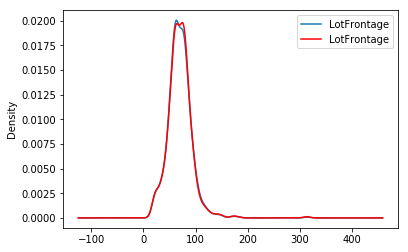

.. _random_sample_imputer:

.. currentmodule:: feature_engine.imputation

RandomSampleImputer
===================

The :class:`RandomSampleImputer()` replaces missing data with a random sample extracted from the
variable. It works with both numerical and categorical variables. A list of variables
can be indicated, or the imputer will automatically select all variables in the train
set.

**Note**

The random samples used to replace missing values may vary from execution to
execution. This may affect the results of your work. Thus, it is advisable to set a
seed.

Setting the seed
----------------

There are 2 ways in which the seed can be set in the :class:`RandomSampleImputer()`:

If `seed = 'general'` then the random_state can be either `None` or an integer.
The `random_state` then provides the seed to use in the imputation. All observations will
be imputed in one go with a single seed. This is equivalent to
`pandas.sample(n, random_state=seed)` where `n` is the number of observations with
missing data and `seed` is the number you entered in the `random_state`.

If `seed = 'observation'`, then the random_state should be a variable name
or a list of variable names. The seed will be calculated observation per
observation, either by adding or multiplying the values of the variables
indicated in the `random_state`. Then, a value will be extracted from the train set
using that seed and used to replace the NAN in that particular observation. This is the
equivalent of `pandas.sample(1, random_state=var1+var2)` if the `seeding_method` is
set to `add` or `pandas.sample(1, random_state=var1*var2)` if the `seeding_method`
is set to `multiply`.

For example, if the observation shows variables color: np.nan, height: 152, weight:52,
and we set the imputer as:

.. code:: python

	RandomSampleImputer(random_state=['height', 'weight'],
                                  seed='observation',
                                  seeding_method='add'))

the np.nan in the variable colour will be replaced using pandas sample as follows:

.. code:: python

	observation.sample(1, random_state=int(152+52))

For more details on why this functionality is important refer to the course
`Feature Engineering for Machine Learning <https://www.udemy.com/feature-engineering-for-machine-learning/>`_.

You can also find more details about this imputation in the following
`notebook <https://github.com/solegalli/feature-engineering-for-machine-learning/blob/master/Section-04-Missing-Data-Imputation/04.07-Random-Sample-Imputation.ipynb>`_.

Note, if the variables indicated in the `random_state` list are not numerical
the imputer will return an error. In addition, the variables indicated as seed
should not contain missing values themselves.

Important for GDPR
------------------

This estimator stores a copy of the training set when the `fit()` method is
called. Therefore, the object can become quite heavy. Also, it may not be GDPR
compliant if your training data set contains Personal Information. Please check
if this behaviour is allowed within your organisation.

Below a code example using the House Prices Dataset (more details about the dataset
:ref:`here <datasets>`).

First, let's load the data and separate it into train and test:

.. code:: python

	import numpy as np
	import pandas as pd
	import matplotlib.pyplot as plt
	from sklearn.model_selection import train_test_split

	from feature_engine.imputation import RandomSampleImputer

	# Load dataset
	data = pd.read_csv('houseprice.csv')

	# Separate into train and test sets
	X_train, X_test, y_train, y_test = train_test_split(
            data.drop(['Id', 'SalePrice'], axis=1),
            data['SalePrice'],
            test_size=0.3,
            random_state=0
        )

In this example, we sample values at random, observation per observation, using as seed
the value of the variable 'MSSubClass' plus the value of the variable 'YrSold'. Note
that this value might be different for each observation.

The :class:`RandomSampleImputer()` will impute all variables in the data, as we left the
default value of the parameter `variables` to `None`.

.. code:: python

	# set up the imputer
	imputer = RandomSampleImputer(
                random_state=['MSSubClass', 'YrSold'],
                seed='observation',
                seeding_method='add'
            )

	# fit the imputer
	imputer.fit(X_train)

With `fit()` the imputer stored a copy of the X_train. And with transform, it will extract
values at random from this X_train to replace NA in the datasets indicated in the `transform()`
methods.

.. code:: python

	# transform the data
	train_t = imputer.transform(X_train)
	test_t = imputer.transform(X_test)

The beauty of the random sampler is that it preserves the original variable distribution:

.. code:: python

	fig = plt.figure()
	ax = fig.add_subplot(111)
	X_train['LotFrontage'].plot(kind='kde', ax=ax)
	train_t['LotFrontage'].plot(kind='kde', ax=ax, color='red')
	lines, labels = ax.get_legend_handles_labels()
	ax.legend(lines, labels, loc='best')

Additional resources
--------------------

In the following Jupyter notebook you will find more details on the functionality of the
:class:`RandomSampleImputer()`, including how to set the different types of seeds.

- `Jupyter notebook <https://nbviewer.org/github/feature-engine/feature-engine-examples/blob/main/imputation/RandomSampleImputer.ipynb>`_

All Feature-engine notebooks can be found in a `dedicated repository <https://github.com/feature-engine/feature-engine-examples>`_.

And finally, there is also a lot of information about this and other imputation techniques
in this online course:

.. figure::  ../../images/feml.png
   :width: 300
   :figclass: align-center
   :align: left
   :target: https://www.trainindata.com/p/feature-engineering-for-machine-learning

   Feature Engineering for Machine Learning

|
|
|
|
|
|
|
|
|
|

Or read our book:

.. figure::  ../../images/cookbook.png
   :width: 200
   :figclass: align-center
   :align: left
   :target: https://www.packtpub.com/en-us/product/python-feature-engineering-cookbook-9781835883587

   Python Feature Engineering Cookbook

|
|
|
|
|
|
|
|
|
|
|
|
|

Both our book and course are suitable for beginners and more advanced data scientists
alike. By purchasing them you are supporting Sole, the main developer of Feature-engine.