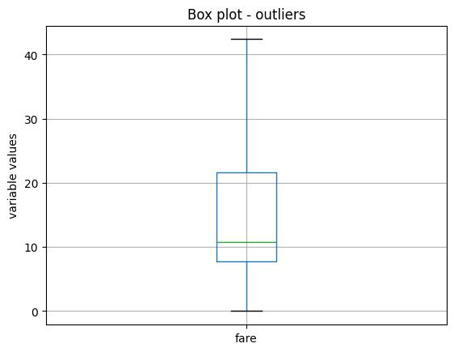

.. _outlier_trimmer:

.. currentmodule:: feature_engine.outliers

OutlierTrimmer
===============

Outliers are data points that significantly deviate from the rest of the dataset, potentially indicating errors or rare
occurrences. Outliers can distort the learning process of machine learning models by skewing parameter estimates and
reducing predictive accuracy. To prevent this, if you suspect that the outliers are errors or rare occurrences, you can
remove them from the training data.

In this guide, we show how to remove outliers in Python using the :class:`OutlierTrimmer()`.

The first step to removing outliers consists of identifying those outliers. Outliers can be identified through various
statistical methods, such as box plots, z-scores, the interquartile range (IQR), or the median absolute deviation.
Additionally, visual inspection of the data using scatter plots or histograms is common practice in data science, and
can help detect observations that significantly deviate from the overall pattern of the dataset.

The :class:`OutlierTrimmer()` can identify outliers by using all of these methods and then remove them automatically.
Hence, we’ll begin this guide with data analysis, showing how we can identify outliers through these statistical methods
and boxplots, and then we will remove outliers by using the :class:`OutlierTrimmer()`.

Identifying outliers
--------------------

Outliers are data points that are usually far greater, or far smaller than some value that determines where most of the
values in the distribution lie. These minimum and maximum values, that delimit the data distribution, can be calculated
in 4 ways: by using the z-score if the variable is normally distributed, by using the interquartile range proximity rule
or the median absolute deviation if the variables are skewed, or by using percentiles.

Gaussian limits or z-score
~~~~~~~~~~~~~~~~~~~~~~~~~~

If the variable shows a normal distribution, most of its values lie between the mean minus 3 times the standard deviation
and the mean plus 3 times the standard deviation. Hence, we can determine the limits of the distribution as follows:

- right tail (upper_bound): mean + 3* std
- left tail (lower_bound): mean - 3* std

We can consider outliers those data points that lie beyond these limits.

Interquartile range proximity rule
~~~~~~~~~~~~~~~~~~~~~~~~~~~~~~~~~~

The interquartile range proximity rule can be used to detect outliers both in variables that show a normal distribution
and in variables with a skew. When using the IQR, we detect outliers as those values that lie before the 25th percentile
times a factor of the IQR, or after the 75th percentile times a factor of the IQR. This factor is normally 1.5, or 3 if
we want to be more stringent. With the IQR method, the limits are calculated as follows:

IQR limits:

- right tail (upper_limit): 75th quantile + 1.5* IQR
- left tail (lower_limit):  25th quantile - 1.5* IQR

where IQR is the inter-quartile range:

- IQR = 75th quantile - 25th quantile = third quartile - first quartile.

Observations found beyond those limits can be considered extreme values.

Maximum absolute deviation
~~~~~~~~~~~~~~~~~~~~~~~~~~

Parameters like the mean and the standard deviation are strongly affected by the presence of outliers. Therefore, it
might be a better solution to use a metric that is robust against outliers, like the median absolute deviation from the
median, commonly shortened to the median absolute deviation (MAD), to delimit the normal data distribution.

When we use MAD, we determine the limits of the distribution as follows:

MAD limits:

- right tail (upper_limit): median + 3.29* MAD
- left tail (lower_limit):  median - 3.29* MAD

MAD is the median absolute deviation from the median. In other words, MAD is the median value of the absolute difference
between each observation and its median.

- MAD = median(abs(X-median(X)))

Percentiles
~~~~~~~~~~~

A simpler way to determine the values that delimit the data distribution is by using percentiles. Like this, outlier
values would be those that lie before or after a certain percentile or quantiles:

- right tail: 95th percentile
- left tail:  5th percentile

The number of outliers identified by any of these methods will vary. These methods detect outliers, but they can’t
decide if they are true outliers or faithful data points. That required further examination and domain knowledge.

Let’s move on to removing outliers in Python.

Remove outliers in Python
-------------------------

In this demo, we'll identify and remove outliers from the Titanic Dataset. First, let's load the data and separate it
into train and test:

.. code:: python

    from sklearn.model_selection import train_test_split
    from feature_engine.datasets import load_titanic
    from feature_engine.outliers import OutlierTrimmer

    X, y = load_titanic(
        return_X_y_frame=True,
        predictors_only=True,
        handle_missing=True,
    )

    X_train, X_test, y_train, y_test = train_test_split(
        X, y, test_size=0.3, random_state=0,
    )

    print(X_train.head())

We see the resulting pandas dataframe below:

.. code:: python

          pclass     sex        age  sibsp  parch     fare    cabin embarked
    501        2  female  13.000000      0      1  19.5000  Missing        S
    588        2  female   4.000000      1      1  23.0000  Missing        S
    402        2  female  30.000000      1      0  13.8583  Missing        C
    1193       3    male  29.881135      0      0   7.7250  Missing        Q
    686        3  female  22.000000      0      0   7.7250  Missing        Q

Identifying outliers
~~~~~~~~~~~~~~~~~~~~

Let's now identify potential extreme values in the training set by using boxplots.

.. code:: python

    X_train.boxplot(column=['age', 'fare', 'sibsp'])
    plt.title("Box plot - outliers")
    plt.ylabel("variable values")
    plt.show()

In the following boxplots, we see that all three variables have data points that are significantly greater than the
majority of the data distribution. The variable age also shows outlier values towards the lower values.

The variables have different scales, so let's plot them individually for better visualization. Let's start by making a
boxplot of the variable fare:

.. code:: python

    X_train.boxplot(column=['fare'])
    plt.title("Box plot - outliers")
    plt.ylabel("variable values")
    plt.show()

We see the boxplot in the following image:

.. figure::  ../../images/boxplot-fare.png
   :align:   center

Next, we plot the variable age:

.. code:: python

    X_train.boxplot(column=['age'])
    plt.title("Box plot - outliers")
    plt.ylabel("variable values")
    plt.show()

We see the boxplot in the following image:

And finally, we make a boxplot of the variable sibsp:

.. code:: python

    X_train.boxplot(column=['sibsp'])
    plt.title("Box plot - outliers")
    plt.ylabel("variable values")
    plt.show()

We see the boxplot and the outlier values in the following image:

Outlier removal
~~~~~~~~~~~~~~~

Now, we will use the :class:`OutlierTrimmer()` to remove outliers. We'll start by using the IQR as outlier detection
method.

IQR
^^^

We want to remove outliers at the right side of the distribution only (param `tail`). We want the maximum values to be
determined using the 75th quantile of the variable (param `capping_method`) plus 1.5 times the IQR (param `fold`). And
we only want to cap outliers in 2 variables, which we indicate in a list.

.. code:: python

    ot = OutlierTrimmer(capping_method='iqr',
                        tail='right',
                        fold=1.5,
                        variables=['sibsp', 'fare'],
                        )

    ot.fit(X_train)

With `fit()`, the :class:`OutlierTrimmer()` finds the values at which it should cap the variables. These values are
stored in one of its attributes:

.. code:: python

    ot.right_tail_caps_

.. code:: python

   {'sibsp': 2.5, 'fare': 66.34379999999999}

We can now go ahead and remove the outliers:

.. code:: python

    train_t = ot.transform(X_train)
    test_t = ot.transform(X_test)

We can compare the sizes of the original and transformed datasets to check that the outliers were removed:

.. code:: python

    X_train.shape, train_t.shape

We see that the transformed dataset contains less rows:

.. code:: python

    ((916, 8), (764, 8))

If we evaluate now the maximum of the variables in the transformed datasets, they should be <= the values observed in
the attribute `right_tail_caps_`:

.. code:: python

    train_t[['fare', 'age']].max()

.. code:: python

    fare    65.0
    age     53.0
    dtype: float64

Finally, we can check the boxplots of the transformed variables to corroborate the effect on their distribution.

.. code:: python

    train_t.boxplot(column=['sibsp', "fare"])
    plt.title("Box plot - outliers")
    plt.ylabel("variable values")
    plt.show()

We see the boxplot and the `sibsp` does no longer have outliers, but as `fare` was very skewed, when removing outliers,
the parameters of the IQR change, and we continue to see outliers:

We'll come back to this later, but now let's continue showing the functionality of the :class:`OutlierTrimmer()`.

When we remove outliers from the datasets, we then need to re-align the target variables. We can do this with pandas
loc. But the :class:`OutlierTrimmer()` can do that automatically as follows:

.. code:: python

    train_t, y_train_t = ot.transform_x_y(X_train, y_train)
    test_t, y_test_t = ot.transform_x_y(X_test, y_test)

The method `transform_x_y` will remove outliers from the predictor datasets and then align the target variable. That
means, it will remove from the target those rows corresponding to the outlier values.

We can corroborate the size adjustment in the target as follows:

.. code:: python

    y_train.shape, y_train_t.shape,

The previous command returns the following output:

.. code:: python

    ((916,), (764,))

We can obtain the names of the fetaures in the transformed dataset as follows:

.. code:: python

    ot.get_feature_names_out()

That returns the following variable namesL

.. code:: python

    ['pclass', 'sex', 'age', 'sibsp', 'parch', 'fare', 'cabin', 'embarked']

MAD
^^^

We saw that the IQR did not work amazingly for the variable fare, because its skew is too big. So let's remove outliers
by using the MAD instead:

.. code:: python

    ot = OutlierTrimmer(capping_method='mad',
                        tail='right',
                        fold=3,
                        variables=['fare'],
                        )

    ot.fit(X_train)

    train_t, y_train_t = ot.transform_x_y(X_train, y_train)
    test_t, y_test_t = ot.transform_x_y(X_test, y_test)

    train_t.boxplot(column=["fare"])
    plt.title("Box plot - outliers")
    plt.ylabel("variable values")
    plt.show()

In the following image, we see that after this transformation, the variable fare no longer shows outlier values:

Z-score
^^^^^^^

The variable age is more homogeneously distributed across its value range, so let's use the z-score or gaussian
approximation to detect outliers. We saw in the boxplot that it has outliers at both ends, so we'll cap both ends of the
distribution:

.. code:: python

    ot_age = OutlierTrimmer(capping_method='gaussian',
                        tail="both",
                        fold=3,
                        variables=['age'],
                        )

    ot_age.fit(X_train)

Let's inspect the maximum values beyond which data points will be considered outliers:

.. code:: python

    ot_age.right_tail_caps_

.. code:: python

    {'age': 67.73951212364803}

And the lower values beyond which data points will be considered outliers:

.. code:: python

    ot_age.left_tail_caps_

.. code:: python

    {'age': -7.410476010820627}

The minimum value does not make sense, because age can't be negative. So, we'll try capping this variable with
percentiles instead.

Percentiles
^^^^^^^^^^^

We'll cap age at the bottom 5 and top 95 percentile:

.. code:: python

    ot = OutlierTrimmer(capping_method='mad',
                        tail='right',
                        fold=0.05,
                        variables=['fare'],
                        )

    ot.fit(X_train)

Let's inspect the maximum values beyond which data points will be considered outliers:

.. code:: python

    ot_age.right_tail_caps_

.. code:: python

    {'age': 54.0}

And the lower values beyond which data points will be considered outliers:

.. code:: python

    ot_age.left_tail_caps_

.. code:: python

    {'age': 9.0}

Let's tranform the dataset and target:

.. code:: python

    train_t, y_train_t = ot_age.transform_x_y(X_train, y_train)
    test_t, y_test_t = ot_age.transform_x_y(X_test, y_test)

And plot the resulting variable:

.. code:: python

    train_t.boxplot(column=['age'])
    plt.title("Box plot - outliers")
    plt.ylabel("variable values")
    plt.show()

In the following image, we see that after this transformation, the variable age still shows some outlier values towards
its higher values, so we should be more stringent with the percentiles or use MAD:

Pipeline
--------

The :class:`OutlierTrimmer()` removes observations from the predictor data sets. If we want to use this transformer
within a Pipeline, we can't use Scikit-learn's pipeline because it can't readjust the target. But we can use
Feature-engine's pipeline instead.

Let's start by creating a pipeline that removes outliers and then encodes categorical variables:

.. code:: python

    from feature_engine.encoding import OneHotEncoder
    from feature_engine.pipeline import Pipeline

    pipe = Pipeline(
        [
            ("outliers", ot),
            ("enc", OneHotEncoder()),
        ]
    )

    pipe.fit(X_train, y_train)

The `transform` method will transform only the dataset with the predictors, just like scikit-learn's pipeline:

.. code:: python

    train_t = pipe.transform(X_train)

    X_train.shape, train_t.shape

We see the adjusted data size compared to the original size here:

.. code:: python

   ((916, 8), (736, 76))

Feature-engine's pipeline can also adjust the target:

.. code:: python

    train_t, y_train_t = pipe.transform_x_y(X_train, y_train)

    y_train.shape, y_train_t.shape

We see the adjusted data size compared to the original size here:

.. code:: python

    ((916,), (736,))

To wrap up, let's add a machine learning algorithm to the pipeline. We'll use logistic regression to predict survival:

.. code:: python

    from sklearn.linear_model import LogisticRegression

    pipe = Pipeline(
        [
            ("outliers", ot),
            ("enc", OneHotEncoder()),
            ("logit", LogisticRegression(random_state=10)),
        ]
    )

    pipe.fit(X_train, y_train)

Now, we can predict survival:

.. code:: python

    preds = pipe.predict(X_train)

    preds[0:10]

We see the following output:

.. code:: python

    array([1, 1, 1, 0, 1, 0, 1, 1, 0, 1], dtype=int64)

We can obtain the probability of survival:

.. code:: python

    preds = pipe.predict_proba(X_train)

    preds[0:10]

We see the following output:

.. code:: python

    array([[0.13027536, 0.86972464],
           [0.14982143, 0.85017857],
           [0.2783799 , 0.7216201 ],
           [0.86907159, 0.13092841],
           [0.31794531, 0.68205469],
           [0.86905145, 0.13094855],
           [0.1396715 , 0.8603285 ],
           [0.48403632, 0.51596368],
           [0.6299007 , 0.3700993 ],
           [0.49712853, 0.50287147]])

We can obtain the accuracy of the predictions over the test set:

.. code:: python

    pipe.score(X_test, y_test)

That returns the following accuracy:

.. code:: python

    0.7823343848580442

We can obtain the names of the features after the trasnformation:

.. code:: python

    pipe[:-1].get_feature_names_out()

That returns the following names:

.. code:: python

    ['pclass',
     'age',
     'sibsp',
     'parch',
     'fare',
     'sex_female',
     'sex_male',
     'cabin_Missing',
    ...

And finally, we can obtain the transformed dataset and target as follows:

.. code:: python

    X_test_t, y_test_t = pipe[:-1].transform_x_y(X_test, y_test)

    X_test.shape, X_test_t.shape

We see the resulting sizes here:

.. code:: python

    ((393, 8), (317, 76))

Setting up the stringency (param `fold`)
----------------------------------------

By default, :class:`OutlierTrimmer()` automatically determines the parameter fold based
on the chosen `capping_method`. This parameter determines the multiplier for standard
deviation, interquartile range (IQR), or Median Absolute Deviation (MAD), or
sets the percentile at which to cap the variables.

The default values for fold are as follows:

- 'gaussian': `fold` is set to 3.0;
- 'iqr': `fold` is set to 1.5;
- 'mad': `fold` is set to 3.29;
- 'percentiles': `fold` is set to 0.05.

You can manually adjust the fold value to make the outlier detection process more or less
conservative, thus customizing the extent of outlier trimming.

Tutorials, books and courses
----------------------------

In the following Jupyter notebook, in our accompanying Github repository, you will find more examples using
:class:`OutlierTrimmer()`.

- `Jupyter notebook <https://nbviewer.org/github/feature-engine/feature-engine-examples/blob/main/outliers/OutlierTrimmer.ipynb>`_

For tutorials about this and other feature engineering methods check out our online course:

.. figure::  ../../images/feml.png
   :width: 300
   :figclass: align-center
   :align: left
   :target: https://www.trainindata.com/p/feature-engineering-for-machine-learning

   Feature Engineering for Machine Learning

|
|
|
|
|
|
|
|
|
|

Or read our book:

.. figure::  ../../images/cookbook.png
   :width: 200
   :figclass: align-center
   :align: left
   :target: https://www.packtpub.com/en-us/product/python-feature-engineering-cookbook-9781835883587

   Python Feature Engineering Cookbook

|
|
|
|
|
|
|
|
|
|
|
|
|

Both our book and course are suitable for beginners and more advanced data scientists
alike. By purchasing them you are supporting Sole, the main developer of Feature-engine.