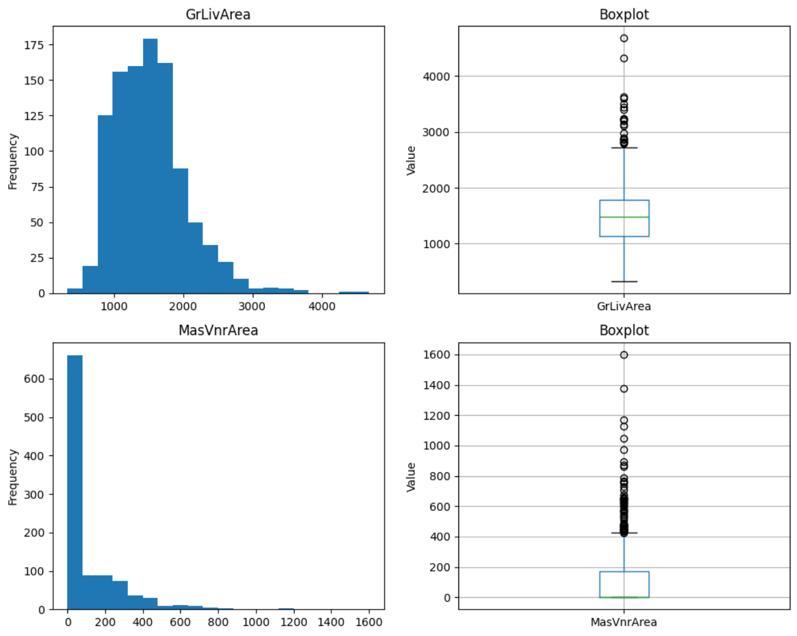
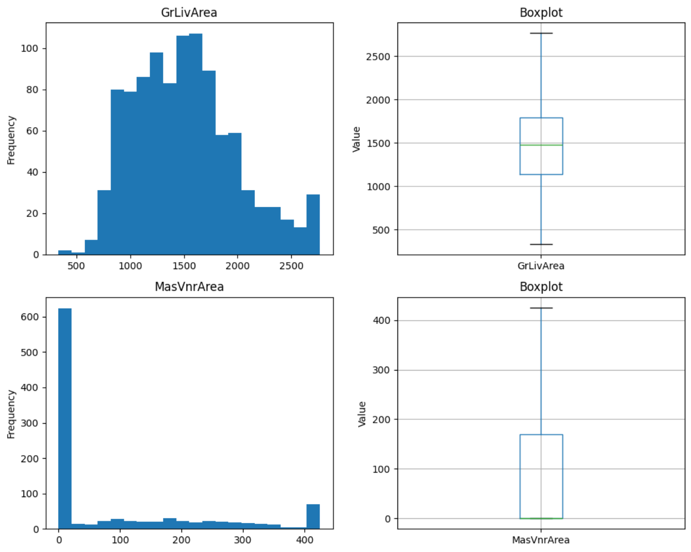
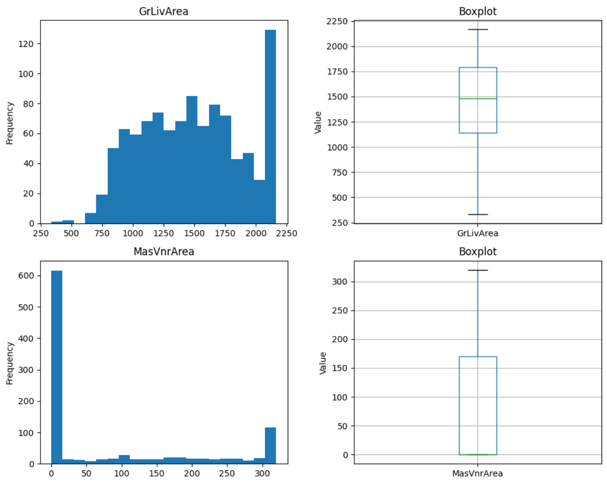

.. _winsorizer:

.. currentmodule:: feature_engine.outliers

Winsorizer
==========

Outliers are data points that significantly differ from the majority of the observations
of the variable. They can be a natural occurrence, or they can be collection errors.

Importantly, outliers can affect the learning process of some machine learning algorithms
by skewing parameter estimates, hence reducing predictive accuracy.

If you suspect the presence of outliers in your variables and are training models or conducting
statistical analyses that are susceptible to outliers, then, you can remove the outliers from
the data.

Outliers can be directly removed (check out :ref:`OutlierTrimmer() <outlier_trimmer>`),
or alternatively, the variable values can be capped at arbitrarily defined minimum and
maximum values.

.. note::

    :class:`Winsorizer()` caps maximum and/or minimum values of a variable at automatically
    determined values.

Calculating the capping values
------------------------------

The minimum and maximum values can be calculated in 4 different ways:

Gaussian limits or z-score
~~~~~~~~~~~~~~~~~~~~~~~~~~

- right tail: mean + 3* std
- left tail: mean - 3* std

Interquartile range proximity rule
~~~~~~~~~~~~~~~~~~~~~~~~~~~~~~~~~~

- right tail: 75th quantile + 1.5* IQR
- left tail:  25th quantile - 1.5* IQR

where IQR is the inter-quartile range: 75th quantile - 25th quantile.

Maximum absolute deviation
~~~~~~~~~~~~~~~~~~~~~~~~~~

- right tail: median + 3.29* MAD
- left tail:  median - 3.29* MAD

where MAD is the median absolute deviation from the median.

- MAD = median(abs(X-median(X)))

Percentiles or quantiles
~~~~~~~~~~~~~~~~~~~~~~~~

- right tail: 95th percentile
- left tail:  5th percentile

.. note::

    The factor that multiplies the `std`, `IQR`, or `MAD`, as well as the percentiles to
    use to find the capping values can be changed to make the capping more or less stringent.
    The values used by default by :class:`Winsorizer()` are those suggested as optimal
    in statistical studies.

Python implementation
---------------------

In this section, we'll show how to cap variables using :class:`Winsorizer()`.

We'll use the house prices dataset. Let's load the data and separate
it into train and test:

.. code:: python

    import matplotlib.pyplot as plt
    from sklearn.datasets import fetch_openml
    from sklearn.model_selection import train_test_split

    # Load dataset
    data = fetch_openml(
        name='house_prices',
        version=1,
        as_frame=True,
        parser='auto',
    ).frame

    # Separate into train and test sets
    X_train, X_test, y_train, y_test =  train_test_split(
        data.drop(['Id', 'SalePrice'], axis=1),
        data['SalePrice'],
        test_size=0.3,
        random_state=0,
    )

    print(X_train.head())

We see the resulting training set below:

.. code:: python

          MSSubClass MSZoning  LotFrontage  LotArea Street Alley LotShape  \
    64            60       RL          NaN     9375   Pave   NaN      Reg
    682          120       RL          NaN     2887   Pave   NaN      Reg
    960           20       RL         50.0     7207   Pave   NaN      IR1
    1384          50       RL         60.0     9060   Pave   NaN      Reg
    1100          30       RL         60.0     8400   Pave   NaN      Reg

         LandContour Utilities LotConfig  ... ScreenPorch PoolArea PoolQC  Fence  \
    64           Lvl    AllPub    Inside  ...           0        0    NaN  GdPrv
    682          HLS    AllPub    Inside  ...           0        0    NaN    NaN
    960          Lvl    AllPub    Inside  ...           0        0    NaN    NaN
    1384         Lvl    AllPub    Inside  ...           0        0    NaN  MnPrv
    1100         Bnk    AllPub    Inside  ...           0        0    NaN    NaN

         MiscFeature MiscVal  MoSold  YrSold  SaleType  SaleCondition
    64           NaN       0       2    2009        WD         Normal
    682          NaN       0      11    2008        WD         Normal
    960          NaN       0       2    2010        WD         Normal
    1384         NaN       0      10    2009        WD         Normal
    1100         NaN       0       1    2009        WD         Normal

    [5 rows x 79 columns]

Let's create a function to plot the histogram of 2 variables, `GrLivArea` and `MasVnrArea`
next to their respective boxplots:

.. code:: python

    def plot_distributions(df):
        fig, axes = plt.subplots(ncols=2, nrows=2, figsize=(10,8))

        # Histogram var 1
        df['GrLivArea'].plot.hist(bins=20, ax=axes[0,0])
        axes[0,0].set_title('GrLivArea')

        # Boxplot var 1
        df.boxplot(column=['GrLivArea'], ax=axes[0,1])
        axes[0,1].set_title('Boxplot')
        axes[0,1].set_ylabel("Value")

        # Histogram var 2
        df['MasVnrArea'].plot.hist(bins=20, ax=axes[1,0])
        axes[1,0].set_title('MasVnrArea')

        # Boxplot var 2
        df.boxplot(column=['MasVnrArea'], ax=axes[1,1])
        axes[1,1].set_title('Boxplot')
        axes[1,1].set_ylabel("Value")
        plt.tight_layout(w_pad=2)

        plt.tight_layout(w_pad=2)
        plt.show()

Let's now test the function using the training set:

.. code:: python

    plot_distributions(X_train)

In the following image, we see the histogram of the 2 variables followed by their respective
box plots:

We observe that both variables are right skewed and also that they seem to have outliers
(see dots beyond the top whiskers in the boxplot).

.. tip::

    The methods to determine outliers highlight observations that deviate from the variable's
    expected distributions, but they can't unequivocally confirm if they are true outliers or
    mere rare occurrences. Determining true outliers requires domain knowledge and further data exploration.

We will set :class:`Winsorizer()` to cap outliers in the previous variables at the right
side of the distribution (param `tail`'s default functionality). We want the maximum
values to be determined using the interquartile range proximity rule (param `capping_method`)
using 1.5 of the IQR to find those limits (param `fold`).

.. note::

    One of the variables contains NAN, hence, we impute the dataframe before finding outliers.

.. code:: python

    from feature_engine.imputation import MeanMedianImputer
    from feature_engine.pipeline import Pipeline
    from feature_engine.outliers import Winsorizer

    w = Winsorizer(
        capping_method="iqr",
        fold=1.5,
        variables=['GrLivArea', 'MasVnrArea'],
    )

    pipe = Pipeline([
        ("imputer", MeanMedianImputer()),
        ("outlier", w),
    ])

    # fit the transformer
    train_t = pipe.fit_transform(X_train)
    test_t = pipe.transform(X_test)

In the previous code, we created a pipeline that first imputes variables with their mean
and then caps the variables `'GrLivArea'` and `'MasVnrArea'` at a maximum value determined
using the IQR proximity rule.

With `fit()`, :class:`Winsorizer()` finds the values at which it should cap the variables.
These values are stored in the following attribute:

.. code:: python

    pipe.named_steps["outlier"].right_tail_caps_

Below, we see the maximum values for each variable:

.. code:: python

    {'GrLivArea': 2764.625, 'MasVnrArea': 425.0}

:class:`Winsorizer()` has also a  `right_tail_caps_` attribute, which in this case should
be empty. Let's check that out:

.. code:: python

	pipe.named_steps["outlier"].left_tail_caps_

Below, we see that the dictionary is empty:

.. code:: python

    {}
    
Let's now plot the histogram and boxplot of the transformed variables with the function
we created previously:

.. code:: python

    plot_distributions(train_t)

In the following image, we see the histogram of the 2 variables followed by their respective
box plots after capping their maximum values:

We observe in the previous image that the variables no longer have outliers (no dots beyond
the whiskers of the boxplot). We also see more observations placed at the right end of the
distribution (rightmost bin in the histograms).

As an alternative, let's cap the variables at their 10th percentile on the right tail:

.. code:: python

    w = Winsorizer(
        capping_method="quantiles",
        tail = "right",
        fold = 0.1,
        variables=['GrLivArea', 'MasVnrArea'],
    )

    pipe = Pipeline([
        ("imputer", MeanMedianImputer()),
        ("outlier", w),
    ])

    # fit the transformer
    train_t = pipe.fit_transform(X_train)
    test_t = pipe.fit_transform(X_test)

Let's now go ahead and plot the distributions of the transformed variables:

.. code:: python

    plot_distributions(train_t)

In the following image, we see the histogram of the 2 variables followed by their respective
box plots after capping their maximum values:

We observe again that the variables have no outliers.

We can inspect the maximum values determined with this method:

.. code:: python

    pipe.named_steps["outlier"].right_tail_caps_

Below, we see the maximum values for each variable:

.. code:: python

    {'GrLivArea': 2146.7000000000003, 'MasVnrArea': 340.6}

.. tip::

    The methods used to determine the capping values will return different results. For
    variables that are normally distributed, the z-score is a good choice. For skewed variables
    any of the other methods are better suited. Keep in mind, however, that if the variable
    is too skewed, calculating some of the parameters of the IQR or MAD methods will not be
    possible and the transformer will raise an error. In those cases, use the percentiles instead.

Setting up the stringency (param `fold`)
----------------------------------------

By default, :class:`Winsorizer()` automatically determines the parameter `fold` based
on the chosen `capping_method`. This parameter determines the multiplier for standard
deviation, interquartile range (IQR), or Median Absolute Deviation (MAD), or
sets the percentile at which to cap the variables.

The default values for fold are as follows:

- 'gaussian': `fold` is set to 3.0;
- 'iqr': `fold` is set to 1.5;
- 'mad': `fold` is set to 3.29;
- 'quantiles': `fold` is set to 0.05.

You can manually adjust the `fold` value to make the outlier detection process more or less
conservative, thus customising the extent of outlier capping.

Additional resources
--------------------

For more details about this and other feature engineering methods check out these resources:

- `Feature Engineering for Machine Learning <https://www.trainindata.com/p/feature-engineering-for-machine-learning>`_, online course.
- `Feature Engineering for Time Series Forecasting <https://www.trainindata.com/p/feature-engineering-for-forecasting>`_, online course.
- `Python Feature Engineering Cookbook <https://www.packtpub.com/en-us/product/python-feature-engineering-cookbook-9781835883587>`_, book.

Both our book and courses are suitable for beginners and more advanced data scientists
alike. By purchasing them you are supporting `Sole <https://linkedin.com/in/soledad-galli>`_,
the main developer of feature-engine.
