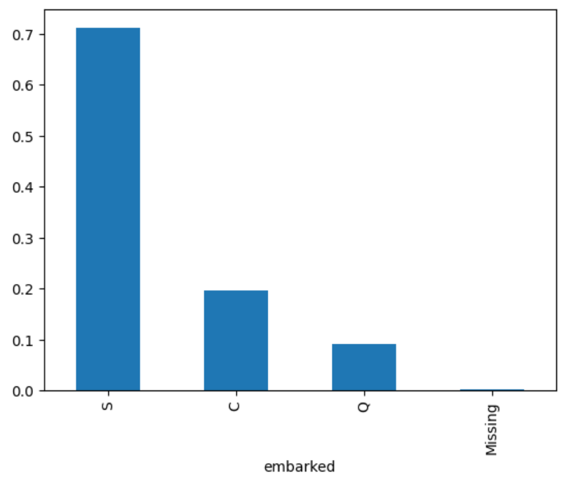

.. _drop_constant:

.. currentmodule:: feature_engine.selection

DropConstantFeatures
====================

Constant features are variables that show zero variability, or, in other words, have the
same value in all rows. A key step towards training a machine learning model is to identify
and remove constant features.

Features with no or low variability rarely constitute useful predictors. Hence, removing
them right at the beginning of the data science project is a good way of simplifying your
dataset and subsequent data preprocessing pipelines.

Filter methods are selection algorithms that select or remove features based solely on
their characteristics. In this light, removing constant features could be considered part
of the filter group of selection algorithms.

In Python, we can find constant features by using pandas `std` or `unique` methods, and then
remove them with `drop`.

With Scikit-learn, we can find and remove constant variables with `VarianceThreshold` to quickly
reduce the number of features. `VarianceThreshold` is part of `sklearn.feature_selection`'s API.

`VarianceThreshold`, however, would only work with numerical variables. Hence, we could only
evaluate categorical variables after encoding them, which requires a prior step of data
preprocessing just to remove redundant variables.

Feature-engine introduces :class:`DropConstantFeatures()` to find and remove constant and
quasi-constant features from a dataframe. :class:`DropConstantFeatures()` works with numerical,
categorical, or datetime variables. It is therefore more versatile than Scikit-learn’s transformer
because it allows us to drop all duplicate variables without the need for prior data transformations.

By default, :class:`DropConstantFeatures()` drops constant variables. We also have the option
to drop quasi-constant features, which are those that show mostly constant values and some other
values in a very small percentage of rows.

Because :class:`DropConstantFeatures()` works with numerical and categorical variables alike,
it offers a straightforward way of reducing the feature subset.

Be mindful, though, that depending on the context, quasi-constant variables could be useful.

**Example**

Let’s see how to use :class:`DropConstantFeatures()` by using the Titanic dataset. This dataset
does not contain constant or quasi-constant variables, so for the sake of the demonstration,
we will consider quasi-constant those features that show the same value in more than 70% of
the rows.

We first load the data and separate it into a training set and a test set:

.. code:: python

    from sklearn.model_selection import train_test_split
    from feature_engine.datasets import load_titanic
    from feature_engine.selection import DropConstantFeatures

    X, y = load_titanic(
        return_X_y_frame=True,
        handle_missing=True,
    )

    X_train, X_test, y_train, y_test = train_test_split(
        X, y, test_size=0.3, random_state=0,
    )

Now, we set up the :class:`DropConstantFeatures()` to remove features that show the same
value in more than 70% of the observations. We do this through the parameter `tol`. The
default value for this parameter is zero, in which case it will remove constant features.

.. code:: python

    # set up the transformer
    transformer = DropConstantFeatures(tol=0.7)

With `fit()` the transformer finds the variables to drop:

.. code:: python

    # fit the transformer
    transformer.fit(X_train)

The variables to drop are stored in the attribute `features_to_drop_`:

.. code:: python

    transformer.features_to_drop_

.. code:: python

    ['parch', 'cabin', 'embarked', 'body']

We can check that the variables `parch` and `embarked` show the same value in more than 70% of
the observations as follows:

.. code:: python

    X_train['embarked'].value_counts(normalize = True)

.. code:: python

    S          0.711790
    C          0.195415
    Q          0.090611
    Missing    0.002183
    Name: embarked, dtype: float64

Based on the previous results, 71% of the passengers embarked in S.

Let's now evaluate `parch`:

.. code:: python

    X_train['parch'].value_counts(normalize = True)

.. code:: python

    0    0.771834
    1    0.125546
    2    0.086245
    3    0.005459
    4    0.004367
    5    0.003275
    6    0.002183
    9    0.001092
    Name: parch, dtype: float64

Based on the previous results, 77% of the passengers had 0 parent or child. Because of this,
these features were deemed quasi-constant and will be removed in the next step.

We can also identify quasi-constant variables as follows:

.. code:: python

    import pandas

    X_train["embarked"].value_counts(normalize=True).plot.bar()

After executing the previous code, we observe the following plot, with more than 70% of
passengers embarking in S:

With `transform()`, we drop the quasi-constant variables from the dataset:

.. code:: python

    train_t = transformer.transform(X_train)
    test_t = transformer.transform(X_test)

    print(train_t.head())

We see the resulting dataframe below:

.. code:: python

          pclass                               name     sex        age  sibsp  \
    501        2  Mellinger, Miss. Madeleine Violet  female  13.000000      0
    588        2                  Wells, Miss. Joan  female   4.000000      1
    402        2     Duran y More, Miss. Florentina  female  30.000000      1
    1193       3                 Scanlan, Mr. James    male  29.881135      0
    686        3       Bradley, Miss. Bridget Delia  female  22.000000      0

                 ticket     fare     boat  \
    501          250644  19.5000       14
    588           29103  23.0000       14
    402   SC/PARIS 2148  13.8583       12
    1193          36209   7.7250  Missing
    686          334914   7.7250       13

                                                  home.dest
    501                            England / Bennington, VT
    588                                Cornwall / Akron, OH
    402                     Barcelona, Spain / Havana, Cuba
    1193                                            Missing
    686   Kingwilliamstown, Co Cork, Ireland Glens Falls...

Like sklearn, Feature-engine transformers have the `fit_transform` method that allows us
to find and remove constant or quasi-constant variables in a single line of code for convenience.

Like sklearn as well, `DropConstantFeatures()` has the `get_support()` method, which returns
a vector with values `True` for features that will be retained and `False` for those that
will be dropped.

.. code:: python

    transformer.get_support()

.. code:: python

    [True, True, True, True, True, False, True, True, False, False,
     True, False, True]

This and other feature selection methods may not necessarily avoid overfitting, but they
contribute to simplifying our machine learning pipelines and creating more interpretable
machine learning models.

Additional resources
--------------------

In this Kaggle kernel we use :class:`DropConstantFeatures()` together with other feature
selection algorithms and then train a Logistic regression estimator:

- `Kaggle kernel <https://www.kaggle.com/solegalli/feature-selection-with-feature-engine>`_

For more details about this and other feature selection methods check out these resources:

.. figure::  ../../images/fsml.png
   :width: 300
   :figclass: align-center
   :align: left
   :target: https://www.trainindata.com/p/feature-selection-for-machine-learning

   Feature Selection for Machine Learning

|
|
|
|
|
|
|
|
|
|

Or read our book:

.. figure::  ../../images/fsmlbook.png
   :width: 200
   :figclass: align-center
   :align: left
   :target: https://www.trainindata.com/p/feature-selection-in-machine-learning-book

   Feature Selection in Machine Learning

|
|
|
|
|
|
|
|
|
|
|
|
|
|

Both our book and course are suitable for beginners and more advanced data scientists
alike. By purchasing them you are supporting Sole, the main developer of Feature-engine.