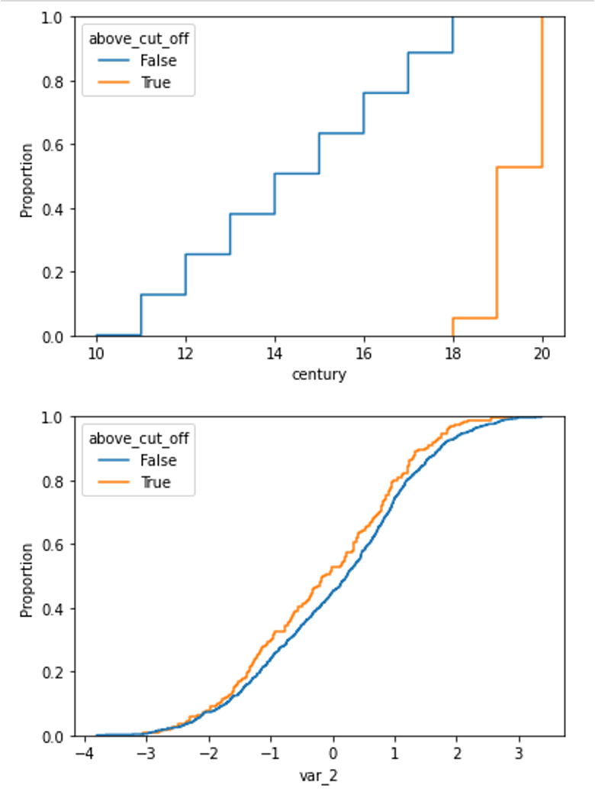
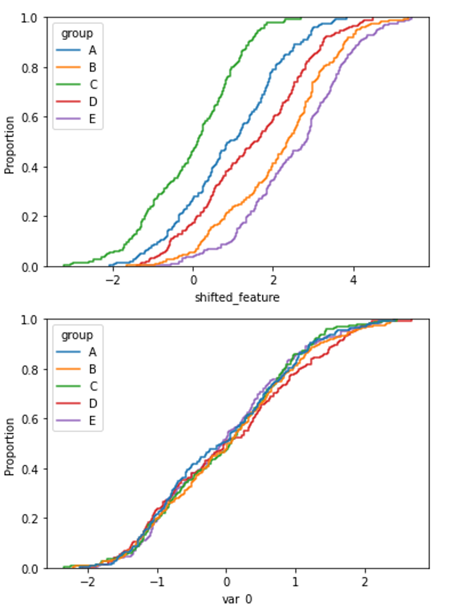
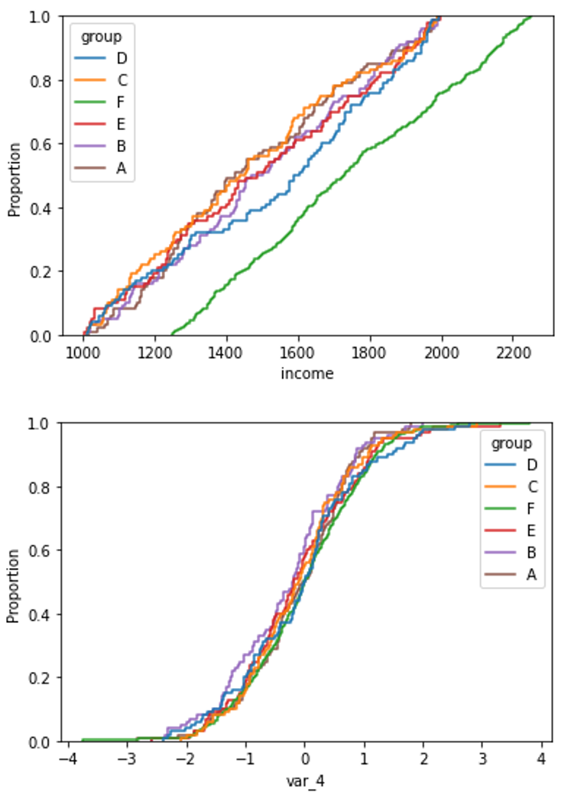

.. _psi_selection:

.. currentmodule:: feature_engine.selection

DropHighPSIFeatures
===================

The :class:`DropHighPSIFeatures()` finds and removes features with changes in their
distribution, i.e. "unstable values", from a pandas dataframe.
The stability of the distribution is computed using the **Population Stability
Index (PSI)** and all features having a PSI value above a given threshold are removed.

Unstable features may introduce an additional bias in a model if the training population
significantly differs from the population in production. Removing features for
which a shift in the distribution is suspected leads to
more robust models and therefore to better performance. In the field of Credit Risk
modelling, eliminating features with high PSI is common practice and usually required by the
Regulator.

Population Stability Index - PSI
--------------------------------

The PSI is a measure of how much a population has changed in time or how different the distributions
are between two different population samples.

To determine the PSI, continuous features are sorted into discrete intervals, the
fraction of observations per interval is then determined, and finally those values
are compared between the 2 groups, or as we call them in Feature-engine, between the
basis and test sets, to obtain the PSI.

In other words, the PSI is computed as follows:

- Define the intervals into which the observations will be sorted.
- Sort the feature values into those intervals.
- Determine the fraction of observations within each interval.
- Compute the PSI.

The PSI is determined as:

.. math::

    PSI = \sum_{i=1}^n (test_i - basis_i) . ln(\frac{test_i}{basis_i})

where `basis` and `test` are the "reference" and "evaluation" datasets, respectively, and `i`
refers to the interval.

In other words, the PSI determines the difference in the proportion of observations in each
interval, between the reference (aka, original) and test datasets.

In the PSI equation, `n` is the total number of intervals.

Important
~~~~~~~~~

When working with the PSI it is worth highlighting the following:

- The PSI is not symmetric; switching the order of the basis and test dataframes in the PSI calculation will lead to different values.
- The number of bins used to define the distributions has an impact on the PSI values.
- The PSI is a suitable metric for numerical features (i.e., either continuous or with high cardinality).
- For categorical or discrete features, the change in distributions is better assessed with Chi-squared.

Threshold
~~~~~~~~~

Different thresholds can be used to assess the magnitude of the distribution shift according
to the PSI value. The most commonly used thresholds are:

- Below 10%, the variable has not experienced a significant shift.
- Above 25%, the variable has experienced a major shift.
- Between those two values, the shift is intermediate.
- 'auto': the threshold will be calculated based on the size of the base and target datasets and the number of bins.

When 'auto', the threshold is calculated using the chi2 approximation, proposed by B. Yurdakul:

.. math::

    threshold = \chi^2_{(q,B-1)} . (\frac{1}{N} + \frac{1}{M})

where q is the percentile, B is the number of bins, N is the size of basis dataset, N is the size of test dataset.

In our implementation, we are using the 99.9th percentile.

As mentioned above, the number of bins has an impact on PSI value, because with a higher number of bins it is easier to find divergence in data 
and vice versa. The same could be said about dataset size - the more data we have, the harder it is to find the difference (if the shift is not drastic).
This formula tries to catch these relationships and adjust threshold to correctly detect feature drift.

Procedure
---------

To compute the PSI, the :class:`DropHighPSIFeatures()` splits the input dataset in
two: a basis data set (aka the reference data) and a test set. The basis data set is assumed to contain
the expected or original feature distributions. The test set will be assessed
against the basis data set.

In the next step, the interval boundaries are determined based on the features in the basis
or reference data. These intervals can be determined to be of equal with, or equal number
of observations.

Next, :class:`DropHighPSIFeatures()` sorts each of the variable values into those intervals, both in the
basis and test datasets, and then determines the proportion (percentage) of observations
within each interval.

Finally, the PSI is determined as indicated in the previous paragraph for each feature.
With the PSI value per feature, :class:`DropHighPSIFeatures()` can now select the features that are unstable and
drop them, based on a threshold.

Splitting the data
------------------

:class:`DropHighPSIFeatures()` allows us to determine how much a feature distribution has
changed in time, or how much it differs between 2 groups.

If we want to evaluate the distribution change in time, we can use a datetime variable as splitting
reference and provide a datetime cut-off as split point.

If we want to compare the distribution change between 2 groups, :class:`DropHighPSIFeatures()`
offers 3 different approaches to split the input dataframe:

- Based on proportion of observations.
- Based on proportions of unique observations.
- Using a cut-off value.

Proportion of observations
~~~~~~~~~~~~~~~~~~~~~~~~~~

Splitting by proportion of observations will result in a certain proportion of observations
allocated to either the reference and test datasets. For example, if we set `split_frac=0.75`,
then 75% and 25% of the observations will be put into the reference and test data, respectively.

If we select this method, we can pass a variable in the parameter `split_col` or leave it to None.

Note that the data split is not done at random, but instead guided by the values in the reference
variable indicated in `split_col`. Under the hood, the reference variable indicated in `split_col`
is ordered, and the percentage of observations is determined with NumPy quantile. This means
that the observations with smaller values in `split_col` will land in the reference dataset,
and those with bigger values will go to the test set.

If the rows in your dataset are sorted in time, this could be a good default option to split the
dataframe in 2 and compute the PSI. This will for example be the case if your data set contains
daily (or any other frequency) sales information on a company's products.

Proportions of unique observations
~~~~~~~~~~~~~~~~~~~~~~~~~~~~~~~~~~

If we split based on proportion of unique observations, it is important that we indicate which
column we want to use as reference in the `split_col` parameter, to make a meaningful split. If
we leave this to None, :class:`DropHighPSIFeatures()` will use the dataframe index as reference.
This makes sense only if the index in the dataframe has meaningful values.

:class:`DropHighPSIFeatures()` will first identify the unique values of the variable in
`split_col`. Then it will put a certain proportion of those values into the reference
dataset and the remaining to the test dataset. The proportion is indicated in the parameter
`split_frac`.

Under the hood, :class:`DropHighPSIFeatures()` will sort the unique values of the reference
variable, and then use NumPy quantiles to determine the fraction that should be allocated to the
reference and test sets. Thus, it is important to consider that the order of the unique values
matters in the split.

This split makes sense when we have for example unique customer identifiers and multiple rows
per customer in the dataset. We want to make sure that all rows belonging to the same customer
are allocated either in the reference or test data, but the same customer cannot be in both
data sets. This way of splitting the data will also ensure that we have a certain percentage,
indicated in `split_frac` of customers in either data set after the split.

Thus, if `split_frac=0.6` and `split_distinct=True`, :class:`DropHighPSIFeatures()` will send
the first 60% of customers to the reference data set, and the remaining 40% to the test set. And it will
ensure that rows belonging to the same customer are just in one of the 2 data sets.

Using a cut-off value
~~~~~~~~~~~~~~~~~~~~~

We have the option to pass a reference variable to use to split the dataframe using `split_col` and
also a cut-off value in the `cut_off` parameter. The cut-off value can be a number, integer or float,
a date or a list of values.

If we pass a datetime column in `split_col` and a datetime value in the `cut_off`, we can split the
data in a temporal manner. Observations collected before the time indicated will be sent to the reference
dataframe, and the remaining to the test set.

If we pass a list of values in the `cut_off` all observations which values are included in the
list will go into the reference data set, and the remaining to the test set. This split is useful
if we have a categorical variable indicating a portfolio from which the observations have been collected.
For example, if we set `split_col='portfolio'` and `cut_off=['port_1', 'port_2']`, all observations
that belong to the first and second portfolio will be sent to the reference data set, and the observations
from other portfolios to the test set.

Finally, if we pass a number to `cut_off`, all observations which value in the variable indicated
in `split_col` is <= cut-off, will be sent to the reference data set, alternatively to the test set.
This can be useful for example when dates are defined as integer (for example 20200411) or when
using an ordinal customer segmentation to split the dataframe (1: retail customers, 2: private
banking customers, 3: SME and 4: Wholesale).

split_col
~~~~~~~~~

To split the data set, we recommend that you indicate which column you want to use as
reference in the `split_col` parameter. If you don't, the split will be done based on the
values of the dataframe index. This might be a good option if the index contains meaningful
values or if splitting just based on `split_frac`.

Examples
--------

The versatility of the class lies in the different options to split the input dataframe
in a reference or basis data set with the "expected" distributions, and a test set which
will be evaluated against the reference.

After splitting the data, :class:`DropHighPSIFeatures()` goes ahead and compares the
feature distributions in both data sets by computing the PSI.

To illustrate how to best use :class:`DropHighPSIFeatures()` depending on your data, we
provide various examples illustrating the different possibilities.

Case 1: split data based on proportions (split_frac)
~~~~~~~~~~~~~~~~~~~~~~~~~~~~~~~~~~~~~~~~~~~~~~~~~~~~

In this case, :class:`DropHighPSIFeatures()` will split the dataset in 2, based on the
indicated proportion. The proportion is indicated in the `split_frac` parameter. You have
the option to select a variable in `split_col` or leave it to None. In the latter, the
dataframe index will be used to split.

Let's first create a toy dataframe containing 5 random variables and 1 variable
with a shift in its distribution (*var_3* in this case).

.. code:: python

    import pandas as pd
    import seaborn as sns

    from sklearn.datasets import make_classification
    from feature_engine.selection import DropHighPSIFeatures

    # Create a dataframe with 500 observations and 6 random variables
    X, y = make_classification(
        n_samples=500,
        n_features=6,
        random_state=0
    )

    colnames = ["var_" + str(i) for i in range(6)]
    X = pd.DataFrame(X, columns=colnames)

    # Add a column with a shift.
    X['var_3'][250:] = X['var_3'][250:] + 1

The default approach in :class:`DropHighPSIFeatures()` is to split the
input dataframe `X` in two equally sized data sets. You can adjust the proportions by changing
the value in the `split_frac` parameter.

For example, let's split the input dataframe into a reference data set containing 60% of
the observations and a test set containing 40% of the observations.

.. code:: python

    # Remove the features with high PSI values using a 60-40 split.

    transformer = DropHighPSIFeatures(split_frac=0.6)
    transformer.fit(X)

The value of `split_frac` tells :class:`DropHighPSIFeatures()` to split X according to a
60% - 40% ratio. The `fit()` method performs the split of the dataframe and the calculation
of the PSI.

Because we created random variables, these features will have low PSI values (i.e., no
distribution change). However, we manually added a distribution shift in the variable *var_3*
and therefore expect the PSI for this particular feature to be above the
0.25 PSI threshold.

The PSI values are accessible through the `psi_values_` attribute:

.. code:: python

    transformer.psi_values_

The analysis of the PSI values below shows that only feature 3 (called `var_3`)
has a PSI above the 0.25 threshold (default value) and will be removed
by the `transform` method.

.. code:: python

    {'var_0': 0.07405459925568803,
    'var_1': 0.09124093185820083,
    'var_2': 0.16985790067687764,
    'var_3': 1.342485289730313,
    'var_4': 0.0743442762545251,
    'var_5': 0.06809060587241555}

From the output, we see that the PSI value for *var_0* is around 7%. This means
that, when comparing the first 300 and the last 200 observations of the dataframe,
there is only a small difference in the distribution of the *var_0* feature.
A similar conclusion applies to *var_1, var_2, var_4* and *var_5*.
Looking at the PSI value for *var_3*, we see that it exceeds by far the 0.25
threshold. We can then conclude the population of this feature has shifted and
it is wise not to include it in the feature set for modelling.

The cut-off value used to split the dataframe is stored in the `cut_off_` attribute:

.. code:: python

    transformer.cut_off_

This yields the following answer

.. code:: python

    299.4

The value of 299.4 means that observations with index from 0 to 299 are used
to define the basis data set. This corresponds to 60% (300 / 500) of the original dataframe
(X).
The value of 299.4 may seem strange because it is not one of the value present in (the
(index of) the dataframe. Intuitively, we would expect the cut_off to be an integer
in the present case. However, the cut_off is computed using quantiles and the quantiles
are computed using extrapolation.

Splitting with proportions will order the index or the reference column first, and then
determine the data that will go into each dataframe. In other words, the order of the index
or the variable indicated in `split_col` matters. Observations with the lowest values will
be sent to the basis dataframe and the ones with the highest values to the test set.

The `features_to_drop_` attribute provides the list with the features to
be dropped when executing the `transform` method.

The command

.. code:: python

    transformer.features_to_drop_

Yields the following result:

.. code:: python

    ['var_3']

That the *var_3* feature is dropped during the procedure is illustrated when
looking at the columns from the `X_transformed` dataframe.

.. code:: python

    X_transformed = transformer.transform(X)

    X_transformed.columns

    Index(['var_0', 'var_1', 'var_2', 'var_4', 'var_5'], dtype='object')

:class:`DropHighPSIFeatures()` also contains a `fit_transform` method that combines
the `fit` and the `transform` methods.

The difference in distribution between a non-shifted and
a shifted distribution is clearly visible when plotting the cumulative density
function.

For the shifted variable:

.. code:: python

    X['above_cut_off'] = X.index > transformer.cut_off_
    sns.ecdfplot(data=X, x='var_3', hue='above_cut_off')

and a non-shifted variable (for example *var_1*)

.. code:: python

    sns.ecdfplot(data=X, x='var_1', hue='above_cut_off')

.. image:: ../../images/PSI_distribution_case1.png

Case 2: split data based on variable (numerical cut_off)
~~~~~~~~~~~~~~~~~~~~~~~~~~~~~~~~~~~~~~~~~~~~~~~~~~~~~~~~

In the previous example, we wanted to split the input dataframe in 2 datasets, with the
reference dataset containing 60% of the observations. We let :class:`DropHighPSIFeatures()`
find the cut-off to achieve this.

We can instead, provide ourselves the numerical cut-off that determines which observations will
go to the reference or basis data set, and which to the test set. Using the `cut_off` parameter,
we can define the specific threshold for the split.

A real life example for this case is the use of the customer ID or contract ID
to split the dataframe. These IDs are often increasing in value over time which justifies
their use to assess distribution shifts in the features.

Let's create a toy dataframe representing the customers' characteristics of a
company. This dataset contains six random variables (in
real life this are variables like age or postal code), the seniority of the customer
(i.e. the number of months since the start of the relationship between the
customer and the company) and the customer ID (i.e. the number (integer) used
to identify the customer). Generally the customer ID grows
over time which means that early customers have a lower customer ID than late
customers.

From the definition of the variables, we expect the *seniority* to increase with
the customer ID and therefore to have a high PSI value when comparing early and
late customer,

.. code:: python

    import pandas as pd
    from sklearn.datasets import make_classification
    from feature_engine.selection import DropHighPSIFeatures

    X, y = make_classification(
            n_samples=500,
            n_features=6,
            random_state=0
        )

    colnames = ["var_" + str(i) for i in range(6)]
    X = pd.DataFrame(X, columns=colnames)

    # Let's add a variable for the customer ID
    X['customer_id'] = [customer_id for customer_id in range(1, 501)]

    # Add a column with the seniority... that is related to the customer ID
    X['seniority'] = 100 - X['customer_id'] // 10

    transformer = DropHighPSIFeatures(split_col='customer_id', cut_off=250)
    transformer.fit(X)

In this case, :class:`DropHighPSIFeatures()` will allocate in the basis or reference data
set, all observations which values in `customer_id` are <= 250. The test dataframe contains the
remaining observations.

The method `fit()` will determine the PSI values, which are stored in the class:

.. code:: python

    transformer.psi_values_

We see that :class:`DropHighPSIFeatures()` does not provide any PSI value for
the `customer_id` feature, because this variable was used as a reference to split the data.

.. code:: python

    {'var_0': 0.07385590683974477,
    'var_1': 0.061155637727757485,
    'var_2': 0.1736694458621651,
    'var_3': 0.044965387331530465,
    'var_4': 0.0904519893659045,
    'var_5': 0.027545195437270797,
    'seniority': 7.8688986006052035}

.. code:: python

    transformer.features_to_drop_

Gives

.. code:: python

    ['seniority']

Executing the dataframe transformation leads to the exclusion of the *seniority*
feature but not to the exclusion of the *customer_id*.

.. code:: python

    X_transformed = transformer.transform(X)

    X_transformed.columns

    Index(['var_0', 'var_1', 'var_2', 'var_3', 'var_4', 'var_5', 'customer_id'], dtype='object')

Case 3: split data based on time (date as cut_off)
~~~~~~~~~~~~~~~~~~~~~~~~~~~~~~~~~~~~~~~~~~~~~~~~~~

:class:`DropHighPSIFeatures()` can handle different types of `split_col`
variables. The following case illustrates how it works with a date variable. In fact,
we often want to determine if the distribution of a feature changes in time, for example
after a certain event like the start of the Covid-19 pandemic.

This is how to do it. Let's create a toy dataframe with 6 random numerical variables
and two date variables. One will be use to specific the split of the dataframe
while the second one is expected to have a high PSI value.

.. code:: python

    import pandas as pd
    from datetime import date
    from sklearn.datasets import make_classification
    from feature_engine.selection import DropHighPSIFeatures

    X, y = make_classification(
            n_samples=1000,
            n_features=6,
            random_state=0
        )

    colnames = ["var_" + str(i) for i in range(6)]
    X = pd.DataFrame(X, columns=colnames)

    # Add two time variables to the dataframe
    X['time'] = [date(year, 1, 1) for year in range(1000, 2000)]
    X['century'] = X['time'].apply(lambda x: ((x.year - 1) // 100) + 1)

    # Let's shuffle the dataframe and reset the index to remove the correlation
    # between the index and the time variables.

    X = X.sample(frac=1).reset_index(drop=True)

Dropping features with high PSI values comparing two periods of time is done simply
by providing the name of the column with the date and a cut-off date.
In the example below the PSI calculations
will be done comparing the periods up to the French revolution and after.

.. code:: python

    transformer = DropHighPSIFeatures(split_col='time', cut_off=date(1789, 7, 14))
    transformer.fit(X)

**Important**: if the date variable is in pandas or NumPy datetime format, you may need
to pass the cut_off value as `pd.to_datetime(1789-07-14)`.

The PSI values shows the *century* variables in unstable as its value is above
the 0.25 threshold.

.. code:: python

    transformer.psi_values_

    {'var_0': 0.0181623637463045,
    'var_1': 0.10595496570984747,
    'var_2': 0.05425659114295842,
    'var_3': 0.09720689210928271,
    'var_4': 0.07917647542638032,
    'var_5': 0.10122468631060424,
    'century': 8.272395772368412}

The class has correctly identified the feature to be dropped.

.. code:: python

    transformer.features_to_drop_

    ['century']

And the transform method correctly removes the feature.

.. code:: python

    X_transformed = transformer.transform(X)

    X_transformed.columns

    Index(['var_0', 'var_1', 'var_2', 'var_3', 'var_4', 'var_5', 'time'], dtype='object')

The difference in distribution between a non-shifted and
a shifted distribution is clearly visible when plotting the cumulative density
function for each of the group.

We can plot the cumulative distribution of the shifted variable like this:

.. code:: python

    X['above_cut_off'] = X.time > pd.to_datetime(transformer.cut_off_)
    sns.ecdfplot(data=X, x='century', hue='above_cut_off')

and the distribution of a non-shifted variable, for example *var_2*, like this:

.. code:: python

    sns.ecdfplot(data=X, x='var_2', hue='above_cut_off')

And below we can compare both plots:

Case 4: split data based on a categorical variable (category or list as cut_off)
~~~~~~~~~~~~~~~~~~~~~~~~~~~~~~~~~~~~~~~~~~~~~~~~~~~~~~~~~~~~~~~~~~~~~~~~~~~~~~~~

:class:`DropHighPSIFeatures()` can also split the original dataframe based on
a categorical variable. The cut-off can then be defined in two ways:

- Using a single string.
- Using a list of values.

In the first case, the column with the categorical variable is sorted alphabetically and
the split is determined by the cut-off. We recommend being very careful when using a single
category as cut-off, because alphabetical sorting in combination with a cut-off does
not always provide obvious results. In other words, for this way of splitting the data to
be meaningful, the alphabetical order of the categories in the reference variable should have
an intrinsic meaning.

A better purpose for splitting the data based on a categorical variable would be to pass a
list with the values of the variable that want in the reference dataframe. A real life
example for this case is the computation of the PSI between different customer segments
like 'Retail', 'SME' or 'Wholesale'. In this case, if we indicate ['Retail'] as
cut-off, observations for Retail will be sent to the basis data set, and those for 'SME'
and 'Wholesale' will be added to the test set.

Split passing a category value
^^^^^^^^^^^^^^^^^^^^^^^^^^^^^^

Let's show how to set up the transformer in this case. The example data set
contains 6 randoms variables, a categorical variable with the labels of the
different categories and 2 category related features.

.. code:: python

    import pandas as pd
    import seaborn as sns

    from sklearn.datasets import make_classification
    from feature_engine.selection import DropHighPSIFeatures

    X, y = make_classification(
        n_samples=1000,
        n_features=6,
        random_state=0
    )

    colnames = ["var_" + str(i) for i in range(6)]
    X = pd.DataFrame(X, columns=colnames)

    # Add a categorical column
    X['group'] = ["A", "B", "C", "D", "E"] * 200

    # And two category related features
    X['group_means'] = X.group.map({"A": 1, "B": 2, "C": 0, "D": 1.5, "E": 2.5})
    X['shifted_feature'] = X['group_means'] + X['var_2']

We can define a simple cut-off value (for example the letter C). In this case, observations
with values that come before C, alphabetically, will be allocated to the reference data set.

.. code:: python

    transformer = DropHighPSIFeatures(split_col='group', cut_off='C')
    X_transformed = transformer.fit_transform(X)

The PSI values are provided in the `psi_values_` attribute.

.. code:: python

    transformer.psi_values_

    {'var_0': 0.06485778974895254,
    'var_1': 0.03605540598761757,
    'var_2': 0.040632784917352296,
    'var_3': 0.023845405645510645,
    'var_4': 0.028007185972248064,
    'var_5': 0.07009152672971862,
    'group_means': 6.601444547497699,
    'shifted_feature': 0.48428009522119164}

From these values we see that the last 2 features should be removed. We can corroborate
that in the `features_to_drop_` attribute:

.. code:: python

    transformer.features_to_drop_

    ['group_means', 'shifted_feature']

And these columns are removed from the original dataframe by the transform
method that, in the present case, has been applied through the fit_transform
method a couple of block cells above.

.. code:: python

    X_transformed.columns

    Index(['var_0', 'var_1', 'var_2', 'var_3', 'var_4', 'var_5', 'group'], dtype='object')

Split passing a list of categories
^^^^^^^^^^^^^^^^^^^^^^^^^^^^^^^^^^

Instead of passing a category value, we can instead pass a list of values to the `cut_off`.
Using the same data set let's set up the :class:`DropHighPSIFeatures()` to split
the dataframe according to the list ['A', 'C', 'E'] for the categorical variable *group*.

In this case, the PSI's will be computed by comparing two dataframes: the first one
containing only the values A, C and E for the *group* variable and the second one containing
only the values B and D.

.. code:: python

    trans = DropHighPSIFeatures(split_col='group', cut_off=['A', 'C', 'E'])
    X_no_drift = trans.fit_transform(X)

.. code:: python

    trans.psi_values_

    'var_0': 0.04322345673014104,
    'var_1': 0.03534439253617049,
    'var_2': 0.05220272785661243,
    'var_3': 0.04550964862452317,
    'var_4': 0.04492720670343145,
    'var_5': 0.044886435640028144,
    'group_means': 6.601444547497699,
    'shifted_features': 0.3683642099948127}

Here again, the object will remove the *group_means* and the *shifted_features* columns
from the dataframe.

.. code:: python

    trans.features_to_drop_

    ['group_means', 'shifted_features']

And these columns are removed from the original dataframe by the transform
method that has been applied through the `fit_transform` method.

.. code:: python

    X_transformed.columns

    Index(['var_0', 'var_1', 'var_2', 'var_3', 'var_4', 'var_5', 'group'], dtype='object')

In the following plots, we can compare the distribution of a feature with high PSI and
one with low PSI, in the different categories of the categorical variable.

With this code we plot the cumulative distribution of a feature which distribution is
different among the different categories of the variable:

.. code:: python

    sns.ecdfplot(data=X, x='shifted_feature', hue='group')

With this code we plot the cumulative distribution of a feature which distribution is
the same across the different categories of the categorical variable:

.. code:: python

    sns.ecdfplot(data=X, x='var_0', hue='group')

And below we can compare the plots of both features:

Case 5: split data based on unique values (split_distinct)
~~~~~~~~~~~~~~~~~~~~~~~~~~~~~~~~~~~~~~~~~~~~~~~~~~~~~~~~~~

A variant to the previous example is the use of the `split_distinct` functionality.
In this case, the split is not done based on the number observations from
`split_col` but from the number of distinct values in the reference variable indicated
in `split_col`.

A real life example for this case is when dealing with groups of different sizes
like customers income classes ('1000', '2000', '3000', '4000', ...).
Split_distinct allows to control the numbers of classes in the basis and test
dataframes regardless of the number of observations in each class.

This case is illustrated in the toy data for this case. The data set contains
6 random variable and 1 income variable that is larger for one of the 6 group
defined (the F group).

.. code:: python

    import numpy as np
    import pandas as pd
    import seaborn as sns

    from sklearn.datasets import make_classification
    from feature_engine.selection import DropHighPSIFeatures

    X, y = make_classification(
        n_samples=1000,
        n_features=6,
        random_state=0
    )

    colnames = ["var_" + str(i) for i in range(6)]
    X = pd.DataFrame(X, columns=colnames)

    # Add a categorical column
    X['group'] = ["A", "B", "C", "D", "E"] * 100 + ["F"] * 500

    # And an income variable that is category dependent.
    np.random.seed(0)
    X['income'] = np.random.uniform(1000, 2000, 500).tolist() +
                  np.random.uniform(1250, 2250, 500).tolist()

    # Shuffle the dataframe to make the dataset more real life case.
    X = X.sample(frac=1).reset_index(drop=True)

The `group` column contains 500 observations in the (A, B, C, D, E)
group and 500 in the (F) group.

When we pass `split_distinct=True` when initializing
the `DropHighPSIFeatures` object, the two dataframes used to compute the
PSI will contain the same number of **unique** values in the `group`
column (i.e., one dataframe will contain 300 rows associated to groups A, B and C
while the other will contain 700 rows associated to groups D, E and F).

.. code:: python

    transformer = DropHighPSIFeatures(split_col='group', split_distinct=True)
    transformer.fit(X)

    transformer.psi_values_

This yields the following PSI values:

.. code:: python

    {'var_0': 0.014825303242393804,
    'var_1': 0.03818316821350485,
    'var_2': 0.029635981271458896,
    'var_3': 0.021700399485890084,
    'var_4': 0.061194837255216114,
    'var_5': 0.04119583769297253,
    'income': 0.46191580731264914}

And we can find the feature that will be dropped, income, here:

.. code:: python

    transformer.features_to_drop_

        ['income']

The former feature will be removed from the dataset when calling the `transform()` method.

.. code:: python

    X_transformed = transformer.transform(X)

    X_transformed.columns

    Index(['var_0', 'var_1', 'var_2', 'var_3', 'var_4', 'var_5', 'group'], dtype='object')

The difference in distribution between a non-shifted and
a shifted distribution is clearly visible when plotting the cumulative density
function for each of the group.

For the shifted variable (income):

.. code:: python

    sns.ecdfplot(data=X, x='income', hue='group')

and a non-shifted variable (for example *var_4*)

.. code:: python

    sns.ecdfplot(data=X, x="var_4", hue="group")

Additional resources
--------------------

In this notebook, we show how to use :class:`DropHighPSIFeatures` on a real dataset and
give more detail about the underlying base and reference sub-dataframes used to
determine the PSI.

- `Jupyter notebook <https://nbviewer.org/github/feature-engine/feature-engine-examples/blob/main/selection/Drop-High-PSI-Features.ipynb>`_

All notebooks can be found in a `dedicated repository <https://github.com/feature-engine/feature-engine-examples>`_.

For more details about this and other feature selection methods check out these resources:

.. figure::  ../../images/fsml.png
   :width: 300
   :figclass: align-center
   :align: left
   :target: https://www.trainindata.com/p/feature-selection-for-machine-learning

   Feature Selection for Machine Learning

|
|
|
|
|
|
|
|
|
|

Or read our book:

.. figure::  ../../images/fsmlbook.png
   :width: 200
   :figclass: align-center
   :align: left
   :target: https://www.trainindata.com/p/feature-selection-in-machine-learning-book

   Feature Selection in Machine Learning

|
|
|
|
|
|
|
|
|
|
|
|
|
|

Both our book and course are suitable for beginners and more advanced data scientists
alike. By purchasing them you are supporting Sole, the main developer of Feature-engine.