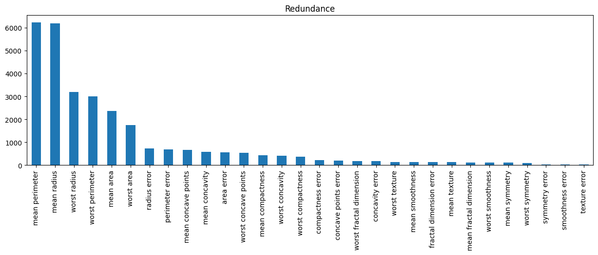
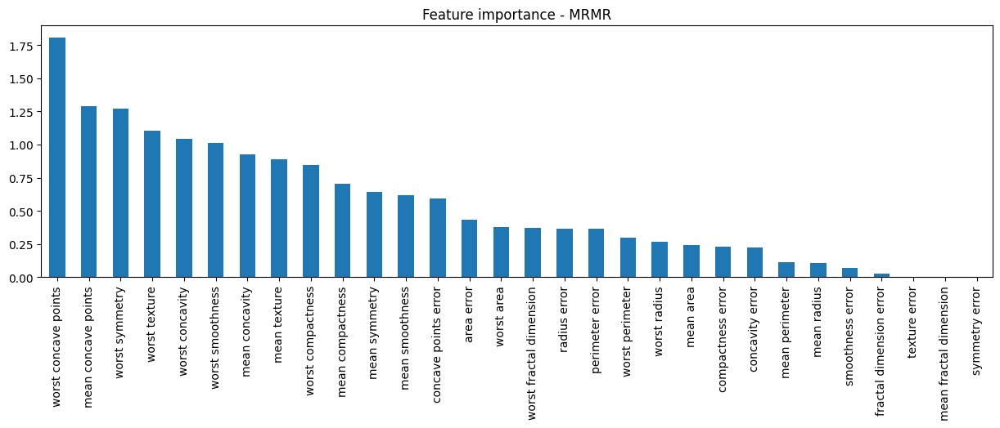
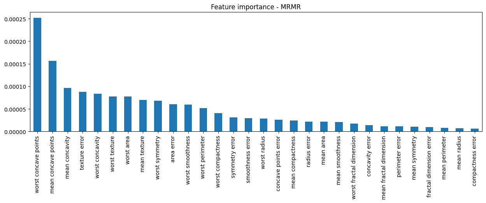

.. _mrmr:

.. currentmodule:: feature_engine.selection

MRMR - Minimum Redundancy Maximum Relevance
===========================================

:class:`MRMR()` selects features based on the Maximum Relevance Minimum Redundancy framework. In
this framework, features with a strong relationship with the target (high relevance), but weak
relationship to other features in the dataset (low redundancy) are favored and hence selected.

The MRMR algorithm obtains a measure of relevance and a measure of redundancy, and then it assigns
an importance score to each feature based on the difference or ratio between relevance and
redundancy. After that, it selects the features with the highest scores.

MRMR was first described as a method to select features for microarray gene expression data,
and then expanded and popularized by Uber in the context of marketing models.

Relevance
----------

:class:`MRMR()` has 3 strategies to determine feature relevance. To determine the relationship
of each feature with the target variable, :class:`MRMR()` determines i) the F-statistic, which is
derived from ANOVA if the target is discrete or correlation if the target is categorical, ii) t
he mutual information, or iii) the importance derived from random forests.

F-statistic
~~~~~~~~~~~

The F-statistic determines the degree of linear association between the features and the target.
If the target is categorical, the F-statistic is calculated using Scikit-learn's `f_classif`
function. If the target is numerical, the F-statistic is determined using `f_regression`.

Note that in both cases, these statistic is useful when the features are continuous. For discrete
features, other tests should be used, like chi-square, which at the moment is not implemented.
So if your datasets contain both numerical and categorical variables, try the mutual information
or the importance derived from random forests instead.

Mutual information
~~~~~~~~~~~~~~~~~~

The mutual information is a measure that quantifies how much we know about one variable, by
examining the values of a second variable. In other words, it measures the non-linear association
between features. Higher values indicate stronger associations.

:class:`MRMR()` uses scikit-learn's `mutual_info_classif` to determine the association between
features and a discrete target, or `mutual_info_regression`, to calculate the association between
features and a continuous target.

The mutual information is calculated differently for continuous and discrete variables, so it is
important to flag those variables that are categorical or discrete through the `discrete_features`
parameter.

Random Forests
~~~~~~~~~~~~~~

Random forests can automatically assign a measure of relevance, by computing the degree of impurity
returned by each feature at each node of the tree across the forest. Hence, the importance derived
from random forests offers a good approximation of the relationship between features and target.

Note however that if the features are highly correlated, the importance derived from random forests
will be diluted, and the feature score will be diluted further when :class:`MRMR()` combines the measure
of relevance with that of redundancy.

Redundancy
----------

:class:`MRMR()` has 2 strategies to determine the relationship of the variables to other variables in
the dataset. It uses correlation, more specifically the F-statistic obtained for Pearson's correlation
coefficient, or mutual information.

Correlation
~~~~~~~~~~~

To determine each features's redundancy, :class:`MRMR()` will determine the correlation of each feature to
all other variables and then take the average. More precisely, it will determine the F-statistic derived
from Pearson's correlation coefficient through Scikit-learn's `f_regression` function and take the average
of those values.

Note that f_regression assumes that all features are continuous, so this metric may returned biased
results for categorical and discrete variables.

Mutual information
~~~~~~~~~~~~~~~~~~

To determine each features's redundancy, :class:`MRMR()` will determine the mutual information
between each feature to all other features in the dataset, and then take the average.

Feature importance
------------------

The MRMR method obtains a measure of feature importance by comparing its relevance to the target
and its redundancy with other features.

High feature importance is obtained when the relevance is high and the redundancy is low.

Note that features with high relevance but that are also highly correlated (or highly related
more broadly speaking) to other features in the dataset, will be de-prioritized and may lose
relevance against features with weaker relationships with the target, but that are also not
related strongly to other variables in the dataset.

The feature importance can be obtained by either obtaining the difference between relevance and
redundancy, or the ratio between the two.

The following schemes are supported by :class:`MRMR()`

.. csv-table::
    :header: Method, Relevance, Redundance, Scheme

    'MID', Mutual information, Mutual information, Difference,
    'MIQ', Mutual information, Mutual information, Ratio,
    'FCD', F-Statistic, Correlation, Difference,
    'FCQ', F-Statistic, Correlation, Ratio,
    'FCQ', Mutual information, Correlation, Ratio,

Feature selection
-----------------

:class:`MRMR()` selects features with high feature importance. There is an option to enter a
threshold and features with importance higher than this threshold will be selected. Alternatively,
:class:`MRMR()` takes the mean of all feature importances as threshold.

Python examples
---------------

Let's see how to implement :class:`MRMR()`. We'll start by using Scikit-learn's breast cancer
diagnoses dataset. The target variable is binary, representing malignant or benign tumors. All
predictor variables are continuous.

Let's import the required libraries and classes:

.. code:: python

    import pandas as pd
    import matplotlib.pyplot as plt
    from sklearn.datasets import load_breast_cancer
    from sklearn.model_selection import train_test_split
    from feature_engine.selection import MRMR

Let's now load the cancer diagnostic data and display its top rows:

.. code:: python

    X, y = load_breast_cancer(return_X_y=True, as_frame=True)
    y = y.map({0:1, 1:0})
    print(X.head())

In the following output we see the top 5 rows of the dataset:

.. code:: python

       mean radius  mean texture  mean perimeter  mean area  mean smoothness  \
    0        17.99         10.38          122.80     1001.0          0.11840
    1        20.57         17.77          132.90     1326.0          0.08474
    2        19.69         21.25          130.00     1203.0          0.10960
    3        11.42         20.38           77.58      386.1          0.14250
    4        20.29         14.34          135.10     1297.0          0.10030

       mean compactness  mean concavity  mean concave points  mean symmetry  \
    0           0.27760          0.3001              0.14710         0.2419
    1           0.07864          0.0869              0.07017         0.1812
    2           0.15990          0.1974              0.12790         0.2069
    3           0.28390          0.2414              0.10520         0.2597
    4           0.13280          0.1980              0.10430         0.1809

       mean fractal dimension  ...  worst radius  worst texture  worst perimeter  \
    0                 0.07871  ...         25.38          17.33           184.60
    1                 0.05667  ...         24.99          23.41           158.80
    2                 0.05999  ...         23.57          25.53           152.50
    3                 0.09744  ...         14.91          26.50            98.87
    4                 0.05883  ...         22.54          16.67           152.20

       worst area  worst smoothness  worst compactness  worst concavity  \
    0      2019.0            0.1622             0.6656           0.7119
    1      1956.0            0.1238             0.1866           0.2416
    2      1709.0            0.1444             0.4245           0.4504
    3       567.7            0.2098             0.8663           0.6869
    4      1575.0            0.1374             0.2050           0.4000

       worst concave points  worst symmetry  worst fractal dimension
    0                0.2654          0.4601                  0.11890
    1                0.1860          0.2750                  0.08902
    2                0.2430          0.3613                  0.08758
    3                0.2575          0.6638                  0.17300
    4                0.1625          0.2364                  0.07678

    [5 rows x 30 columns]

Let's now split the data into train and test sets:

.. code:: python

    X_train, X_test, y_train, y_test = train_test_split(
        X, y, test_size=0.3, random_state=0)

The F-Statistic framework: linear associations
~~~~~~~~~~~~~~~~~~~~~~~~~~~~~~~~~~~~~~~~~~~~~~

We set up :class:`MRMR()` to select features by determining their relevance and redundancy
based on the F-statistic obtained from ANOVA when tested against the target, or correlation
when tested among features:

.. code:: python

    sel = MRMR(method="FCQ", regression=False)
    sel.fit(X, y)

With `fit()`, :class:`MRMR()` computed the relevance, redundance, MRMR or feature importance
and determined which features should be retained.

Let's take a look at some of those values. We can print out the relevance as follows:

.. code:: python

    sel.relevance_

In the following output, we see an array with the F-statistic obtained by examining each
feature against the target:

.. code:: python

    array([6.46981021e+02, 1.18096059e+02, 6.97235272e+02, 5.73060747e+02,
           8.36511234e+01, 3.13233079e+02, 5.33793126e+02, 8.61676020e+02,
           6.95274435e+01, 9.34592949e-02, 2.68840327e+02, 3.90947023e-02,
           2.53897392e+02, 2.43651586e+02, 2.55796780e+00, 5.32473391e+01,
           3.90144816e+01, 1.13262760e+02, 2.41174067e-02, 3.46827476e+00,
           8.60781707e+02, 1.49596905e+02, 8.97944219e+02, 6.61600206e+02,
           1.22472880e+02, 3.04341063e+02, 4.36691939e+02, 9.64385393e+02,
           1.18860232e+02, 6.64439606e+01])

We can instead create a bar plot with the relevance to get a sense of the association between
features and target:

.. code:: python

    d.Series(sel.relevance_, index=sel.variables_).sort_values(
        ascending=False).plot.bar(figsize=(15, 4))
    plt.title("Relevance")
    plt.show()

In the following image, we see the F-statistic per feature:

.. figure::  ../../images/f_statistic.png
   :align:   center

We can print out the redundancy values as follows:

.. code:: python

    sel.redundance_

In the following output, we see an array with the values of relevance, which in this case is the
mean F-statistic per feature, obtained by assessing correlation to all other features in the
dataset:

.. code:: python

    array([6196.15821542,  133.05876824, 6227.29215401, 2355.2733152 ,
            135.03538401,  442.82301531,  575.26152148,  666.93637339,
            108.18283331,  123.71509918,  731.00127784,   25.00542472,
            691.57943195,  565.40539072,   35.21629573,  228.46363233,
            175.7670852 ,  190.49932237,   37.35475678,  134.98503485,
           3194.31985518,  135.53962024, 2999.97186014, 1746.11614782,
            121.24488967,  359.44991008,  418.47932409,  533.70655754,
             93.65630926,  178.89484368])

We can go ahead and display a bar plot with the redundancy:

.. code:: python

    pd.Series(sel.redundance_, index=sel.variables_).sort_values(
        ascending=False).plot.bar(figsize=(15, 4))
    plt.title("Redundance")
    plt.show()

In the following image we see the redundancy of each feature:

Features with larger values are highly correlated to other features in the dataset.

The feature importance score, which in this case is the ratio between relevance and redundancy
can be found as follows:

.. code:: python

    sel.mrmr_

In the following output we see a pandas series with the feature names in the index and the
feature importance as values:

.. code:: python

    mean radius                0.104416
    mean texture               0.887548
    mean perimeter             0.111964
    mean area                  0.243310
    mean smoothness            0.619476
    mean compactness           0.707355
    mean concavity             0.927914
    mean concave points        1.291991
    mean symmetry              0.642685
    mean fractal dimension     0.000755
    radius error               0.367770
    texture error              0.001563
    perimeter error            0.367127
    area error                 0.430933
    smoothness error           0.072636
    compactness error          0.233067
    concavity error            0.221967
    concave points error       0.594557
    symmetry error             0.000646
    fractal dimension error    0.025694
    worst radius               0.269473
    worst texture              1.103713
    worst perimeter            0.299318
    worst area                 0.378898
    worst smoothness           1.010128
    worst compactness          0.846686
    worst concavity            1.043521
    worst concave points       1.806958
    worst symmetry             1.269111
    worst fractal dimension    0.371414
    dtype: float64

We can go ahead and create a bar plot:

.. code:: python

    sel.mrmr_.sort_values(
        ascending=False).plot.bar(figsize=(15, 4))
    plt.title("Feature importance - MRMR")
    plt.show()

In the following image we see the feature importance or MRMR score:

We can see the subset of features that will be removed as follows:

.. code:: python

    sel.features_to_drop_

In the following output we see the features that were not selected:

.. code:: python

    ['mean radius',
     'mean perimeter',
     'mean area',
     'mean fractal dimension',
     'radius error',
     'texture error',
     'perimeter error',
     'area error',
     'smoothness error',
     'compactness error',
     'concavity error',
     'symmetry error',
     'fractal dimension error',
     'worst radius',
     'worst perimeter',
     'worst area',
     'worst fractal dimension']

Finally, we can go ahead and retain the selected features like this:

.. code:: python

    Xtr = sel.transform(X_test)
    print(Xtr.head())

In the following output we see the test set with a reduced number of features:

.. code:: python

         mean texture  mean smoothness  mean compactness  mean concavity  \
    512         20.52          0.11060           0.14690         0.14450
    457         25.25          0.08791           0.05205         0.02772
    439         15.66          0.07966           0.05581         0.02087
    298         18.17          0.06576           0.05220         0.02475
    37          18.42          0.08983           0.03766         0.02562

         mean concave points  mean symmetry  concave points error  worst texture  \
    512              0.08172         0.2116              0.013340          29.66
    457              0.02068         0.1619              0.006451          34.23
    439              0.02652         0.1589              0.010760          19.31
    298              0.01374         0.1635              0.005243          25.26
    37               0.02923         0.1467              0.011640          22.81

         worst smoothness  worst compactness  worst concavity  \
    512           0.15740            0.38560          0.51060
    457           0.12890            0.10630          0.13900
    439           0.10340            0.10170          0.06260
    298           0.09445            0.21670          0.15650
    37            0.09701            0.04619          0.04833

         worst concave points  worst symmetry
    512               0.20510          0.3585
    457               0.06005          0.2444
    439               0.08216          0.2136
    298               0.07530          0.2636
    37                0.05013          0.1987

In the final dataset we only have the relevant features!

Using random forests
~~~~~~~~~~~~~~~~~~~~

When we have categorical or discrete variables, or want to examine non-linear associations, we
can determine the relevance using the random forests derived feature importance.

:class:`MRMR()` will train a random forest using grid search over a hyperparameter grid that
can be specified by the user. The redundancy is determined using the F-statistic from Pearson's
correlation coefficient.

In a similar way, the MRMR feature selection algorithm will compute the feature importance as the
ratio between the random forest importance and the F-Statistic.

Lets, set up :class:`MRMR()` to use a random forests classifier for the relevance. Note that we
need to specify a cross-validation scheme, a performance metric, and we have the option to pass
a grid with hyperparameters to optimize:

.. code:: python

    sel = MRMR(
        method="RFCQ",
        scoring="roc_auc",
        param_grid = {"n_estimators": [5, 50, 500], "max_depth":[1,2,3]},
        cv=3,
        regression=False,
        random_state=42,
    )

    sel.fit(X, y)

We can now go ahead and plot the relevance:

.. code:: python

    pd.Series(sel.relevance_, index=sel.variables_).sort_values(
        ascending=False).plot.bar(figsize=(15, 4))
    plt.title("Relevance")
    plt.show()

In the following image we see the relationship between features and the target derived from
random forests:

.. figure::  ../../images/rfimportancemrmr.png
   :align:   center

The redundancy is identical to that obtained in the previous section. So, we'll move on to
the feature importance score:

.. code:: python

    sel.mrmr_.sort_values(
        ascending=False).plot.bar(figsize=(15, 4))
    plt.title("Feature importance - MRMR")
    plt.show()

In the following image we see the importance score for each feature:

We can now go ahead and select relevant features using the `transform()` method.

Mutual information
~~~~~~~~~~~~~~~~~~

If we have non-linear associations and / or categorical or discrete variables, a better
option is to obtain the relevance and redundance utilizing mutual information.

The mutual information is calculated differently for numerical and categorical variables,
so it is best to flag discrete features with a boolean array.

For this demo, we'll use the California housing dataset to predict house prices, and we'll
treat 3 variables as discrete. Let's load the data:

.. code:: python

    from sklearn.datasets import fetch_california_housing

    X, y = fetch_california_housing(return_X_y=True, as_frame=True)
    X[['AveRooms', 'AveBedrms', 'AveOccup']] = X[['AveRooms', 'AveBedrms', 'AveOccup']].astype(int)

    print(X.head())

In the following output we see the first 5 rows of the dataset:

.. code:: python

       MedInc  HouseAge  AveRooms  AveBedrms  Population  AveOccup  Latitude  \
    0  8.3252      41.0         6          1       322.0         2     37.88
    1  8.3014      21.0         6          0      2401.0         2     37.86
    2  7.2574      52.0         8          1       496.0         2     37.85
    3  5.6431      52.0         5          1       558.0         2     37.85
    4  3.8462      52.0         6          1       565.0         2     37.85

       Longitude
    0    -122.23
    1    -122.22
    2    -122.24
    3    -122.25
    4    -122.25

Now, we'll set up :class:`MRMR()` to use mutual information to determine redundace and relevance,
and the importance score as the ratio of the two. Note the boolean vector with `True` in the
position of the categorical variables  'AveRooms', 'AveBedrms' and 'AveOccup':

.. code:: python

    sel = MRMR(
        variables = ['MedInc', 'HouseAge', 'AveRooms', 'AveBedrms', 'Population', 'AveOccup'],
        method="MIQ",
        discrete_features=[False, False, True, True, False, True],
        regression=True,
        random_state=42,
    )

    sel.fit(X,y)

    sel.mrmr_

In the following output we see the feature importance:

.. code:: python

    MedInc        4.752725
    HouseAge      0.894946
    AveRooms      1.136606
    AveBedrms     0.337142
    Population    0.667695
    AveOccup      1.986972
    dtype: float64

To select features we use transform():

.. code:: python

    Xtr = sel.transform(X)
    print(Xtr.head())

Note that the variables latitude and longitude, which were not part of the set of features
examined by MRMR are retained in the transformed dataset:

.. code:: python

       MedInc  AveOccup  Latitude  Longitude
    0  8.3252         2     37.88    -122.23
    1  8.3014         2     37.86    -122.22
    2  7.2574         2     37.85    -122.24
    3  5.6431         2     37.85    -122.25
    4  3.8462         2     37.85    -122.25

For compatibility with Scikit-learn selection transformers, :class:`MRMR()` also supports the
method `get_support()`:

.. code:: python

    sel.get_support()

which returns the following output:

.. code:: python

    [True, False, False, False, False, True, True, True]

Considerations
--------------

The maximum relevance minimum redundancy feature selection method is fast, and therefore allows
scrutinizing fairly big datasets. Computing the F-statistic or the mutual information is, in
general, fast. That's one of the reasons that made it gain popularity.

However, features with high relevance and also high redundancy may receive lower importance
scores than features with lower relevance and even lower redundancy. Hence, whenever possible,
don't just look at the importance score, take a look at both relevance and redundancy as well,
not to overlook any important variable.

Additional resources
--------------------

For more details about this and other feature selection methods check out these resources:

.. figure::  ../../images/fsml.png
   :width: 300
   :figclass: align-center
   :align: left
   :target: https://www.trainindata.com/p/feature-selection-for-machine-learning

   Feature Selection for Machine Learning

|
|
|
|
|
|
|
|
|
|

Or read our book:

.. figure::  ../../images/fsmlbook.png
   :width: 200
   :figclass: align-center
   :align: left
   :target: https://leanpub.com/feature-selection-in-machine-learning

   Feature Selection in Machine Learning

|
|
|
|
|
|
|
|
|
|
|
|
|
|

Both our book and course are suitable for beginners and more advanced data scientists
alike. By purchasing them you are supporting Sole, the main developer of Feature-engine.