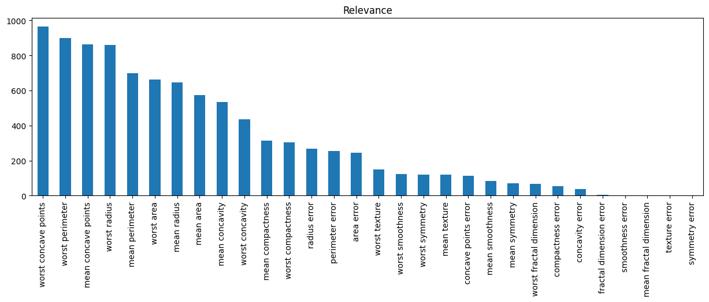
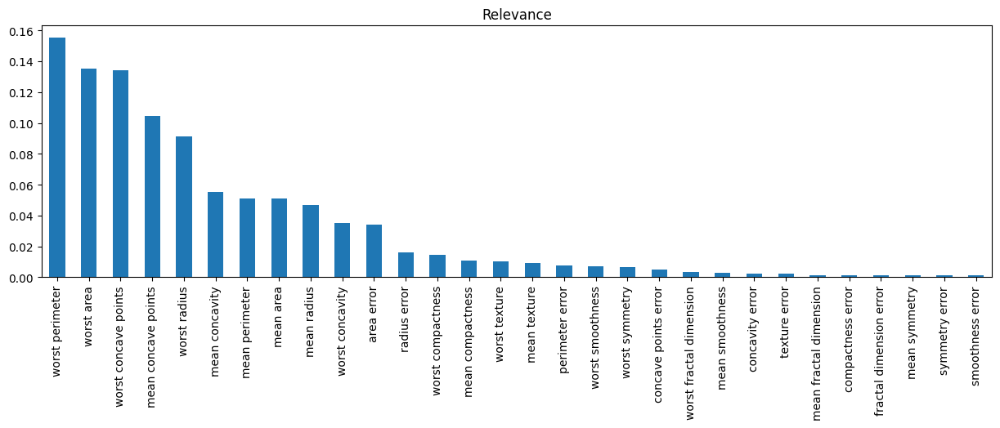

.. _mrmr:

.. currentmodule:: feature_engine.selection

MRMR - Minimum Redundancy Maximum Relevance
===========================================

:class:`MRMR()` selects features based on the Maximum Relevance Minimum Redundancy framework. In
this framework, features with a strong relationship with the target (high relevance), but weak
relationship with other predictor features (low redundancy) are favored and hence selected.

The MRMR algorithm obtains a measure of relevance and a measure of redundancy, and then it assigns
an importance score to each feature based on the difference or ratio between relevance and
redundancy. After that, it selects the features with the highest scores.

MRMR was first described in bioinformatics as a method to select features for microarray gene expression data,
and then expanded and popularized by Uber in the context of marketing models.

MRMR - Mechanism
----------------

The MRMR feature selection algorithm works as follows:

1. Determine the relevance of all predictor variables and select the feature with highest relevance.
2. Determine the redundancy between the remaining features and the selected in step 1.
3. Calculate the importance score as the ratio or difference between relevance and redundancy and select the feature with the maximum value: add it to the selected features.
4. Determine the mean redundancy between the remaining features and the features selected so far.
5. Calculate the importance score and select the feature with the maximum value: add it to the selected features.
6. Repeat 4 and 5 until the desired number of selected features is reached.

MRMR is an iterative algorithm. At each iteration, it determines the mean redundancy between the
remaining features and the features that were selected in previous rounds. With the redundancy,
it obtains a new measure of importance, and then it selects the feature with highest importance.

Note that you need to define the number of features to select.

Relevance
----------

:class:`MRMR()` has 3 strategies to determine feature relevance. To determine the relationship
of each feature with the target variable, :class:`MRMR()` obtains:

1. The F-statistic, which is derived from ANOVA if the target is discrete or correlation if the target is categorical.
2. The mutual information.
3. The importance derived from random forests.

The relevance is used to select the first feature and then to calculate the MRMR values at
each of the subsequent iterations.

F-statistic
~~~~~~~~~~~

The F-statistic determines the degree of linear association between the features and the target.
If the target is categorical, the F-statistic is calculated using Scikit-learn's `f_classif`
function. If the target is continuous, the F-statistic is determined using `f_regression`.

Note that in both cases, these statistic is useful when the features are continuous. For discrete
features, other tests should be used, like chi-square, which at the moment is not implemented.
So if your datasets contain both numerical and categorical variables, try the mutual information
or the importance derived from random forests instead.

Mutual information
~~~~~~~~~~~~~~~~~~

The mutual information is a measure that quantifies how much we know about one variable, by
examining the values of a second variable. In other words, it measures the non-linear association
between features. Higher values indicate stronger associations.

:class:`MRMR()` uses scikit-learn's `mutual_info_classif` to determine the association between
features and a discrete target, or `mutual_info_regression`, to calculate the association between
features and a continuous target.

The mutual information is calculated differently for continuous and discrete variables, so it is
important to flag categorical and discrete through the `discrete_features` parameter.

Random Forests
~~~~~~~~~~~~~~

Random forests can automatically assign a measure of relevance, by computing the degree of impurity
reduction returned by each feature at each node of the tree, and then across the forest. Hence, the importance derived
from random forests offers a good approximation of the relationship between features and target.

Note however that if the features are highly correlated, the importance derived from random forests
will be diluted.

Redundancy
----------

Redundant features are those that are highly correlated, or show high dependency with other features in
the dataset.

:class:`MRMR()` has 2 strategies to determine the relationship of the variables to other variables in
the dataset: Pearson's correlation coefficient or mutual information.

Correlation
~~~~~~~~~~~

To determine each features's redundancy, :class:`MRMR()` obtains Pearson's correlation
coefficient between each feature and the features selected in previous rounds. Next, it
takes the average of the absolute value of the coefficients.

Note that correlation assumes that all features are continuous, so this metric may returned biased
results for categorical and discrete variables.

Mutual information
~~~~~~~~~~~~~~~~~~

To determine each features's redundancy, :class:`MRMR()` caclulates the mutual information
between each feature and the features selected in former iterations, and then takes the average.

MRMR
----

The MRMR method obtains a measure of feature importance by comparing its relevance to the target
and its redundancy with other, previously selected features.

High feature importance is obtained when the relevance is high and the redundancy is low.

A value of MRMR can be obtained through the difference or the ratio between relevance and
redundancy.

The following schemes are supported by :class:`MRMR()`:

.. csv-table::
    :header: Method, Relevance, Redundance, Scheme

    'MID', Mutual information, Mutual information, Difference,
    'MIQ', Mutual information, Mutual information, Ratio,
    'FCD', F-Statistic, Correlation, Difference,
    'FCQ', F-Statistic, Correlation, Ratio,
    'RFCQ', Random Forests, Correlation, Ratio,

Feature selection
-----------------

:class:`MRMR()` selects as many features as indicated in the parameter `'max_features'`.
If left to `None`, :class:`MRMR()` will select 20% of the features seen in the training
dataset used during fit.

Note that the number of features to select is arbitrary.

MRMR is fast to compute if using the F-statistic and correlation. However, these statistical
values are suitable to establish linear relationships.

To detect non-linear relationships, using the variant that determines relevance through
random forests derived feature importance might be better. Mutual information inherently
detects linear and non-linear associations, but for continuous features it takes longer to
compute, impacting the speed of selection of MRMR.

Python examples
---------------

Let's see how to implement :class:`MRMR()`. We'll start by using Scikit-learn's breast cancer
dataset. The target variable is binary, representing malignant or benign tumors. All
predictor variables are continuous.

Let's import the required libraries and classes:

.. code:: python

    import pandas as pd
    import matplotlib.pyplot as plt
    from sklearn.datasets import load_breast_cancer
    from sklearn.model_selection import train_test_split
    from feature_engine.selection import MRMR

Let's now load the cancer diagnostic data and display its top rows:

.. code:: python

    X, y = load_breast_cancer(return_X_y=True, as_frame=True)
    y = y.map({0:1, 1:0})
    print(X.head())

In the following output, we see the top 5 rows of the dataset:

.. code:: python

       mean radius  mean texture  mean perimeter  mean area  mean smoothness  \
    0        17.99         10.38          122.80     1001.0          0.11840
    1        20.57         17.77          132.90     1326.0          0.08474
    2        19.69         21.25          130.00     1203.0          0.10960
    3        11.42         20.38           77.58      386.1          0.14250
    4        20.29         14.34          135.10     1297.0          0.10030

       mean compactness  mean concavity  mean concave points  mean symmetry  \
    0           0.27760          0.3001              0.14710         0.2419
    1           0.07864          0.0869              0.07017         0.1812
    2           0.15990          0.1974              0.12790         0.2069
    3           0.28390          0.2414              0.10520         0.2597
    4           0.13280          0.1980              0.10430         0.1809

       mean fractal dimension  ...  worst radius  worst texture  worst perimeter  \
    0                 0.07871  ...         25.38          17.33           184.60
    1                 0.05667  ...         24.99          23.41           158.80
    2                 0.05999  ...         23.57          25.53           152.50
    3                 0.09744  ...         14.91          26.50            98.87
    4                 0.05883  ...         22.54          16.67           152.20

       worst area  worst smoothness  worst compactness  worst concavity  \
    0      2019.0            0.1622             0.6656           0.7119
    1      1956.0            0.1238             0.1866           0.2416
    2      1709.0            0.1444             0.4245           0.4504
    3       567.7            0.2098             0.8663           0.6869
    4      1575.0            0.1374             0.2050           0.4000

       worst concave points  worst symmetry  worst fractal dimension
    0                0.2654          0.4601                  0.11890
    1                0.1860          0.2750                  0.08902
    2                0.2430          0.3613                  0.08758
    3                0.2575          0.6638                  0.17300
    4                0.1625          0.2364                  0.07678

    [5 rows x 30 columns]

Let's now split the data into train and test sets:

.. code:: python

    X_train, X_test, y_train, y_test = train_test_split(
        X, y, test_size=0.3, random_state=0)

The F-Statistic framework: linear associations
~~~~~~~~~~~~~~~~~~~~~~~~~~~~~~~~~~~~~~~~~~~~~~

In this example, we want :class:`MRMR()` to determine feature relevance by using the F-statistic
obtained with ANOVA, and the redundancy by examining the Pearson's correlation coefficient
among features. The importance is obtained as the ratio between relevance and redundancy.

Let's set up :class:`MRMR()`:

.. code:: python

    sel = MRMR(method="FCQ", regression=False)
    sel.fit(X, y)

With `fit()`, :class:`MRMR()` computed the relevance, redundancy, MRMR or feature importance
and determined which features should be selected. Note that this is an iterative process.

We can print out the relevance as follows:

.. code:: python

    sel.relevance_

In the following output, we see an array with the F-statistic obtained from ANOVA:

.. code:: python

    array([6.46981021e+02, 1.18096059e+02, 6.97235272e+02, 5.73060747e+02,
           8.36511234e+01, 3.13233079e+02, 5.33793126e+02, 8.61676020e+02,
           6.95274435e+01, 9.34592949e-02, 2.68840327e+02, 3.90947023e-02,
           2.53897392e+02, 2.43651586e+02, 2.55796780e+00, 5.32473391e+01,
           3.90144816e+01, 1.13262760e+02, 2.41174067e-02, 3.46827476e+00,
           8.60781707e+02, 1.49596905e+02, 8.97944219e+02, 6.61600206e+02,
           1.22472880e+02, 3.04341063e+02, 4.36691939e+02, 9.64385393e+02,
           1.18860232e+02, 6.64439606e+01])

We can instead create a bar plot with the relevance:

.. code:: python

    pd.Series(sel.relevance_, index=sel.variables_).sort_values(
        ascending=False).plot.bar(figsize=(15, 4))
    plt.title("Relevance")
    plt.show()

In the following image, we see the F-statistic per feature:

We can see the subset of features that will be removed as follows:

.. code:: python

    sel.features_to_drop_

In the following output we see the features that were not selected:

.. code:: python

    ['mean radius',
     'mean texture',
     'mean area',
     'mean smoothness',
     'mean compactness',
     'mean concavity',
     'mean symmetry',
     'mean fractal dimension',
     'radius error',
     'texture error',
     'perimeter error',
     'area error',
     'smoothness error',
     'compactness error',
     'concavity error',
     'concave points error',
     'symmetry error',
     'fractal dimension error',
     'worst texture',
     'worst smoothness',
     'worst compactness',
     'worst concavity',
     'worst symmetry',
     'worst fractal dimension']

Finally, we can go ahead and retain the selected features like this:

.. code:: python

    Xtr = sel.transform(X_test)
    print(Xtr.head())

In the following output we see the test set with a reduced number of features:

.. code:: python

         mean perimeter  mean concave points  worst radius  worst perimeter  \
    512           88.64              0.08172         16.41           113.30
    457           84.10              0.02068         14.35            91.29
    439           89.59              0.02652         14.91            96.53
    298           91.22              0.01374         16.22           105.80
    37            82.61              0.02923         13.30            84.46

         worst area  worst concave points
    512       844.4               0.20510
    457       632.9               0.06005
    439       688.9               0.08216
    298       819.7               0.07530
    37        545.9               0.05013

In the final dataset we only have the "relevant features". And by relevant, we mean those
with high association with the target, and low association with other features.

Since we left the parameter `'max_features'` as `None, :class:`MRMR()` selected 20% of the
features in the training set. The training set contained 30 features, so 6 features remain
after applying MRMR.

Using random forests
~~~~~~~~~~~~~~~~~~~~

When we have categorical or discrete variables, or want to examine non-linear associations, we
can determine the relevance using the random forests derived feature importance.

:class:`MRMR()` will train a random forest using grid search over a hyperparameter grid that
can be specified by the user. The redundancy is determined using Pearson's
correlation coefficient.

In a similar way, the MRMR feature selection algorithm will compute the feature importance as the
ratio between the random forest importance and Pearson's correlation coefficient.

Lets, set up :class:`MRMR()` to use a random forests classifier for the relevance. Note that we
need to specify a cross-validation scheme, a performance metric, and we have the option to pass
a grid with hyperparameters to optimize:

.. code:: python

    sel = MRMR(
        method="RFCQ",
        scoring="roc_auc",
        param_grid = {"n_estimators": [5, 50, 500], "max_depth":[1,2,3]},
        cv=3,
        regression=False,
        random_state=42,
    )

    sel.fit(X, y)

We can now go ahead and plot the relevance:

.. code:: python

    pd.Series(sel.relevance_, index=sel.variables_).sort_values(
        ascending=False).plot.bar(figsize=(15, 4))
    plt.title("Relevance")
    plt.show()

In the following image we see the relationship between features and the target derived from
random forests:

We can now go ahead and select relevant features using the `transform()` method.

.. code:: python

    Xtr = sel.transform(X_test)
    print(Xtr.head())

In the following output we see the test set with a reduced number of features:

.. code:: python

         mean concave points  fractal dimension error  worst radius  \
    512              0.08172                 0.004005         16.41
    457              0.02068                 0.001828         14.35
    439              0.02652                 0.002104         14.91
    298              0.01374                 0.001957         16.22
    37               0.02923                 0.001777         13.30

         worst perimeter  worst area  worst concave points
    512           113.30       844.4               0.20510
    457            91.29       632.9               0.06005
    439            96.53       688.9               0.08216
    298           105.80       819.7               0.07530
    37             84.46       545.9               0.05013

In the final dataset we only have the relevant features. Again, we selected 20% of the
features in the training set.

Mutual information
~~~~~~~~~~~~~~~~~~

If we have non-linear associations and / or categorical or discrete variables, a better
option is to obtain the relevance and redundancy utilizing mutual information.

The mutual information is calculated differently for numerical and categorical variables,
so it is best to flag discrete features with a boolean array.

For this demo, we'll use the California housing dataset to predict house prices, and we'll
treat 3 variables as discrete. Let's load the data:

.. code:: python

    from sklearn.datasets import fetch_california_housing

    X, y = fetch_california_housing(return_X_y=True, as_frame=True)
    X[['AveRooms', 'AveBedrms', 'AveOccup']] = X[['AveRooms', 'AveBedrms', 'AveOccup']].astype(int)

    print(X.head())

In the following output, we see the first 5 rows of the dataset:

.. code:: python

       MedInc  HouseAge  AveRooms  AveBedrms  Population  AveOccup  Latitude  \
    0  8.3252      41.0         6          1       322.0         2     37.88
    1  8.3014      21.0         6          0      2401.0         2     37.86
    2  7.2574      52.0         8          1       496.0         2     37.85
    3  5.6431      52.0         5          1       558.0         2     37.85
    4  3.8462      52.0         6          1       565.0         2     37.85

       Longitude
    0    -122.23
    1    -122.22
    2    -122.24
    3    -122.25
    4    -122.25

Now, we'll set up :class:`MRMR()` to use mutual information to determine both redundancy and relevance,
and the importance score as the ratio (or quotient, hence the Q in MIQ) between the two.

Note the boolean vector with `True` in the position of the categorical variables  'AveRooms', 'AveBedrms' and 'AveOccup':

.. code:: python

    sel = MRMR(
        variables = ['MedInc', 'HouseAge', 'AveRooms', 'AveBedrms', 'Population', 'AveOccup'],
        method="MIQ",
        max_features=4,
        discrete_features=[False, False, True, True, False, True],
        regression=True,
        random_state=42,
    )

    sel.fit(X,y)

To select features we use `transform()`:

.. code:: python

    Xtr = sel.transform(X)
    print(Xtr.head())

Note that the variables latitude and longitude, which were not part of the set of features
examined by MRMR are retained in the transformed dataset:

.. code:: python

       MedInc  HouseAge  AveBedrms  AveOccup  Latitude  Longitude
    0  8.3252      41.0          1         2     37.88    -122.23
    1  8.3014      21.0          0         2     37.86    -122.22
    2  7.2574      52.0          1         2     37.85    -122.24
    3  5.6431      52.0          1         2     37.85    -122.25
    4  3.8462      52.0          1         2     37.85    -122.25

For compatibility with Scikit-learn, :class:`MRMR()` also supports the
method `get_support()`:

.. code:: python

    sel.get_support()

which returns the following output:

.. code:: python

    [True, True, False, True, False, True, True, True]

Considerations
--------------

The maximum relevance minimum redundancy feature selection method is fast, and therefore allows
scrutinizing fairly big datasets. Computing the F-statistic is fast. That's one of the reasons
that made it gain popularity.

Additional resources
--------------------

For more details about this and other feature selection methods check out these resources:

.. figure::  ../../images/fsml.png
   :width: 300
   :figclass: align-center
   :align: left
   :target: https://www.trainindata.com/p/feature-selection-for-machine-learning

   Feature Selection for Machine Learning

|
|
|
|
|
|
|
|
|
|

Or read our book:

.. figure::  ../../images/fsmlbook.png
   :width: 200
   :figclass: align-center
   :align: left
   :target: https://www.trainindata.com/p/feature-selection-in-machine-learning-book

   Feature Selection in Machine Learning

|
|
|
|
|
|
|
|
|
|
|
|
|
|

Both our book and course are suitable for beginners and more advanced data scientists
alike. By purchasing them you are supporting Sole, the main developer of Feature-engine.