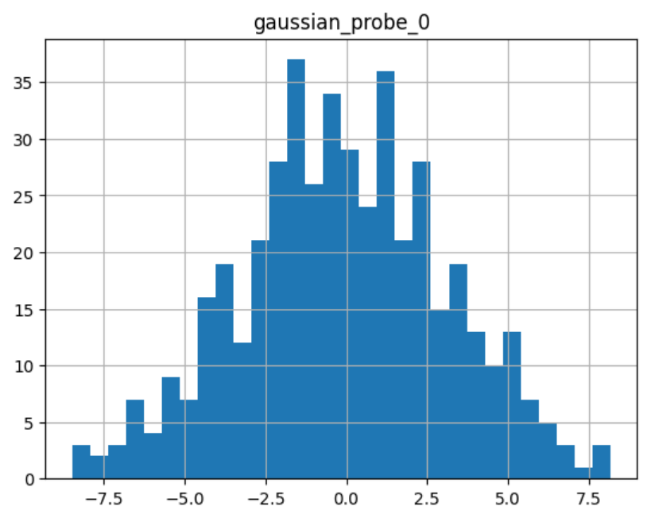
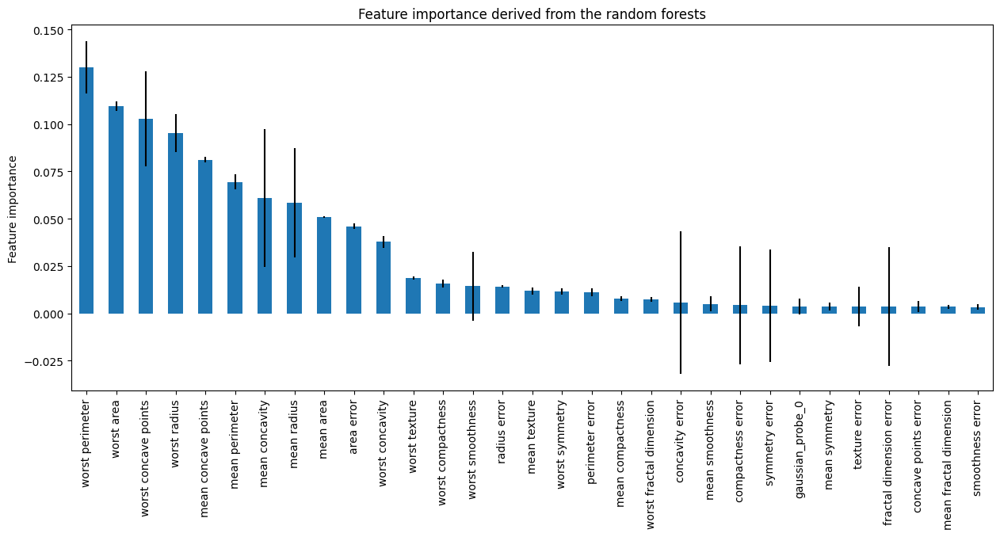
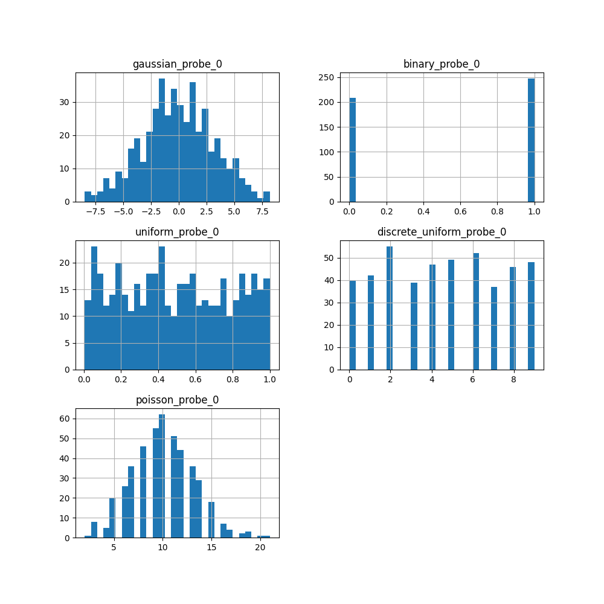
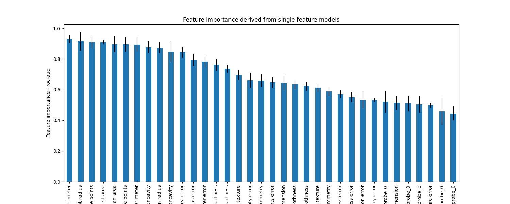

.. _probe_features:

.. py:currentmodule:: feature_engine.selection

ProbeFeatureSelection
=====================

:class:`ProbeFeatureSelection()` adds one or more random variables to the dataframe. Next
it derives the feature importance for each variable, including the probe features. Finally,
it removes those features whose importance is lower than the probes.

Deriving feature importance
---------------------------

:class:`ProbeFeatureSelection()` has 2 strategies to derive feature importance.

In the `collective` strategy, :class:`ProbeFeatureSelection()` trains one machine learning
model using all the variables plus the probe features, and then derives the feature importance
from the fitted model. This feature importance is given by the coefficients of
linear models or the feature importance derived from tree-based algorithms.

In the `individual feature` strategy, :class:`ProbeFeatureSelection()` trains one machine
learning model per feature and per probe, and then, the feature importance is given by the
performance of that single feature model. Here, the importance is given by any performance
metric chosen by you.

Both strategies have advantages and limitations. If the features are correlated, the
feature importance value returned by the coefficients of a linear model, or derived from
a decision tree, will appear to be smaller than if the feature was used to train a model
individually. Hence, potentially important features might be lost to the probes due to these
seemingly low importance values resulting from correlation.

On the other hand, training models using individual features, does not allow to detect
feature interactions and does not remove redundant variables.

In addition, keep in mind that the importance derived tree-based models is biased towards
features with high cardinality. Hence, continuous features will seem to be more important
than discrete variables. If your features are discrete and your probes continuous,
you could be removing important features accidentally.

Selecting features
------------------

After assigning a value of feature importance to each feature, including the probes,
:class:`ProbeFeatureSelection()` will select those variables whose importance is greater
than:

- the mean importance of all probes
- the maximum importance of all probes
- the mean plus 3 times the standard deviation of the importance of the probes

The threshold for feature selection can be controlled through the parameter `threshold`
when setting up the transformer.

Feature selection process
-------------------------

This is how :class:`ProbeFeatureSelection()` selects features using the `collective`
strategy:

1. Add 1 or more random features to the dataset
2. Train a machine learning model using all features including the random ones
3. Derive feature importance from the fitted model
4. Take the average (or maximum or mean+std) importance of the random features
5. Select features whose importance is greater than the importance of the random variables (step 4)

This is how :class:`ProbeFeatureSelection()` selects features using the `individual feature`
strategy:

1. Add 1 or more random features to the dataset
2. Train a machine learning per feature and per probe
3. Determine the feature importance as the performance of the single feature model
4. Take the average (or maximum or mean+std) importance of the random features
5. Select features whose importance is greater than the importance of the random variables (step 4)

Rationale of probe feature selection
------------------------------------

One of the primary goals of feature selection is to remove noise from the dataset. A
randomly generated variable, i.e., probe feature, inherently possesses a high level of
noise. Consequently, any variable with less importance than a probe feature is assumed
to be noise and can be discarded from the dataset.

Distribution of the probe features
----------------------------------

When initiating the :class:`ProbeFeatureSelection()` class, you have the option to select
which distribution is to be assumed to create the probe feature(s), as well as the number of
probe features to create.

The possible distributions are 'normal', 'binary', 'uniform', 'discrete_uniform',
'poisson', or 'all'. 'all' creates `n_probe` features per each of the aforementioned
distributions. So, if you selected 'all' and are creating 2 probe features, you will have
2 probes for each distribution.

The distribution matters. Tree-based models tend to give more importance to highly cardinal
features. Hence, probes created from a uniform or normal distribution will display a greater
importance than probes extracted from a binomial, poisson or discrete uniform distributions
when using these models.

Python examples
---------------

Let's see how to use this transformer to select variables from UC Irvine's Breast Cancer
Wisconsin (Diagnostic) dataset, which can be found `here`_. We will use Scikit-learn to load
the dataset. This dataset concerns breast cancer diagnoses. The target variable is binary, i.e.,
malignant or benign. The data is solely comprised of numerical data.

.. _here: https://archive.ics.uci.edu/ml/datasets/Breast+Cancer+Wisconsin+(Diagnostic)

Let's import the required libraries and classes:

.. code:: python

    import matplotlib.pyplot as plt
    import pandas as pd
    from sklearn.datasets import load_breast_cancer
    from sklearn.ensemble import RandomForestClassifier
    from sklearn.model_selection import train_test_split
    from feature_engine.selection import ProbeFeatureSelection

Let's now load the cancer diagnostic data:

.. code:: python

    cancer_X, cancer_y = load_breast_cancer(return_X_y=True, as_frame=True)

Let's check the shape of `cancer_X`:

.. code:: python

    print(cancer_X.shape)

We see that the dataset is comprised of 569 observations and 30 features:

.. code:: python

    (569, 30)

Let's now split the data into train and test sets:

.. code:: python

    # separate train and test sets
    X_train, X_test, y_train, y_test = train_test_split(
        cancer_X,
        cancer_y,
        test_size=0.2,
        random_state=3
    )

    X_train.shape, X_test.shape

We see the size of the datasets below. Note that there are 30 features in both the
training and test sets.

.. code:: python

    ((455, 30), (114, 30))

Now, we set up :class:`ProbeFeatureSelection()` to select features using the `collective`
strategy.

We will pass  `RandomForestClassifier()` as the :code:`estimator`. We will use `precision`
as the :code:`scoring` parameter and `5` as :code:`cv` parameter, both parameters to be
used in the cross validation.

In this example, we will introduce just 1 random feature with a normal distribution. Thus,
we pass `1` for the :code:`n_probes` parameter and `normal` as the :code:`distribution`.

.. code:: python

    sel = ProbeFeatureSelection(
        estimator=RandomForestClassifier(),
        variables=None,
        scoring="precision",
        n_probes=1,
        distribution="normal",
        cv=5,
        random_state=150,
        confirm_variables=False
    )

    sel.fit(X_train, y_train)

With :code:`fit()`, the transformer:

- creates `n_probes` number of probe features using provided distribution(s)
- uses cross-validation to fit the provided estimator
- calculates the feature importance score for each variable, including probe features
- if there are multiple probe features, the transformer calculates the average importance score
- identifies features to drop because their importance scores are less than that of the probe feature(s)

Analysing the probes
~~~~~~~~~~~~~~~~~~~~

In the attribute :code:`probe_features`, we find the pseudo-randomly generated variable(s):

.. code:: python

    sel.probe_features_.head()

.. code:: python

           gaussian_probe_0
    0         -0.694150
    1          1.171840
    2          1.074892
    3          1.698733
    4          0.498702

We can go ahead and display a histogram of the probe feature:

.. code:: python

    sel.probe_features_.hist(bins=30)

As we can see, it shows a normal distribution:

|

Analysing the feature importance
~~~~~~~~~~~~~~~~~~~~~~~~~~~~~~~~

The attribute :code:`feature_importances_` shows each variable's feature importance:

.. code:: python

    sel.feature_importances_.head()

These are the importance for the first 5 features:

.. code:: python

    mean radius        0.058463
    mean texture       0.011953
    mean perimeter     0.069516
    mean area          0.050947
    mean smoothness    0.004974
    dtype: float64

At the end of the series, we see the importance of the probe feature:

.. code:: python

    sel.feature_importances_.tail()

These are the importance of the last 5 features including the probe:

.. code:: python

    worst concavity            0.037844
    worst concave points       0.102769
    worst symmetry             0.011587
    worst fractal dimension    0.007456
    gaussian_probe_0           0.003783
    dtype: float64

In the attribute :code:`feature_importances_std_` we find the standard deviation of the
feature importance, which we can use for data analysis:

.. code:: python

    sel.feature_importances_std_.head()

These are the standard deviations for the first 5 features:

.. code:: python

    mean radius        0.013648
    mean texture       0.002571
    mean perimeter     0.025189
    mean area          0.010173
    mean smoothness    0.001650
    dtype: float64

We can go ahead and plot bar plots with the feature importance and the standard deviation:

.. code:: python

    r = pd.concat([
        sel.feature_importances_,
        sel.feature_importances_std_
    ], axis=1)

    r.columns = ["mean", "std"]

    r.sort_values("mean", ascending=False)["mean"].plot.bar(
        yerr=[r['std'], r['std']], subplots=True, figsize=(15,6)
    )
    plt.title("Feature importance derived from the random forests")
    plt.ylabel("Feature importance")
    plt.show()

In the following image, we see the importance of each feature, including the probe:

|

Selected features
~~~~~~~~~~~~~~~~~

In the attribute :code:`features_to_drop_`, we find the variables that were not selected:

.. code:: python

    sel.features_to_drop_

These are the variables that will be removed from the dataframe:

.. code:: python

    ['mean symmetry',
     'mean fractal dimension',
     'texture error',
     'smoothness error',
     'concave points error',
     'fractal dimension error']

We see that the :code:`features_to_drop_` have feature importance scores that are less
than the probe feature's score:

.. code:: python

    sel.feature_importances_.loc[sel.features_to_drop_+["gaussian_probe_0"]]

The previous command returns the following output:

.. code:: python

    mean symmetry              0.003698
    mean fractal dimension     0.003455
    texture error              0.003595
    smoothness error           0.003333
    concave points error       0.003548
    fractal dimension error    0.003576
    gaussian_probe_0           0.003783

Dropping features from the data
~~~~~~~~~~~~~~~~~~~~~~~~~~~~~~~

With :code:`transform()`, we can go ahead and drop the six features with feature importance score
smaller than `gaussian_probe_0` variable:

.. code:: python

    Xtr = sel.transform(X_test)

    Xtr.shape

The final shape of the data after removing the features:

.. code:: python

    (114, 24)

Getting the name of the resulting features
~~~~~~~~~~~~~~~~~~~~~~~~~~~~~~~~~~~~~~~~~~

And, finally, we can also obtain the names of the features in the final transformed dataset:

.. code:: python

    sel.get_feature_names_out()

In the following output we see the name of the features that will be present in the
transformed datasets:

.. code:: python

    ['mean radius',
     'mean texture',
     'mean perimeter',
     'mean area',
     'mean smoothness',
     'mean compactness',
     'mean concavity',
     'mean concave points',
     'radius error',
     'perimeter error',
     'area error',
     'compactness error',
     'concavity error',
     'symmetry error',
     'worst radius',
     'worst texture',
     'worst perimeter',
     'worst area',
     'worst smoothness',
     'worst compactness',
     'worst concavity',
     'worst concave points',
     'worst symmetry',
     'worst fractal dimension']

For compatibility with Scikit-learn selection transformers, :class:`ProbeFeatureSelection()`
also supports the method `get_support()`:

.. code:: python

    sel.get_support()

which returns the following output:

.. code:: python

    [True, True, True, True, True, True, True, True, False, False, True, False, True,
     True, False, True, True, False, True, False, True, True, True, True, True, True,
     True, True, True, True]

Using several probe features
~~~~~~~~~~~~~~~~~~~~~~~~~~~~

Let's now repeat the selection process, but using more than 1 probe feature.

.. code:: python

    sel = ProbeFeatureSelection(
        estimator=RandomForestClassifier(),
        variables=None,
        scoring="precision",
        n_probes=1,
        distribution="all",
        cv=5,
        random_state=150,
        confirm_variables=False
    )

    sel.fit(X_train, y_train)

Let's display the random features that the transformer created:

.. code:: python

    sel.probe_features_.head()

Here we find some example values of the probe features:

.. code:: python

       gaussian_probe_0  binary_probe_0  uniform_probe_0  \
    0         -0.694150               1         0.983610
    1          1.171840               1         0.765628
    2          1.074892               1         0.991439
    3          1.698733               0         0.668574
    4          0.498702               0         0.192840

       discrete_uniform_probe_0  poisson_probe_0
    0                         2                8
    1                         3                3
    2                         0                7
    3                         8                2
    4                         3               13

Let's go ahead and plot histograms:

.. code:: python

    sel.probe_features_.hist(bins=30, figsize=(10,10))
    plt.show()

In the histograms we recognise the 5 well defined distributions:

Let's display the importance of the random features

.. code:: python

    sel.feature_importances_.tail()

.. code:: python

    gaussian_probe_0            0.004600
    binary_probe_0              0.000366
    uniform_probe_0             0.002541
    discrete_uniform_probe_0    0.001124
    poisson_probe_0             0.001759
    dtype: float64

We see that the binary feature has an extremely low importance, hence, when we take the
average, the value is so small, that no feature will be dropped (remember random forests
favouring highly cardinal features?):

.. code:: python

    sel.features_to_drop_

The previous command returns and empty list:

.. code:: python

    []

It is important to select a suitable probe feature distribution when trying to remove variables.
If most variables are continuous, introduce features with normal and uniform distributions.
If you have one hot encoded features or sparse matrices, binary features might be a better
option.

Changing the probe importance threshold
~~~~~~~~~~~~~~~~~~~~~~~~~~~~~~~~~~~~~~~

We can make the selection process more aggressive by using the maximum of the probe features
or the mean plus 3 times the standard deviation as threshold to select features.

In the following example, we'll use the same random forest and the same probe features,
but this time, we'll select features whose importance is greater than the mean plus 3 times
the standard deviation of the probes:

.. code:: python

    sel = ProbeFeatureSelection(
        estimator=RandomForestClassifier(),
        variables=None,
        scoring="precision",
        n_probes=1,
        distribution="all",
        threshold = "mean_plus_std",
        cv=5,
        random_state=150,
        confirm_variables=False
    )

    sel.fit(X_train, y_train)

We now inspect the variables that will be removed:

.. code:: python

    sel.features_to_drop_

We see that now, several variables will be removed from the dataset:

.. code:: python

    ['mean smoothness',
     'mean symmetry',
     'mean fractal dimension',
     'texture error',
     'smoothness error',
     'compactness error',
     'concave points error',
     'symmetry error',
     'fractal dimension error']

Using the individual feature strategy
~~~~~~~~~~~~~~~~~~~~~~~~~~~~~~~~~~~~~

We will now select features by training a random forest per feature and using the roc-auc
obtained from that model as a measure of feature importance:

.. code:: python

    sel = ProbeFeatureSelection(
        estimator=RandomForestClassifier(n_estimators=5, random_state=1),
        variables=None,
        collective=False,
        scoring="roc_auc",
        n_probes=1,
        distribution="all",
        cv=5,
        random_state=150,
        confirm_variables=False
    )

    sel.fit(X_train, y_train)

We can now go ahead and plot the feature importance, including that of the probes:

.. code:: python

    r = pd.concat([
        sel.feature_importances_,
        sel.feature_importances_std_
    ], axis=1)

    r.columns = ["mean", "std"]

    r.sort_values("mean", ascending=False)["mean"].plot.bar(
        yerr=[r['std'], r['std']], subplots=True, figsize=(15,6)
    )
    plt.title("Feature importance derived from single feature models")
    plt.ylabel("Feature importance - roc-auc")
    plt.show()

In the following image we see the feature importance, including the probes:

When assessed individually, each feature seems to have a greater importance. Note that
many of the features return roc-auc that are not significantly different from the probes
(error bars overlaps). So, even if the transformer would not drop those features, we
could decide to discard them after analysis of this plot.

Alternatively, we can set the threshold to be more aggressive and drop features whose
importance is smaller than the mean plus three times the standard deviation of the
importance of the probes, as follows:

.. code:: python

    sel = ProbeFeatureSelection(
        estimator=RandomForestClassifier(n_estimators=5, random_state=1),
        variables=None,
        collective=False,
        scoring="roc_auc",
        n_probes=1,
        distribution="all",
        threshold = "mean_plus_std",
        cv=5,
        random_state=150,
        confirm_variables=False
    ).fit(X_train, y_train)

Additional resources
--------------------

More info about this method can be found in these resources:

- `Kaggle Tips for Feature Engineering and Selection <https://www.youtube.com/watch?v=RtqtM1UJfZc&t=3150s>`_, by Gilberto Titericz.
- `Feature Selection: Beyond feature importance? <https://www.kdnuggets.com/2019/10/feature-selection-beyond-feature-importance.html>`_, KDDNuggets.

For more details about this and other feature selection methods check out these resources:

.. figure::  ../../images/fsml.png
   :width: 300
   :figclass: align-center
   :align: left
   :target: https://www.trainindata.com/p/feature-selection-for-machine-learning

   Feature Selection for Machine Learning

|
|
|
|
|
|
|
|
|
|

Or read our book:

.. figure::  ../../images/fsmlbook.png
   :width: 200
   :figclass: align-center
   :align: left
   :target: https://www.trainindata.com/p/feature-selection-in-machine-learning-book

   Feature Selection in Machine Learning

|
|
|
|
|
|
|
|
|
|
|
|
|
|

Both our book and course are suitable for beginners and more advanced data scientists
alike. By purchasing them you are supporting Sole, the main developer of Feature-engine.