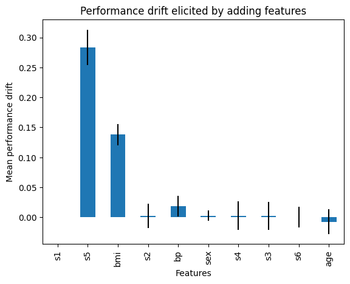
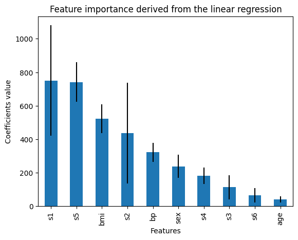

.. _recursive_addition:

.. currentmodule:: feature_engine.selection

RecursiveFeatureAddition
========================

:class:`RecursiveFeatureAddition` implements recursive feature addition (RFA), which is
a forward feature selection process.

This method starts by training a machine learning model using the entire set of variables
and then derives the feature importance from this model. The feature importance is given by
the coefficients of the linear models (`coef_` attribute) or the feature importance derived
from decision tree-based models (`feature_importances_` attribute).

In the next step, :class:`RecursiveFeatureAddition` trains a model only using the feature
with the highest importance and stores this model's performance.

Then, :class:`RecursiveFeatureAddition` adds the second most important feature, trains a
new machine learning model, and determines its performance. If the performance increases
beyond a threshold (compared to the previous model with just 1 feature), then the second
feature is deemed important and will be kept. Otherwise, it is removed.

:class:`RecursiveFeatureAddition` proceeds to evaluate the next most important feature
by adding it to the feature set, training a new machine learning model, obtaining its performance,
determining the performance change, and so on, until all features are evaluated.

Note that the feature importance derived from the initial machine learning model is used
just to rank features and thus determine the order in which the features will be added.
But whether to retain a feature is determined based on the increase in the performance of
the model after the feature addition.

Parameters
----------

:class:`RecursiveFeatureAddition` has 2 parameters that need to be determined somewhat arbitrarily by
the user: the first one is the machine learning model which performance will be evaluated. The
second is the threshold in the performance increase that needs to occur, to keep a feature.

RFA is not machine learning model agnostic. This means that the feature selection depends on
the model, and different models may have different subsets of optimal features. Thus, it is
recommended that you use the machine learning model that you finally intend to build.

Regarding the threshold, this parameter needs a bit of hand tuning. Higher thresholds will
return fewer features.

Python example
--------------

Let's see how to use this transformer with the diabetes dataset that comes in Scikit-learn.
First, we load the data:

.. code:: python

    import matplotlib.pyplot as plt
    import pandas as pd
    from sklearn.datasets import load_diabetes
    from sklearn.linear_model import LinearRegression
    from feature_engine.selection import RecursiveFeatureAddition

    # load dataset
    X, y = load_diabetes(return_X_y=True, as_frame=True)

    print(X.head())

In the following output we see the diabetes dataset:

.. code:: python

            age       sex       bmi        bp        s1        s2        s3  \
    0  0.038076  0.050680  0.061696  0.021872 -0.044223 -0.034821 -0.043401
    1 -0.001882 -0.044642 -0.051474 -0.026328 -0.008449 -0.019163  0.074412
    2  0.085299  0.050680  0.044451 -0.005670 -0.045599 -0.034194 -0.032356
    3 -0.089063 -0.044642 -0.011595 -0.036656  0.012191  0.024991 -0.036038
    4  0.005383 -0.044642 -0.036385  0.021872  0.003935  0.015596  0.008142

             s4        s5        s6
    0 -0.002592  0.019907 -0.017646
    1 -0.039493 -0.068332 -0.092204
    2 -0.002592  0.002861 -0.025930
    3  0.034309  0.022688 -0.009362
    4 -0.002592 -0.031988 -0.046641

Now, we set up :class:`RecursiveFeatureAddition` to select features based on the r2
returned by a Linear Regression model, using 3 fold cross-validation. In this case,
we leave the parameter `threshold` to the default value which is 0.01.

.. code:: python

    # initialize linear regression estimator
    linear_model = LinearRegression()

    # initialize feature selector
    tr = RecursiveFeatureAddition(estimator=linear_model, scoring="r2", cv=3)

With `fit()` the model finds the most useful features, that is, features that when added,
caused an increase in model performance bigger than 0.01. With `transform()`, the transformer
removes the features from the dataset.

.. code:: python

    Xt = tr.fit_transform(X, y)
    print(Xt.head())

Only 4 features were deemed important by recursive feature addition with linear regression:

.. code:: python

            bmi        bp        s1        s5
    0  0.061696  0.021872 -0.044223  0.019907
    1 -0.051474 -0.026328 -0.008449 -0.068332
    2  0.044451 -0.005670 -0.045599  0.002861
    3 -0.011595 -0.036656  0.012191  0.022688
    4 -0.036385  0.021872  0.003935 -0.031988

:class:`RecursiveFeatureAddition` stores the performance of the model trained using all
the features in its attribute:

.. code:: python

    # get the initial linear model performance, using all features
    tr.initial_model_performance_

In the following output we see the performance of the linear regression trained on the
entire dataset:

.. code:: python

    0.488702767247119

Evaluating feature importance
~~~~~~~~~~~~~~~~~~~~~~~~~~~~~

The coefficients of the linear regression are used to determine the initial feature importance
score, which is used to sort the features before applying the recursive addition process. We
can check out the feature importance as follows:

.. code:: python

    tr.feature_importances_

In the following output we see the feature importance derived from the linear model:

.. code:: python

    s1     750.023872
    s5     741.471337
    bmi    522.330165
    s2     436.671584
    bp     322.091802
    sex    238.619526
    s4     182.174834
    s3     113.965992
    s6      64.768417
    age     41.418041
    dtype: float64

The feature importance is obtained using cross-validation, so :class:`RecursiveFeatureAddition`
also stores the standard deviation of the feature importance:

.. code:: python

    tr.feature_importances_std_

In the following output we see the standard deviation of the feature importance:

.. code:: python

    age     18.217152
    sex     68.354719
    bmi     86.030698
    bp      57.110383
    s1     329.375819
    s2     299.756998
    s3      72.805496
    s4      47.925822
    s5     117.829949
    s6      42.754774
    dtype: float64

The selection procedure is based on whether adding a feature increases the performance of
a model compared to the same model without that feature. We can check out the performance
changes as follows:

..  code:: python

    # Get the performance drift of each feature
    tr.performance_drifts_

In the following output we see the changes in performance returned by adding each feature:

..  code:: python

    {'s1': 0,
     's5': 0.28371458794131676,
     'bmi': 0.1377714799388745,
     's2': 0.0023327265047610735,
     'bp': 0.018759914615172735,
     'sex': 0.0027996354657459643,
     's4': 0.002695149440021638,
     's3': 0.002683934134630306,
     's6': 0.000304067408860742,
     'age': -0.007387230783454768}

We can also check out the standard deviation of the performance drift:

..  code:: python

    # Get the performance drift of each feature
    tr.performance_drifts_std_

In the following output we see the standard deviation of the changes in performance
returned by adding each feature:

..  code:: python

    {'s1': 0,
     's5': 0.029336910701570382,
     'bmi': 0.01752426732750277,
     's2': 0.020525965661877265,
     'bp': 0.017326401244547558,
     'sex': 0.00867675077259389,
     's4': 0.024234566449074676,
     's3': 0.023391851139598106,
     's6': 0.016865740401721313,
     'age': 0.02042081611218045}

We can now plot the performance change with the standard deviation to identify importance
features:

..  code:: python

    r = pd.concat([
        pd.Series(tr.performance_drifts_),
        pd.Series(tr.performance_drifts_std_)
    ], axis=1
    )
    r.columns = ['mean', 'std']

    r['mean'].plot.bar(yerr=[r['std'], r['std']], subplots=True)

    plt.title("Performance drift elicited by adding features")
    plt.ylabel('Mean performance drift')
    plt.xlabel('Features')
    plt.show()

In the following image we see the change in performance resulting from adding each feature
to a model:

For comparison, we can plot the feature importance derived from the linear regression
together with the standard deviation:

..  code:: python

    r = pd.concat([
        tr.feature_importances_,
        tr.feature_importances_std_,
    ], axis=1
    )
    r.columns = ['mean', 'std']

    r['mean'].plot.bar(yerr=[r['std'], r['std']], subplots=True)

    plt.title("Feature importance derived from the linear regression")
    plt.ylabel('Coefficients value')
    plt.xlabel('Features')
    plt.show()

In the following image we see the feature importance determined by the coefficients of
the linear regression:

We see that both plots coincide in that `s1` and `s5` are the most important features.
However, note that from the feature importance plot we'd think that `s2` and `bp`
are important (their coefficient value is relatively big), however, adding them to a
model that already contains `s1`, `s5` and `bmi`, doesn't result in an increase in model performance.
This suggests that there might be correlation between `s2` or `bp` and some of the most
important features (`s1`, `s5` and `bmi`).

Checking out the eliminated features
~~~~~~~~~~~~~~~~~~~~~~~~~~~~~~~~~~~~

:class:`RecursiveFeatureAddition` stores the features that will be dropped based
on the given threshold:

..  code:: python

    # the features to drop
    tr.features_to_drop_

These features were not deemed important by the RFA process:

..  code:: python

    ['age', 'sex', 's2', 's3', 's4', 's6']

:class:`RecursiveFeatureAddition` also has the `get_support()` method that works exactly
like that of Scikit-learn's feature selection classes:

..  code:: python

    tr.get_support()

The output contains True for the features that are selected and False for those that will
be dropped:

..  code:: python

    [False, False, True, True, True, False, False, False, True, False]

And that's it! You now now how to select features by recursively adding them to a dataset.

Additional resources
--------------------

For more details about this and other feature selection methods check out these resources:

.. figure::  ../../images/fsml.png
   :width: 300
   :figclass: align-center
   :align: left
   :target: https://www.trainindata.com/p/feature-selection-for-machine-learning

   Feature Selection for Machine Learning

|
|
|
|
|
|
|
|
|
|

Or read our book:

.. figure::  ../../images/fsmlbook.png
   :width: 200
   :figclass: align-center
   :align: left
   :target: https://www.trainindata.com/p/feature-selection-in-machine-learning-book

   Feature Selection in Machine Learning

|
|
|
|
|
|
|
|
|
|
|
|
|
|

Both our book and course are suitable for beginners and more advanced data scientists
alike. By purchasing them you are supporting Sole, the main developer of Feature-engine.