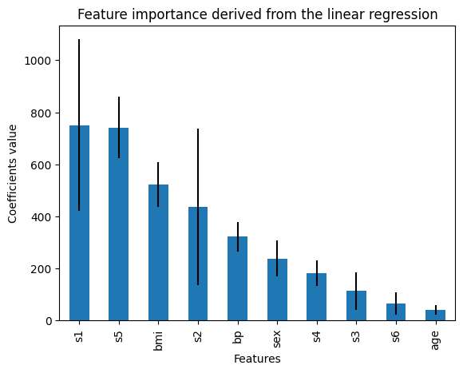

.. _recursive_elimination:

.. currentmodule:: feature_engine.selection

RecursiveFeatureElimination
============================

:class:`RecursiveFeatureElimination` implements recursive feature elimination. Recursive
feature elimination (RFE) is a backward feature selection process.

In Feature-engine's implementation of RFE, a feature will be kept or removed based on the
resulting change in model performance resulting of adding that feature to a
machine learning. This differs from Scikit-learn's implementation of
`RFE <https://scikit-learn.org/stable/modules/generated/sklearn.feature_selection.RFE.html>`_
where a feature will be kept or removed based on the feature importance derived from a
machine learning model via it's coefficients parameters or 'feature_importances_` attribute.

Feature-engine's implementation of RFE begins by training a model on the entire set of variables,
and storing its performance value. From this same model, :class:`RecursiveFeatureElimination`
derives the feature importance through the `coef_` or `feature_importances_` attributes, depending
if it is a linear model or a tree-based algorithm. These feature importance value is used
to sort the features by incraeasing performance, to determine the order in which the features
will be recursively removed. The least important features are removed first.

In the next step, :class:`RecursiveFeatureElimination` removes the least important feature
and trains a new machine learning model using the remaining variables. If the performance of
this model is worse than the performance from the previus model, then, the feature is kept
(because eliminating the feature caused a drop in model performance) otherwise, it removed.

:class:`RecursiveFeatureElimination` removes now the second least important feature, trains a new model,
compares its performance to the previous model, determines if it should remove or retain the feature,
and moves on to the next variable until it evaluates all the features in the dataset.

Note that, in Feature-engine's implementation of RFE, the feature importance is used
just to rank features and thus determine the order in which the features will be eliminated.
But whether to retain a feature is determined based on the decrease in the performance of the
model after the feature elimination.

By recursively eliminating features, RFE attempts to eliminate dependencies and
collinearity that may exist in the model.

Parameters
----------

:class:`RecursiveFeatureElimination` has 2 parameters that need to be determined somewhat arbitrarily by
the user: the first one is the machine learning model which performance will be evaluated. The
second is the threshold in the performance drop that needs to occur to remove a feature.

RFE is not machine learning model agnostic, this means that the feature selection depends on
the model, and different models may have different subsets of optimal features. Thus, it is
recommended that you use the machine learning model that you finally intend to build.

Regarding the threshold, this parameter needs a bit of hand tuning. Higher thresholds will
return fewer features.

Python example
--------------

Let's see how to use this transformer with the diabetes dataset that comes in Scikit-learn.
First, we load the data:

.. code:: python

    import matplotlib.pyplot as plt
    import pandas as pd
    from sklearn.datasets import load_diabetes
    from sklearn.linear_model import LinearRegression
    from feature_engine.selection import RecursiveFeatureElimination

    # load dataset
    X, y = load_diabetes(return_X_y=True, as_frame=True)

    print(X.head())

In the following output we see the diabetes dataset:

.. code:: python

            age       sex       bmi        bp        s1        s2        s3  \
    0  0.038076  0.050680  0.061696  0.021872 -0.044223 -0.034821 -0.043401
    1 -0.001882 -0.044642 -0.051474 -0.026328 -0.008449 -0.019163  0.074412
    2  0.085299  0.050680  0.044451 -0.005670 -0.045599 -0.034194 -0.032356
    3 -0.089063 -0.044642 -0.011595 -0.036656  0.012191  0.024991 -0.036038
    4  0.005383 -0.044642 -0.036385  0.021872  0.003935  0.015596  0.008142

             s4        s5        s6
    0 -0.002592  0.019907 -0.017646
    1 -0.039493 -0.068332 -0.092204
    2 -0.002592  0.002861 -0.025930
    3  0.034309  0.022688 -0.009362
    4 -0.002592 -0.031988 -0.046641

Now, we set up :class:`RecursiveFeatureElimination` to select features based on the r2
returned by a Linear Regression model, using 3 fold cross-validation. In this case,
we leave the parameter `threshold` to the default value which is 0.01.

.. code:: python

    # initialize linear regresion estimator
    linear_model = LinearRegression()

    # initialize feature selector
    tr = RecursiveFeatureElimination(estimator=linear_model, scoring="r2", cv=3)

With `fit()` the model finds the most useful features, that is, features that when removed
cause a drop in model performance bigger than 0.01. With `transform()`, the transformer
removes the features from the dataset.

.. code:: python

    Xt = tr.fit_transform(X, y)
    print(Xt.head())

Six features were deemed important by recursive feature elimination with linear regression:

.. code:: python

            sex       bmi        bp        s1        s2        s5
    0  0.050680  0.061696  0.021872 -0.044223 -0.034821  0.019907
    1 -0.044642 -0.051474 -0.026328 -0.008449 -0.019163 -0.068332
    2  0.050680  0.044451 -0.005670 -0.045599 -0.034194  0.002861
    3 -0.044642 -0.011595 -0.036656  0.012191  0.024991  0.022688
    4 -0.044642 -0.036385  0.021872  0.003935  0.015596 -0.031988

:class:`RecursiveFeatureElimination` stores the performance of the model trained using all
the features in its attribute:

.. code:: python

    # get the initial linear model performance, using all features
    tr.initial_model_performance_

In the following output we see the performance of the linear regression trained on the
entire dataset:

.. code:: python

    0.488702767247119

Evaluating feature importance
~~~~~~~~~~~~~~~~~~~~~~~~~~~~~

The coefficients of the linear regression are used to determine the initial feature importance
score, which is used to sort the features before applying the recursive elimination process. We
can check out the feature importance as follows:

.. code:: python

    tr.feature_importances_

In the following output we see the feature importance derived from the linear model:

.. code:: python

    age     41.418041
    s6      64.768417
    s3     113.965992
    s4     182.174834
    sex    238.619526
    bp     322.091802
    s2     436.671584
    bmi    522.330165
    s5     741.471337
    s1     750.023872
    dtype: float64

The feature importance is obtained using cross-validation, so :class:`RecursiveFeatureElimination`
also stores the standard deviation of the feature importance:

.. code:: python

    tr.feature_importances_std_

In the following output we see the standard deviation of the feature importance:

.. code:: python

    age     18.217152
    sex     68.354719
    bmi     86.030698
    bp      57.110383
    s1     329.375819
    s2     299.756998
    s3      72.805496
    s4      47.925822
    s5     117.829949
    s6      42.754774
    dtype: float64

The selection procedure is based on whether removing a feature decreases the performance of
a model compared to the same model with that feature. We can check out the performance
changes as follows:

..  code:: python

    # Get the performance drift of each feature
    tr.performance_drifts_

In the following output we see the changes in performance returned by removing each feature:

..  code:: python

    {'age': -0.0032800993162502845,
     's6': -0.00028194870232089997,
     's3': -0.0006751427734088544,
     's4': 0.00013890056776355575,
     'sex': 0.01195652626644067,
     'bp': 0.02863360798239445,
     's2': 0.012639242239088355,
     'bmi': 0.06630359039334816,
     's5': 0.10937354113435072,
     's1': 0.024318355833473526}

We can also check out the standard deviation of the performance drift:

..  code:: python

    # Get the performance drift of each feature
    tr.performance_drifts_std_

In the following output we see the standard deviation of the changes in performance
returned by eliminating each feature:

..  code:: python

    {'age': 0.013642261032787014,
     's6': 0.01678934235354838,
     's3': 0.01685859860738229,
     's4': 0.017977817100713972,
     'sex': 0.025202392033518706,
     'bp': 0.00841776123355417,
     's2': 0.008676750772593812,
     'bmi': 0.042463565656018436,
     's5': 0.046779680487815146,
     's1': 0.01621466049786452}

We can now plot the performance change with the standard deviation to identify importance
features:

..  code:: python

    r = pd.concat([
        pd.Series(tr.performance_drifts_),
        pd.Series(tr.performance_drifts_std_)
    ], axis=1
    )
    r.columns = ['mean', 'std']

    r['mean'].plot.bar(yerr=[r['std'], r['std']], subplots=True)

    plt.title("Performance drift elicited by adding features")
    plt.ylabel('Mean performance drift')
    plt.xlabel('Features')
    plt.show()

In the following image we see the change in performance resulting from removing each feature
from a model:

For comparison, we can plot the feature importance derived from the linear regression
together with the standard deviation:

..  code:: python

    r = pd.concat([
        tr.feature_importances_,
        tr.feature_importances_std_,
    ], axis=1
    )
    r.columns = ['mean', 'std']

    r['mean'].plot.bar(yerr=[r['std'], r['std']], subplots=True)

    plt.title("Feature importance derived from the linear regression")
    plt.ylabel('Coefficients value')
    plt.xlabel('Features')
    plt.show()

In the following image we see the feature importance determined by the coefficients of
the linear regression:

By comparing the performance in both plots, we can begin to understand which features
are important, and which ones could show some correlation to other variables in the data.
If a feature has a relatively big coefficient, but removing it does not change the model
performance, then, it might be correlated to another variable in the data.

Checking out the eliminated features
~~~~~~~~~~~~~~~~~~~~~~~~~~~~~~~~~~~~

:class:`RecursiveFeatureElimination` also stores the features that will be dropped based
on the given threshold.

..  code:: python

    # the features to remove
    tr.features_to_drop_

These features were not deemed important by the RFE process:

..  code:: python

    ['age', 's3', 's4', 's6']

:class:`RecursiveFeatureElimination`  also has the `get_support()` method that works exactly
like that of Scikit-learn's feature selection classes:

..  code:: python

    tr.get_support()

The output contains True for the features that are selected and False for those that will
be dropped:

..  code:: python

    [False, True, True, True, True, True, False, False, True, False]

And that's it! You now now how to select features by recursively removing them to a dataset.

Additional resources
--------------------

More details on recursive feature elimination in this article:

- `Recursive feature elimination with Python <https://www.blog.trainindata.com/recursive-feature-elimination-with-python/>`_

For more details about this and other feature selection methods check out these resources:

For more details about this and other feature selection methods check out these resources:

.. figure::  ../../images/fsml.png
   :width: 300
   :figclass: align-center
   :align: left
   :target: https://www.trainindata.com/p/feature-selection-for-machine-learning

   Feature Selection for Machine Learning

|
|
|
|
|
|
|
|
|
|

Or read our book:

.. figure::  ../../images/fsmlbook.png
   :width: 200
   :figclass: align-center
   :align: left
   :target: https://www.trainindata.com/p/feature-selection-in-machine-learning-book

   Feature Selection in Machine Learning

|
|
|
|
|
|
|
|
|
|
|
|
|
|

Both our book and course are suitable for beginners and more advanced data scientists
alike. By purchasing them you are supporting Sole, the main developer of Feature-engine.