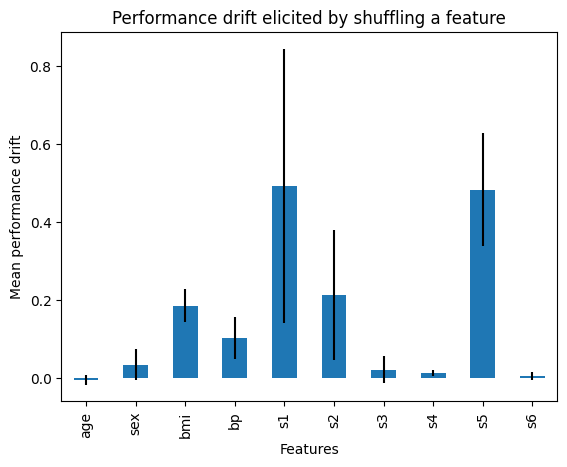

.. _feature_shuffling:

.. currentmodule:: feature_engine.selection

SelectByShuffling
=================

:class:`SelectByShuffling()` selects features whose random value permutation reduces model
performance. If a feature is predictive, shuffling its values across rows will result in
predictions that deviate significantly from the actual outcomes. Conversely, if the
feature is not predictive, altering the order of its values will have little to no impact
on the model's predictions.

Procedure
---------

The algorithm operates as follows:

1. Train a machine learning model using all available features.
2. Establish a baseline performance metric for the model.
3. Shuffle the values of a single feature while keeping all other features unchanged.
4. Use the model from step 1 to generate predictions with the shuffled feature.
5. Measure the model's performance based on these new predictions.
6. If the performance drops beyond a predefined threshold, retain the feature.
7. Repeat steps 3-6 for each feature until all have been evaluated.

Python Example
--------------

Let's see how to use :class:`SelectByShuffling()` with the diabetes dataset that comes
with Scikit-learn. First, we load the data:

.. code:: python

    import pandas as pd
    import matplotlib.pyplot as plt
    from sklearn.datasets import load_diabetes
    from sklearn.linear_model import LinearRegression
    from feature_engine.selection import SelectByShuffling

    X, y = load_diabetes(return_X_y=True, as_frame=True)
    print(X.head())

In the following output, we see the diabetes dataset:

.. code:: python

            age       sex       bmi        bp        s1        s2        s3  \
    0  0.038076  0.050680  0.061696  0.021872 -0.044223 -0.034821 -0.043401
    1 -0.001882 -0.044642 -0.051474 -0.026328 -0.008449 -0.019163  0.074412
    2  0.085299  0.050680  0.044451 -0.005670 -0.045599 -0.034194 -0.032356
    3 -0.089063 -0.044642 -0.011595 -0.036656  0.012191  0.024991 -0.036038
    4  0.005383 -0.044642 -0.036385  0.021872  0.003935  0.015596  0.008142

             s4        s5        s6
    0 -0.002592  0.019907 -0.017646
    1 -0.039493 -0.068332 -0.092204
    2 -0.002592  0.002861 -0.025930
    3  0.034309  0.022688 -0.009362
    4 -0.002592 -0.031988 -0.046641

Now, we set up a machine learning model. We'll use a linear regression:

.. code:: python

    linear_model = LinearRegression()

Now, we set up :class:`SelectByShuffling()` to select features by shuffling. We'll examine
the change in the `r2` using 3 fold cross-validation.

The parameter `threshold` is left to None, which means that features will be selected if
the performance drop is bigger than the mean drop caused by all features.

.. code:: python

    tr = SelectByShuffling(
        estimator=linear_model,
        scoring="r2",
        cv=3,
        random_state=0,
    )

The `fit`()` method identifies important variables—those whose value permutations lead
to a decline in model performance. The `transform()` method then removes these variables
from the dataset.

.. code:: python

    Xt = tr.fit_transform(X, y)

:class:`SelectByShuffling()` stores the performance of the model trained using all the
features in its attribute:

.. code:: python

    tr.initial_model_performance_

In the following output we see the r2 of the linear regression trained and evaluated on
the entire dataset, without shuffling, using cross-validation.

.. code:: python

    0.488702767247119

In the following sections, we'll explore some of the additional useful data stored by
:class:`SelectByShuffling()`.

Evaluating feature importance
~~~~~~~~~~~~~~~~~~~~~~~~~~~~~

:class:`SelectByShuffling()` stores the change in the model performance caused by shuffling
every feature.

..  code:: python

    tr.performance_drifts_

In the following output, we see the change in the linear regression r2 after shuffling
each feature:

.. code:: python

    {'age': -0.0054698043007869734,
     'sex': 0.03325633986510784,
     'bmi': 0.184158237207512,
     'bp': 0.10089894421748086,
     's1': 0.49324432634948095,
     's2': 0.21163252880660438,
     's3': 0.02006839198785859,
     's4': 0.011098050006761673,
     's5': 0.4828781996541602,
     's6': 0.003963360084439538}

:class:`SelectByShuffling()` stores the standard deviation of the performance change:

.. code:: python

    tr.performance_drifts_std_

In the following output, we see the variability of the change in r2 after feature
shuffling:

.. code:: python

    {'age': 0.012788500580799392,
     'sex': 0.040792331972680645,
     'bmi': 0.042212436355346106,
     'bp': 0.05397012536801143,
     's1': 0.35198797776358015,
     's2': 0.167636042355086,
     's3': 0.03455158514716544,
     's4': 0.007755675852874145,
     's5': 0.1449579162698361,
     's6': 0.011193022434166025}

We can plot the performance change together with the standard deviation to get a better
idea of how shuffling features affect the model performance:

..  code:: python

    r = pd.concat([
        pd.Series(tr.performance_drifts_),
        pd.Series(tr.performance_drifts_std_)
    ], axis=1
    )
    r.columns = ['mean', 'std']

    r['mean'].plot.bar(yerr=[r['std'], r['std']], subplots=True)

    plt.title("Performance drift elicited by shuffling a feature")
    plt.ylabel('Mean performance drift')
    plt.xlabel('Features')
    plt.show()

In the following image we see the change in performance resulting from shuffling each
feature:

With this set up, features that elicited a mean performance drop greater than the mean
performance of all features, will be removed. If, for any reason, this threshold is too
conservative or too permissive, by analysing the former barplot, you can get a better
idea of how these features affect the predictions of the model, and select a different
threshold.

Checking out the eliminated features
~~~~~~~~~~~~~~~~~~~~~~~~~~~~~~~~~~~~

:class:`SelectByShuffling()` stores the features that will be dropped based on a certain
threshold:

.. code:: python

    tr.features_to_drop_

The following features were deemed as non-important, because their performance drift is
greater than the mean performance drift of all features:

.. code:: python

    ['age', 'sex', 'bp', 's3', 's4', 's6']

If we now print the transformed data, we see that the features above were removed.

..  code:: python

    print(Xt.head())

In the following output, we see the dataframe with the selected features:

..  code:: python

            bmi        s1        s2        s5
    0  0.061696 -0.044223 -0.034821  0.019907
    1 -0.051474 -0.008449 -0.019163 -0.068332
    2  0.044451 -0.045599 -0.034194  0.002861
    3 -0.011595  0.012191  0.024991  0.022688
    4 -0.036385  0.003935  0.015596 -0.031988

    
Additional resources
--------------------

For more details about this and other feature selection methods check out these resources:

   Feature Selection for Machine Learning

|
|
|
|
|
|
|
|
|
|

Or read our book:

.. figure::  ../../images/fsmlbook.png
   :width: 200
   :figclass: align-center
   :align: left
   :target: https://www.trainindata.com/p/feature-selection-in-machine-learning-book

   Feature Selection in Machine Learning

|
|
|
|
|
|
|
|
|
|
|
|
|
|

Both our book and course are suitable for beginners and more advanced data scientists
alike. By purchasing them you are supporting Sole, the main developer of Feature-engine.