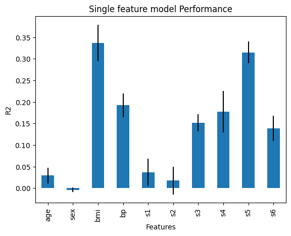

.. _single_feat_performance:

.. currentmodule:: feature_engine.selection

SelectBySingleFeaturePerformance
================================

:class:`SelectBySingleFeaturePerformance()` selects features based on the performance of
machine learning models trained on each feature individually. In other words, it
identifies features that demonstrate strong predictive power on their own. The selection
process works as follows:

1. Train a separate machine learning model using only one feature at a time.
2. Evaluate each model using a chosen performance metric.
3. Retain features whose performance exceeds a specified threshold.

If the `threshold` parameter is set to `None`, the algorithm will select features with
performance above the average of all individual features.

Python Example
--------------

Let's see how to use :class:`SelectBySingleFeaturePerformance()` with the diabetes
dataset that comes with Scikit-learn. First, we load the data:

.. code:: python

    import pandas as pd
    import matplotlib.pyplot as plt
    from sklearn.datasets import load_diabetes
    from sklearn.linear_model import LinearRegression
    from feature_engine.selection import SelectBySingleFeaturePerformance

    X, y = load_diabetes(return_X_y=True, as_frame=True)
    print(X.head())

In the following output, we see the diabetes dataset:

.. code:: python

            age       sex       bmi        bp        s1        s2        s3  \
    0  0.038076  0.050680  0.061696  0.021872 -0.044223 -0.034821 -0.043401
    1 -0.001882 -0.044642 -0.051474 -0.026328 -0.008449 -0.019163  0.074412
    2  0.085299  0.050680  0.044451 -0.005670 -0.045599 -0.034194 -0.032356
    3 -0.089063 -0.044642 -0.011595 -0.036656  0.012191  0.024991 -0.036038
    4  0.005383 -0.044642 -0.036385  0.021872  0.003935  0.015596  0.008142

             s4        s5        s6
    0 -0.002592  0.019907 -0.017646
    1 -0.039493 -0.068332 -0.092204
    2 -0.002592  0.002861 -0.025930
    3  0.034309  0.022688 -0.009362
    4 -0.002592 -0.031988 -0.046641

Let's set up :class:`SelectBySingleFeaturePerformance()` to select features based on the
r2 returned by a Linear regression, using 3 fold cross-validation. We want to select features
which r2 > 0.01.

.. code:: python

    # initialize feature selector
    sel = SelectBySingleFeaturePerformance(
            estimator=LinearRegression(), scoring="r2", cv=3, threshold=0.01)

With `fit()` the transformer fits 1 model per feature, determines the performance and
selects the important features:

.. code:: python

    # fit transformer
    sel.fit(X, y)

The features that will be dropped are stored in the following attribute:

.. code:: python

    sel.features_to_drop_

Only one feature will be dropped, because a linear model trained using this feature showed
an r2 smaller than 0. 1:

.. code:: python

    [sex]

Evaluating feature importance
~~~~~~~~~~~~~~~~~~~~~~~~~~~~~

:class:`SelectBySingleFeaturePerformance()` stores the performance of each one of the
single feature models:

..  code:: python

    sel.feature_performance_

In the following output, we see the r2 of every linear regression trained using the
feature in the key of the dictionary:

.. code:: python

    {'age': 0.029231969375784466,
     'sex': -0.003738551760264386,
     'bmi': 0.33662080998769284,
     'bp': 0.19218913007834937,
     's1': 0.037115559827549806,
     's2': 0.017854228256932614,
     's3': 0.1515388617752689,
     's4': 0.1772160996650173,
     's5': 0.31494478799681097,
     's6': 0.13876602125792703}

We can also check out the standard deviation of the r2 as follows:

.. code:: python

    sel.feature_performance_std_

In the following output, we see the standard deviation:

.. code:: python

    {'age': 0.017870583127141664,
     'sex': 0.005465336770744777,
     'bmi': 0.04257342727445452,
     'bp': 0.027318947204928765,
     's1': 0.031397211603399186,
     's2': 0.03224477055466249,
     's3': 0.020243573053986438,
     's4': 0.04782262499458294,
     's5': 0.02473650354444323,
     's6': 0.029051175300521623}

We can plot the performance together with the standard deviation to get a better
idea of the model performance's variability:

..  code:: python

    r = pd.concat([
        pd.Series(sel.feature_performance_),
        pd.Series(sel.feature_performance_std_)
    ], axis=1
    )
    r.columns = ['mean', 'std']

    r['mean'].plot.bar(yerr=[r['std'], r['std']], subplots=True)

    plt.title("Single feature model Performance")
    plt.ylabel('R2')
    plt.xlabel('Features')
    plt.show()

In the following image we see the single feature model performance:

With this, we can get a better idea of the relationship between the features and the
target variable, based on a linear regression model.

Checking out the resulting dataframe
~~~~~~~~~~~~~~~~~~~~~~~~~~~~~~~~~~~~

With `transform()` we go ahead and remove the features from the dataset:

.. code:: python

    # drop variables
    Xt = sel.transform(X)

We can now print the transformed data:

..  code:: python

    print(Xt.head())

In the following output, we see the selected features:

..  code:: python

            age       bmi        bp        s1        s2        s3        s4  \
    0  0.038076  0.061696  0.021872 -0.044223 -0.034821 -0.043401 -0.002592
    1 -0.001882 -0.051474 -0.026328 -0.008449 -0.019163  0.074412 -0.039493
    2  0.085299  0.044451 -0.005670 -0.045599 -0.034194 -0.032356 -0.002592
    3 -0.089063 -0.011595 -0.036656  0.012191  0.024991 -0.036038  0.034309
    4  0.005383 -0.036385  0.021872  0.003935  0.015596  0.008142 -0.002592

             s5        s6
    0  0.019907 -0.017646
    1 -0.068332 -0.092204
    2  0.002861 -0.025930
    3  0.022688 -0.009362
    4 -0.031988 -0.046641

Additional resources
--------------------

Check also:

- `Jupyter notebook <https://nbviewer.org/github/feature-engine/feature-engine-examples/blob/main/selection/Select-by-Single-Feature-Performance.ipynb>`_

All notebooks can be found in a `dedicated repository <https://github.com/feature-engine/feature-engine-examples>`_.

For more details about this and other feature selection methods check out these resources:

For more details about this and other feature selection methods check out these resources:

.. figure::  ../../images/fsml.png
   :width: 300
   :figclass: align-center
   :align: left
   :target: https://www.trainindata.com/p/feature-selection-for-machine-learning

   Feature Selection for Machine Learning

|
|
|
|
|
|
|
|
|
|

Or read our book:

.. figure::  ../../images/fsmlbook.png
   :width: 200
   :figclass: align-center
   :align: left
   :target: https://www.trainindata.com/p/feature-selection-in-machine-learning-book

   Feature Selection in Machine Learning

|
|
|
|
|
|
|
|
|
|
|
|
|
|

Both our book and course are suitable for beginners and more advanced data scientists
alike. By purchasing them you are supporting Sole, the main developer of Feature-engine.