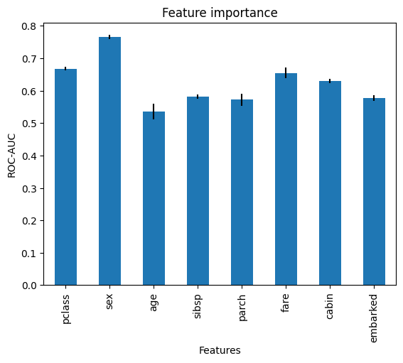

.. _target_mean_selection:

.. currentmodule:: feature_engine.selection

SelectByTargetMeanPerformance
=============================

:class:`SelectByTargetMeanPerformance()` selects features based on a performance metric,
like ROC-AUC or accuracy for classification, or mean squared error and R-squared
for regression.

Performance metrics are obtained by comparing a prediction with the real value of the
target. The closer the values of the prediction to the real target, the better the value
of the performance metric. Typically, these predictions are obtained from machine learning
models.

:class:`SelectByTargetMeanPerformance()` uses a very simple method to obtain "predictions".
It returns the mean target value per category or per interval if the variable is continuous.
With this "prediction", it determines the value of a performance metric of choice for each
feature, by comparing the values of the "predictions" with that of the target.

Procedure
---------

This feature selection idea is very simple; it involves taking the mean of the
responses (target) for each level (category or interval) of the variable, and so amounts to a least
squares fit on a single categorical variable against a response variable, with the
categories in the continuous variables defined by intervals.

Despite its simplicity, the method has a number of advantages:

- Speed: Computing means and intervals is fast, straightforward and efficient.
- Stability with respect to feature magnitude: Extreme values for continuous variables do not skew predictions as they would in many models.
- Comparability between continuous and categorical variables.
- Does not assume linear relationships and hence can identify non-linearities.
- Does not require encoding categorical variables into numbers.

The method has also some limitations. First, the selection of the number of intervals
as well as the threshold is arbitrary. And also, rare categories and very skewed
variables will raise errors when NAN are accidentally introduced during the evaluation.

:class:`SelectByTargetMeanPerformance()` works with cross-validation. It uses the k-1
folds to define the numerical intervals and learn the mean target value per category or
interval. Then, it uses the remaining fold to evaluate the performance of the
feature: that is, in the last fold it sorts numerical variables into the bins, replaces
bins and categories by the learned target estimates, and calculates the performance of
each feature.

Important
---------

:class:`SelectByTargetMeanPerformance()` automatically identifies numerical and
categorical variables. It will select as categorical variables, those cast as object
or categorical, and as numerical variables those of type numeric. Therefore, make sure
that your variables are of the correct data type.

Troubleshooting
---------------

The main problem that you may encounter using this selector is having missing data
introduced in the variables when replacing the categories or the intervals by the
target mean estimates.

Categorical variables
~~~~~~~~~~~~~~~~~~~~~

NAN are introduced in categorical variables when a category present in the kth fold was
not present in the k-1 fold used to calculate the mean target value per category. This
is probably due to the categorical variable having high cardinality (a lot of categories)
or rare categories, that is, categories present in a small fraction of the observations.

If this happens, try reducing the cardinality of the variable, for example by grouping
rare labels into a single group. Check the :ref:`RareLabelEncoder <rarelabel_encoder>`
for more details.

Numerical variables
~~~~~~~~~~~~~~~~~~~

NAN are introduced in numerical variables when an interval present in the kth cross-validation
fold was not present in the k-1 fold used to calculate the mean target value per interval.
This is probably due to the numerical variable being highly skewed, or having few unique values,
for example, if the variable is discrete instead of continuous.

If this happens, check the distribution of the problematic variable and try to identify
the problem. Try using equal-frequency intervals instead of equal-width and also reducing
the number of bins.

If the variable is discrete and has few unique values, another thing you could do is
casting the variable as object, so that the selector evaluates the mean target value
per unique value.

Finally, if a numerical variable is truly continuous and not skewed, check that it is
not accidentally cast as object.

Example
-------

Let's see how to use this method to select variables in the Titanic dataset. This data
has a mix of numerical and categorical variables, then it is a good option to showcase
this selector.

Let's import the required libraries and classes, and prepare the titanic dataset:

.. code:: python

    import numpy as np
    import matplotlib.pyplot as plt
    import pandas as pd
    from sklearn.model_selection import train_test_split

    from feature_engine.datasets import load_titanic
    from feature_engine.encoding import RareLabelEncoder
    from feature_engine.selection import SelectByTargetMeanPerformance

    data = load_titanic(
        handle_missing=True,
        predictors_only=True,
        cabin="letter_only",
    )

    # replace infrequent cabins by N
    data['cabin'] = np.where(data['cabin'].isin(['T', 'G']), 'N', data['cabin'])

    # cap maximum values
    data['parch'] = np.where(data['parch']>3,3,data['parch'])
    data['sibsp'] = np.where(data['sibsp']>3,3,data['sibsp'])

    # cast variables as object to treat as categorical
    data[['pclass','sibsp','parch']] = data[['pclass','sibsp','parch']].astype('O')

    print(data.head())

We can see the first 5 rows of data below:

.. code:: python

      pclass  survived     sex      age sibsp parch      fare cabin embarked
    0      1         1  female  29.0000     0     0  211.3375     B        S
    1      1         1    male   0.9167     1     2  151.5500     C        S
    2      1         0  female   2.0000     1     2  151.5500     C        S
    3      1         0    male  30.0000     1     2  151.5500     C        S
    4      1         0  female  25.0000     1     2  151.5500     C        S

Let's now go ahead and split the data into train and test sets:

.. code:: python

    # separate train and test sets
    X_train, X_test, y_train, y_test = train_test_split(
        data.drop(['survived'], axis=1),
        data['survived'],
        test_size=0.1,
        random_state=0)

    X_train.shape, X_test.shape

We see the sizes of the datasets below:

.. code:: python

    ((1178, 8), (131, 8))

Now, we set up :class:`SelectByTargetMeanPerformance()`. We will examine the roc-auc
using 3 fold cross-validation. We will separate numerical variables into equal-frequency
intervals. And we will retain those variables where the roc-auc is bigger than the mean
ROC-AUC of all features (default functionality).

.. code:: python

    sel = SelectByTargetMeanPerformance(
        variables=None,
        scoring="roc_auc",
        threshold=None,
        bins=3,
        strategy="equal_frequency",
        cv=3,
        regression=False,
    )

    sel.fit(X_train, y_train)

With `fit()` the transformer:

- replaces categories by the target mean
- sorts numerical variables into equal-frequency bins
- replaces bins by the target mean
- calculates the the roc-auc for each transformed variable
- selects features which roc-auc bigger than the average

In the attribute `variables_` we find the variables that were evaluated:

.. code:: python

    sel.variables_

.. code:: python

    ['pclass', 'sex', 'age', 'sibsp', 'parch', 'fare', 'cabin', 'embarked']

In the attribute `features_to_drop_` we find the variables that were not selected:

.. code:: python

    sel.features_to_drop_

.. code:: python

    ['age', 'sibsp', 'parch', 'embarked']

Evaluating feature importance
~~~~~~~~~~~~~~~~~~~~~~~~~~~~~

In the attribute `feature_performance_` we find the ROC-AUC for each feature. Remember
that this is the average ROC-AUC in each cross-validation fold:

.. code:: python

    sel.feature_performance_

In the following output we see the ROC-AUC returned by the target mean encoding of
each variable:

.. code:: python

    {'pclass': 0.668151138112005,
    'sex': 0.764831274819234,
    'age': 0.535490029737471,
    'sibsp': 0.5815934176199077,
    'parch': 0.5721327969642238,
    'fare': 0.6545985745474006,
    'cabin': 0.630092526712033,
    'embarked': 0.5765961846034091}

The mean ROC-AUC of all features is 0.62, we can calculate it as follows:

.. code:: python

    pd.Series(sel.feature_performance_).mean()

    0.6229357428894605

In the attribute `feature_performance_std_` we find the standard deviation of the
ROC-AUC for each feature:

.. code:: python

    sel.feature_performance_std_

Below we see the standard deviation of the ROC-AUC:

.. code:: python

    {'pclass': 0.0062490415569808975,
     'sex': 0.006574623168243345,
     'age': 0.023454310730681827,
     'sibsp': 0.007263903286722272,
     'parch': 0.017865107795851633,
     'fare': 0.01669212962579665,
     'cabin': 0.006868970787685758,
     'embarked': 0.008925910686325774}

We can plot the performance together with the standard deviation to get a better
idea of the feature's importance:

..  code:: python

    r = pd.concat([
        pd.Series(sel.feature_performance_),
        pd.Series(sel.feature_performance_std_)
    ], axis=1
    )
    r.columns = ['mean', 'std']

    r['mean'].plot.bar(yerr=[r['std'], r['std']], subplots=True)

    plt.title("Feature importance")
    plt.ylabel('ROC-AUC')
    plt.xlabel('Features')
    plt.show()

In the following image we see the feature importance:

With this, we can get a better idea of the relationship between the features and the
target variable, based on a linear regression model.

Checking out the resulting dataframe
~~~~~~~~~~~~~~~~~~~~~~~~~~~~~~~~~~~~

With `transform()` we can go ahead and drop the features:

.. code:: python

    Xtr = sel.transform(X_test)

    Xtr.head()

.. code:: python

         pclass     sex     fare cabin
    1139      3    male   7.8958     M
    533       2  female  21.0000     M
    459       2    male  27.0000     M
    1150      3    male  14.5000     M
    393       2    male  31.5000     M

And finally, we can also obtain the names of the features in the final transformed
data:

.. code:: python

    sel.get_feature_names_out()

.. code:: python

    ['pclass', 'sex', 'fare', 'cabin']

Additional resources
--------------------

Check also:

- `Jupyter notebook <https://nbviewer.org/github/feature-engine/feature-engine-examples/blob/main/selection/Select-by-Target-Mean-Encoding.ipynb>`_

All notebooks can be found in a `dedicated repository <https://github.com/feature-engine/feature-engine-examples>`_.

For more details about this and other feature selection methods check out these resources:
For more details about this and other feature selection methods check out these resources:

.. figure::  ../../images/fsml.png
   :width: 300
   :figclass: align-center
   :align: left
   :target: https://www.trainindata.com/p/feature-selection-for-machine-learning

   Feature Selection for Machine Learning

|
|
|
|
|
|
|
|
|
|

Or read our book:

.. figure::  ../../images/fsmlbook.png
   :width: 200
   :figclass: align-center
   :align: left
   :target: https://www.trainindata.com/p/feature-selection-in-machine-learning-book

   Feature Selection in Machine Learning

|
|
|
|
|
|
|
|
|
|
|
|
|
|

Both our book and course are suitable for beginners and more advanced data scientists
alike. By purchasing them you are supporting Sole, the main developer of Feature-engine.