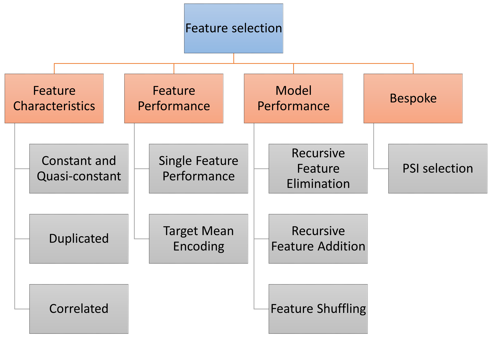

.. -*- mode: rst -*-
.. _selection_user_guide:

.. currentmodule:: feature_engine.selection

Feature Selection
=================

Feature-engine's feature selection transformers identify features with low predictive
performance and drop them from the dataset. Most of the feature selection algorithms
supported by Feature-engine are not yet available in other libraries. These algorithms
have been gathered from data science competitions or used in the industry.

Selection Mechanism Overview
----------------------------

Feature-engine’s transformers select features based on different strategies.

The first strategy evaluates the features intrinsic characteristics, like their distributions.
For example, we can remove constant or quasi-constant features. Or we can remove features
whose distribution in unstable in time by using the Population Stability Index.

A second strategy consists in determining the relationships between features. Among these,
we can remove features that are duplicated or correlated.

We can also select features based on their relationship with the target. To assess this,
we can replace the feature values by the target mean, or calculate the information value.

Some feature selection procedures involve training machine learning models. We can assess
features individually, or collectively, through various algorithms, as shown in the
following diagram:

   Selection mechanisms - Overview

Algorithms that select features based on their performance within a group of variables, will
normally train a model with all the features, and then remove or add or shuffle a feature and
re-evaluate the model performance.

These methods are normally geared towards improving the overall performance of the final
machine learning model as well as reducing the feature space.

Selectors Characteristics Overview
----------------------------------

Some Feature-engine's selectors work with categorical variables off-the-shelf and/or allow
missing data in the variables. These gives you the opportunity to quickly screen features
before jumping into any feature engineering.

In the following tables, we highlight the main Feature-engine selectors characteristics:

Selection based on feature characteristics
------------------------------------------

============================================ ======================= ============= ====================================================================================
    Transformer                                Categorical variables   Allows NA	    Description
============================================ ======================= ============= ====================================================================================
:class:`DropFeatures()`                         √	                      √	            Drops arbitrary features determined by user
:class:`DropConstantFeatures()`  	            √	                      √	            Drops constant and quasi-constant features
:class:`DropDuplicateFeatures()`                √	                      √             Drops features that are duplicated
:class:`DropCorrelatedFeatures()`               ×	                      √	            Drops features that are correlated
:class:`SmartCorrelatedSelection()`	            ×	                      √	            From a correlated feature group drops the less useful features
:class:`MRMR()`                  	            √	                      ×	            Selects features based on the MRMR framework
============================================ ======================= ============= ====================================================================================

Methods that determine duplication or the number of unique values, can work with both
numerical and categorical variables and support missing data as well.

Selection procedures based on correlation work only with numerical variables but allow
missing data.

Selection based on a machine learning model
-------------------------------------------

============================================ ======================= ============= ====================================================================================
    Transformer                                Categorical variables   Allows NA	    Description
============================================ ======================= ============= ====================================================================================
:class:`SelectBySingleFeaturePerformance()`	    ×	                      ×	            Selects features based on single feature model performance
:class:`RecursiveFeatureElimination()`          ×                         ×             Removes features recursively by evaluating model performance
:class:`RecursiveFeatureAddition()`             ×                         ×             Adds features recursively by evaluating model performance
============================================ ======================= ============= ====================================================================================

Selection procedures that require training a machine learning model from Scikit-learn
require numerical variables without missing data.

Selection methods commonly used in finance
------------------------------------------

============================================ ======================= ============= ====================================================================================
    Transformer                                Categorical variables   Allows NA	    Description
============================================ ======================= ============= ====================================================================================
:class:`DropHighPSIFeatures()`	                ×	                      √	            Drops features with high Population Stability Index
:class:`SelectByInformationValue()`	            √                         x             Drops features with low information value
============================================ ======================= ============= ====================================================================================

:class:`DropHighPSIFeatures()` allows to remove features with changes in their distribution. This is done by
splitting the input dataframe in two parts and comparing the distribution of each feature in the two
parts. The metric used to assess distribution shift is the Population Stability Index (PSI). Removing
unstable features may lead to more robust models. In fields like Credit Risk Modelling, the Regulator
often requires the PSI of the final feature set to be below are given threshold.

Alternative feature selection methods
-------------------------------------

============================================ ======================= ============= ====================================================================================
    Transformer                                Categorical variables   Allows NA	    Description
============================================ ======================= ============= ====================================================================================
:class:`SelectByShuffling()`	                ×	                      ×	            Selects features if shuffling their values causes a drop in model performance
:class:`SelectByTargetMeanPerformance()`        √                         ×             Using the target mean as performance proxy, selects high performing features
:class:`ProbeFeatureSelection()`                ×                         ×             Selects features whose importance is greater than those of random variables
============================================ ======================= ============= ====================================================================================

The :class:`SelectByTargetMeanPerformance()` uses the target mean value as proxy for prediction,
replacing categories or variable intervals by these values and then determining a performance metric.
Thus, it is suitable for both categorical and numerical variables. In its current implementation,
it does not support missing data.

The :class:`ProbeFeatureSelection()` introduces random variables to the dataset, then creates a model and derives
the feature importance. It selects all variables whose importance is grater than the mean importance of the random
features.

Throughout the rest of user guide, you will find more details about each of the feature selection procedures.

Feature Selection Algorithms
----------------------------

Click below to find more details on how to use each one of the transformers.

.. toctree::
   :maxdepth: 1

   DropFeatures
   DropConstantFeatures
   DropDuplicateFeatures
   DropCorrelatedFeatures
   SmartCorrelatedSelection
   SelectBySingleFeaturePerformance
   RecursiveFeatureElimination
   RecursiveFeatureAddition
   SelectByShuffling
   SelectByTargetMeanPerformance
   DropHighPSIFeatures
   SelectByInformationValue
   ProbeFeatureSelection
   MRMR

Additional Resources
--------------------

More details about feature selection can be found in the following resources:

.. figure::  ../../images/fsml.png
   :width: 300
   :figclass: align-center
   :align: left
   :target: https://www.trainindata.com/p/feature-selection-for-machine-learning

   Feature Selection for Machine Learning

|
|
|
|
|
|
|
|
|
|

Or read our book:

.. figure::  ../../images/fsmlbook.png
   :width: 200
   :figclass: align-center
   :align: left
   :target: https://www.trainindata.com/p/feature-selection-in-machine-learning-book

   Feature Selection in Machine Learning

|
|
|
|
|
|
|
|
|
|
|
|
|
|

Both our book and course are suitable for beginners and more advanced data scientists
alike. By purchasing them you are supporting Sole, the main developer of Feature-engine.